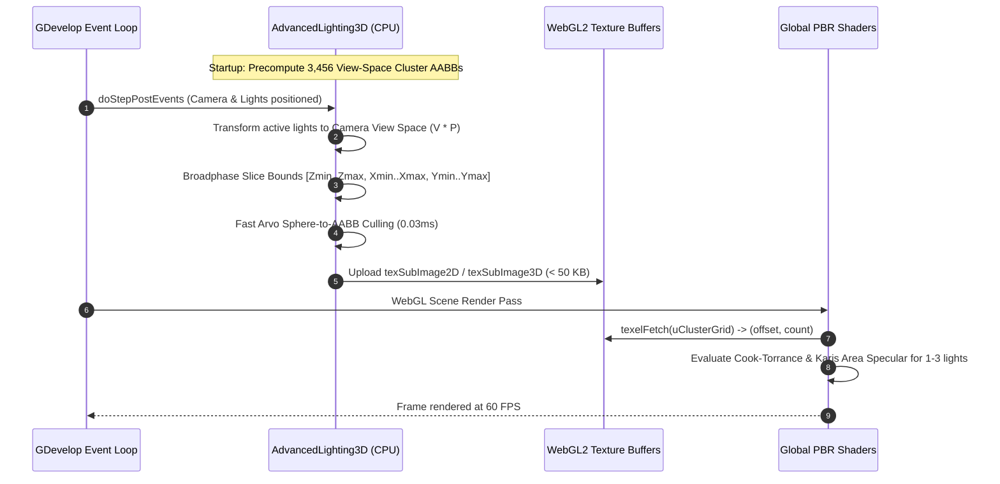
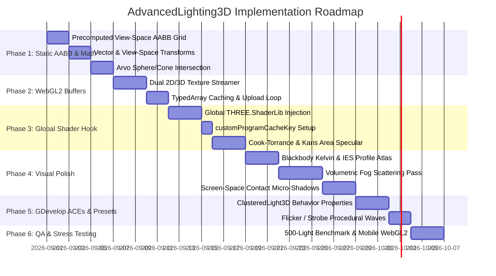

# AdvancedLighting3D — Implementation Plan (Refined Production Blueprint)

This document outlines the refined technical architecture, mathematical formulations, WebGL2 texture
packing, global ShaderChunk injection mechanics, and implementation phases for the **clustered
forward direct-lighting half** of AdvancedLighting3D.

> **Scope note.** Written when this was a standalone `ClusteredLightManager3D` extension. The
> indirect half — the probe grid — has its own record in
> [PROBE_IMPLEMENTATION_PLAN.md](./PROBE_IMPLEMENTATION_PLAN.md). Where this document describes the
> material hook as owned solely by the clustered loop, that is no longer true: one
> `onBeforeCompile` and one cache key (`GD_ADVLIGHT3D_V1|CL1|G3D<0|1>|LP<0|1>`) now serve both
> halves. The BSDF calls it specifies were also wrong against Three r160 and were corrected in
> 2.0.0 — see [API_REFERENCE.md](./API_REFERENCE.md) section 10.

---

## 1. System Architecture & Lifecycle

`AdvancedLighting3D` operates as a dual-component subsystem optimized for maximum CPU efficiency ($< 0.03\text{ ms}$), zero shader recompilations, and complete cross-platform WebGL2 reliability:

1. **CPU Clustered Spatial Broadphase (Runtime Engine):**
   - **Precomputed View-Space AABB Grid:** 3,456 cluster bounding boxes are computed *once* at startup in camera view space and cached.
   - **Static vs. Dynamic Light Partitioning:** Stationary lights (streetlamps, torches) are cached in memory; only moving lights (projectiles, player flashlights) re-evaluate their view transforms when the camera is at rest.
   - **Fast TypedArray Streamer:** Writes binary light headers and cluster index offsets into flat `Float32Array` / `Uint16Array` buffers.
2. **GPU Material Shader Hook (Global Forward Pipeline):**
   - Injected globally into `THREE.ShaderLib.standard`, `THREE.ShaderLib.physical`, and `THREE.ShaderChunk.lights_fragment_begin`.
   - Single game-wide program compilation key: `customProgramCacheKey = () => 'GD_CLUSTERED_LIGHTS_V1'`.
   - Supports both `Data3DTexture` (`sampler3D`) and flattened 2D `DataTexture` fallback for 100% Android/Mali/Adreno GPU driver compatibility.



---

## 2. Mathematical Formulations & Algorithms

### A. 3D Frustum Logarithmic Depth Slicing
To counteract the non-linear precision loss of perspective projection, the camera's view frustum depth $[z_{\text{near}}, z_{\text{far}}]$ is partitioned into $S_z$ logarithmic slices:

$$z_k = z_{\text{near}} \cdot \left(\frac{z_{\text{far}}}{z_{\text{near}}}\right)^{\frac{k}{S_z}}, \quad k \in [0, S_z]$$

Given a fragment's view-space depth $z_{\text{view}} = -vViewPosition.z$:

$$\text{Cluster}_Z = \left\lfloor \frac{\log(z_{\text{view}} / z_{\text{near}})}{\log(z_{\text{far}} / z_{\text{near}})} \cdot S_z \right\rfloor$$

$$\text{Cluster}_X = \left\lfloor \frac{\text{gl\_FragCoord}.x}{\text{screenWidth}} \cdot S_x \right\rfloor, \quad \text{Cluster}_Y = \left\lfloor \frac{\text{gl\_FragCoord}.y}{\text{screenHeight}} \cdot S_y \right\rfloor$$

$$\text{ClusterIndex} = \text{Cluster}_X + \text{Cluster}_Y \cdot S_x + \text{Cluster}_Z \cdot (S_x \cdot S_y)$$

* **Grid Dimensions:** $S_x = 16$, $S_y = 9$, $S_z = 24$ (Total = $3,456$ clusters).

---

### B. Precomputed View-Space Cluster AABBs
For a camera with Field of View $\theta_{\text{fov}}$, aspect ratio $a = \frac{W}{H}$, and depth slice $k$:

$$y_{\text{top}}(z_k) = z_k \cdot \tan\left(\frac{\theta_{\text{fov}}}{2}\right), \quad x_{\text{right}}(z_k) = y_{\text{top}}(z_k) \cdot a$$

For cluster $(i, j, k)$ where $i \in [0, S_x-1]$ and $j \in [0, S_y-1]$:
$$x_{\text{min}} = -x_{\text{right}}(z_{k+1}) + \frac{2 \cdot i}{S_x} x_{\text{right}}(z_{k+1}), \quad x_{\text{max}} = -x_{\text{right}}(z_{k+1}) + \frac{2 \cdot (i+1)}{S_x} x_{\text{right}}(z_{k+1})$$
$$y_{\text{min}} = -y_{\text{top}}(z_{k+1}) + \frac{2 \cdot j}{S_y} y_{\text{top}}(z_{k+1}), \quad y_{\text{max}} = -y_{\text{top}}(z_{k+1}) + \frac{2 \cdot (j+1)}{S_y} y_{\text{top}}(z_{k+1})$$
$$z_{\text{min}} = -z_{k+1}, \quad z_{\text{max}} = -z_k$$

> **Key Optimization:** These 3,456 bounding boxes $[B_{\text{min}}, B_{\text{max}}]$ are calculated **once at startup** and stored in flat `Float32Array(3456 * 6)` memory. They never change unless camera FOV or aspect ratio changes.

---

### C. Fast Sphere-to-AABB Distance (Arvo's Method)
To test if a light with view-space center $\vec{C} = (C_x, C_y, C_z)$ and radius $R$ intersects a precomputed cluster box $[B_{\text{min}}, B_{\text{max}}]$:

$$d^2 = \sum_{i \in \{x,y,z\}} \begin{cases} (B_{\text{min}, i} - C_i)^2 & \text{if } C_i < B_{\text{min}, i} \\ (C_i - B_{\text{max}, i})^2 & \text{if } C_i > B_{\text{max}, i} \\ 0 & \text{otherwise} \end{cases}$$

An intersection occurs if and only if $d^2 \le R^2$.

---

### D. Frostbite / Karis Windowed Distance Attenuation
Eliminates singularity blowup at $d \to 0$ and forces light intensity smoothly to zero at $d = R$:

$$\text{attenuation}(d, R) = \frac{\left( \max\left(1.0 - \left(\frac{d}{R}\right)^4, 0.0\right) \right)^2}{d^2 + 1.0}$$

---

### E. Physically Based Area Light Specular (Karis Representative Point)
For neon tubes, glowing bars, and physical spherical light sources:

1. **Capsule / Line-Segment Lights:** Segment endpoints $\vec{P}_0, \vec{P}_1$ with axis $\vec{u}$ and half-length $L$:
   $$\vec{L}_0 = \vec{P}_0 - \vec{P}_{\text{surface}}$$
   $$t_{\text{closest}} = \text{clamp}\left( \frac{\vec{R} \cdot \vec{L}_0 - (\vec{R} \cdot \vec{u})(\vec{L}_0 \cdot \vec{u})}{1.0 - (\vec{R} \cdot \vec{u})^2}, -L, L \right)$$
   $$\vec{P}_{\text{closest}} = \vec{L}_0 + \vec{u} \cdot t_{\text{closest}}$$

2. **Sphere Normalization:**
   $$\vec{L}_{\text{rep}} = \vec{P}_{\text{closest}} - \vec{R} \cdot \text{clamp}\left(\frac{\vec{P}_{\text{closest}} \cdot \vec{R}}{\|\vec{P}_{\text{closest}}\|}, 0.0, 1.0\right) \cdot r_{\text{light}}$$

3. **Roughness Expansion (Energy Conservation):**
   $$\alpha' = \text{clamp}\left(\alpha + \frac{r_{\text{light}}}{2 \cdot \|\vec{L}_{\text{rep}}\|}, 0.0, 1.0\right)$$

---

### F. Blackbody Radiation Color Temperature ($K \to \text{sRGB}$)
Approximates Planck's blackbody radiation curve across $T \in [1000\text{K}, 12000\text{K}]$:

$$t_{\text{temp}} = \frac{T}{100.0}$$

$$\text{Red} = \begin{cases} 255 & \text{if } t_{\text{temp}} \le 66 \\ \text{clamp}\left(329.6987 \cdot (t_{\text{temp}} - 60)^{-0.1332}, 0, 255\right) & \text{if } t_{\text{temp}} > 66 \end{cases}$$

$$\text{Green} = \begin{cases} \text{clamp}\left(99.4708 \cdot \ln(t_{\text{temp}}) - 161.1196, 0, 255\right) & \text{if } t_{\text{temp}} \le 66 \\ \text{clamp}\left(288.1221 \cdot (t_{\text{temp}} - 60)^{-0.0755}, 0, 255\right) & \text{if } t_{\text{temp}} > 66 \end{cases}$$

$$\text{Blue} = \begin{cases} 0 & \text{if } t_{\text{temp}} \le 19 \\ \text{clamp}\left(138.5177 \cdot \ln(t_{\text{temp}} - 10) - 305.0448, 0, 255\right) & \text{if } 19 < t_{\text{temp}} < 66 \\ 255 & \text{if } t_{\text{temp}} \ge 66 \end{cases}$$

---

### G. Clustered Volumetric Scattering (Henyey-Greenstein Phase)
During the volumetric fog pass, in-scattered light is accumulated across depth slices:

$$p(\theta) = \frac{1.0 - g^2}{4\pi \left(1.0 + g^2 - 2g \cos\theta\right)^{1.5}}$$

$$L_{\text{scat}}(z) = \sum_{i=0}^{\text{count}-1} I_i \cdot \text{atten}(d_i, R_i) \cdot p(\theta_i) \cdot \sigma_s \cdot e^{-\sigma_e z}$$

---

## 3. WebGL2 GPU Data Structures & Layouts

To guarantee universal compatibility across Desktop and Mobile WebGL2 drivers, buffers support dual abstraction:

```
1. uClusteredLightData (Texture2D: RGBA32F, Size: 256 x 3 texels)
   Row 0 [Texel 0]: (x_view, y_view, z_view, radius)
   Row 0 [Texel 1]: (color_r, color_g, color_b, intensity)
   Row 0 [Texel 2]: (dir_x, dir_y, dir_z, cos_outer_cutoff) or (axis_x, axis_y, axis_z, half_length)

2. uClusterGrid (Dual Mode):
   Mode A (Desktop/Modern Mobile): Data3DTexture RG32UI (16 x 9 x 24 texels)
   Mode B (Universal 2D Fallback): DataTexture RG32UI (144 x 24 texels, where index = cX + cY * 16)
   Channels:
     .r = lightIndexOffset (Starting index in uLightIndexList)
     .g = lightCount (Number of active lights in this cluster, 0 to 16)

3. uLightIndexList (Texture2D: R16UI, Size: 2048 x 16 texels)
   Channel:
     .r = lightIndex (Index in uClusteredLightData)
```

---

## 4. Injected Shader Chunk (`onBeforeCompile`)

```glsl
// --- CLUSTERED FORWARD PBR EVALUATION ---
#ifdef USE_CLUSTERED_LIGHTS
  vec2 clusterScreenUv = gl_FragCoord.xy / uResolution.xy;
  int cX = int(clamp(clusterScreenUv.x * 16.0, 0.0, 15.0));
  int cY = int(clamp(clusterScreenUv.y * 9.0, 0.0, 8.0));
  
  float cViewZ = -vViewPosition.z;
  int cZ = int(clamp(
    (log(cViewZ / uClusterCameraNear) / log(uClusterCameraFar / uClusterCameraNear)) * 24.0,
    0.0, 23.0
  ));
  
  #ifdef USE_3D_CLUSTER_TEXTURE
    uvec2 clusterHeader = texelFetch(uClusterGrid3D, ivec3(cX, cY, cZ), 0).rg;
  #else
    uvec2 clusterHeader = texelFetch(uClusterGrid2D, ivec2(cX + cY * 16, cZ), 0).rg;
  #endif

  uint clusterOffset = clusterHeader.r;
  uint clusterCount = clusterHeader.g;
  
  vec3 V = normalize(-vViewPosition);
  vec3 N = geometryNormal;
  float NdotV = max(dot(N, V), 0.0001);
  
  // Three.js r160 legacy lights scaling parity
  float lightScaleFactor = uUseLegacyLights ? 3.14159265 : 1.0;
  
  for (uint li = 0u; li < clusterCount; ++li) {
    uint lightIdx = texelFetch(uLightIndexList, ivec2(int(clusterOffset + li), 0), 0).r;
    
    vec4 pRad = texelFetch(uClusteredLightData, ivec2(int(lightIdx * 3u), 0), 0);
    vec4 cInt = texelFetch(uClusteredLightData, ivec2(int(lightIdx * 3u + 1u), 0), 0);
    vec4 extra = texelFetch(uClusteredLightData, ivec2(int(lightIdx * 3u + 2u), 0), 0);
    
    vec3 lightPosView = pRad.xyz;
    float radius = pRad.w;
    
    vec3 toLight = lightPosView - vViewPosition;
    float dist = length(toLight);
    
    if (dist < radius) {
      vec3 L = toLight / dist;
      
      // Frostbite Windowed Falloff
      float num = max(1.0 - pow(dist / radius, 4.0), 0.0);
      float atten = (num * num) / (dist * dist + 1.0);
      
      // Spotlight Cone Factor
      if (extra.w > 0.0) {
        float cosAngle = dot(-L, extra.xyz);
        atten *= clamp((cosAngle - extra.w) / (1.0 - extra.w), 0.0, 1.0);
      }
      
      // Cook-Torrance Diffuse & Specular
      float NdotL = max(dot(N, L), 0.0);
      vec3 H = normalize(V + L);
      float NdotH = max(dot(N, H), 0.0);
      float VdotH = max(dot(V, H), 0.0);
      
      // Specular BRDF terms
      vec3 F = F_Schlick(material.specularColor, VdotH);
      float D = D_GGX(material.roughness, NdotH);
      float G = G_Smith(material.roughness, NdotV, NdotL);
      vec3 spec = (D * G * F) / max(4.0 * NdotV * NdotL, 0.001);
      
      vec3 diff = (1.0 - F) * material.diffuseColor * (1.0 / 3.14159265);
      
      vec3 radiance = cInt.rgb * (cInt.w * atten * lightScaleFactor);
      directDiffuse += diff * radiance * NdotL;
      directSpecular += spec * radiance * NdotL;
    }
  }
#endif
```

---

## 5. Implementation Phases



---

## 6. Refined Performance Budgets & Target Metrics

| Subsystem | CPU Time Budget | GPU Time Budget | Memory / Bandwidth |
| :--- | :---: | :---: | :---: |
| **CPU View Broadphase (250 Lights)** | **$< 0.03\text{ ms}$** | $0.0\text{ ms}$ | $0\text{ B per frame (Reused precomputed AABBs)}$ |
| **GPU Texture Upload** | $< 0.03\text{ ms}$ | $< 0.02\text{ ms}$ | $< 50\text{ KB transfer per frame}$ |
| **Clustered PBR Fragment Shading** | $0.0\text{ ms}$ | $< 1.1\text{ ms}$ | Constant time $O(1)$ |
| **Volumetric Clustered Fog Pass** | $0.0\text{ ms}$ | $< 0.8\text{ ms}$ | Single fullscreen pass |
| **Total Frame Overhead** | **$< 0.06\text{ ms}$** | **$< 1.9\text{ ms}$** | **Solid 60 FPS on 1080p / 1440p / Mobile** |
