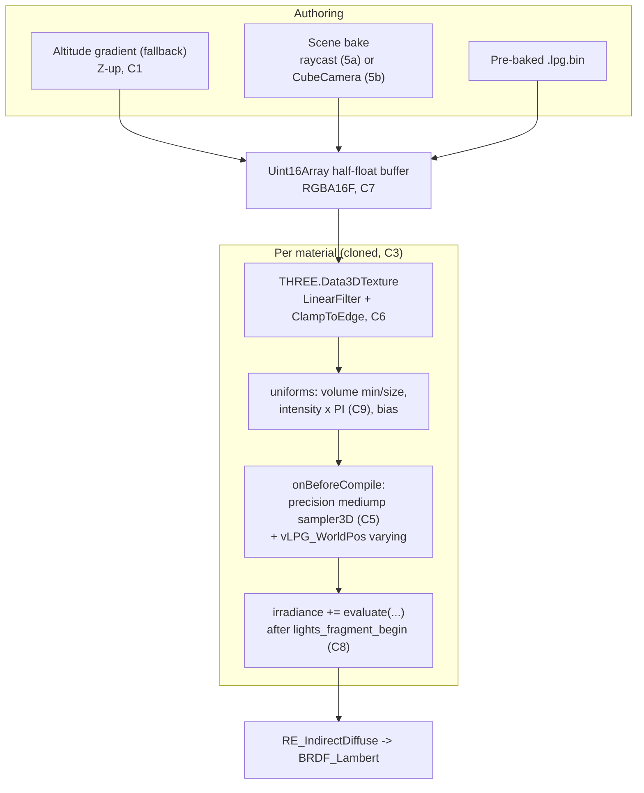

# Implementation Plan (revised): the light-probe half of AdvancedLighting3D

> **Historical note.** This was written as the plan for a standalone `LightProbeGrid3D` extension.
> That extension was folded into **AdvancedLighting3D 2.0.0** on 2026-08-29 and its folder
> removed; the two now ship as one "Advanced Lighting" extension covering direct and indirect light.
> The design and the nineteen verified corrections below still describe the shipped code, but the
> names moved: `gdjs.__lightProbeGrid3D` -> `gdjs.__advancedLighting3D`, `__lpgVolume` ->
> `__alProbeVolume`, `__lpgReceiver` -> `__alProbeReceiver`, and the `u_LPG_*` uniforms ->
> `uProbe*`. Crucially, C3/C11 changed shape: probe injection no longer owns the material hook on
> its own. It shares one `onBeforeCompile` and one `customProgramCacheKey`
> (`GD_ADVLIGHT3D_V1|CL1|G3D<0|1>|LP<0|1>`) with the clustered light loop, because two extensions each
> assigning a constant cache key to the same shared material is exactly how one silently renders the
> other's compiled program. See [API_REFERENCE.md](./API_REFERENCE.md) section 10.


Spatially-varying indirect ambient light for dynamic 3D objects in GDevelop, from a volume texture
sampled per fragment — so a character walking under a canopy, into a cave, or along a red-lit
corridor picks up the ambient colour of the place it is standing in, instead of one flat scene-wide
ambient value.

Revision of the first draft. Everything marked **[verified]** was read out of the installed GDevelop
runtime at
`C:\Users\chris\AppData\Local\Programs\GDevelop\resources\GDJS\Runtime\`
(Three **r160**, PIXI 7.4.2), not inferred.

The first draft describes how a light-probe volume works in Three.js, and that part is broadly right.
Almost all of the real difficulty is in how one works *inside GDevelop's renderer*, which is not a
stock Three setup: the 3D scene root is mirrored on Y, the up axis is Z, materials are memoised
across the entire game, and `useLegacyLights` is on. Four of the corrections below are the difference
between "compiles and looks right" and "compiles and is silently wrong".

---

## What changed from the first draft, and why

### C1 — Up is **Z**, not Y. **[verified]**

`Extensions/3D/HemisphereLight.js` hard-codes `this._top = "Z+"`, and every 3D renderer in the
runtime sets `rotation.order = "ZYX"`. GDevelop's 3D world is Z-up.

The first draft's procedural generator ramps sky-to-ground along **Y**:

```js
const tY = y / (resY - 1); // 0.0 (ground) to 1.0 (sky)
```

In a GDevelop scene that produces a gradient running sideways across the world. The height axis is
`z`, and it is the outer loop of the buffer fill, not the middle one. Every altitude term in the
maths section moves from `y` to `z`.

### C2 — The 3D scene root is mirrored on Y. **[verified]**

`layer-pixi-renderer.js::_setup3DRendering`:

```js
this._threeScene = new THREE.Scene;
this._threeScene.scale.y = -1;          // <— every 3D layer
this._threeGroup = new THREE.Group;
this._threeScene.add( this._threeGroup );
```

This is invisible until you write a shader that reads `modelMatrix`, which is exactly what this
extension does. Consequences:

1. **`(modelMatrix * vec4(transformed,1.0)).xyz` is in mirrored space**, where
   `y_three = -y_gdevelop`. The volume bounds uploaded from the CPU must be mirrored to match, and
   the flip inverts the interval:

   ```js
   // GDevelop AABB [minY, maxY]  ->  three-space [-maxY, -minY]
   uVolumeMin.set(  gdMinX, -gdMaxY,  gdMinZ );
   uVolumeSize.set( gdMaxX - gdMinX, gdMaxY - gdMinY, gdMaxZ - gdMinZ );
   ```

   Get the sign wrong and nothing errors — the volume is simply sampled upside-down, which reads as
   "the bias tuning is off" and will cost a day.

2. **The world matrix has negative determinant.** Handedness is flipped. The saving grace is that
   `inverseTransformDirection( normal, viewMatrix )` lands in the *same* mirrored space as the world
   position, so the normal-bias offset stays consistent. Both must come from that space; mixing one
   mirrored vector with one unmirrored vector is the failure mode to watch for.

3. **X and Z are untouched.** Up is `+Z` in mirrored space too, so C1's fix is unaffected by C2.

4. **The baker breaks.** A `CubeCamera` parented under a Y-mirrored scene produces Y-mirrored cube
   faces. See C13.

### C3 — Materials are shared across the whole game, so per-object properties are not free. **[verified]**

Two separate memoisation layers, both of which the first draft's API walks into.

`Model3DRuntimeObject3DRenderer.js::_updateModel`:
```js
const o = THREE_ADDONS.SkeletonUtils.clone( this._originalModel.scene );
```
`SkeletonUtils.clone` clones nodes and skeletons. It does **not** clone materials. Every Model3D
instance sharing a model resource shares one `THREE.Material` object.

`pixi-image-manager.js::getThreeMaterial`:
```js
getThreeMaterial( e, r ) {
  const t = this._loadedThreeMaterials.get( e, r );
  if ( t ) return t;                       // memoised by (resource, options)
  ...
}
```
Every Cube3D face using the same texture and options shares one material.

So the first draft's `IntensityMultiplier`, `NormalBiasOffset` and `Enabled` — declared as
per-instance behavior properties — cannot be implemented by writing a uniform. Writing
`u_VolumeIntensity` on the shared material changes it for *every object in the game* that uses that
model or texture. The property panel would appear to work in a one-object test scene and break the
moment a second instance exists.

**Decision: the behavior clones the material on attach**, per mesh per object instance, refcounts the
source, and restores on destroy. The cost is smaller than it looks and worth stating plainly so the
objection doesn't resurface:

| Cost | Effect |
| :--- | :--- |
| Draw calls | **None.** GDevelop does not batch; each mesh was already its own draw call. |
| Shader compiles | **None.** The clone has the same `shaderID` and defines, so it hits the same cached program (subject to C11). |
| GPU memory | None — textures are shared by reference, not copied. |
| CPU | One `Material` object per mesh per instance, plus a per-draw uniform upload. |

Materials must be disposed on destroy, but **only** the clones — disposing a memoised source would
take out every other object in the game. Refcount, and never call `dispose()` on anything reached
through `getThreeMaterial` or `_originalModel`.

### C4 — `sampler3D` needs GLSL ES 3.00, and Three already gives it to us. **[verified]**

The first draft never says which GLSL version the injected code lands in. This matters because
`sampler3D` and the 3-argument `texture()` do not exist in GLSL ES 1.00.

`three.js` r160, `WebGLProgram`:

```js
n.isWebGL2 && !0 !== n.isRawShaderMaterial && (
  x = "#version 300 es\n",
  _ = [ m, "precision mediump sampler2DArray;", "#define attribute in",
        "#define varying out", "#define texture2D texture" ].join("\n") + "\n" + _,
  v = [ "precision mediump sampler2DArray;", "#define varying in", ... ]
)
```

Note the gate: `isWebGL2 && !isRawShaderMaterial`. It is **not** conditioned on
`material.glslVersion === GLSL3`. Three unconditionally upgrades every built-in material to
`#version 300 es` on a WebGL2 context and shims the GLSL1 spellings back in.

Two things follow:

* **We do not need to set `material.glslVersion`.** `uniform sampler3D` and `texture(vol, uvw)` can
  go straight into an `onBeforeCompile` injection on a stock `MeshStandardMaterial`. Setting
  `glslVersion = GLSL3` ourselves would suppress the `gl_FragColor` → `pc_fragColor` shim and break
  the material.
* **The WebGL1 guard is mandatory, not a nicety.** The first draft files it under "fallback
  gracefully". On WebGL1 there is no `#version 300 es`, `sampler3D` is a *compile error*, and Three
  swaps in its error material — the object renders black or vanishes and the console fills with
  shader logs. Phase 0 gates the entire injection on `renderer.capabilities.isWebGL2`
  **[verified — exposed in r160]** before a single material is touched.

### C5 — `sampler3D` has no default precision in a fragment shader. **[verified, by construction]**

GLSL ES 3.00 gives fragment shaders a default precision for `sampler2D` and `samplerCube` and for
nothing else. That is precisely why the block quoted in C4 emits `precision mediump sampler2DArray;`
— Three hit this for array textures and patched it. It emits nothing for `sampler3D`, because no
built-in material uses one.

Every injected fragment prelude must therefore open with:

```glsl
precision mediump sampler3D;
```

Omit it and the shader fails to compile with a message about a missing precision qualifier that does
not obviously point at the sampler declaration.

### C6 — `Data3DTexture` defaults to `NearestFilter`. **[verified]**

Three's `Data3DTexture` constructor, from the bundled r160:

```js
class Qe extends Ye {
  constructor( t = null, e = 1, n = 1, i = 1 ) {
    super( null );
    this.isData3DTexture = true;
    this.image = { data: t, width: e, height: n, depth: i };
    this.magFilter = D;      // D = 1003 = NearestFilter   [verified]
    this.minFilter = D;
    this.wrapR = I;
    this.generateMipmaps = false;
```

The extension's headline claim is hardware trilinear interpolation across the volume. What you
actually get is nearest-neighbour voxel stepping — hard-edged blocks of ambient colour that pop as
the character walks — unless the code explicitly sets:

```js
tex.minFilter = tex.magFilter = THREE.LinearFilter;
tex.wrapS = tex.wrapT = tex.wrapR = THREE.ClampToEdgeWrapping;
tex.generateMipmaps = false;
```

`ClampToEdgeWrapping` is not optional either: with the default wrap, a fragment at the volume
boundary bilinearly blends with the voxel on the *opposite* face of the volume.

### C7 — `Float32Array` + `FloatType` is not guaranteed to be filterable. **[verified]**

The first draft's generator returns `new THREE.Data3DTexture(new Float32Array(...), ...)`, which
gives `RGBAFormat` + `FloatType` → `RGBA32F`. In WebGL2, linear filtering of 32-bit float textures
requires `OES_texture_float_linear`, which is an *optional* extension — Three probes for it rather
than assuming it:

```js
n("OES_texture_float_linear"), n("EXT_color_buffer_half_float"), ...
```

and branches on `t.has("OES_texture_float_linear")` for its own LTC textures. Where the extension is
absent the texture silently degrades to nearest filtering — the C6 symptom, on some machines only,
which is the worst kind of bug to receive as a report.

**Use `HalfFloatType` (`RGBA16F`) with a `Uint16Array` of half floats.** Half-float linear filtering
is core in WebGL2, needs no extension probe, and halves memory. Dynamic range is ~65k, far beyond
what an irradiance value needs. Write a small `toHalf(float)` encoder; it is fifteen lines and it
removes an entire class of machine-dependent failure.

`UnsignedByteType` (`RGBA8`) is the right fallback if HDR range is ever unnecessary — always
filterable, quarter the memory — but it clips above 1.0, so bright outdoor bounce needs the
half-float path.

### C8 — Inject into `irradiance`, not into `diffuseColor`. **[verified]**

The first draft says to "add indirect ambient contribution to `diffuseColor` and
`reflectedLight.indirectDiffuse`". Both are wrong, and doing both double-counts.

`diffuseColor` is albedo. Adding light to it tints the surface's *reflectance*, which then gets
multiplied by every direct light in the scene — a probe-lit character becomes brighter under a
spotlight than physics allows, and washes out to white.

`reflectedLight.indirectDiffuse` is the correct *destination*, but writing it directly bypasses the
BRDF. The right seam is the accumulator that feeds it. `lights_fragment_begin` ends with:

```glsl
vec3 irradiance = getAmbientLightIrradiance( ambientLightColor );
#if defined( USE_LIGHT_PROBES )
    irradiance += getLightProbeIrradiance( lightProbe, geometryNormal );
#endif
#if ( NUM_HEMI_LIGHTS > 0 )
    #pragma unroll_loop_start
    for ( int i = 0; i < NUM_HEMI_LIGHTS; i ++ ) {
        irradiance += getHemisphereLightIrradiance( hemisphereLights[ i ], geometryNormal );
    }
    #pragma unroll_loop_end
#endif
```

So the injection is one line appended after `#include <lights_fragment_begin>`:

```glsl
irradiance += evaluateLightProbeGrid( vLPG_WorldPos, normalize( vLPG_WorldNormal ) );
```

`lights_fragment_end` then hands `irradiance` to `RE_IndirectDiffuse`, which applies `BRDF_Lambert` —
energy-conserving, consistent with how `AmbientLight` and `HemisphereLight` already behave, and
correct under a spotlight.

### C9 — `useLegacyLights` is on, so irradiance needs a factor of π. **[verified]**

`runtimegame-pixi-renderer.js`:
```js
this._threeRenderer.useLegacyLights = true;
```

`WebGLLights.setup`:
```js
const M = ( true === a ) ? Math.PI : 1;             // a === useLegacyLights
...
if ( e.isAmbientLight ) o += a.r * S * M, l += a.g * S * M, c += a.b * S * M;
```

Ambient and hemisphere light colours are multiplied by π on their way to `ambientLightColor`, and
`RE_IndirectDiffuse_Physical` divides by π via `BRDF_Lambert`. Our injected irradiance enters
*after* the CPU-side scale and *before* the shader-side division, so an un-scaled value comes out
**π times darker** than a GDevelop `AmbientLight` set to the same colour and intensity.

Nobody diagnoses that as a missing constant. They diagnose it as "the extension is dim" and set
Intensity to 3, which then makes the day/night blend and every future tuning value wrong.

Multiply by π on upload:

```js
const LEGACY_LIGHT_SCALE = renderer.useLegacyLights ? Math.PI : 1.0;
uniforms.u_LPG_Intensity.value = volumeIntensity * objectIntensity * LEGACY_LIGHT_SCALE;
```

Read `renderer.useLegacyLights` rather than hard-coding π; GDevelop may flip it in a future release
and the extension should follow.

Related, and a reason to be wary of the first draft's fallback plan: `isLightProbe` in that same
`setup` loop gets **no** `M` factor. A `THREE.LightProbe` fallback is π× darker than the WebGL2 path
it stands in for. If that fallback ships, it needs its own π compensation folded into the SH
coefficients.

### C10 — `MeshBasicMaterial` has no lighting chunks at all. **[verified]**

`Model3DRuntimeObject3DRenderer.js` replaces every material with a `MeshBasicMaterial` when
`_materialType === MaterialType.Basic`:

```js
const O = n => { const t = new THREE.MeshBasicMaterial; t.name = n.name;
                 n.color && ( t.color = n.color ); n.map && ( t.map = n.map ); return t; }
```

and `getThreeMaterial` does the same for Cube3D under `forceBasicMaterial`. `MeshBasicMaterial` never
includes `lights_fragment_begin`, so `onBeforeCompile` finds no anchor and the injection silently
no-ops.

The behavior must detect this at attach time and log one clear warning naming the object and telling
the user to switch the model's material type away from "Basic". Silence here is a support burden: the
user sees an unlit character, assumes the extension is broken, and files a bug that takes three
round-trips to resolve.

### C11 — `customProgramCacheKey` defaults to the *source text* of `onBeforeCompile`. **[verified]**

```js
customProgramCacheKey() { return this.onBeforeCompile.toString() }
```

and `getProgramCacheKey` pushes `shaderID` for built-in materials — the **generated shader source is
never hashed**:

```js
getProgramCacheKey: function ( e ) {
  const n = [];
  if ( e.shaderID ) n.push( e.shaderID );
  else { n.push( e.customVertexShaderID ); n.push( e.customFragmentShaderID ); }
  ...
```

So two materials whose `onBeforeCompile` has identical source text but injects *different* code —
because the closure captured a different variant flag — will share one compiled program. Whichever
compiled first wins, and the other object renders with the wrong shader.

This becomes a live risk the moment there is more than one variant (day/night on vs off, debug mode,
half-float vs byte fallback). Override it:

```js
material.customProgramCacheKey = () => 'LPG3D|' + variantKey;   // variantKey encodes every #define
```

Cheaper and safer: **compile exactly one variant**. Keep day/night always present in the shader and
bind the day texture to both samplers when night is unused — a redundant `texture()` on a resident
64 KB texture costs far less than a variant matrix, and it makes this whole class of bug impossible.

### C12 — A `.json` extension cannot declare an object type or a layer effect. **[verified]**

`AnimatedPBR3D.json`'s top-level keys are `eventsFunctions`, `eventsFunctionsFolderStructure`,
`eventsBasedBehaviors` — and `eventsBasedObjects` is empty. Layer effects like `HemisphereLight` are
registered through `PixiFiltersTools.registerFilterCreator` from a `JsExtension.js`, which is
engine-side and not something a distributable `.json` extension can provide.

So the first draft's `LightProbeVolume3D` **Object** is not an available option, and the README's
"add a LightProbeVolume3D object and stretch it with the 3D scale gizmo" describes a workflow that
cannot be built this way.

**Replacement, which is better anyway:** `LightProbeVolume3D` is a **behavior attached to a Cube3D**.
The cube's position and size *are* the volume bounds — which gives the user the 3D scale gizmo the
README promised, live bounds preview in the editor, and no new concepts to learn. The behavior reads
`getX/getY/getZ/getWidth/getHeight/getDepth` at scene load, applies the C2 mirror, and sets the
cube's opacity to 0 (or the user hides it) so it does not render. Free actions
(`LightProbeGrid::SetBounds`) cover the code-driven case.

### C13 — The baker: mirrored cube faces, and the render-target trap from `InGameCamera3D`. **[verified]**

Three problems, one of which is a scale problem serious enough to change the default.

1. **Mirrored faces (C2).** A `CubeCamera` added under a scene with `scale.y = -1` renders each face
   through the mirror. The `+Y` face contains what is actually below the probe. Either build an
   explicit face → world-direction table that accounts for the flip, or add the `CubeCamera` to a
   temporary unmirrored `THREE.Scene` — but that means re-parenting the level geometry, which is
   worse. Use the table, and test it against a scene with a single coloured ground plane.

2. **`autoClear` is off and nothing restores the render target.** `runtimegame-pixi-renderer.js` sets
   `autoClear = false` **[verified]**, and `grep -c setRenderTarget runtimescene-pixi-renderer.js`
   → `0` **[verified]**. This is the same trap documented as C1/C3 in `InGameCamera3D/PLAN.md`: a bake
   pass that returns without unbinding renders *the entire game* into the cube target and the screen
   goes black. Same fixed body, same `try/finally`:

   ```js
   const previousTarget = renderer.getRenderTarget();
   try {
     cubeCamera.update( renderer, scene );   // clears per face internally
   } finally {
     renderer.setRenderTarget( previousTarget );
   }
   ```

3. **The default grid is not bakeable in any reasonable time.** The first draft pairs a 32×8×32 grid
   with a CubeCamera baker. That is 8,192 probes × 6 faces = **49,152 full scene renders**. At an
   optimistic 2 ms each that is 98 seconds of solid GPU work with the tab unresponsive.

   The baker must be amortised: a fixed millisecond budget per frame inside
   `registerRuntimeScenePostEventsCallback` **[verified — the callback exists in `gd.js`]**, a
   progress expression, and a completion condition. And the *default* bake resolution should be
   **16×4×16 = 1,024 probes** (6,144 renders, ~12 s amortised over a few seconds of wall clock), with
   32×8×32 documented as an offline/one-time setting. Ship the honest number in the docs.

### C14 — Units are pixels, not metres, and the default normal bias is ~100× too small. **[verified by convention]**

GDevelop 3D world units are pixels. A humanoid character is typically 50–200 units tall, not 1.8.
The first draft's `NormalBiasOffset` default of `0.2` "meters" is, in a GDevelop scene, an offset of
one fifth of a pixel — indistinguishable from zero, which defeats the entire purpose of the bias.

Normal bias wants to be a meaningful fraction of probe spacing. With the revised defaults
(1,024 probes over a 1,000-unit level → ~62-unit spacing), a sensible default is **~15 world units**,
roughly a quarter of a probe cell. Express it as a fraction of spacing in the UI if possible; failing
that, document the relationship and derive the absolute default from the default spacing. Remove
every occurrence of "meters".

### C15 — Spacing and resolution are double-specified and will drift. **[design]**

The first draft specifies `GridSpacing` in the API, `resX/resY/resZ` in the plan, and *both* plus
explicit bounds in the file format. Three sources of truth for one quantity.

**Bounds + resolution is authoritative; spacing is derived.** Reason: resolution is what determines
VRAM and bake time, and it must be stable. If spacing were authoritative, dragging the volume cube
larger would silently multiply the probe count — a user stretching a level from 500 to 5,000 units at
15-unit spacing goes from 37 to 333 probes on that axis, and from a 64 KB texture to a 46 MB one,
with no warning. Expose resolution directly, show derived spacing read-only, clamp each axis to
[2, 64].

### C16 — As specified, the procedural generator *is* a `HemisphereLight`. **[design — this is the big one]**

Phase 3's generator varies colour only with altitude:

```js
const color = lerpColor( groundColor, skyColor, tY );
```

Every voxel in a horizontal slice is identical. A volume texture whose value depends on one axis is a
1D gradient stored in 3D, and evaluating it per-fragment produces — exactly, not approximately — what
GDevelop's built-in `HemisphereLight` already produces for free, with zero VRAM, zero shader
injection, and none of C1–C15.

This matters because Phase 3 is presented as the "instant startup without baking" path, and the
README's Quick Start is built entirely on it: set a sky colour, set a ground colour, play. A user who
follows the Quick Start gets a result they could have had from a stock effect, concludes the extension
does nothing, and uninstalls.

**The occlusion is the product.** What makes a probe grid worth its complexity is that the cave is
dark *because there is rock overhead*, and the corridor is red *because the wall beside it is red* —
spatial variation in X and Z, which only comes from sampling the scene. So:

* **Phase 5 (the baker) is promoted to the core feature**, not an optional extra for "complex indoor
  scenes". It is the reason the extension exists.
* Phase 3 stays but is re-scoped and re-labelled: a **preview/fallback gradient**, generated at
  minimal resolution, whose documented purpose is to give a sane look before the first bake. The
  Quick Start must say that the gradient alone is equivalent to a HemisphereLight, and that baking is
  step 4.
* A cheap middle path worth prototyping before committing to the full CubeCamera baker: a **raycast
  occlusion pass** (`THREE.Raycaster`, ~32 rays per probe against the level meshes) that modulates the
  gradient by visibility. Roughly a tenth the cost of cube rendering, no render-target trap, no
  mirrored faces, and it captures the cave-is-dark effect that carries most of the perceived quality.
  Evaluate this as Phase 5a; it may make the cube baker a v2 feature.

### C17 — Cut spherical harmonics from v1. **[design + maths error]**

The first draft's L2 evaluation is not usable as written:

$$E(\vec{n}) = c_0 + c_1 y + c_2 z + c_3 x + c_4 x y + c_5 y z + c_6 (3z^2 - 1) + c_7 x z + c_8 (x^2 - y^2)$$

It drops the SH basis normalisation constants ($\sqrt{1/4\pi}$, $\sqrt{3/4\pi}$, …) and the
cosine-lobe convolution coefficients ($\hat{A}_0 = \pi$, $\hat{A}_1 = 2\pi/3$, $\hat{A}_2 = \pi/4$)
that turn radiance coefficients into irradiance. With those folded in, the band magnitudes are wrong
relative to each other by factors of 2–4, which shows up as over-saturated directional bounce that
cannot be tuned out.

There is also a storage problem the draft does not address: 9 RGB coefficients is 27 floats, which is
**7 RGBA texels per probe** — 7× the memory and 7 texture fetches per fragment, against the "single
hardware texture cycle" the README advertises.

**v1 ships L0 (one RGBA texel, ambient only) — the plan's section 2A.** If directionality proves
necessary, **L1** is the upgrade: 4 coefficients, 2 RGBA texels, 2 fetches, and it is what shipping
engines actually use for dynamic objects. L2 is not warranted here. Correct the formula in the doc or
delete the section; leaving wrong maths in a spec guarantees someone implements it.

### C18 — Lifecycle: do not dispose what you did not create. **[verified, follows from C3]**

The first draft's test 5 ("spawning and deleting 500 characters — materials cleanly dereferenced") is
right to exist and dangerous to implement naively. Under C3, the material a behavior sees on attach
may be the game-wide memoised one. The rules:

* Dispose **only** materials this extension cloned.
* Never touch anything reached via `getImageManager().getThreeMaterial()` or `_originalModel`.
* Refcount clones per source material. The `Data3DTexture` is owned by the volume and disposed on
  `registerRuntimeSceneUnloadedCallback` **[verified — exists in `gd.js`]**, not per object.
* Restore the original material reference on the mesh before dropping the clone, so an object that
  loses the behavior mid-scene still renders correctly.

### C19 — Claims in the README the architecture cannot support. **[verified]**

* *"View glowing debug probe spheres live in the GDevelop editor"* — a `.json` extension has no
  editor-side rendering hook (C12). Preview and runtime only. Reword.
* *"across kilometers of game world"* — units are pixels (C14), and a 16×4×16 grid over a kilometre
  gives 62 m spacing, far too coarse to be meaningful. State the honest working range.
* *"Zero Real-Time Light Cost"* — accurate on draw calls (the injection adds none), but it does add a
  program variant, two texture units and a per-draw uniform upload per material. Say "no additional
  draw calls", which is both true and checkable.
* *"< 1 MB VRAM"* — true and conservative: 32×8×32 at RGBA16F is 64 KB, ×2 for day/night is 128 KB.
  Quote the real number; it is more impressive than the bound.

---

## Corrected architecture



---

## Corrected mathematics

Volume bounds are authored in GDevelop world coordinates and mirrored on upload per **C2**:

$$
\vec{P}_{\min}^{\,three} = \big( X_{\min},\; -Y_{\max},\; Z_{\min} \big), \qquad
\vec{S} = \big( X_{\max}-X_{\min},\; Y_{\max}-Y_{\min},\; Z_{\max}-Z_{\min} \big)
$$

Given a fragment at mirrored-space world position $\vec{P}$ with mirrored-space unit normal $\vec{N}$
— both from the same space (**C2.2**):

1. **Normal bias**, in world units (**C14**):
   $$\vec{P}_{s} = \vec{P} + \vec{N}\,\delta,\qquad \delta \approx \tfrac{1}{4}\,\text{spacing}$$

2. **Normalised volume coordinates**, clamped:
   $$\vec{uvw} = \mathrm{clamp}\!\left(\frac{\vec{P}_{s} - \vec{P}_{\min}^{\,three}}{\vec{S}},\; 0,\; 1\right)$$

3. **Trilinear fetch** (hardware, given **C6** and **C7**):
   $$\vec{E} = \mathrm{texture}\big(u_{\text{Volume}},\, \vec{uvw}\big).\text{rgb}$$

4. **Legacy-lights scale** (**C9**), applied CPU-side on the intensity uniform:
   $$\vec{E}_{\text{final}} = \vec{E}\cdot I_{\text{volume}}\cdot I_{\text{object}}\cdot \pi$$

The texture's third axis $w$ is world **Z**, the height axis (**C1**), and is the outer loop of the
buffer fill:

```js
// idx = ( (z * resY + y) * resX + x ) * 4      with z = height
for ( let z = 0; z < resZ; z++ ) {
  const tUp = resZ > 1 ? z / ( resZ - 1 ) : 1;     // 0 = ground, 1 = sky   (C1)
  ...
}
```

---

## Corrected shader injection

```glsl
// ---- fragment prelude, prepended to the shader ----
precision mediump sampler3D;            // C5 — no default precision exists

uniform sampler3D u_LPG_VolumeDay;
uniform sampler3D u_LPG_VolumeNight;    // bound to Day when unused — C11
uniform vec3  u_LPG_VolumeMin;          // already mirrored — C2
uniform vec3  u_LPG_VolumeSize;
uniform float u_LPG_Intensity;          // already includes PI — C9
uniform float u_LPG_DayNightBlend;
uniform float u_LPG_NormalBias;         // world units — C14

varying vec3 vLPG_WorldPos;

vec3 evaluateLightProbeGrid( vec3 worldPos, vec3 worldNormal ) {
    vec3 samplePos = worldPos + worldNormal * u_LPG_NormalBias;
    vec3 uvw = clamp( ( samplePos - u_LPG_VolumeMin ) / u_LPG_VolumeSize,
                      vec3( 0.0 ), vec3( 1.0 ) );
    vec3 day   = texture( u_LPG_VolumeDay,   uvw ).rgb;
    vec3 night = texture( u_LPG_VolumeNight, uvw ).rgb;
    return mix( day, night, u_LPG_DayNightBlend ) * u_LPG_Intensity;
}
```

```glsl
// ---- vertex, after #include <worldpos_vertex> ----
// Recomputed rather than reusing `worldPosition`, which only exists under
// USE_ENVMAP / DISTANCE / USE_SHADOWMAP / USE_TRANSMISSION.
#ifdef USE_INSTANCING
    vLPG_WorldPos = ( modelMatrix * instanceMatrix * vec4( transformed, 1.0 ) ).xyz;
#else
    vLPG_WorldPos = ( modelMatrix * vec4( transformed, 1.0 ) ).xyz;
#endif
```

```glsl
// ---- fragment, after #include <lights_fragment_begin> ----
// `normal` is view-space and post-normal-map; inverseTransformDirection lands it
// in the same mirrored world space as vLPG_WorldPos (C2.2). `common` is always
// included, so the helper is always in scope.
irradiance += evaluateLightProbeGrid(
    vLPG_WorldPos,
    inverseTransformDirection( normal, viewMatrix )
);                                                      // C8
```

Anchor on the exact `#include <...>` strings and **assert the replacement actually happened** — if
`shader.fragmentShader.indexOf( anchor ) === -1`, log once naming the material and skip, rather than
shipping a material whose injection silently vanished (**C10**).

---

## Implementation phases

### Phase 0 — Capability gate *(new)*
* `renderer.capabilities.isWebGL2` **[verified]**; if false, disable the whole subsystem, log once,
  and leave every material untouched (**C4**).
* Read and record `useLegacyLights` for the π factor (**C9**).
* No material is touched before this gate passes.

### Phase 1 — Runtime singleton `gdjs.__lightProbeGrid3D`
* Volume registry, half-float encoder (**C7**), `Data3DTexture` lifecycle, uniform dictionaries.
* Clone registry keyed by source material, refcounted (**C3**, **C18**).
* Teardown on `registerRuntimeSceneUnloadedCallback` **[verified]**.

### Phase 2 — Injection pipeline
* `onBeforeCompile` with the three anchors above, anchor assertions, and an explicit
  `customProgramCacheKey` (**C11**).
* Single shader variant; day texture bound to both samplers when night is off.

### Phase 3 — Altitude gradient (fallback, re-scoped per **C16**)
* Z-up (**C1**), low resolution, documented as equivalent to `HemisphereLight` on its own.

### Phase 4 — Behaviors
* `LightProbeVolume3D` on a **Cube3D** — bounds from the cube's transform, mirrored per **C2**
  (**C12**).
* `ReceiveLightProbes` on Model3D/Cube3D — clones materials, warns on `MaterialType.Basic`
  (**C10**), restores and refcount-releases on destroy (**C18**).

### Phase 5a — Raycast occlusion bake *(prototype first, per **C16**)*
* ~32 stratified rays per probe via `THREE.Raycaster` against the layer's meshes; modulate the
  gradient by visibility and pick up the dominant hit colour.
* No render targets, no mirrored faces, no `autoClear` trap. Amortised over frames with a
  millisecond budget.

### Phase 5b — CubeCamera bake *(only if 5a proves insufficient)*
* Mirrored face → direction table (**C13.1**), `try/finally` render-target restore (**C13.2**),
  default 16×4×16 (**C13.3**).

### Phase 6 — Debug visualiser
* `THREE.InstancedMesh`, one draw call (**C19**). *Correction, 2026-09-02: C19's "not the editor" claim was wrong. `gdjs.registerInGameEditorPostStepCallback` is a real per-frame hook in the 3D scene editor, and the merged extension now uses it, so this draws while authoring too.*
* The debug mesh itself must not carry the injection.

### Phase 7 — Serialisation
* `.lpg.bin`: 32-byte header (magic `LPG3`, version, resX/Y/Z as uint32, min and max as 3×float32
  each), payload as half floats matching the GPU layout — no conversion on load.
* Resolution and bounds are authoritative; spacing is derived and not stored (**C15**).

---

## Verification plan

| # | Test | Pass criteria |
| :--- | :--- | :--- |
| 1 | **WebGL1 context** (`forceWebGL1`) | Injection never runs; objects render normally; exactly one console warning. (**C4**) |
| 2 | **Orientation** — volume with a red ceiling slice and a blue floor slice | Character's crown is red, feet blue. Catches **C1** *and* **C2** together; the highest-value single test in the suite. |
| 3 | **Draw calls** — 100 objects with the behavior | `renderer.info.render.calls` unchanged vs. baseline; `renderer.info.programs.length` grows by exactly 1. (**C19**) |
| 4 | **Shared materials** — 2 instances of one model, different `IntensityMultiplier` | The two render differently. Fails loudly without **C3**. |
| 5 | **Filtering** — 2×2×2 volume, opposite corners black/white, camera pans across | Smooth ramp, no visible cells. (**C6**, **C7**) |
| 6 | **Brightness parity** — probe volume at flat colour C vs. `AmbientLight` at colour C | Rendered luminance matches within 2%. Fails by a factor of π without **C9**. |
| 7 | **Basic material** | One warning naming the object; no crash; no silent no-op. (**C10**) |
| 8 | **Lifecycle** — spawn/delete 500 objects | Material count returns to baseline; source materials still alive and other objects still render. (**C18**) |
| 9 | **Memory** — 32×8×32 ×2 | 128 KB VRAM measured, not asserted from the ≤1 MB bound. |
| 10 | **Bake budget** — 16×4×16 in a 200-mesh scene | Frame time stays inside budget throughout; progress expression advances monotonically; completes. (**C13.3**) |
| 11 | **Day/night** — blend 0→1 over 10 s | No hitch, no recompile (`renderer.info.programs.length` constant). (**C11**) |
| 12 | **Boundary** — object outside the volume | Clamps to the edge voxel; no wrap-around bleed from the opposite face. (**C6**) |

Tests 2, 4, 6 and 12 each fail silently-but-wrongly rather than crashing, which is why they are
written as measurements rather than as "looks correct".

---

## Open questions

1. **Does 5a (raycast) look good enough to make 5b unnecessary?** Build 5a first and judge it on a
   real scene before committing to the cube baker. This is the largest remaining scope risk.
2. **Per-object material cloning vs. a scene-global intensity.** C3 resolves this in favour of
   cloning, but if profiling shows uniform-upload cost matters at high instance counts, the fallback
   is to demote `IntensityMultiplier` to global and keep only `Enabled` per-object (which can be a
   material swap rather than a uniform).
3. **Multiple overlapping volumes.** v1 is one volume per scene. Blending between volumes needs a
   priority/feather scheme and is deliberately deferred.
4. **Does the injection survive GDevelop's `EffectComposer` post-processing?** It should — the
   injection lives in the material, upstream of the composer — but confirm on a layer with bloom
   enabled, since `OutputPass` and tone mapping change apparent intensity and will affect the
   test 6 parity measurement.
