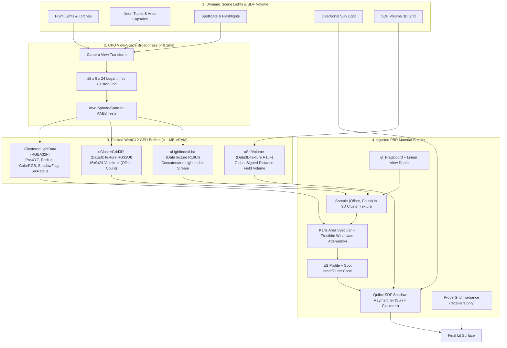

# AdvancedLighting3D — Clustered Dynamic Lighting, Baked Indirect GI & SDF Soft Shadows

**AdvancedLighting3D** is a complete dynamic lighting architecture and material pipeline for
**GDevelop 5 (Three.js WebGL2 backend)**. It covers direct light, indirect GI, and raymarched soft shadows:

1. **Direct light.** By partitioning the camera view frustum into a 3D grid of **3,456 spatial clusters**
($16 \times 9 \times 24$ depth slices), it can register up to **512 active dynamic lights**
(torches, streetlamps, campfires, neon signs, magic spells, muzzle flashes) without shader
recompilation for ordinary light updates (Karis area light specular
reflections, blackbody Kelvin colour temperatures, IES photometric profiles, and spot cones).

2. **Indirect light.** A **`LightProbeVolume3D`** bakes the scene's ambient into a small RGBA16F 3D
texture that **`ReceiveLightProbes`** objects sample per fragment, so a character walking under a
canopy, into a cave, or along a red-lit corridor picks up the ambient colour of *that place* instead
of the single flat ambient value a scene otherwise gets. About 16 KB of VRAM at default settings and
no additional draw calls.

3. **SDF Soft Shadows.** An **`SDFVolume3D`** bakes scene geometry into an
R16F 3D Signed Distance Field via exact Ericson triangle queries and Felzenszwalb's $O(N)$ separable
Euclidean Distance Transform. The injected PBR shader raymarches this distance field with Quilez's
improved penumbra estimator, delivering approximate contact-hardening soft shadows for the
directional Sun in SDF mode and clustered local lights in SDF/Hybrid modes. Local shadow candidates are ordered by distance to each cluster center; the per-fragment budget defaults to four. This is a conservative surface-distance approximation; small features require sufficient voxel resolution.

> **Why one extension.** All three systems inject into the same `lights_fragment_begin` chunk of the same
> shared materials. Unifying them provides **one injection, one customProgramCacheKey and one
> post-events tick**, guaranteeing that direct clustered lights, probe irradiance, and SDF raymarched
> shadows evaluate in optimal mathematical order with zero cache collisions.

---

## 🌟 Key Highlights

- **Clustered light evaluation:** Up to 512 registered lights; each pixel evaluates up to 64 entries in its cluster. Cost depends on overlap and shadow settings.
- **Zero Shader Recompilation Stutter:** Light data is streamed dynamically through WebGL2 DataTextures and 3D textures (`sampler3D`), eliminating all runtime shader recompilations when lights spawn, move, or extinguish.
- **Physically Based Area Lights (Karis Model):** Replaces artificial pinpoint specular reflections with realistic broad reflections for glowing embers, light bulbs, and neon tube/capsule lights.
- **Blackbody Radiation Color Temperature:** Set authentic physical lighting in Kelvin (1,800K candle flames to 8,500K moonlight).
- **IES Photometric Profiles:** Real-world architectural light distributions (wall sconces, streetlamps, spotlights, downlights), carried to the GPU in the fourth light texel.
- **Volumetric SDF Soft Shadows:** Fast 3D Signed Distance Field raymarching using Inigo Quilez's penumbra estimator. Contact-hardening soft shadows for the directional Sun and clustered local lights. CSM uses native shadow-map passes for the Sun in Hybrid mode.
- **O(N) Separable Euclidean Distance Transform:** Static geometry is converted into high-precision distance volumes using Ericson triangle distance tests and 3-axis Felzenszwalb parabolic envelopes under an amortised frame budget.
- **Baked Indirect Light Probes:** A 3D grid of probes captures occlusion and coloured bounce, sampled with one hardware-filtered `sampler3D` fetch per fragment. Caves go dark because there is rock overhead; the corridor goes red because the wall beside it is red.
- **Day / Night Probe Blending:** Two baked states blended on the GPU by a single global factor — no CPU recomputation, no rebake.
- **Binary Stream Files (.lpg.bin & .sdf.bin):** Both probe grids and SDF distance volumes can be exported during authoring and loaded instantly in shipping builds with zero runtime baking.
- **Hybrid Co-Existence Pipeline:** Seamlessly adds to GDevelop's native Sun, skybox and ambient light without breaking changes.

---

## 📐 The Unified Lighting Pipeline

---

## 📊 Comparison: Standard GDevelop Lighting vs. AdvancedLighting3D

| Metric / Capability | Standard GDevelop 3D Lighting | AdvancedLighting3D |
| :--- | :--- | :--- |
| **Max Dynamic Lights** | Depends on the renderer and material path | **64–512 registered lights (256 default), with at most 64 in one cluster** |
| **CPU cost of 100 Lights** | One draw path per light | **~1.3 ms broadphase, measured** (see below; GPU cost unprofiled) |
| **Shader Hitching on Spawn** | Light-count changes can alter the render path | **Ordinary light updates stream through textures without recompiling** |
| **Specular Reflections** | Pinpoint plastic white dots | **Realistic Area Lights (Karis Tube & Sphere)** |
| **Light Color Modeling** | Manual RGB hex codes | **Kelvin Blackbody Temperature (1,800K–8,500K)** |
| **Light Profiles** | Uniform spheres only | **IES Photometric Lobes (Sconces, Downlights)** |
| **Dynamic Shadows** | Traditional shadow maps: multi-pass rasterization, acne, peter-panning, strictly limited light count | **SDF Raymarched Soft Shadows: single 3D distance field, contact hardening, Sun + clustered lights, zero extra draw calls** |
| **Indirect / Ambient Light** | One flat ambient value for the whole scene | **Spatially varying baked probe grid (occlusion + coloured bounce)** |
| **Ambient in a Cave** | Same as outdoors | **Dark, because the bake saw rock overhead** |
| **Day / Night Ambient** | Manual re-tint | **Two baked volumes blended by one GPU factor** |
| **GPU VRAM Overhead** | Depends on native light and shadow settings | **Cluster buffers scale with MaxLights; probes and SDF scale with volume resolution; CSM scales with cascade count and map size** |

---

## Shadow modes and CSM

Auto is the default. CSM follows the first visible native directional Sun on the base 3D layer; it does not add another source of brightness. If there is no native Sun, CSM stays inactive. Add one in GDevelop before expecting Sun shadows.

Shadowing is configured on four independent axes, not one combined mode enum.

**Who shadows the scene** (`SetShadowMode`): `Auto` (this extension does), `Native` (leave the stock
GDevelop shadow system alone), or `Off`.

**How the Sun shadows** (`SetSunShadows`): `Cascades`, `DistanceField`, or `Off`.

**How local clustered lights shadow.** Each light picks its own technique from its Shadow Technique
property and what the budget allows: a real depth map, the baked distance field, or nothing. Two
scene-level settings control the depth maps:

| Setting | Choices | What it changes |
| --- | --- | --- |
| Maps: Depth renderer | `Native` / `Owned` | Who renders the depth map. Native borrows Three's shadow pass through a hidden zero-intensity light and costs **two** fragment texture units per shadowed light, plus a full material recompile whenever the shadowed-light count changes. Owned renders the maps directly: **one** unit, no recompile, spot lights only — point lights fall back to Native automatically. |
| Maps: Filter | `PCF` / `VSM` | Default for lights whose own Shadow Map Filter is `Auto`. |

**Contact shadows** are a separate, additive layer: short-range screen-space darkening marched
against a full-resolution depth prepass, costing **one** texture unit shared by every light rather
than one each. The ray starts above the receiver normal, jitters within each step and blends its hit
interval. It also reconstructs each sampled view-space position and rejects hits lying on the
receiver's own plane; this prevents the detached horizontal bars caused by neighboring floor-depth
texels at shallow viewing angles.

**Local shadow-map slots follow the current view.** A light competes only when it occupies a cluster
rendered by the active camera in the current frame. Spotlights use their finite cone for this test,
not the much larger range sphere, so an off-screen cone cannot reserve a slot just because its range
encloses the FPS camera. Visible candidates are ordered first by their nearest occupied depth slice
and then by cluster coverage, with a small incumbent allowance to avoid flicker between nearly equal
lights. Off-screen lights release their slots immediately. The limit is four slots; lights beyond it
fall back to SDF when available or remain lit without a local map.

**Texture-unit protection is automatic.** Before shadow work each frame, the extension reads the
GPU's fragment-texture limit and scans the scene's most texture-heavy Standard/Physical material
plus native GDevelop shadow casters. It reserves the clustered-light core first, then explicitly
attached probes, SDF and contact shadows, then CSM, then local maps. Any complete feature block that
does not fit is removed from the shader permutation before compilation and a warning explains what
was disabled. This also makes AdvancedWeather3D coexist safely: its scene-light changes may make
Three recompile a material, but the recompiled variant cannot request more samplers than the
allocator admitted.

The linked-program test measures **25 active fragment samplers** with every feature on using Native
local maps, or **21** with Owned maps. Neither fits the WebGL2 guaranteed minimum of 16. On a
simulated 16-unit device the automatic fallback compiles at 11 units by retaining probes, SDF and
contact shadows while dropping the six-unit CSM and eight-unit Native-local blocks. Use Owned,
fewer material maps, DistanceField Sun shadows, or fewer native shadow casters when you want to
retain more features on constrained GPUs.

#### PCF or VSM

PCF takes nine depth comparisons per light per pixel and averages them; that averaging is the only
thing making the edge soft, so a softer PCF shadow costs more every frame, forever.

VSM stores the **mean and standard deviation** of depth instead of depth itself. Statistics can be
blurred where a depth value cannot, so the map is blurred once when it is rendered and then read
with a **single** bilinear tap, and Chebyshev's inequality converts the two moments back into a
visibility estimate. Softness becomes a property of the map, paid once per map update, instead of a
per-pixel cost. Bias tuning also largely goes away, because nothing is being compared against
itself.

**Set it per light** (`ClusteredLight3D` → Shadow Map Filter: `Auto | PCF | VSM`, or the
`SetShadowMapFilter` action). `Auto` follows the scene-level Maps: Filter setting, so that stays a
real default rather than dead weight. A light asking for VSM promotes the scene's depth renderer to
Owned on its own; point lights ignore the setting and stay on PCF.

Mixing is the point, and it is *cheaper* than turning VSM on scene-wide, not more expensive:

* The shader is **unchanged**. `uAlLocalKind[slot].x` was already a per-slot uniform (0 = spot PCF,
  1 = point, 2 = spot VSM), so the per-slot branch already existed. Nothing was added to the
  per-pixel path.
* Moments targets are **per slot**, allocated only for lights that asked. One VSM light among four
  allocates one buffer, not four — and a light switched back to PCF releases its buffer.
* Blur passes run **per VSM slot**, so fewer VSM lights means fewer passes.

The rule of thumb is about motion, because the cost sits in map regeneration: VSM saves 8 texture
fetches per lit pixel per light per frame, and spends roughly `2 x mapSize² x 8` fetches each time
the map re-renders. At a 512 map that is 4.2M, which a light covering 50,000 screen pixels earns
back after about 11 still frames; at 1024 it is nearer 42. The extension only re-renders a map when
something inside that light actually moves, so **static casters → VSM, casters that move every
frame → PCF.**

Two controls, and they pull against each other:

* **Maps: VSM softness** (default 4) — blur radius in map texels. Past about 8 the Chebyshev
  estimate starts eroding the shadow itself; on the reference scene radius 8 retained 56% of PCF's
  shadow area against 77% at radius 4.
* **Maps: VSM light bleed reduction** (default 0.15) — crushes the technique's characteristic
  artefact, where a surface shadowed by two stacked occluders brightens instead of going dark. It is
  paid for directly in softness. Measured on the reference scene at a fixed radius: 0 gives a
  1278 px penumbra, 0.15 gives 464 px, 0.30 gives 332 px. Three.js defaults this to 0.30; the
  default here is **0.15**, because at 0.30 the result comes out harder than the PCF it replaced,
  which defeats the point of choosing VSM at all. Raise it only if you actually see light leaking
  through stacked geometry.

Stated plainly: **at the shipped defaults VSM is not dramatically softer than PCF.** Choose it for
one texture fetch instead of nine, and for softness that costs nothing to widen — then raise VSM
softness or lower light bleed reduction to spend that headroom.

One implementation note, because it is the difference between VSM working and VSM being a slower
PCF: the moments are taken over **linearised** depth. A perspective depth buffer puts every surface
a spot light can usefully reach into roughly the top 8% of [0,1] — measured at 234..255 of 255 here.
Variance is a squared quantity, so that compression collapses the standard deviation below what the
16-bit store can even hold, and Chebyshev degenerates into exactly the hard step VSM exists to
avoid. Three's own VSM converts the projected depth as-is, which is why its spot VSM shadows look
barely softer than its PCF ones.

Use SetShadowMode, or add one **AdvancedShadowManager3D** to configure the scene in the inspector. CSM supports 2–4 cascades (default 3), 1024/2048/4096 maps (default 2048), maximum distance, practical split lambda, depth/normal bias, PCF softness and seam blending. Fitting handles the mirrored Y root and Z-up coordinates, snaps to shadow texels, overlaps cascade transition bands and fades the final cascade to unshadowed Sun. Meshes keep their authored Three.js `castShadow` and `receiveShadow` flags, so enable those flags on the casters and receivers that should participate. Mode changes and scene cleanup release owned maps and restore renderer settings.

SDF baking now yields during voxel seeding, each distance-transform scanline, and conversion. Geometry collection and GPU texture upload remain synchronous. Deleting/resizing a volume cancels stale bake work. Loaded files validate bounds and samples. Zero normal bias is valid. Empty fields stay finite. Conservative half-voxel-diagonal dilation reduces thin-wall leaks, at the cost of slightly thicker silhouettes; rebake older SDF files to use this change.

SDF is **static geometry only**: moving casters need CSM for Sun shadows; moving local-light casters are not implemented. Only the base 3D layer is currently managed. Per-light `ShadowBias` offsets local SDF rays in voxel-size units; the global SDF normal bias controls the directional Sun.

### Validation

Run node AdvancedLighting3D/test-light-flicker-effects.mjs, node AdvancedLighting3D/test-shadow-runtime.mjs, and node AdvancedLighting3D/test-shadow-webgl.mjs. `test-owned-depth-webgl.mjs` asserts the Owned renderer matches the Native one pixel for pixel, `test-vsm-webgl.mjs` validates VSM filtering and mixed PCF/VSM lights, `test-contact-shadows-webgl.mjs` validates the depth-prepass contact result, and `test-sampler-ladder.mjs` measures every feature's active sampler cost and the automatic 16-unit fallback. The WebGL tests use the repository's Three.js r160 and headless Chrome with SwiftShader, check actual changed pixels, mode restoration, cascade bounds and shader errors, and write validation images. They require Chrome (or CHROME_PATH).

Software-WebGL tests are not hardware performance measurements or a full GDevelop export test. Desktop/mobile GPU profiling and editor/export acceptance testing remain outstanding. No universal 60 FPS guarantee is made.

## 🚀 Quick Start Guide

1. **No scene manager to add.** The runtime installs itself when the scene loads. Optionally call `SetMaxLights` (64–512, default 256) if you expect more than 256 simultaneous lights.
2. **Add Light Behavior:** Add the **`ClusteredLight3D`** behavior to any 3D object (torches, lampposts, projectiles, or empty light anchors).
3. **Customize Properties:**
   - Set **Light Type:** `Point`, `Spot`, or `AreaCapsule`.
   - A Spot light attached to a Cube3D automatically places an unlit bulb decal over the cube's front (`+Z`) face. This is the exact face the cone points out of, and the decal is attached directly to the editor's Cube3D mesh so face-material refreshes cannot erase it.
   - An AreaCapsule is a two-sided tube along the object's local Z axis. Diffuse lighting and attenuation use the nearest point on the fixed tube; only its physically view-dependent specular reflection uses the Karis representative point.
   - Set **Color Temperature:** e.g. `2200K` for warm torch fire or `5500K` for cool halogen.
   - Set **Attenuation Radius:** e.g. `12.0` meters.
   - For animation, add **`Lightflickereffects`** to the same object. Its **Flicker Mode** setting includes `FireFlicker` for flame modulation.
4. **Trigger In Event Sheet:**
   - On spell cast: `ClusteredLight3D::SetIntensity(3.5)` and `ClusteredLight3D::SetRadius(25.0)`
   - On shooting: `Lightflickereffects::TriggerMuzzleFlash(duration: 0.05)`
   - Master brightness: `AdvancedLighting3D::SetGlobalIntensity(1.2)`

### Lightflickereffects and LightTweens

These are separate optional companions for **ClusteredLight3D**. Add either or both to the same object. Leave **Light behavior name** empty to connect to its first light, or enter a specific behavior name when it has multiple lights. Use one of each companion per light.

**Lightflickereffects** provides FireFlicker, FluorescentHum, SirenStrobe and PulseWave, with speed and variation. ApplyFlickerPreset configures Candle, Torch, Fluorescent, Alarm, Breathing or None. TriggerMuzzleFlash creates a decaying burst. PauseEffects, ResumeEffects and StopAllEffects affect only flicker and flashes.

**LightTweens** smoothly changes intensity, radius (metres), RGB color and temperature (Kelvin). Each action takes a target, **duration in seconds** (default 1), easing style and playback mode. Available styles: Linear, EaseIn, EaseOut, EaseInOut, CubicIn, CubicOut, CubicInOut, SineIn, SineOut, SineInOut and ExponentialInOut. Playback can be Once, Loop or PingPong.

For a half-second fade out, call LightTweens → TweenIntensity with target 0, duration 0.5, EaseOut, Once. For a breathing radius, use TweenRadius with your target radius, duration 2, SineInOut, PingPong.

Intensity and radius can tween together. Color and temperature replace each other. Restarting a channel begins at its current value; zero duration applies immediately. PauseTweens and ResumeTweens control only transitions. StopTween stops one channel or All at the current values. IsTweenPlaying, IsTweenFinished and TweenProgress expose status; finished remains true until restarted or stopped, so use Trigger once for a one-shot event.

Flicker modulates the tweened base intensity. Both behaviors work independently of their order on the object. Pauses are independent and survive behavior deactivation/reactivation. Destroying either companion leaves the other active. IsPaused and IsLightConnected are available on both. Animation runs in the game; the editor shows steady authored lighting.

**Extension API changes:** Original ClusteredLight3D flicker settings and events now belong to Lightflickereffects. Transition actions previously on Lightflickereffects now belong to LightTweens. Only the extension is updated; project files are not modified.

### Adding baked indirect light

5. **Define the probe volume.** Add a **Cube3D** to the scene, stretch it over the level with the 3D scale
   gizmo and add the **`LightProbeVolume3D`** behavior. The cube's bounds are the volume's bounds and
   the cube hides itself at runtime. Note that **Z is the height axis** in GDevelop, so the default
   grid is $16 \times 16 \times 4$.
6. **Attach receivers.** Add **`ReceiveLightProbes`** to your player, enemies and props. Receivers
   also keep receiving clustered dynamic lights and SDF shadows — all three share one shader.
7. **Bake probes.** Call `StartProbeBake()` once and poll `IsProbeBakeComplete()`. Export with
   `ExportProbeData` so shipping builds load the `.lpg.bin` directly instead of rebaking.

### Adding Signed Distance Field (SDF) Soft Shadows

8. **Define the shadow volume.** Add a **Cube3D** bounding the static level geometry and attach the
   **`SDFVolume3D`** behavior. Set dimensions like $64 \times 64 \times 32$ or $128 \times 128 \times 32$.
9. **Bake geometry.** Enable **`AutoBakeOnStart`** or call `StartSDFBake()`. The amortised Felzenszwalb
   algorithm calculates exact Euclidean distance fields across all static meshes. Export with `ExportSDFData`
   to save an `.sdf.bin` file and load it in production via `LoadSDFDataFromFile`.
10. **Enable shadow casting.** On any `ClusteredLight3D`, check **`CastShadows`** (true) and set
    **`SourceRadius`** (e.g. 5.0–20.0 for soft penumbra). The Three.js directional Sun light automatically
    casts raymarched soft shadows across the distance field!

---

## ⚠️ Requirements and limits

| | |
| :--- | :--- |
| **WebGL2** | Required by all systems. `sampler3D` and `usampler3D` do not exist in GLSL ES 1.00, so there is no degraded mode. Check `IsSupported()` before your setup events. |
| **Lit standard materials** | Injection is applied to `MeshStandardMaterial` only. Objects set to material type **Basic** cannot receive clustered light, probe light, or SDF shadows — `MeshBasicMaterial` has no lighting at all. The extension warns once, naming the material. |
| **Units** | The clustered light `Radius`, `CapsuleLength` and `SourceRadius` are in **metres**; the runtime converts at 100 world units per metre. Probe/SDF bounds and offsets stay in raw GDevelop world units. |
| **SDF & Probe volumes per scene** | One active probe volume and one active SDF volume per scene. Overlapping multi-volume blending is not implemented. |
| **SDF Static Geometry** | The distance field is baked from static scene meshes. Dynamic skinned characters receive shadows from the static world; dynamic character self-shadowing is not evaluated in the static SDF volume. |
| **Scene editor** | Clustered lights **do** render live in the 3D scene editor via `gdjs.registerInGameEditorPostStepCallback`. Flicker and muzzle flashes are pinned to the configured intensity in the editor so authoring is against a steady light. |

---

## 🖊️ In the scene editor

Lights render live in GDevelop's **3D scene editor**, not just in Preview. That is not automatic:
the editor drives its own loop (`_updateObjectsForInGameEditor` → `gdjs.callbacksInGameEditorPostStep`
→ `render()`) and **never runs events**, so a behavior's `doStepPreEvents` and the scene's
post-events callbacks both stay silent there. The extension registers for that editor callback list
explicitly and runs the same broadphase from it.

Two consequences worth knowing while authoring:

- **Flicker and muzzle flashes do not animate in the editor.** Each light is drawn at its configured
  `Intensity`. Authoring against a pulsing light is worse than authoring against a steady one.
- **`Intensity` is live without a step.** The light's working intensity is seeded from the property
  at creation rather than defaulting to `1.0`, because nothing in the editor would ever update it.

## 📈 Measured CPU cost

The CPU broadphase, timed in the Node harness at a 4 m radius (16 x 9 x 24 grid, 1920x1080,
fov 45). Note the **default is 12 m**, not 4 — see the warning below the table:

| Active lights | Broadphase / frame |
| ---: | ---: |
| 0 | 0.21 ms |
| 1 | 0.58 ms |
| 16 | 1.21 ms |
| 64 | 1.24 ms |
| 256 | 1.83 ms |
| 500 | 1.70 ms |

Two things keep that flat. The per-cluster bins are typed arrays allocated once and reused —
they used to be 3,456 freshly allocated JS arrays every frame, which cost 0.84 ms before a
single light was considered. And a light is only tested against the tiles its screen-space
footprint actually covers, rather than all 144 tiles of every depth slice it spans.

**Radius is the performance knob — but reach comes first.** A light whose radius covers the whole
view lands in every cluster and defeats the clustering: 256 lights at 4 m cost 1.8 ms, the same 256
at 12 m cost 10.5 ms. It is tempting to make the default small for that reason. Don't: attenuation
reaches **exactly zero** at the radius, so a surface past it is not dim, it is *unlit*, and a 4 m
default turns a stock scene black the moment anything sits more than 400 units from the light.
The default is 12 m (1200 units) because that lights an ordinary scene. Lower it per-light once you
have something on screen and `CPUBroadphaseTimeMs()` says you need to.

*(GPU cost is not measured here — nothing has been profiled in GDevelop yet.)*

---

## ❌ Architectural boundaries

| Feature | Status |
| :--- | :--- |
| **Dynamic character shadow casters** | SDF volumes represent static world geometry. Dynamic skinned characters do not write into the static SDF volume; they receive shadows cast by the world. |
| **Projective Decals** | Planned in a dedicated decoupled package (`ClusteredDetail`), not part of lighting. |
| **Configurable cluster grid** | `ClusterGridX/Y/Z` are compile-time constants (16 × 9 × 24). |
| **Multiple layers** | The cluster broadphase reads the camera and scene from the base layer (`""`) only. Lights, probes, and SDF volumes on other layers are not handled. |

Everything else in this document is wired end to end and covered by the test suite.

---

## 🔗 Shader hook ownership

`material.onBeforeCompile` is **one function property, not a list** — two systems that both assign it
do not compose, and the loser's shader edits vanish with no error.

This extension therefore does not assign it. `ShaderChain.runtime.js` owns the hook, and the
clustered-lighting, probe and SDF-shadow injection registers into it as a band-100 (BASE SHADING)
injector. The chain is embedded ahead of this runtime by `build-extension.mjs`, so the extension is
still a single self-contained import and works with MaterialMaster **not** installed.

- The same `ShaderChain.runtime.js` ships inside Material 3D. The two copies negotiate by
  `CHAIN_VERSION` at load, so either install order and either extension alone behave identically.
- `customProgramCacheKey` is now composed by the chain: this extension's fragment appears as
  `advlight3d:GD_ADVLIGHT3D_V8|…` inside a larger key rather than owning the whole string.
- `ensureAll()` runs on the post-events tick. A runtime that swaps in a fresh material discards the
  hook silently; this re-patches it on the next frame.
- The build refuses to compile if this runtime assigns `onBeforeCompile` directly.

---

## 📚 Documentation Index

- [IMPLEMENTATION_PLAN.md](./IMPLEMENTATION_PLAN.md) — Technical architecture, mathematical formulations (logarithmic depth slicing, Arvo distance metrics, Karis representative point area specular, Frostbite windowed attenuation, volumetric scattering integrals), WebGL2 texture packing, and implementation phases.
- [API_REFERENCE.md](./API_REFERENCE.md) — Complete specification of Manager and Object Properties, Actions, Conditions, Expressions, Presets, and Color Temperature constants.
