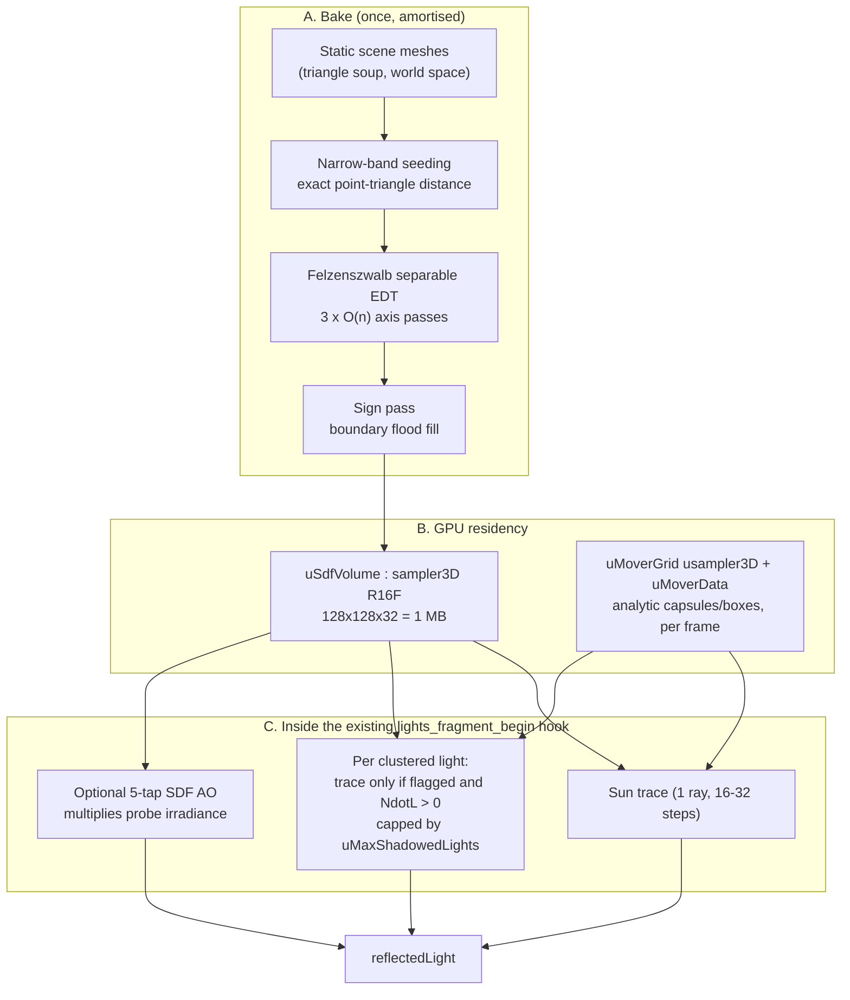

# SDF Shadows — Implementation Plan

> **Status:** historical design reference. The SDF system is implemented in **AdvancedLighting3D**
> as a third feature sharing the one `lights_fragment_begin` injection, alongside the clustered
> direct-light loop ([IMPLEMENTATION_PLAN.md](./IMPLEMENTATION_PLAN.md)) and the baked probe grid
> ([PROBE_IMPLEMENTATION_PLAN.md](./PROBE_IMPLEMENTATION_PLAN.md)).

---

## 0. Why SDF, and why here

AdvancedLighting3D can register up to 512 dynamic lights, with a 256-light default and a 64-light
per-cluster limit. Version 4.1.0 removes the unimplemented `EnableContactShadows` and per-light
`CastContactShadows` properties because screen-space contact shadows need a sampleable depth buffer and
GDevelop's 3D layer composer does not expose one (its render targets carry a depth *renderbuffer*,
not a texture).

Enumerating what is actually available in this engine:

| Technique | Verdict in GDevelop |
| :--- | :--- |
| **Shadow maps** (Three's native) | Works, but one directional plus a couple of spots is the practical ceiling. Each shadow-casting light is a full extra scene render. Cascades swim and crawl without light-space texel snapping (see Appendix A.3 of the shadow selector plan). Cannot serve a clustered light system. |
| **Screen-space contact shadows** | **Impossible without rewriting the layer composer.** No depth texture. Also cannot shadow from off-screen geometry. |
| **Voxel cone tracing (VXGI)** | Needs conservative rasterisation plus image load/store. No compute and no `imageStore` in WebGL2. Dead end. |
| **Ray tracing / BVH in-shader** | A BVH traversal per light per fragment. Texture-fetch bound and branch-divergent; unusable at GDevelop's target hardware. |
| **Signed distance field, sphere-traced** | One 3D texture. One trace loop. Cost independent of triangle count. Soft penumbrae for free. Casts from off-screen and off-cascade geometry. Zero extra render passes. **This is the one that fits.** |

The specific match to this extension: the SDF is *sampled*, not *rendered*, so it composes with the
clustered loop at zero architectural cost — a shadow term is one multiply on the radiance already
being computed inside the existing per-light loop. And the field is world-anchored, so nothing
swims when the camera moves.

The honest trade: **SDF shadows are a medium-frequency technique.** They lose detail below one
voxel. They do not replace a shadow map for a close-up hero character's fingers. They do replace it
for everything else, and they do the thing a shadow map cannot: shadow 300 torches.

---

## 1. Architecture

Three tiers, each shippable on its own.



* **Tier 1 — static field plus sun.** The single biggest visual win. Soft, stable, non-swimming sun
  shadows over the whole level with no shadow camera, no cascades, and no texel-snapping stabilization.
* **Tier 2 — shadowed clustered lights.** Per-light opt-in flag, hard cap per fragment.
* **Tier 3 — movers.** Analytic primitives (sphere / capsule / box) unioned into the field so the
  player and enemies cast without a rebake.

---

## 2. The field

### 2.1 Storage

| | |
| :--- | :--- |
| **Texture** | `THREE.Data3DTexture`, `RedFormat` + `HalfFloatType` (**R16F**) |
| **Filtering** | `LinearFilter` min/mag — R16F is texture-filterable in WebGL2 core, no extension needed |
| **Wrap** | `ClampToEdge` on all three axes (and the trace never trusts a sample outside the box — see §4.4) |
| **Contents** | Signed distance to the nearest static surface, in **GDevelop world units**, in **mirrored three-space** |
| **Sampling** | One `texture(uSdfVolume, uvw).r` per trace step |

Half float is the right encoding rather than R8: an 8-bit field must be normalised against a maximum
encode distance, and clamping the far field to a few voxels destroys the long empty-space strides
that make sphere tracing cheap in the first place. R16F stores true unbounded distance and gives
plenty of precision near zero, which is the only place it matters.

### 2.2 Resolution and memory

| Grid | Voxels | VRAM | Voxel size over a 2,000-unit level |
| :--- | ---: | ---: | ---: |
| 64 x 64 x 32 | 131,072 | **256 KB** | 31 units |
| 128 x 128 x 32 | 524,288 | **1 MB** | 15.6 units |
| 128 x 128 x 64 | 1,048,576 | **2 MB** | 15.6 x 15.6 x 7.8 |
| 192 x 192 x 64 | 2,359,296 | **4.5 MB** | 10.4 units |
| 256 x 256 x 64 | 4,194,304 | **8 MB** | 7.8 units |

Default: **128 x 128 x 32**, matching the probe volume's habit of a coarse height axis (Z is up in
GDevelop, and levels are wide and flat). At 1 MB this is a rounding error next to a single 2048²
texture.

Sizing rule for the docs: **a caster needs to be roughly 3 voxels across to cast a recognisable
shadow.** A 100-unit-tall character in a 2,000-unit level at 128³ is 6 voxels — a readable body
shadow, no limbs. Users wanting limb detail need either a smaller volume or Tier 3 primitives.

### 2.3 Coordinate space

Follow exactly what the probe volume already does, because the two share the authoring workflow and
must not disagree:

* Bounds are authored by stretching a **Cube3D** (`SDFVolume3D` behavior), read as
  `(x, y, z, width, height, depth)` in GDevelop coordinates.
* The scene root is Y-mirrored (`_threeScene.scale.y = -1`), so the sampling-space minimum is
  `(minX, -maxY, minZ)` and the size is unchanged. This is the same `threeMin` / `threeSize` pair
  `syncVolumeBoundsFromObject` already computes.
* The baker writes voxels at mirrored positions (`originVec.set(px, -py, pz)`), as `stepBake` does.
* **Get this wrong and the field is flipped in Y with no error message.** A unit test asserting the
  mirrored round trip is mandatory (§10).

---

## 3. Baking

The naive bake — every voxel against every triangle — is O(voxels × triangles): 524,288 × 20,000 =
10^10 operations. Not viable. The bake is instead three cheap passes.

### 3.1 Pass A — narrow-band seeding

For each triangle, compute its AABB in voxel space, dilate by `B` voxels (default **2**), and for
each voxel in that dilated box compute the **exact point-triangle distance** (Ericson's
closest-point-on-triangle: barycentric region test, then the six degenerate cases). Keep the minimum
per voxel.

Work is proportional to *surface area in voxels*, not to the volume:

$$\text{seed ops} \approx \sum_{\text{tri}} (2B+1)^3 \cdot \frac{A_\text{tri}}{s^2}$$

For a typical level (20k triangles, 128³ grid) this lands around **0.5–1 M** point-triangle tests,
roughly 50–150 ms of single-threaded JS. Amortised at 8 ms/frame that is about 15 frames.

Also record, per seeded voxel, the index of the winning triangle — needed by the pseudonormal sign
mode (§3.3) and free to keep as a scratch `Int32Array` discarded after baking.

### 3.2 Pass B — exact EDT (Felzenszwalb–Huttenlocher)

The rest of the volume is filled by a **distance transform of sampled functions**: three separable
1-D passes (X, then Y, then Z), each computing the lower envelope of parabolas

$$D(p) = \min_q \left( (p-q)^2 + f(q) \right)$$

seeded with $f(q) = d_\text{band}(q)^2$ inside the band and $+\infty$ outside. Each 1-D pass is
**O(n)** with a small constant. Total: 3 × 524,288 ≈ 1.6 M operations, roughly 20–60 ms in JS. Take
the square root at the end.

This is exact Euclidean distance to the seeded samples, so accuracy is bounded by the band seeding,
not by the propagation — no jump-flooding approximation error, and no iteration count to tune.

> **This bake is cheaper than the probe bake the extension already ships.** 1,024 probes × 32 rays
> is 32,768 `Raycaster.intersectObjects` calls against the whole mesh list; the SDF bake never
> raycasts. Worth saying out loud in the docs: the shadow bake costs less than the GI bake.

### 3.3 Pass C — sign

Three modes, because game meshes are frequently not watertight:

| `SignMode` | Method | Fails on |
| :--- | :--- | :--- |
| `Unsigned` | Skip the pass; everything stays positive. | Nothing — but a ray starting inside geometry creeps instead of escaping. Adequate in practice because rays always start at `surface + N * bias`, outside. |
| `FloodFill` **(default)** | BFS "outside" from the grid border through non-band voxels; unvisited non-band voxels are interior, so negate them. A 524k-node BFS, single-digit ms. | Open shells — an unclosed room floods inside-out. |
| `Pseudonormal` | Angle-weighted pseudonormal (Bærentzen & Aanæs) of the winning triangle from Pass A; sign is `dot(voxelCentre - closestPoint, n_pseudo)`. Correct at edges and vertices where a raw face normal is not. Band only; pair with FloodFill for the deep interior. | Needs per-vertex and per-edge normal accumulation — the most code of the three. |

For shadow tracing the sign only genuinely matters within about one voxel of a surface, which is why
`Unsigned` is a legitimate fallback rather than a broken one.

### 3.4 Thin geometry

A single-quad floor or a leaf card is infinitely thin and will half-vanish at any resolution.
Ship an **`Inflate`** property (default **0.5 voxel**): subtract a constant from the field after
Pass B, thickening every surface uniformly. It costs a little shadow bloat and rescues all the flat
geometry GDevelop users actually build levels out of.

### 3.5 Amortisation and lifecycle

Mirror the probe baker exactly: a `bakeState` machine stepped from `doStepPostEvents` under
`SetSDFBakeBudgetMs` (default 8 ms), resumable mid-pass (per-triangle in A, per-row in B, per-BFS-
batch in C), with `StartSDFBake()` / `IsSDFBakeComplete()` / `SDFBakeProgress()`. Geometry
collection reuses `collectBakeGeometry`, which already excludes probe receivers and debug meshes —
add an exclusion for objects carrying `SDFShadowCaster3D`, since they are Tier 3 movers and must not
also be baked into the static field, or they cast twice and permanently.

### 3.6 Serialisation — `.sdf.bin`

Same shape as the existing `LPG3` format, so the loader is near-identical:

```
0..3    magic 'SDF3'
4..7    uint32  version = 1
8..19   uint32  resX, resY, resZ
20      uint8   encoding (0 = R16F)
21      uint8   flags (bit0 signed, bit1 inflated)
22..27  uint8   reserved
28..31  float32 voxelSize (largest axis, drives shader bias defaults)
32..55  float32 minX,minY,minZ,maxX,maxY,maxZ  (unmirrored GDevelop coords)
56..    payload: resX*resY*resZ half floats
```

128 × 128 × 32 gives **1,048,632 bytes**. Distance fields are smooth, so it gzips well; ship it as a
game resource and never bake at runtime in a release build.

---

## 4. The trace

### 4.1 Sampling

```glsl
// Returns a huge value outside the volume, so a ray that leaves is never falsely occluded.
float sdfSampleStatic(vec3 wp) {
  vec3 uvw = (wp - uSdfMin) / uSdfSize;
  if (any(lessThan(uvw, vec3(0.0))) || any(greaterThan(uvw, vec3(1.0)))) return 1e6;
  return texture(uSdfVolume, uvw).r;
}
```

The bounds test is not optional. With `ClampToEdge`, a sample past the border returns the border
voxel's value — which, near a wall at the volume edge, is a small number, and would paint a hard
band of fake shadow around the whole level. See §4.4.

### 4.2 Soft shadow, improved Quilez

```glsl
float sdfShadow(vec3 ro, vec3 rd, float tMin, float tMax, float k, int maxSteps) {
  float res = 1.0;
  float t = tMin;
  float ph = 1e20;                 // previous h, for the corrected penumbra estimate
  for (int i = 0; i < maxSteps; i++) {
    if (t >= tMax) break;
    float h = sdfScene(ro + rd * t);
    if (h < uSdfHitEps) return 0.0;
    // Quilez's corrected estimate: removes the banding the naive k*h/t form produces.
    float y = h * h / (2.0 * ph);
    float d = sqrt(max(h * h - y * y, 0.0));
    res = min(res, k * d / max(t - y, 1e-4));
    ph = h;
    t += clamp(h, uSdfMinStep, uSdfMaxStep);
  }
  return clamp(res, 0.0, 1.0);     // budget exhausted: return what we have, never 0
}
```

Two deliberate choices:

* **Running out of steps returns the partial `res`, not `0.0`.** Returning 0 on exhaustion is the
  classic SDF-shadow bug: distant surfaces go black in a hard ring at the step budget's reach.
* **`ph` starts huge** so the first iteration's penumbra term degenerates harmlessly instead of
  producing a bright seam at the ray origin.

### 4.3 Penumbra width — `k` from real light geometry

`k` is the reciprocal of the light's angular radius. Both cases fall out of the same identity:

* **Sun:** `k = 1.0 / tan(radians(uSunAngularRadiusDeg))`. The real sun is a 0.265° half-angle
  (`k ≈ 216`, razor sharp). Games want softer — default **1.8°**, so `k ≈ 32`. Expose it as
  `SunSoftness` in degrees, never as a raw `k`.
* **Clustered light:** a source of radius $R_s$ subtends a half-angle $R_s / L$ at distance $L$, so
  `k = distToLight / sourceRadius`. Pack `sourceRadius` into the free `shape.w` channel of the light
  texture (§5.2), defaulting to `attenuationRadius * 0.05` — consistent with the `radius * 0.1` the
  Karis area-specular path already assumes.

Penumbrae therefore widen correctly with occluder distance, for free. That behaviour is the entire
reason to prefer this over a shadow map's fixed-radius PCF blur.

### 4.4 Ray setup — the four biases that decide whether this looks right

1. **Normal offset start.** `ro = worldPos + N_world * max(uSdfNormalBias, 1.0 * voxelSize)`.
   The field is only accurate to about a voxel; starting on the surface self-shadows everything.
2. **Along-ray start.** `tMin = 2.0 * voxelSize`, skipping the receiver's own footprint in the field.
3. **Analytic volume exit.** Ray-box intersect against the volume bounds and set
   `tMax = min(userMaxDistance, tExit)`. Never step outside.
4. **Boundary fade.** Fade the shadow factor to 1.0 across the outer ~4 voxels of the volume, so the
   edge of the baked region is a soft falloff rather than a visible rectangle in the level.

Also `uSdfMinStep = 0.5 * voxelSize` (prevents infinite creep along a grazing surface) and
`uSdfMaxStep = 8.0 * voxelSize` for the sun (bounds the error of a long stride through a region
where the field understates a thin occluder).

**Do not jitter the ray start** beyond about a quarter step. Dithering trades banding for noise, and
noise needs TAA to resolve — GDevelop has none. Banding is the lesser evil here.

### 4.5 Cost control

The shadow term is only evaluated when it can matter:

```
skip if  NdotL <= 0.0                              (backfacing: free ~50% rejection)
skip if  the light is not flagged as a shadow caster
skip if  shadowedCount >= uMaxShadowedLights
skip if  fragment distance > uSdfShadowDistance    (hard cut with a fade band)
step budget drops with view distance               (2 LOD bands)
```

Point-light traces additionally cap `tMax = min(distToLight, uPointShadowDistance)` and use a much
smaller step budget than the sun (8–12 vs 16–32), since they terminate at the light.

---

## 5. Integration with the existing extension

### 5.1 One injection, one cache key

The extension already owns a single `onBeforeCompile` and a single `customProgramCacheKey`, which is
precisely why the clustered and probe halves were merged into one folder. SDF is a third `#define`
in that same hook, not a second hook:

```
cacheKey = 'GD_ADVLIGHT3D_V3|CL1|G3D<0|1>|LP<0|1>|SDF<0|1>|MOV<0|1>'
```

Bump `V2` to `V3` when the light packing changes (§5.2). A shared or colliding key hands a material
another variant's compiled program — silently, since a bad 3D shader in GDevelop renders unlit
rather than erroring.

### 5.2 Light data packing

The light texture is 4 texels per light. `shape` (texel 3) currently uses `.x` for the IES profile
id and `.y` for cos(inner cone). **Both remaining channels are free**, so shadows cost zero extra
bandwidth:

| Channel | New meaning |
| :--- | :--- |
| `shape.z` | Flags. Bit 0 = casts SDF shadow. |
| `shape.w` | Source radius in world units (drives penumbra width). |

### 5.3 Getting a world-space position without touching the vertex shader

The probe path already has `vProbeWorldPos`, but that varying and its `worldpos_vertex` hook exist
only on **receiver clones**. SDF shadowing applies to every injected material, so promoting the
varying would force the vertex hook onto everything and add another program variant.

Cheaper and simpler: pass **`uViewToWorld`** (a `mat4` equal to `camera.matrixWorld`, updated once
per frame in the existing post-events tick) and reconstruct in the fragment shader:

```glsl
vec3 wp = (uViewToWorld * vec4(geometryPosition, 1.0)).xyz;
vec3 nw = inverseTransformDirection(geometryNormal, viewMatrix);
```

`geometryPosition` and `geometryNormal` are the locals `lights_fragment_begin` declares.
**`vViewPosition` must not be used** — it is the *negated* fragment position and would flip every
light vector. `inverseTransformDirection(dir, viewMatrix)` is Three's own helper, already used by
the probe hook.

Per-light world direction, no extra texture fetch:
`vec3 Lw = inverseTransformDirection(normalize(toLight), viewMatrix);`

### 5.4 Where the term lands in the shader

Inside the existing clustered loop, immediately before accumulation:

```glsl
float sdfShadowFactor = 1.0;
#ifdef AL_SDF_SHADOWS
  if (shadowedSoFar < uMaxShadowedLights && (uint(shape.z) & 1u) == 1u && clNdotL > 0.0) {
    float srcR = max(shape.w, 0.001);
    sdfShadowFactor = sdfShadow(ro, Lw, tMin, min(dist, uPointShadowDistance),
                                dist / srcR, AL_SDF_POINT_STEPS);
    shadowedSoFar++;
  }
#endif
vec3 radiance = cInt.rgb * (cInt.w * atten * lightScaleFactor * sdfShadowFactor);
```

### 5.5 The sun

Two modes, and the difference matters:

* **`OwnSun` (recommended for Tier 1).** The extension reads the scene's directional light, adds its
  own sun term inside the injected block with the SDF factor applied, and sets the native light's
  `castShadow = false` (or asks the user to). Full control, one code path, and it obeys the same
  energy conventions the clustered loop already handles (the `× PI` when `useLegacyLights` is on).
* **`ModulateNative`.** Three applies the shadow map to `directLight.color` *inside*
  `lights_fragment_begin` itself, so there is no post-hoc hook — the factor has to be multiplied in
  before `RE_Direct`. Achievable, since the extension already replaces that `#include`: read
  `THREE.ShaderChunk.lights_fragment_begin` at runtime, splice the SDF multiply into the directional
  branch, and emit the expanded chunk in place of the `#include`. This gives the best-looking result
  — **shadow map for the near field, SDF for the far field, blended over a distance band** — but it
  is textually coupled to r160's chunk source. Gate it behind a marker check and fall back to
  `OwnSun` when the expected substring is absent.

Ship Tier 1 with `OwnSun`; add `ModulateNative` as a Phase 6 quality option.

### 5.6 Free bonus — SDF ambient occlusion

Five taps along the normal, feeding the probe irradiance the extension already computes:

```glsl
float sdfAO(vec3 p, vec3 n) {
  float occ = 0.0, sca = 1.0;
  for (int i = 1; i <= 5; i++) {
    float h = float(i) * uAoRadius * 0.2;
    occ += (h - sdfSampleStatic(p + n * h)) * sca;
    sca *= 0.75;
  }
  return clamp(1.0 - uAoStrength * occ, 0.0, 1.0);
}
// irradiance *= sdfAO(...)   applied before lights_fragment_end consumes it
```

Five texture fetches buy grounded contact darkening everywhere, including places the probe grid is
too coarse to resolve. `uAoRadius` default around **40 world units** — remember GDevelop 3D is
pixel-scale and a character is 50–200 units tall, so a 1.2-unit AO radius ported from a metric engine
is effectively zero here.

---

## 6. Movers (Tier 3)

Static-only shadows are a hard sell when the player casts nothing. Baked fields cannot follow a
moving object, so movers are **analytic primitives** unioned into the field at sample time.

### 6.1 Primitives

`SDFShadowCaster3D` behavior, one per moving caster. Shape auto-fitted from the object AABB or set
explicitly:

| Type | Params | GLSL |
| :--- | :--- | :--- |
| Sphere | centre, r | `length(p-c) - r` |
| Capsule | p0, p1, r | segment distance − r |
| Box | centre, halfExtents, quaternion | `length(max(abs(q)-h,0.0)) + min(max(q.x,max(q.y,q.z)),0.0)` |
| Ellipsoid | centre, radii | scaled-sphere approximation |

A humanoid is a capsule; a crate is a box. That covers essentially every GDevelop mover.

### 6.2 Culling — reuse the clustered machinery

Evaluating 32 primitives inside each of ~24 trace steps is 768 evaluations per ray. Not acceptable.
Instead build a **world-space uniform grid** over the volume bounds (default **32 × 32 × 8**),
holding `(offset, count)` into a mover index list — structurally identical to `uClusterGrid3D` and
`uLightIndexList`, and populated on the CPU each frame by the same Arvo sphere-to-AABB test
`updateClusterAABBs` already uses.

```glsl
float sdfScene(vec3 wp) {
  float d = sdfSampleStatic(wp);
  #ifdef AL_SDF_MOVERS
    // Movers only matter for near-field shadows; skip the lookup on far strides.
    if (traceT < uMoverMaxDistance) {
      uvec2 hdr = texelFetch(uMoverGrid, moverCell(wp), 0).rg;
      for (uint i = 0u; i < hdr.g; ++i) d = min(d, moverDist(wp, hdr.r + i));
    }
  #endif
  return d;
}
```

Typical occupancy is 0–2 primitives per cell, so the added per-step cost is one integer fetch plus a
couple of cheap closed forms. Note the union is a hard `min`; for a softer join between a mover and
the ground, a `smin` with a small blend radius looks better and costs one extra `mix`.

CPU cost for 64 movers: one AABB rasterisation each into an 8,192-cell grid — well under 0.1 ms, the
same order as the existing light broadphase.

---

## 7. Quality tiers

One `SDFShadowQuality` property, because the trace is the entire cost and users must be able to
scale it:

| Tier | Sun steps | Point steps | Max shadowed lights | AO | Movers |
| :--- | ---: | ---: | ---: | :--- | :--- |
| `Off` | — | — | 0 | off | off |
| `Low` | 12 | — | 0 | off | on |
| `Medium` **(default)** | 20 | 8 | 1 | off | on |
| `High` | 28 | 10 | 2 | on | on |
| `Ultra` | 40 | 14 | 4 | on | on |

### Cost model

The trace is texture-fetch bound, and the fetches are **spatially coherent** — neighbouring
fragments walk near-identical paths, so the 3D texture cache hit rate is high. That coherence is why
the technique is viable at all.

Rough budget at 720p (≈0.92 M fragments, before depth rejection and the `NdotL <= 0` half):

| Config | Fetches/frame | Desktop iGPU | Mobile |
| :--- | ---: | :--- | :--- |
| Medium, sun only | ~9 M | comfortable | acceptable |
| High, sun + 2 lights | ~22 M | comfortable | marginal |
| Ultra, sun + 4 lights | ~50 M | fine on a dGPU | no |

Publish these as guidance, and default mobile detection to `Low`.

---

## 8. Limits to state up front

The README has a "What this extension does *not* do" section. These belong in it from day one:

| Limit | Detail |
| :--- | :--- |
| **No contact detail** | Sub-voxel contact shadows are lost. Tier 3 primitives recover it for characters; a true contact-shadow pass still needs a depth texture the engine does not expose. |
| **The static field is static** | Opening a door, destroying a wall, or spawning level geometry does not update the baked field. Re-bake, or model the mover as a primitive. |
| **Thin geometry** | Anything thinner than `Inflate` may not cast. Ship `Inflate` on by default and document it. |
| **One volume per scene** | Same constraint as the probe volume. Multi-volume selection is a later phase and pairs naturally with `WorldPartition3D` for chunked levels. |
| **WebGL2 only** | `sampler3D` does not exist in GLSL ES 1.00. `IsSupported()` gates everything and the shader path compiles out entirely. |
| **Alpha-tested foliage** | The bake sees triangles, not alpha masks. A leaf card casts as a solid quad. Provide a per-object "exclude from bake" flag. |
| **Base layer only** | The clustered broadphase already reads only layer `""`; the SDF volume inherits that. |

---

## 9. ACE surface

**Behaviors**

* `SDFVolume3D` (on a Cube3D, mirroring `LightProbeVolume3D`): `ResolutionX/Y/Z`, `Inflate`,
  `SignMode`, `AutoBakeOnLoad`, `DataFile`.
* `SDFShadowCaster3D` (on movers): `Shape`, `RadiusScale`, `Enabled`, `BlendRadius`.
* `ExcludeFromSDFBake` (a flag for static objects that should not be baked — foliage, glass, decals).

**Scene actions, conditions and expressions**

| Kind | Name |
| :--- | :--- |
| Action | `StartSDFBake`, `CancelSDFBake`, `SetSDFBakeBudgetMs`, `ExportSDFData`, `LoadSDFData` |
| Action | `SetSDFShadowQuality`, `SetSDFShadowDistance`, `SetSunSoftness`, `SetSunShadowEnabled` |
| Action | `SetSDFNormalBias`, `SetMaxShadowedLights`, `SetSDFAOEnabled`, `SetSDFAOStrength/Radius` |
| Action | `ToggleSDFDebugView` (slice / field magnitude / step-count heatmap) |
| Condition | `IsSDFSupported`, `IsSDFBakeInProgress`, `IsSDFBakeComplete`, `IsSDFVolumeLoaded` |
| Expression | `SDFBakeProgress`, `SDFVoxelSize`, `SDFVRAMBytes`, `SDFShadowStepBudget` |
| Behavior | `SetCastsSDFShadow` and `SetSourceRadius` on `ClusteredLight3D` |

A **step-count heatmap** debug view is worth building early — it is the only practical way to see
where the trace is expensive, and it turns performance tuning from guesswork into reading a picture.

---

## 10. Test plan

Extend `test-runtime.mjs` (mocked `THREE`, no GPU) with:

1. **Point-triangle distance** against a reference implementation over randomised triangles,
   covering all six degenerate regions.
2. **EDT correctness**: on a 16³ grid with random seeds, assert the separable transform equals the
   brute-force minimum for every voxel, to float tolerance. This is the pass most likely to hide an
   off-by-one, and it is fully testable on the CPU.
3. **Sign flood fill**: a closed box voxelisation has a negative interior; an open box does not —
   assert the documented failure so the limitation stays honest.
4. **Mirrored-Y round trip**: a caster authored at GDevelop `y = 100` lands at sampling `y = -100`.
5. **`.sdf.bin` round trip**: header fields and payload survive export then load.
6. **Budget honoured**: a mocked `performance.now` proves `stepBake` returns within budget and
   resumes at the same triangle / row / BFS index.
7. **Shader string hygiene**: assert the generated GLSL contains no NUL bytes (a NUL silently
   truncates a GDevelop JsCode block and surfaces only as `<Action> is not a function`), and that the
   cache key differs across every `SDF` / `MOV` / `LP` variant combination.
8. **Precision declarations**: assert `precision mediump sampler3D;` precedes every `sampler3D`
   declaration — GLSL ES 3.00 defines no default precision for it in fragment shaders, and getting
   this wrong is a compile error that renders objects unlit with no message.

Build integration: install the runtime once via the private `onSceneLoaded` free function (the
pattern that took `ClusteredLightManager3D` from 7.2 MB to 509 KB). Do not prepend the runtime to
every JsCode block.

---

## 11. Phases

| Phase | Deliverable | Gate |
| :--- | :--- | :--- |
| **0** | Node-side bake prototype: OBJ in, `.sdf.bin` out, plus a PNG slice dump. No GDevelop. | Slices visually match the mesh; EDT unit tests pass. |
| **1** | `SDFVolume3D` behavior, amortised in-engine bake, export/load, debug slice view. | Bake a real project scene under budget; the exported file reloads identically. |
| **2** | Shader: `uSdfVolume` upload, `sdfSampleStatic`, `OwnSun` trace, bias set, boundary fade. | Sun shadows in a GDevelop preview — no acne, no swim, no border rectangle. |
| **3** | Per-light shadows: `shape.z/.w` packing, `uMaxShadowedLights`, LOD, distance cut. | A torch casts; 100 torches still hold frame rate at `Medium`. |
| **4** | Movers: `SDFShadowCaster3D`, mover grid, `smin` blending. | The player casts a moving shadow with no rebake. |
| **5** | SDF AO into `irradiance`; quality tiers; step-count heatmap. | AO grounds objects; the heatmap shows no runaway regions. |
| **6** | `ModulateNative` sun mode (near shadow map plus far SDF, blended). | Crisp contact under a character, soft SDF beyond it. |
| **7** | Fold into `AdvancedLighting3D.json`: docs, `API_REFERENCE.md`, README limits section, CHANGELOG. | Full `test-runtime.mjs` green; the extension JSON stays around 1 MB. |

Phases 0–2 carry the value. If the project stops after Phase 2 it has already delivered stable soft
sun shadows that GDevelop cannot otherwise produce.

---

## 12. Open decisions

1. **Volume authoring** — reuse the `LightProbeVolume3D` Cube3D exactly, or share *one* cube driving
   both volumes? Sharing is friendlier (one box to stretch) but couples two independent resolutions
   and bake lifetimes. Leaning towards separate behaviors, with `SDFVolume3D` defaulting its bounds
   to the probe volume's when one exists.
2. **Bake in the editor vs. at runtime.** A `.json` extension has no editor hook, so the bake must
   run in preview and be exported — the same friction the probe grid has. Worth considering a small
   Node CLI (`bake-sdf.mjs`) that reads a GDevelop project's 3D resources directly, so shipping teams
   never bake in-engine at all.
3. **Sign mode default** — `FloodFill` is proposed, but if test scenes turn out to be mostly open
   shells, `Unsigned` may be the more honest default.
4. **`Medium` step counts** are guesses until measured on real hardware. Phase 2's heatmap should set
   them, not this document.
