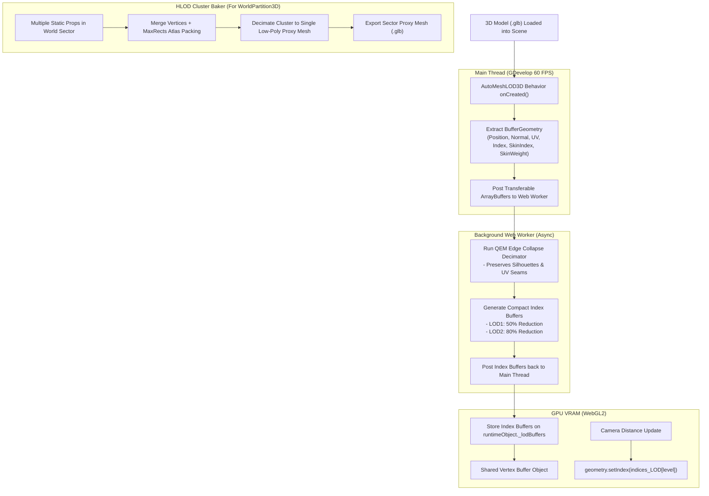

# AutoMeshLOD3D — Implementation Plan

This document details the engineering architecture, QEM decimation algorithms, Web Worker asynchronous threading, and HLOD multi-mesh cluster baking for **AutoMeshLOD3D**.

---

## 1. System Architecture & Data Flow



---

## 2. Decimation Engine: Quadric Error Metric (QEM)

For each vertex $v$, a quadric matrix $Q_v$ represents the sum of squared distances to all incident triangular planes:
$$Q_v = \sum_{p \in \text{planes}(v)} K_p, \quad \text{where } K_p = p \cdot p^T$$

When collapsing an edge $(v_1, v_2) \rightarrow \bar{v}$:
1. Combined Quadric Matrix: $\bar{Q} = Q_{v_1} + Q_{v_2}$
2. Optimal Target Position: $\bar{v} = \bar{Q}^{-1} \begin{bmatrix} 0 & 0 & 0 & 1 \end{bmatrix}^T$
3. Error Metric: $\Delta(\bar{v}) = \bar{v}^T \bar{Q} \bar{v}$

---

## 3. Shared Vertex Buffer & Multi-Index Strategy

All LOD levels share the original vertex positions, UV coordinates, normals, and skeletal bone weights:
```javascript
mesh._lodIndices = {
  0: originalIndexBuffer,                                // 100% triangles
  1: new THREE.BufferAttribute(lod1UintArray, 1),        // 50% triangles
  2: new THREE.BufferAttribute(lod2UintArray, 1)         // 20% triangles
};
```
Swapping LOD levels is a zero-allocation pointer swap: `mesh.geometry.setIndex(mesh._lodIndices[targetLOD])`.

---

## 4. HLOD Cluster Baking Module

For `WorldPartition3D` integration:
1. Gathers all static meshes inside sector bounding box.
2. Merges vertex buffers into a single unified `BufferGeometry`.
3. Bakes all material textures into a unified $2048 \times 2048$ atlas.
4. Simplifies the merged geometry down to $\sim 1,000$ triangles for the entire sector.
