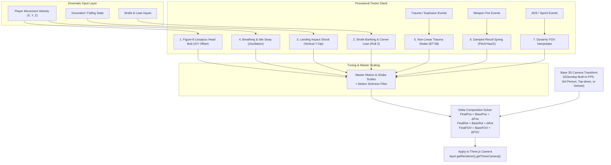

# CameraTweens3D — Implementation Plan

This document outlines the technical architecture, procedural kinematic algorithms, spring-damper mathematical models, tuning modules, and GDevelop lifecycle integration for **CameraTweens3D**.

---

## 1. System Architecture: The Additive Procedural Delta Pipeline

`CameraTweens3D` is designed as a **non-destructive procedural modifier**. It does not overwrite the camera's base position or rotation; instead, it computes additive deltas every frame and applies them cleanly to Three.js's active camera:



---

## 2. Mathematical Formulations & Tuning Algorithms

### A. Head Bobbing: Dual-Octave Lissajous Curve
Walking motion naturally follows a horizontal sway with a vertical bounce at twice the frequency:
$$\Delta X_{\text{bob}}(t) = \cos\left(\frac{\omega \cdot t}{2}\right) \cdot A_x \cdot s_{\text{ratio}} \cdot \text{BobIntensity} \cdot \text{MasterMotionScale}$$
$$\Delta Y_{\text{bob}}(t) = \sin(\omega \cdot t) \cdot A_y \cdot s_{\text{ratio}} \cdot \text{BobIntensity} \cdot \text{MasterMotionScale}$$
$$\Delta \text{Roll}_{\text{bob}}(t) = \cos\left(\frac{\omega \cdot t}{2}\right) \cdot A_{\text{roll}} \cdot s_{\text{ratio}} \cdot \text{BobIntensity} \cdot \text{MasterMotionScale}$$

Where:
* $\omega = 2\pi \cdot \text{StrideFrequency} \cdot (\text{currentSpeed} / \text{walkSpeed})$
* $s_{\text{ratio}} = \text{clamp}(\text{currentSpeed} / \text{walkSpeed}, 0.0, 1.5)$
* When airborne or crouching, $s_{\text{ratio}}$ is scaled by `AirborneDamping` or `CrouchDamping`.

---

### B. Landing Impact Shock: Damped Harmonic Compression
On the rising edge of the grounded state, when $V_{\text{peak}} > \text{LandingMinFallSpeed}$:
$$\text{Impulse}_{\text{landing}} = \text{clamp}(V_{\text{peak}} \cdot 0.04 \cdot \text{LandingShockIntensity}, 0.0, 0.40\text{ meters})$$
$$\text{PitchDip}_{\text{landing}} = \text{clamp}(V_{\text{peak}} \cdot 0.6 \cdot \text{LandingPitchDip} \cdot \text{LandingShockIntensity}, 0.0, 10°)$$

$V_{\text{peak}}$ is the **greatest** downward speed reached while airborne, not the speed on the
contact frame — a character controller has already zeroed its vertical velocity by then, and reading
it there makes every landing identical. It comes from `getCurrentFallSpeed()` when a Physics
Character 3D behavior is present, and from differenced Z otherwise. `LandingShockIntensity` scales
the pitch dip as well as the compression, so switching the module off switches all of it off.

The spring recovery is solved via a 2nd-order critically damped ODE:
$$y(t + \Delta t) = (c_1 + c_2 \Delta t) e^{-\omega_0 \Delta t}$$
Where $\omega_0 = \text{LandingSpringStiffness}$ and $\zeta = \text{LandingSpringDamping}$.

---

### C. Strafe Leaning & Centripetal Roll Banking
$$\Delta \text{Roll}_{\text{target}} = -\left(\frac{V_{\text{sideways}}}{V_{\text{max}}}\right) \cdot \text{StrafeTiltMaxAngle} + \theta_{\text{manualLean}} - \left(\frac{d\text{Yaw}}{dt}\right) \cdot \text{TurnBankingAngle}$$
$$\Delta \text{Roll}_{\text{current}} = \text{lerp}\left(\Delta \text{Roll}_{\text{current}}, \Delta \text{Roll}_{\text{target}}, 1.0 - e^{-\text{StrafeTiltSmoothing} \cdot \Delta t}\right)$$

---

### D. Non-Linear Trauma Shake ($T^p$)
Trauma $T \in [0.0, 1.0]$ decays linearly. The noise is 1D gradient (Perlin) noise over a 256-entry
permutation lattice, so it repeats exactly every 256 lattice units; the shake clock is wrapped on a
multiple of that period, which keeps it continuous forever. Each instance is offset by a seed derived
from its object id, so two shaking objects do not shake in lockstep.

$$\frac{dT}{dt} = -\text{TraumaDecayRate}$$

The resulting shake magnitude follows the power curve:
$$\text{Power} = T^{\text{TraumaExponent}} \cdot \text{MasterShakeScale}$$
$$\Delta X_{\text{shake}} = \text{Power} \cdot \text{MaxShakePosition} \cdot \text{PerlinNoise}(t \cdot \text{ShakeNoiseFrequency})$$
$$\Delta Y_{\text{shake}} = \text{Power} \cdot \text{MaxShakePosition} \cdot \text{PerlinNoise}(t \cdot \text{ShakeNoiseFrequency} + 100.0)$$
$$\Delta \text{Roll}_{\text{shake}} = \text{Power} \cdot \text{MaxShakeAngle} \cdot \text{PerlinNoise}(t \cdot \text{ShakeNoiseFrequency} + 200.0)$$

---

### E. Weapon Recoil Kickback & Snappy Spring Return
When firing a weapon:
$$\vec{F}_{\text{recoil}} = \begin{bmatrix} \text{pitchKick} \cdot \text{RecoilPitchMultiplier} \\ \text{yawRandom} \cdot \text{RecoilYawRandomness} \\ -\text{kickbackZ} \end{bmatrix}$$
A high-stiffness spring ($\omega_0 = \text{RecoilRecoverySpeed}$) rapidly snaps the crosshair back to the rest position with zero persistent offset.

---

## 3. The 4 One-Click Genre Presets

A preset is a plain patch object, applied on top of `DEFAULT_TUNING` rather than on top of whatever
the last preset left behind. Without that reset, a field one preset zeroes and the next never
mentions — turn banking, stair jitter, pitch inertia — stays zeroed forever.

```javascript
applyPreset(name) {
  const preset = PRESETS[canonical(name)];
  if (!preset) return;
  assignPatch(state, DEFAULT_TUNING);  // reset first
  assignPatch(state, preset);
}
```

The four shipped patches are in `CameraTweens3D.runtime.js`; `README.md` tabulates their values.

Three fields are deliberately **not** in any preset:

| Field | Owner | Why |
| :--- | :--- | :--- |
| `masterMotionScale` | the player's settings slider | a preset writing it would fight the property |
| `masterShakeScale` | the player's settings slider | same |
| `shakeIntensity` | the preset and the `ShakeProfile` dropdown | separated out so the two multipliers compose instead of overwriting each other |

The behavior's plain-valued properties (units, target layer, FOV, the two master scales) are applied
**before** the preset and the module profiles, and no field is written by more than one of the three
passes. That is what stops an untouched property default from silently undoing the preset the user
actually picked.

---

## 3b. Units

The model above is metric: `bobVerticalWeight` is 6 cm, `maxShakePosition` is 20 cm,
`landingMinFallSpeed` is 2.5 m/s. GDevelop's 3D world is not — it uses the same units as its 2D
world, so a default Cube3D is 100 units on a side and the default camera sits ~724 units back.

The boundary is a single scale factor, `state.unitScale` (world units per metre, 100 by default,
optionally auto-detected from the owner's depth):

* incoming speeds are divided by it before they reach the model;
* the summed local position delta is multiplied by it on the way out;
* every user-facing number — action parameters, expression results — is in world units.

Angles need no conversion and are in degrees throughout.

---

## 4. Frame Lifecycle & Camera Ownership

Deltas are not written per behavior. Every behavior targeting the same 3D layer contributes into a
shared **channel** for that layer, which owns the base transform and is the only thing that writes
the Three camera.

```
doStepPreEvents   (each behavior)  -> channelRelease(layer)
   your event sheet runs           -> the camera is clean and reads normally
doStepPostEvents  (each behavior)  -> resolve units & FOV
                                      updateKinematics  (character behavior, or differenced position)
                                      stepProceduralDeltas
                                      channelContribute(layer, deltas)
render
```

`channelContribute` captures `basePos` / `baseQuat` / `baseFov` from the camera the first time it is
called in a frame, accumulates each contributor's delta, and writes `base + accumulated`. Rotation
therefore composes once, from a single base — a per-behavior right-multiply by the inverse would only
cancel for the *last* delta applied, so the first behavior's undo would corrupt the second's.

`channelRelease` restores **by assignment, and only if the camera still holds exactly what we wrote**.
This matters because `layer.setCameraX/Y/Z/Rotation` writes the camera absolutely (via the layer
renderer's `updatePosition()`, which is push-based — it is not called per frame from the renderer).
If something re-based the camera between apply and release, a subtracted delta would drift the camera
by one offset per frame, forever. Checking first means the stale delta is simply dropped.

`onDeActivate` and `onDestroy` release too, so a disabled behavior cannot leave its last frame baked
into the camera.

### FOV

FOV goes through `layer.setCamera3DFieldOfView()` when available, so GDevelop's own dirty flag and
clamping stay in sync. `BaseFOV = 0` inherits the layer's configured FOV, which is what keeps merely
adding the behavior from changing how an existing project looks. A custom tween holds its target and
never overwrites `baseFOV`; `Release FOV tween` eases back to the automatic value.

---

## 5. Verification

`test-cameratweens.mjs` runs 11 phases against the real runtime under a THREE mock that does genuine
quaternion and vector math — the camera-channel tests would pass vacuously otherwise. It covers noise
bounds and 256-periodicity, spring convergence, preset/profile precedence and reset, "Off" meaning
off, world-unit scale and speed-ratio range, landing fire-once and fall-speed scaling (both motion
sources), FOV inheritance and tween reversibility, camera restore for one contributor / two
contributors / an externally re-based camera, expression fidelity, comfort-mode semantics, and the
generated JSON's schema, groups, lifecycle hooks, runtime embed count and ACE bindings.

What the harness cannot check, and what still needs a real GDevelop run:

* the sign of the strafe lean and the turn bank on an actual rig (both are invertible by passing a
  negative angle if they come out backwards);
* that the yaw source auto-detection picks the right channel for your camera setup;
* first-person, third-person, top-down and vehicle cameras end to end;
* frame cost across all four presets.
