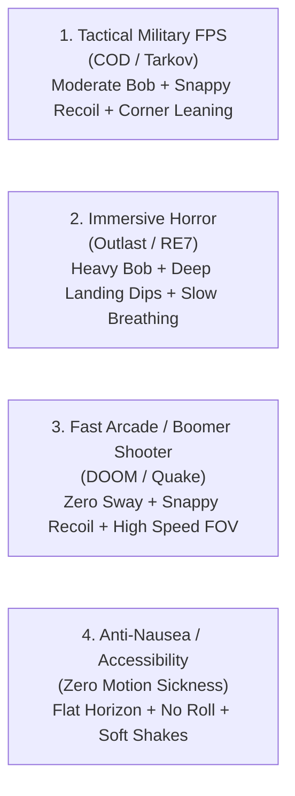

# CameraTweens3D — Procedural Camera Motion, Shakes & Tweening for GDevelop

**CameraTweens3D** is a modular, high-polish procedural camera modifier and tweening extension for **GDevelop 5 (Three.js backend)**.

Instead of replacing your existing camera, **CameraTweens3D** acts as a plug-and-play procedural effect layer that sits on top of **any** 3D camera (GDevelop's built-in First Person 3D camera, Third-Person camera, top-down view, or vehicle rigs)—instantly giving your game AAA-grade physical weight, dynamic head bobbing, run/walk leaning, jump landing shocks, trauma-based screen shakes, weapon recoil kicks, and smooth FOV transitions.

By **Twillion**. Version **1.3.0**.

---

## Key Highlights

- **Universal Camera Compatibility:** Works seamlessly with GDevelop's built-in First Person camera, Third Person camera, custom rigs, and vehicle cameras without control conflicts.
- **Reads your character behavior directly:** if the object carries a **Physics Character 3D** behavior, the extension takes ground state, fall speed, forward speed and strafe speed straight from it, instead of guessing from frame-to-frame position. **Physics Car 3D** supplies ground state only — its one speed getter reports engine RPM, so a car's speeds still come from position differencing.
- **Streamlined dropdown setup:** intuitive choices (`Genre Preset`, `Head Bob Style`, `Run/Walk Lean Intensity`, `Landing Feel`, `Recoil Feel`, `Explosion Shake Power`, `Sprint FOV Boost`) instead of raw physics numbers.
- **4 One-Click Genre Presets:** `Tactical Military`, `Immersive Horror`, `Fast Arcade Shooter`, `Accessibility & Comfort`.
- **Full In-Game Options Menu Support:** global multiplier actions hook player settings sliders directly into camera shake and motion scales.
- **Motion Sickness / Anti-Nausea Mode:** zeroes roll tilt, flattens horizontal sway, and locks speed FOV — with an `Auto` setting that follows the operating system's reduced-motion preference.
- **Non-destructive:** every offset is released before your events run and re-applied after them, so nothing it does leaks into your own camera logic.

---

## Install

Load `CameraTweens3D.json` in GDevelop: **Project manager → Extensions → Import an extension**.

Rebuild it after editing the runtime:

```bash
node CameraTweens3d/build-extension.mjs
```

Run the test suite:

```bash
node CameraTweens3d/test-cameratweens.mjs
```

---

## 4 One-Click Genre Presets



These are the values the runtime actually ships, not approximations of them:

| Preset | Bob | Run/walk lean | Turn lean | Landing | Breathing | Sprint FOV | Shake | Recoil | Comfort mode |
| :--- | ---: | ---: | ---: | ---: | ---: | ---: | ---: | ---: | :---: |
| **`Tactical Military`** | `0.8x` | `2.0°` | `1.5°` | `1.0x` | `0.6x` | `+8°` | `1.0x` | `1.0x` | off |
| **`Immersive Horror`** | `1.4x` | `2.5°` | `1.8°` | `1.8x` | `1.5x` | `+5°` | `1.2x` | `1.0x` | off |
| **`Fast Arcade Shooter`** | `0.3x` | `1.0°` | `0.75°` | `0.4x` | `0.0x` | `+15°` | `1.0x` | `0.8x` | off |
| **`Accessibility & Comfort`** | `0.0x` | `0.0°` | `0.0°` | `0.2x` | `0.0x` | `+0°` | `0.5x` | `0.5x` | **on** |

Selecting a preset resets every tuning value it does not itself mention, so switching between presets never leaves a field zeroed by the previous one.

---

## Quick Start Guide

1. **Add the Behavior:** add **`CameraTweens3D`** to your player character or camera anchor object.
2. **Check the scene scale:** `World Units per Meter` defaults to `100`, which suits a default GDevelop 3D project (a Cube3D is 100 units on a side). If your scene is built at a different scale, set it — every offset in the extension is derived from a physical model in metres and converted through this number.
   `Terrain Micro-Jitter` defaults to `0` for a stable camera. Raise it only if you deliberately want noisy grounded movement; `0.015` reproduces the original effect.
3. **Pick your Game Genre:** select a preset (e.g. `Tactical Military (COD / Tarkov)`) or customise the dropdown styles.
4. **Trigger Action Events:**
   - On shooting: `CameraTweens3D::Apply weapon recoil (Pitch: 3.0, Yaw: 0.5, KickbackZ: 4)`
   - On explosion: `CameraTweens3D::Add trauma by 0.8`
   - On aiming: `CameraTweens3D::Set Aim Down Sights (ADS): true`
5. **Enjoy Instant Polish!**

### Field of view

`Base Field of View` defaults to **0**, meaning *keep whatever the 3D layer is already set to*. Adding the behavior therefore does not change how your game looks until you ask it to. Set a number to take control of the FOV, or use `Set base resting FOV` at runtime to drive it from a player settings slider. `ADS Zoom FOV` likewise defaults to 0, meaning two thirds of the base.

`Tween camera FOV` holds its target and **does not** overwrite the resting FOV; call `Release FOV tween` to ease back to the automatic value.

---

## Notes on your rig

- **Ground and speed detection.** With a Physics Character 3D behavior on the same object, everything is read from it. Without one, the extension falls back to differentiating the object's position, and to a `Walk Speed Reference` of 250 units/s — set that property if your character moves at a different speed. Use the `is detected as being on the ground` condition to confirm detection worked.
- **Leaning.** `Run/Walk Lean Intensity` covers two things: roll driven by **sideways** movement speed, and banking into turns. It does not lean from forward speed alone. The turn part follows the first yaw channel it sees move — the layer's camera angle, the 3D camera's Y rotation, or the object's own angle. If either leans the wrong way for your rig, pass a negative value to `Set turn lean angle` or `Set run/walk lean max angle`.
  Two notes on what the numbers mean: the run/walk figure is the roll at your `Walk Speed Reference`, and strafing faster than that can reach 1.5× it; the turn figure is degrees of roll **per 100°/s of yaw**, so `1.5` banks 0.9° in an ordinary 60°/s turn.
- **Terrain micro-jitter.** This optional noise adds fine vertical motion while grounded and moving. It defaults to off and can be changed in the behavior properties or with `Set terrain micro-jitter intensity`.
- **Two instances on one layer** is supported: each contributes into a shared per-layer channel, and the base transform is captured and restored once per frame.

---

## Documentation Index

- [IMPLEMENTATION_PLAN.md](./IMPLEMENTATION_PLAN.md) — Technical blueprint, mathematical models (Lissajous curves, critically damped spring dampers, trauma noise decay, tuning algorithms), and GDevelop frame lifecycle integration.
- [API_REFERENCE.md](./API_REFERENCE.md) — Complete specification of Behavior Properties, Actions, Conditions, Expressions, and Preset definitions.
- [REVIEW.md](./REVIEW.md) — Maintainer review: the defects fixed in 1.1.0, and the upgrades still open.

---

## Upgrading

### From 1.2.x — weapon recoil kickback is now in world units

`Apply weapon recoil`'s **KickbackZ** argument was the only length in the extension authored in
metres; everything else you type or read back is in world units. It now takes world units too, so
`RecoilKickbackZ()` can be fed straight back into the action.

**Multiply any existing KickbackZ argument by your `World Units per Meter`** — the old default of
`0.04` becomes `4`. Left unchanged, a kickback will be 100× too small at the default scale rather
than 100× too large, so nothing breaks loudly; it just stops kicking.

Landing impacts also changed shape. The compression and pitch-dip clamps were hard ceilings reached
at a 10 m/s and a 5.5 m/s fall respectively, so every fall past roughly two metres produced an
identical thump. They are now soft-saturating (`cap·tanh(x/cap)`), which leaves an ordinary landing
within about 1% of what it was and makes a genuinely long fall land harder than a short one. If you
had tuned `Landing Feel` around the old ceiling, deep falls will now hit noticeably harder.

### From 1.1.x — the lean module was renamed

The "strafe tilt" naming is gone. The **displayed** names changed in 1.1.2 and the **identifiers**
changed in 1.2.0, so a project built against 1.1.x needs two small fixes after re-importing:

| Old identifier | New identifier |
| :--- | :--- |
| property `StrafeTiltProfile` | property `LeanProfile` |
| action `SetStrafeTiltProfile` | action `SetLeanProfile` — *Set run/walk lean intensity* |
| action `SetStrafeTiltMaxAngle` | action `SetLeanMaxAngle` — *Set run/walk lean max angle* |
| action `SetTurnBankingAngle` | action `SetTurnLeanAngle` — *Set turn lean angle* |

1. Any event using one of those three actions will show as invalid — delete it and pick the renamed
   action from the list.
2. The lean dropdown on the behavior resets to `Default for Preset`; set it again if you had chosen
   a specific level.

Nothing else moved, and the behavior's own name is unchanged, so the behavior stays attached to your
objects and every other action keeps working.

### From 1.0.0

1.1.0 changes several defaults on purpose. If you had a 1.0.0 project:

- `Base Field of View` now defaults to `0` (inherit the layer) rather than `75`. 1.0.0 silently widened every project's FOV to 75°; if you relied on that, set it back to 75 explicitly.
- `Motion Sickness / Comfort Mode` is now a dropdown (`Default for Preset` / `Off` / `On` / `Auto`) rather than a checkbox. An old stored `false` still reads as off.
- Positional offsets — head bob, shake throw, kickback, lean — are now scaled into world units and are roughly 100× larger than in 1.0.0, where they were authored in metres and applied as raw units. This is the intended size; they were invisible before.
- `Trigger landing impact` now takes a fall speed in **world units per second** (e.g. `500`), not metres per second.
- `HeadBobY()`, `LandingDipY()` and `RecoilKickbackZ()` now report **world units**, matching what is applied to the camera.
