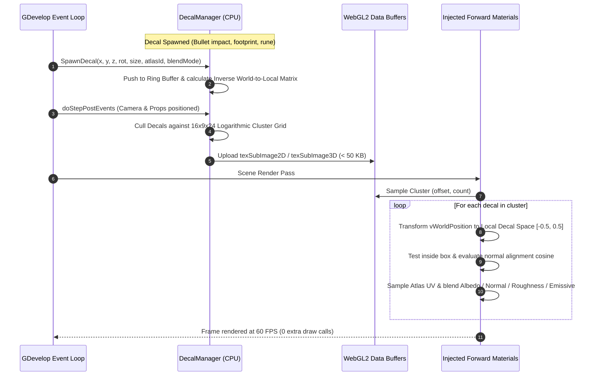

# ClusteredDetail — Technical Implementation Plan

This document specifies the complete mathematical formulations, GPU DataTexture schemas, GLSL shader injection architecture, and phased engineering roadmap for **ClusteredDetail** (Clustered Forward Projective Decals for GDevelop 5).

---

## 1. System Architecture & Lifecycle

ClusteredDetail operates as an integrated CPU broadphase and GPU forward shader pipeline:



---

## 2. Mathematical Formulations & Algorithms

### A. Decal Representation & Local Transformation

A decal is defined as a 3D Oriented Bounding Box (OBB) in world space:
* **Center:** $\vec{C} = (C_x, C_y, C_z)$
* **Half-Extents:** $\vec{E} = (w/2, h/2, d/2)$ where $w$ is width, $h$ is height, and $d$ is the projection depth.
* **Rotation Matrix:** $R \in \mathbb{R}^{3 \times 3}$ (or orientation quaternion $q$).
* **Forward Projection Vector:** $\vec{D}_{\text{fwd}} = R \cdot (0, 0, -1)$ pointing in the direction the decal projects.

To test whether a surface fragment at world position $\vec{P}_{\text{world}}$ lies inside the decal's volume, we transform $\vec{P}_{\text{world}}$ into normalized local decal space $[-0.5, 0.5]^3$:

$$M_{\text{world\_to\_local}} = \begin{pmatrix} \frac{1}{w} & 0 & 0 \\ 0 & \frac{1}{h} & 0 \\ 0 & 0 & \frac{1}{d} \end{pmatrix} R^T \cdot T(-\vec{C})$$

For any fragment world position $\vec{P}$:

$$\vec{p}_{\text{local}} = M_{\text{world\_to\_local}} \cdot \begin{pmatrix} \vec{P}_{\text{world}} \\ 1 \end{pmatrix}$$

The containment test is a simple unit cube boundary check:

$$\text{isInside} = (|p_{\text{local}, x}| \le 0.5) \land (|p_{\text{local}, y}| \le 0.5) \land (|p_{\text{local}, z}| \le 0.5)$$

---

### B. Projected UV Coordinates & Texture Atlas Mapping

When $\text{isInside}$ is true, the projected UV coordinate across the decal's face is:

$$u_{\text{norm}} = p_{\text{local}, x} + 0.5, \quad v_{\text{norm}} = 0.5 - p_{\text{local}, y}$$

Given a texture atlas rectangle $[u_{\text{min}}, v_{\text{min}}, \Delta u, \Delta v]$ where $\Delta u = u_{\text{max}} - u_{\text{min}}$ and $\Delta v = v_{\text{max}} - v_{\text{min}}$:

$$uv_{\text{atlas}} = \left( u_{\text{min}} + u_{\text{norm}} \cdot \Delta u, \; v_{\text{min}} + v_{\text{norm}} \cdot \Delta v \right)$$

---

### C. Depth Feathering (Z-Edge Fade)

To prevent harsh, razor-sharp edges where the decal's projection box ends in depth:

$$w_{\text{depth}} = 1.0 - \text{smoothstep}(0.35, 0.5, |p_{\text{local}, z}|)$$

---

### D. Angle-Based Normal Rejection & Falloff

To avoid back-projection (e.g. projecting a floor puddle onto a ceiling) and stretching on perpendicular geometry (e.g. projecting onto a vertical wall at a $90^\circ$ grazing angle):

1. Compute the cosine between the surface normal $\vec{N}_{\text{world}}$ and the opposite of the decal's forward projection direction:
   $$\cos \theta = \vec{N}_{\text{world}} \cdot (-\vec{D}_{\text{fwd}})$$

2. Given a user-configured cutoff angle $\theta_{\text{cutoff}}$ (e.g., $60^\circ$, so $\cos \theta_{\text{cutoff}} = 0.5$):
   $$w_{\text{angle}} = \text{clamp}\left( \frac{\cos \theta - \cos \theta_{\text{cutoff}}}{1.0 - \cos \theta_{\text{cutoff}}}, \; 0.0, \; 1.0 \right)$$

3. If $\cos \theta \le \cos \theta_{\text{cutoff}}$, the decal is completely discarded for this fragment, avoiding unnecessary texture lookups.

---

### E. Total Decal Weight & Fade Integration

The final blending weight $W$ for the decal fragment is:

$$W = \alpha_{\text{decal}} \cdot w_{\text{depth}} \cdot w_{\text{angle}} \cdot \text{TextureAlpha}(uv_{\text{atlas}})$$

Where $\alpha_{\text{decal}}$ is the animated master opacity of the decal (modulating over time during its spawn/fade lifecycle).

---

## 3. Frustum Cluster Grid Partitioning

ClusteredDetail partitions the camera view frustum into the same proven $16 \times 9 \times 24 = 3,456$ logarithmic depth grid used by clustered lighting:

$$z_k = z_{\text{near}} \cdot \left(\frac{z_{\text{far}}}{z_{\text{near}}}\right)^{\frac{k}{24}}, \quad k \in [0, 24]$$

### Fast CPU Broadphase Culling (OBB to Cluster AABB)

1. Compute the bounding sphere of the decal OBB:
   $$R_{\text{bound}} = \frac{1}{2} \sqrt{w^2 + h^2 + d^2}$$
2. Transform the decal center $\vec{C}$ to camera view space: $\vec{C}_{\text{view}} = V \cdot \vec{C}$.
3. Depth slice bounds:
   $$k_{\text{min}} = \text{clamp}\left( \left\lfloor \frac{\log((-C_{\text{view}, z} - R_{\text{bound}}) / z_{\text{near}})}{\log(z_{\text{far}} / z_{\text{near}})} \cdot 24 \right\rfloor, \; 0, \; 23 \right)$$
   $$k_{\text{max}} = \text{clamp}\left( \left\lfloor \frac{\log((-C_{\text{view}, z} + R_{\text{bound}}) / z_{\text{near}})}{\log(z_{\text{far}} / z_{\text{near}})} \cdot 24 \right\rfloor, \; 0, \; 23 \right)$$
4. Screen tile bounds:
   Project the sphere footprint to screen space $[x_{\text{min}}, x_{\text{max}}] \times [y_{\text{min}}, y_{\text{max}}]$ and map to tile indices $[i_{\text{min}}, i_{\text{max}}] \in [0, 15]$ and $[j_{\text{min}}, j_{\text{max}}] \in [0, 8]$.
5. Add decal index to the bins $(i, j, k)$ spanning that sub-volume.

---

## 4. WebGL2 GPU Data Packing & Textures

All decal parameters are streamed into WebGL2 textures without recompiling shaders.

### A. `uDecalData` Texture (`RGBA32F`, $4 \times \text{MaxDecals}$)

For each decal slot $d \in [0, \text{MaxDecals}-1]$, 4 consecutive texels store its transformation and material properties:

| Texel | Channels $(R, G, B, A)$ | Purpose |
| :--- | :--- | :--- |
| **0** | $(m_{00}, m_{01}, m_{02}, m_{03})$ | $M_{\text{world\_to\_local}}$ Row 0 |
| **1** | $(m_{10}, m_{11}, m_{12}, m_{13})$ | $M_{\text{world\_to\_local}}$ Row 1 |
| **2** | $(m_{20}, m_{21}, m_{22}, m_{23})$ | $M_{\text{world\_to\_local}}$ Row 2 |
| **3** | $(u_{\text{min}}, v_{\text{min}}, \Delta u, \Delta v)$ | Atlas UV coordinates |
| **4** *(Auxiliary)* | $(\cos \theta_{\text{cutoff}}, \text{BlendMode}, \alpha_{\text{decal}}, \text{EmissiveIntensity})$ | Normal cutoff, blend mode enum, master fade, emissive scale |

*Total VRAM for 256 decals:* $256 \times 5 \times 16\text{ bytes} \approx \mathbf{20.48\text{ KB}}$.

### B. `uDecalClusterGrid3D` (`RG32UI`, $16 \times 9 \times 24$ `Data3DTexture`)
* **Channel R:** Byte offset into `uDecalIndexList`.
* **Channel G:** Number of active decals overlapping this cluster (capped at 32).
* *Total VRAM:* $16 \times 9 \times 24 \times 8\text{ bytes} \approx \mathbf{27.6\text{ KB}}$.

### C. `uDecalIndexList` (`R16UI`, flat `DataTexture`)
* Flat list of 16-bit decal indices referenced by `uDecalClusterGrid3D`.
* *Total VRAM:* $2048 \times 2\text{ bytes} \approx \mathbf{4\text{ KB}}$.

---

## 5. Injected Forward Material Shaders

ClusteredDetail hooks into Three.js `MeshStandardMaterial` and `MeshPhysicalMaterial` via `onBeforeCompile` with a unique cache key:
`customProgramCacheKey = () => 'GD_CLUSTERED_DETAIL_V1'`.

### A. Header Definitions (`common` Chunk)
```glsl
uniform highp sampler2D uDecalData;
uniform highp usampler3D uDecalClusterGrid3D;
uniform highp usampler2D uDecalIndexList;
uniform sampler2D uDecalAtlas;
uniform vec3 uDecalClusterParams; // (screenWidth, screenHeight, numSlices)
uniform vec2 uDecalZParams;       // (zNear, logRatio)
```

### B. Decal Projection Loop (`map_fragment` Chunk)
```glsl
// Calculate cluster index from fragment coordinate & linear depth
float viewDepth = -vViewPosition.z;
int clusterZ = int(clamp(floor(log(viewDepth / uDecalZParams.x) / uDecalZParams.y * 24.0), 0.0, 23.0));
ivec3 clusterCoord = ivec3(
    int(gl_FragCoord.x / uDecalClusterParams.x * 16.0),
    int(gl_FragCoord.y / uDecalClusterParams.y * 9.0),
    clusterZ
);

uvec2 clusterHeader = texelFetch(uDecalClusterGrid3D, clusterCoord, 0).rg;
uint decalOffset = clusterHeader.r;
uint decalCount = clusterHeader.g;

for (uint i = 0u; i < decalCount; ++i) {
    int decalIdx = int(texelFetch(uDecalIndexList, ivec2(int(decalOffset + i), 0), 0).r);
    int baseTexel = decalIdx * 5;

    // Fetch Inverse World-to-Local Matrix Rows
    vec4 r0 = texelFetch(uDecalData, ivec2(baseTexel + 0, 0), 0);
    vec4 r1 = texelFetch(uDecalData, ivec2(baseTexel + 1, 0), 0);
    vec4 r2 = texelFetch(uDecalData, ivec2(baseTexel + 2, 0), 0);
    vec4 uvRect = texelFetch(uDecalData, ivec2(baseTexel + 3, 0), 0);
    vec4 params = texelFetch(uDecalData, ivec2(baseTexel + 4, 0), 0);

    // Transform world position into local box space [-0.5, 0.5]
    vec4 worldPos = vec4(vWorldPosition, 1.0);
    vec3 localPos = vec3(dot(r0, worldPos), dot(r1, worldPos), dot(r2, worldPos));

    // Box containment test
    if (abs(localPos.x) <= 0.5 && abs(localPos.y) <= 0.5 && abs(localPos.z) <= 0.5) {
        // Normal angle rejection
        vec3 decalFwd = -normalize(vec3(r2.x, r2.y, r2.z));
        float cosTheta = dot(vNormal, -decalFwd);
        float minCos = params.x;

        if (cosTheta > minCos) {
            float angleWeight = clamp((cosTheta - minCos) / (1.0 - minCos), 0.0, 1.0);
            float depthWeight = 1.0 - smoothstep(0.35, 0.5, abs(localPos.z));
            
            // Map to Atlas UV
            vec2 normUV = vec2(localPos.x + 0.5, 0.5 - localPos.y);
            vec2 atlasUV = uvRect.xy + normUV * uvRect.zw;
            vec4 decalTex = texture(uDecalAtlas, atlasUV);

            float totalAlpha = decalTex.a * params.z * angleWeight * depthWeight;
            int blendMode = int(params.y);

            if (blendMode == 0) {
                // Alpha Blend
                diffuseColor.rgb = mix(diffuseColor.rgb, decalTex.rgb, totalAlpha);
            } else if (blendMode == 1) {
                // Multiply (Dirt / Scorch marks)
                diffuseColor.rgb = mix(diffuseColor.rgb, diffuseColor.rgb * decalTex.rgb, totalAlpha);
            } else if (blendMode == 2) {
                // Emissive Rune / Laser
                diffuseColor.rgb += decalTex.rgb * totalAlpha * params.w;
            }
        }
    }
}
```

---

## 6. PBR Channels & Normal Map Blending

ClusteredDetail supports 4 distinct blend modes:

| Blend Mode | Target Shader Chunk | Visual Application | Formula |
| :--- | :--- | :--- | :--- |
| **0 — AlphaBlend** | `map_fragment` | Blood splatters, paint, posters | $\vec{C}_{\text{out}} = \text{mix}(\vec{C}, \vec{C}_{\text{decal}}, W)$ |
| **1 — Multiply** | `map_fragment` | Scorch marks, burn marks, mud | $\vec{C}_{\text{out}} = \text{mix}(\vec{C}, \vec{C} \odot \vec{C}_{\text{decal}}, W)$ |
| **2 — Normal Perturbation** | `normal_fragment_maps` | Bullet cracks, stone chips | Reoriented Normal Mapping (RNM) |
| **3 — Emissive Glow** | `emissivemap_fragment` | Magic runes, molten cracks | $\vec{E}_{\text{out}} = \vec{E} + \vec{C}_{\text{decal}} \cdot W \cdot I_{\text{emissive}}$ |

### Reoriented Normal Mapping (RNM) in GLSL
When a decal provides a normal map, it perturbs the underlying geometry's normal rather than overwriting it:
```glsl
// Unpack decal tangent normal [-1, 1]
vec3 n1 = normal; // Underlying surface normal
vec3 n2 = decalNormalTex.xyz * 2.0 - 1.0;
// Reoriented Normal Blend
n1 += vec3(0.0, 0.0, 1.0);
n2 *= vec3(-1.0, -1.0, 1.0);
normal = normalize(n1 * dot(n1, n2) / n1.z - n2);
```

---

## 7. Decal Ring Buffer & Memory Lifecycle

Dynamic decals (bullet holes, footsteps, sparks) are managed in a fixed-capacity ring buffer:

1. **Allocated Slots:** Default 128 slots (configurable up to 512).
2. **$O(1)$ Insertion:** When a new bullet hole is spawned, write head increments: `head = (head + 1) % maxDecals`.
3. **Automatic Eviction:** If the buffer is full, the oldest decal is automatically recycled.
4. **Soft Fading:** Decals track `age` and `lifetime`. When `age > (lifetime - fadeDuration)`, `alphaDecal` linearly attenuates to `0.0`.
5. **Static Anchoring:** Static editor decals (graffiti, permanent signs) are flagged as `pinned = true` and are exempted from ring buffer eviction.

---

## 8. Implementation Phases

```mermaid
gantt
    title ClusteredDetail Implementation Roadmap
    dateFormat  X
    axisFormat %d

    section Phase 1: Core CPU Math
    Decal OBB Data Structures          :active, p1_1, 0, 2
    Matrix Inversion & Bounds          :p1_2, after p1_1, 2
    Decal Ring Buffer Lifecycle        :p1_3, after p1_2, 2

    section Phase 2: Frustum Broadphase
    Logarithmic Depth Slicing          :p2_1, 4, 3
    Sphere/OBB Cluster Binning         :p2_2, after p2_1, 3

    section Phase 3: GPU Packing
    DataTexture & Data3DTexture Streamer :p3_1, 7, 3
    Texture Atlas Packing & Coordinates :p3_2, after p3_1, 2

    section Phase 4: Shader Injections
    Three.js onBeforeCompile Hook      :p4_1, 10, 3
    GLSL Decal Box Projection Loop     :p4_2, after p4_1, 3
    Angle Rejection & Depth Fade       :p4_3, after p4_2, 2
    Multi-Channel PBR & Normals        :p4_4, after p4_3, 3

    section Phase 5: GDevelop Integration
    Extension JSON & Behavior Wrapper   :p5_1, 16, 3
    Unit Test Suite & Verification     :p5_2, after p5_1, 3
```



---

## 9. Performance Budget & Verification Plan

* **CPU Broadphase:** $< 0.05\text{ ms}$ for 128 active decals (spatial culling skips non-overlapping frustum clusters).
* **GPU Overhead:** $< 0.2\text{ ms}$ on mobile Mali/Adreno GPUs; $\approx 0.03\text{ ms}$ on desktop RTX.
* **VRAM Footprint:** $< 60\text{ KB}$ for cluster index grids and matrices + user's decal texture atlas.
* **Zero GC Pressure:** All buffers are pre-allocated typed arrays (`Float32Array`, `Uint32Array`, `Uint16Array`). Zero object allocations in the per-frame render loop.
