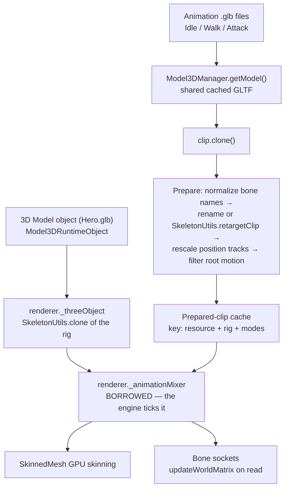

# Implementation Plan (revised): `ExternalSkeletalAnimator3D`

Play external, modular skeletal animation files (`.glb`) on a GDevelop 3D Model object, without
baking every clip into the character file.

Revision of the original plan. Everything below marked **[verified]** was read out of the installed
GDevelop runtime at
`C:\Users\chris\AppData\Local\Programs\GDevelop\resources\GDJS\Runtime\`
(GDevelop 5.6.279, Three **r160**), not inferred.

---

## What changed from the first draft, and why

### C1 — Do not create an `AnimationMixer`. Borrow the engine's. **[verified]**

`Model3DRuntimeObject3DRenderer` already owns one, bound to the cloned model scene:

```js
this._animationMixer = new THREE.AnimationMixer(o)   // _updateModel(), o = SkeletonUtils.clone(scene)
```

and `Model3DRuntimeObject.update()` already ticks it once per frame with the object's own
time-scaled delta:

```js
update(e){ const t = this.getElapsedTime()/1e3; this._renderer.updateAnimation(t) }
```

Two consequences the original plan walks straight into:

1. **A second mixer on the same skeleton fights the first.** Both write the same bone
   `.position` / `.quaternion` / `.scale` each frame; whichever updates last wins, per property, per
   frame. The symptom is a rig that twitches or snaps back to the built-in animation.
2. **Ticking our own mixer plays everything at 2x speed**, because the engine's tick already
   advanced the same clock.

The fix is also a simplification — we get frame timing, pause and the object's time scale for free:

```js
const renderer = object.getRenderer();
const mixer = renderer._animationMixer;   // borrow. Never construct. Never .update().
```

Cache-invalidation detail: `_animationMixer` is replaced inside `_updateModel()`, which is reached
only from `onModelChanged()` — construction and `updateFromObjectData` (hot reload). **[verified]**
So store the mixer identity next to the action cache and rebuild the cache when
`renderer._animationMixer !== cached.mixer`. Cheap, and it survives hot reload.

**Frame order is already in our favour. [verified]** `RuntimeInstanceContainer._updateObjectsPreEvents`
runs `object.update(this)` and then `object.stepBehaviorsPreEvents(this)` back-to-back for the same
instance — so by the time `doStepPreEvents` runs, the mixer has already advanced this frame and bone
local transforms are current.

### C2 — Lock `objectType` to `Scene3D::Model3DObject`.

The original plan left `objectType` open. Once we borrow the engine mixer (C1) the behavior is
meaningless on anything without a skeleton, and `Model3DObject` is the only stock object that has
one. Locking it:

- removes the whole "attached to a Sprite, silently does nothing forever" failure class
  (`AnimatedPBR3D/REVIEW.md` D9 / D13),
- gets us the mixer, the crossfade duration and the per-instance rig clone for free,
- turns every runtime guard into a one-liner.

This is a deliberate scope cut versus the original plan and belongs in the README.

### C3 — Clone every clip before touching it. **[verified]**

`Model3DManager.getModel(name)` returns the **shared, cached** GLTF object
(`this._loadedThreeModels.getFromName(r)`) — the same `animations[]` array handed to every object in
the game. Renaming its tracks in place, or stripping root-motion tracks in place, corrupts the cache
for every other consumer and for the next scene.

`AnimationClip.prototype.clone()` deep-clones tracks (**[verified]** in the r160 bundle:
`clone(){const t=[];for(let e=0;e<this.tracks.length;e++)t.push(this.tracks[e].clone());…}`), so:

```js
const prepared = sourceClip.clone();   // then rename / filter / rescale prepared.tracks
```

Cache the *prepared* clip, keyed by (resource, target rig, retarget mode, root-motion mode) — never
the source.

### C4 — `THREE_ADDONS.GLTFLoader`, not `THREE.GLTFLoader`. **[verified]**

There is no `THREE.GLTFLoader`. The loaders live on a separate global:

```js
new THREE_ADDONS.GLTFLoader()          // Model3DManager does exactly this
```

`THREE_ADDONS` exports, complete list **[verified]**: `BrightnessContrastShader`, `DRACOLoader`,
`EffectComposer`, `ExposureShader`, `GLTFLoader`, `HueSaturationShader`, `OutlinePass`, `OutputPass`,
`RenderPass`, `SMAAPass`, `SelectionBox`, `ShaderPass`, `SkeletonUtils`, `TransformControls`,
`UnrealBloomPass`.

DRACO caveat: `Model3DManager` wires a `DRACOLoader` with
`setDecoderPath("./pixi-renderers/draco/gltf/")`. A bare `new THREE_ADDONS.GLTFLoader()` on the URL
path will **fail on Draco-compressed GLBs** unless we attach a DRACOLoader the same way.

### C5 — `getModel()` never returns null, so "missing" and "empty" look identical. **[verified]**

```js
getModel(r){ return this._loadedThreeModels.getFromName(r) || this._invalidModel }
```

`_invalidModel` is a magenta box with `animations: []`. A resource that was never loaded for this
scene therefore returns an object that plays nothing, silently — the exact failure mode that made
AnimatedPBR3D 1.0.0 unusable (its D9: "failure state computed and never surfaced").

This is the plan's biggest genuinely *unresolved* risk and deserves a named decision rather than a
buried assumption:

> **Open question for you:** does a `model3DResource` **behavior property** get registered by the
> editor as a scene resource dependency, so GDevelop preloads the animation GLB? If it does not,
> every animation file loads lazily on first use and the first playback is a no-op.

A design that is correct either way:

- A `PreloadAnimation` action calling `game.getResourceLoader().loadResource(name)` then
  `.processResource(name)` (both public, both async **[verified]**), so animations can be warmed
  during a loading screen.
- `PlayAnimation` on a clip with no tracks must not silently succeed: record a failure reason, kick
  off the same load, play on completion.
- Ship `IsAnimationReady(name)` and `LastError()` so that state is reachable from the event sheet.
  AnimatedPBR3D D9 is precisely the cost of skipping this.

### C6 — `SkeletonUtils.retargetClip` already ships. Offer it as a mode. **[verified]**

The original plan hand-rolls `normalizeAndRetargetClip`, which is really *track renaming*: it works
when two skeletons share hierarchy and rest pose, and produces broken poses when they don't. That is
the honest limit, and it should be documented rather than papered over with the word "retarget".

`THREE_ADDONS.SkeletonUtils` exposes `retarget`, `retargetClip` and `clone` **[verified]** — the
engine itself uses `SkeletonUtils.clone` to instance the model. So make it a property:

| `RetargetMode` | What it does | When to use |
|---|---|---|
| `Rename tracks` *(default)* | strip namespaces, map to target bone names, drop unmatched tracks | same rig family — Mixamo to Mixamo, a Blender rig to itself |
| `Rest-pose retarget` | `SkeletonUtils.retargetClip(targetRoot, sourceRoot, clip, { names })` | different rest pose (A-pose vs T-pose) or different proportions |
| `None` | play the clip untouched | the clip was exported from the exact target file |

r160's `retargetClip` is finicky and was reworked upstream after this version — hence *opt-in*, not
default, and the README should say so plainly.

### C7 — Position-track scale mismatch. Absent from the original plan; it is the number one real-world failure.

**[verified]** `stretchModelIntoUnitaryCube` applies `makeScale(h, -_, E)` to the **wrapper group**,
not to the skinned mesh — bone *local* transforms are never rescaled, and the whole rig is resized by
its parent instead. Good news for rotation tracks (unaffected). Bad news for **position** tracks: a
hips translation authored in a 100-unit (cm) Mixamo export, applied to a 1-unit character, throws the
hips 100x too far. This is the "the character explodes" bug report.

Add to the prepare step, before root-motion filtering:

- `PositionTrackScale` property, default `Auto`.
- `Auto` = ratio of the hips/root bone's rest-pose height in the target rig to the same bone's
  rest-pose height in the source rig; fall back to `1` when the bone can't be matched.
- Multiply every `VectorKeyframeTrack` whose path ends in `.position` by that ratio.

### C8 — Root motion needs one more mode than the plan lists.

`In-Place (Lock X/Z)` / `Full In-Place (Lock All)` / `Preserve Root Motion` is nearly right, but
"Preserve" as written just leaves the track in — which moves the *mesh inside* the GDevelop object.
The object's own X/Y/Z never changes, so collisions and the camera don't follow. Rename and split:

- `In-Place (lock X/Z)` — **default**, as the original plan chose. Keeps vertical hip bounce.
- `In-Place (lock all)`
- `Visual root motion` — the honest name for what "Preserve" actually does.
- `Drive object` — strip the track *and* apply the per-frame delta to `object.setX/setY/setZ`. This
  is what people actually mean by root motion, and the only mode where physics and the camera behave.
  It is also the only one with real work behind it: delta extraction plus the loop-wrap
  discontinuity at clip end.

### C9 — Interop with the object's built-in animations.

`Model3DRuntimeObject.setAnimationIndex` starts an action on the *same* mixer and stores it as
`renderer._action` **[verified]**. If the user has a built-in animation set, it keeps playing
underneath ours.

`PlayAnimation` should crossfade from `renderer._action` when it is running — same mixer, so
`crossFadeFrom` is legal — and stop it at the end of the fade. Leave `renderer._action` itself alone;
nulling it makes the engine's own `hasAnimationEnded()` lie.

Document the rule plainly: **once this behavior plays an external clip, the built-in "Set animation"
actions are no longer in charge.**

### C10 — Bone sockets would read stale world matrices.

Bone *local* transforms are current in `doStepPreEvents` (C1), but `matrixWorld` is only recomputed
during render, which happens after events. Reading `bone.getWorldPosition()` without forcing an
update returns **last frame's** pose — a visible one-frame lag on a fast attack swing.

Force it per queried bone, not globally per frame:

```js
bone.updateWorldMatrix(true /* parents */, false /* children */);
bone.getWorldPosition(v);
```

**[verified]** the result is directly usable as GDevelop X/Y/Z: the renderer sets
`position.set(object.getX() …, object.getY() …, object.getZ() …)` with no axis conversion, so the
Three world frame and the object's frame coincide.

### C11 — Schema and JsCode conventions, carried over from the AnimatedPBR3D post-mortem

Non-negotiable. Every one of these cost a release last time — see `AnimatedPBR3D/REVIEW.md`
D1, D14, D15, D16.

| Thing | Correct | Wrong (shipped once) |
|---|---|---|
| Behavior properties key | `propertyDescriptors` | `properties` |
| Choice / resource kind on a **property** | `extraInformation: [...]` | `extraInfo` |
| Extra data on a **parameter** | `supplementaryInformation: "…"` (string) | `extraInfo: [...]` |
| Animation-file parameter type | `model3DResource` | `resource` — not a registered type |
| Object / behavior inside JsCode | preamble below | bare `object` / `behavior` — **ReferenceError on frame 1** |
| Condition result | `eventsFunctionContext.returnValue = …` | `return …` — silently always false |
| JsCode event | must also set `parameterObjects: "Object"` | omitted |

Mandatory preamble in every JsCode block:

```js
const __objs = eventsFunctionContext.getObjects("Object");
const object = __objs.length ? __objs[0] : null;
if (!object) return;
const behavior = object.getBehavior(eventsFunctionContext.getBehaviorName("Behavior"));
if (!behavior) return;
```

And every action, condition and expression must guard the singleton —
`gdjs.__externalSkeletalAnimator3D ? … : …` — because a condition can run before the owner's first
`doStepPreEvents` (AnimatedPBR3D D8).

### C12 — A GLB holds *many* clips. Pick one out of it and apply it to the target rig. Address animations as (file, clip).

**A single GLB routinely contains more than one animation, and you must be able to reach in, take
one clip by name, and apply it to the skeleton of the model carrying the behavior.** That is the
requirement. `getModel(file)` hands back the full GLTF with an `animations[]` **array**
**[verified]** — every clip in the file is already sitting there, indexed and named. The engine's own
lookup is `THREE.AnimationClip.findByName(animations, name)` **[verified]**, a plain `===` match on
`clip.name` returning `null` on a miss. So the data and the lookup both exist; the only thing missing
was an API wide enough to name a clip.

The same mechanism then covers pulling from several files at once: each file goes through
`getModel()` independently, each selected clip is cloned and prepared against *that file's* bone
names, and every prepared clip lands on the target object's one borrowed mixer (C1). Because they
share that mixer and that skeleton, **crossfading between clips from different files is legal and
works** — by the time an action exists, its clip has already been renamed onto the target rig's bones.

The original plan — and my first revision — both got the addressing wrong. `PlayAnimation` took only
a resource name, which silently assumes **one clip per file**. That assumption breaks immediately:

- Mixamo, downloaded per-animation: one clip per file. Fine.
- Kenney / Synty / Quaternius character packs: **one GLB containing every clip** — `Idle`, `Walk`,
  `Run`, `Attack`, `Death`. `getModel(file).animations` is an array of 5+.
- A Blender NLA export: however many actions you pushed down.

`getModel()` returns the full GLTF with an `animations[]` array **[verified]**, and the engine's own
lookup is `THREE.AnimationClip.findByName(animations, name)` **[verified]** — a plain `===` match on
`clip.name`, returning `null` on a miss. So the data is all there; only the API was too narrow.

**The addressing model, three layers:**

```
PlayAnimation("Pack_Character.glb", "Walk")     ← file + clip name    (explicit)
PlayAnimation("Mixamo_Walk.glb", "")            ← file, blank clip = first clip in the file
PlayAnimation("walk1")                          ← alias, resolved through the registry below
```

Blank-clip-means-first keeps the one-clip-per-file Mixamo workflow a single argument, which is what
the original plan optimised for. Nothing regresses.

**Actions this adds:**

- `PlayAnimation(AnimationFile, ClipName, Loop, Speed, Crossfade)` — `ClipName` blank = first clip.
- `PlayAnimationByIndex(AnimationFile, ClipIndex, Loop, Speed, Crossfade)` — for packs with
  unusable clip names (see the Mixamo note below).
- `RegisterAnimation(Alias, AnimationFile, ClipName)` — bind a short name once, at scene start.
- `PlayAlias(Alias, Loop, Speed, Crossfade)` / `CrossfadeToAlias(Alias, Crossfade)`.

**Expressions this adds, for discovery:** `ClipCount(file)` and `ClipNameAt(file, index)`. Without
these there is no way to find out what is inside a pack GLB from inside GDevelop — the editor's
animation dropdown only ever reads the *object's own* model, never a separate animation file. Expect
users to run a one-off loop printing `ClipNameAt` to the console the first time they open a new pack.
Say so in the README rather than letting them guess.

**Why the alias registry earns its place.** Without it, a state machine repeats a resource name and a
clip name in every one of a dozen event branches, and re-skinning to a different animation pack means
editing all of them. With it, the file/clip pairs are declared once in `On scene start` and the rest
of the event sheet reads `PlayAlias("walk")`. It is a small amount of runtime code — a `Map` on the
behavior state — for a large usability difference, and it is the natural place to hang a future
"animation set" resource.

**Two sharp edges to document, both bite immediately:**

1. **Mixamo names every clip `mixamo.com`.** Download ten animations and you get ten files whose
   single clip has an identical, useless name. Clip *names* therefore do not uniquely identify an
   animation across files — only (file, clip) does. This is exactly why the addressing is a pair and
   why `RegisterAnimation` takes both. It also means `CurrentAnimation()` should return the alias
   when one was used, falling back to `file#clip`, never the bare clip name.
2. **`findByName` is an exact match** — no trimming, no case folding. A typo, a trailing space, or
   `walk` vs `Walk` returns `null` and plays nothing. Route every miss into the C5 error path with
   the full list of clip names actually present in that file, so `LastError()` reads
   `Clip "Walk " not found in Pack.glb. Available: Idle, Walk, Run, Attack, Death.`

**Costs, and they are bounded.** Each distinct source file is a separate GLB download and a separate
entry in `Model3DManager`'s cache — pulling 12 animations from 12 Mixamo files means 12 fetches,
against 1 for a pack GLB. Worth a README line recommending a single consolidated GLB for shipping
builds and separate files during iteration. The prepared-clip cache key already includes the resource
name (C3), so nothing collides across files, and preparation cost is paid once per (file, clip, rig,
mode) regardless of how many objects use it.

**Correction — an animation GLB always contains its bones.** An earlier draft of this section warned
that some animation-only exports "delete the skeleton". That is not a thing that can happen. In
glTF, an animation channel targets a **node index** (`animation.channels[].target.node`), so the
nodes being animated must exist in the same file or the animation cannot be expressed at all. Mixamo's
**"Without Skin"** option drops the *mesh* — the skin — not the bones; "skin" in glTF means the
mesh-to-bone binding, not the armature. Every animation GLB therefore ships the bone hierarchy it
drives, and both modes have something to match against.

The real distinction is narrower, and it is about `THREE.Bone` vs `Object3D`. Three's `GLTFLoader`
only promotes a node to a `Bone` when a glTF `skin` lists it as a joint, and only builds a
`THREE.Skeleton` when there is a skin. A mesh-less animation file usually has no skin, so its
hierarchy loads as plain `Object3D` nodes with no `Skeleton`. Consequences:

- **`Rename tracks` mode is unaffected.** It reads track names and writes track names; the mixer
  binds by name and does not care whether the target is a `Bone` or an `Object3D`.
- **`Rest-pose retarget` mode is also fine**, as long as we hand it the source **scene** rather than
  a skeleton. **[verified]** r160's `retargetClip` opens with
  `s.names = s.names || []; r.isObject3D || (r = <build a SkeletonHelper from r.bones[0]>)` — it takes
  either an `Object3D` root or a `Skeleton`, and converts the latter into the former. Passing
  `gltf.scene` from the animation file is the supported path and needs no skin.

So there is no "missing armature" error case to write. What *is* worth guarding is the
mesh-less-file case where `rig.skinned` is null on the **target** — that one is real, and it means
the behavior was attached to a model with no skinned mesh at all.

---

## Revised architecture



---

## Deliverables

### `ExternalSkeletalAnimator3D/ExternalSkeletalAnimator3D.runtime.js`

The whole engine as one plain `.js` file, guarded by `if (!gdjs.__externalSkeletalAnimator3D) { … }`.
Kept out of the JSON so it can be linted and `node --check`ed as itself — the same split
`VolumetricFog` and `Custom3DShaderBackend` already use in this repo.

Modules: `inspectRig`, `prepareClip`, `ActionCache`, `BoneSockets`, `Loader`, `disposeState`.

### `ExternalSkeletalAnimator3D/build-extension.mjs`

Inlines the runtime into each JsCode block and emits the JSON, following
`build-volumetricfog-json.mjs`. Add two checks the last extension needed and lacked:

- **`node --check` every generated `inlineCode` block** before writing the JSON; fail the build on a
  parse error.
- **Schema lint**: assert no `properties`, `extraInfo`, or `type: "resource"` key survives anywhere
  in the output. Five lines, and it would have caught D1 and D14 outright.

### `ExternalSkeletalAnimator3D/ExternalSkeletalAnimator3D.json`

**Behavior properties**

| Name | Type | Default |
|---|---|---|
| `DefaultAnimation` | `model3DResource` | — |
| `DefaultLoop` | Boolean | `true` |
| `DefaultSpeed` | Number | `1` |
| `DefaultCrossfade` | Number | `0.2` |
| `RootMotionMode` | Choice | `In-Place (lock X/Z)` |
| `RetargetMode` | Choice | `Rename tracks` |
| `PositionTrackScale` | Choice | `Auto` |
| `AutoCleanBoneNames` | Boolean | `true` |

**Actions** — the original plan says "Actions (10)" and then lists 12. The real set is 17:

`PlayAnimation` *(file + clip, C12)*, **`PlayAnimationByIndex`** (C12), `PlayAnimationFromURL`,
`CrossfadeTo`, **`RegisterAnimation`** (C12), **`PlayAlias`** (C12), **`CrossfadeToAlias`** (C12),
`PauseAnimation`, `ResumeAnimation`, `StopAnimation`, `SetAnimationSpeed`, `SetAnimationTime`,
`SetAnimationProgress`, `AttachObjectToBone`, `DetachObjectFromBone`, `SetRootMotionMode`,
**`PreloadAnimation`** (C5).

**Conditions** — the plan's 6, plus the two C5 makes mandatory:

`IsPlaying`, `IsPaused`, `HasFinished`, `CurrentAnimationIs`, `AnimationTime`, `AnimationProgress`,
**`IsAnimationReady`**, **`HasError`**.

**Expressions** — the plan's 8, plus three:

`CurrentAnimation` *(alias, else `file#clip` — C12)*, `CurrentTime`, `Duration`, `Progress`, `Speed`,
`BonePositionX`, `BonePositionY`, `BonePositionZ`, **`LastError`**, **`ClipCount`** (C12),
**`ClipNameAt`** (C12).

Present from the start, all absent in AnimatedPBR3D: `shortDescription`, `helpPath`, `iconUrl`,
`previewIconUrl`, `authorIds`, and a `group` on every function so 13 actions don't land in one flat
list.

### `ExternalSkeletalAnimator3D/README.md`

As the original plan, plus four sections the corrections above force:

- **What this does not do.** Track renaming is not proportional retargeting; `Rest-pose retarget` is
  best-effort on r160; cross-proportion rigs need per-rig tuning.
- **It takes over from the built-in "Set animation" actions** (C9).
- **Scale**: why a Mixamo clip on a 1-unit character explodes, and what `PositionTrackScale: Auto`
  does about it (C7).
- **Preloading**, and why the first play of a never-preloaded animation may be a no-op (C5).
- **Pulling clips from several files, and several clips from one file** (C12): the (file, clip)
  pair, blank-clip-means-first, the alias registry, how to discover what's inside a pack GLB with
  `ClipCount` / `ClipNameAt`, the Mixamo `mixamo.com` name collision, and the recommendation to
  consolidate into one GLB for shipping builds.

Every condition must be documented **by its editor name**, not by its event-sheet sentence. That
mismatch is AnimatedPBR3D D12, and it makes a README unsearchable.

---

## Verification

**Build time, automated inside `build-extension.mjs`:** JSON parses; `node --check` on every inline
block; schema lint for the C11 key set; every parameter type drawn from the registered list.

**In GDevelop — yours to run. I won't stand up a browser harness for this:**

1. Import, attach to a Model3D object, add `Idle.glb` / `Walk.glb` / `Attack.glb` as resources.
2. `DefaultAnimation` plays on scene start.
3. Crossfade between two external clips is smooth **and plays at the correct speed** — the direct
   test of C1. Double speed means a second mixer got created, or ours is being ticked.
4. Set a built-in animation on the object, then play an external one: the built-in yields (C9).
5. Ten instances on screen: no per-instance rig corruption — proves clips are cloned (C3).
5a. **Multi-source (C12).** Play `Walk` from `PackA.glb`, then crossfade to `Attack` from a separate
   `Mixamo_Attack.glb`: the blend is smooth and both bind to the same rig. Then play two different
   clips out of one pack GLB by name, and confirm a deliberately misspelled clip name surfaces the
   available-clip list through `LastError()` rather than failing silently.
6. A Mixamo clip on a character exported at a different scale: no explosion (C7).
7. Sword attached to `mixamorig:RightHand` tracks the hand with **no one-frame lag** through a fast
   swing (C10).
8. Destroy and respawn the object 200 times: no growth in `renderer.info.memory` — actions uncached
   and the socket list cleared on destroy.

---

---

## 14. Ragdoll Physics & Physical Dynamics Subsystem

### 14.1 Architecture & State Machine

```
[STATE_ANIMATED] ──(EnableRagdoll)──> [STATE_RAGDOLL] ──(DisableRagdoll)──> [STATE_GET_UP_BLEND] ──(Slerp Done)──> [STATE_ANIMATED]
```

1. **`STATE_ANIMATED`:** The borrowed `_animationMixer` drives the model's skeleton. Sockets track bones in `doStepPreEvents`.
2. **`STATE_RAGDOLL`:**
   - On trigger, snapshot current world transforms of all bones:
     $$\mathbf{M}_{\text{boneWorld}} = \mathbf{M}_{\text{objectWorld}} \cdot \mathbf{M}_{\text{boneLocal}}$$
   - Pause `_animationMixer` to stop animation tracks from overriding physics.
   - Activate Jolt Physics body shapes (Capsules for limbs, Boxes for Pelvis/Chest, Sphere for Head) at the captured world positions.
   - Transfer linear/angular character momentum and apply directional hit impulses $\vec{F}_{\text{hit}}$ or radial blast forces:
     $$\vec{F}_{\text{blast}} = \frac{\vec{P}_{\text{bone}} - \vec{P}_{\text{blast}}}{\|\vec{P}_{\text{bone}} - \vec{P}_{\text{blast}}\|} \cdot \text{Force}$$
   - In `doStepPostEvents`, synchronize Jolt rigid body transforms back into `bone.position` and `bone.quaternion`, then invoke `skeleton.update()`.
   - Update object root $(X, Y, Z)$ to follow the fallen `Hips`/`Pelvis` bone.
3. **`STATE_GET_UP_BLEND`:**
   - When ragdoll velocity drops below threshold ($\epsilon = 0.05\text{ m/s}$), detect facing orientation (Face Up vs. Face Down via Pelvis $+Z$ normal).
   - Unpause `_animationMixer` and slerp bone quaternions from the ragdoll resting pose into the start pose of the get-up animation over `0.35s`.

### 14.2 Anatomical Joint Limits (Jolt Constraints)
- **Hinges ($1\text{ DOF}$):** Knees (backward bend $-140^\circ \dots 0^\circ$), Elbows (forward bend $0^\circ \dots 145^\circ$).
- **Swing-Twist ($3\text{ DOF}$):** Shoulders (cone $80^\circ$, twist $\pm 45^\circ$), Thighs/Hips (cone $60^\circ$, twist $\pm 30^\circ$).
- **Spine/Neck ($3\text{ DOF}$):** Restricted torso flexibility (cone $25^\circ$).

### 14.3 New Ragdoll ACEs
- **Actions:** `EnableRagdoll(force, angle, hitBone)`, `ApplyBlastImpulse(x, y, z, force, radius)`, `DisableRagdoll(clipName, blendTime)`, `SetRagdollJointStiffness(stiffness)`.
- **Conditions:** `IsRagdollActive`, `HasRagdollStopped`, `IsRagdollFacingUp`.
- **Expressions:** `RagdollPelvisX`, `RagdollPelvisY`, `RagdollPelvisZ`, `RagdollSpeed`.

---

## Suggested sequencing

**1.0** — C1 through C5, C9, C11, **and C12** — clip-level addressing is not optional, since a
one-clip-per-file API cannot open a pack GLB at all. Plus root-motion modes `lock X/Z`, `lock all`
and `visual`. Rename-tracks retargeting only. That is already a complete, shippable extension.

**1.1** — C6 (`Rest-pose retarget`), C7 (`Auto` position scale), C8 (`Drive object` root motion),
`PlayAnimationFromURL` with DRACO wired up.

**1.2 (Physics & Ragdoll)** — Jolt Physics body instantiation, joint limit constraints, animation-to-ragdoll handover, and dynamic get-up recovery blending.
