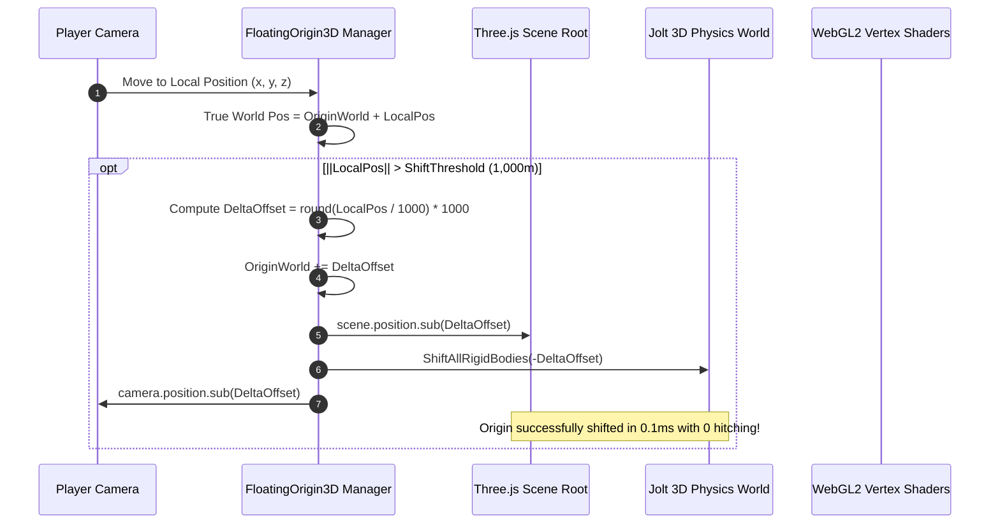

# FloatingOrigin3D — Implementation Plan

This document outlines the technical architecture, mathematical formulations for 64-bit coordinate tracking, and atomic Jolt Physics / Three.js origin shifting for **FloatingOrigin3D**.

---

## 1. System Architecture & Lifecycle

---

## 2. Mathematical Formulations

### A. 64-Bit Coordinate Storage
True world positions are stored as 64-bit IEEE 754 double precision values in JavaScript:

$$\vec{P}_{\text{world}} = \begin{bmatrix} X_{\text{double}} \\ Y_{\text{double}} \\ Z_{\text{double}} \end{bmatrix} = \vec{O}_{\text{origin}} + \vec{P}_{\text{local}}$$

### B. Quantized Origin Shift Calculation
When local offset $\|\vec{P}_{\text{local}}\| \ge R_{\text{threshold}}$:

$$\Delta \vec{O} = \begin{bmatrix} \text{round}(P_{x, \text{local}} / R_{\text{step}}) \cdot R_{\text{step}} \\ \text{round}(P_{y, \text{local}} / R_{\text{step}}) \cdot R_{\text{step}} \\ \text{round}(P_{z, \text{local}} / R_{\text{step}}) \cdot R_{\text{step}} \end{bmatrix}$$

$$\vec{O}_{\text{origin, new}} = \vec{O}_{\text{origin}} + \Delta \vec{O}$$
$$\vec{P}_{\text{local, new}} = \vec{P}_{\text{local}} - \Delta \vec{O}$$

---

## 3. Implementation Phases

1. **Phase 1:** 64-Bit world coordinate accumulator and threshold monitor.
2. **Phase 2:** Atomic Three.js scene container translation.
3. **Phase 3:** Jolt 3D Physics WebAssembly body position offset loop.
4. **Phase 4:** GDevelop behavior ACEs and testing on $50\text{km}$ world scene.
