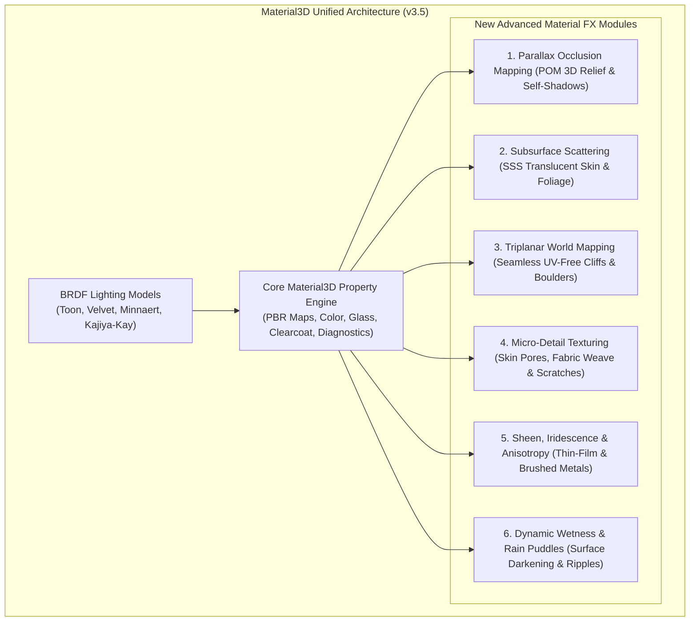
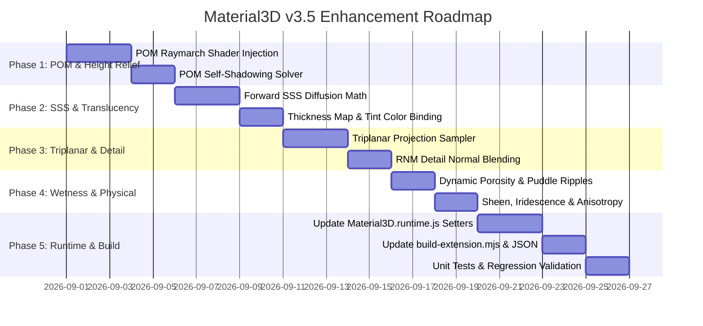

# Material 3D — Advanced Material FX Enhancement Plan (v3.5 Architecture)

**Target:** `Material3D` Extension (`Material3D.runtime.js`, `BRDFMaterial.runtime.js`, `build-extension.mjs`, `README.md`).  
**Objective:** Upgrade `Material3D` from standard PBR / BRDF material overrides into a **comprehensive AAA surface-shading powerhouse** by integrating 6 advanced visual modules directly into its existing runtime and shader injection hooks.

---

## 1. Executive Summary & Enhancement Vision

`Material3D` currently provides:
1. **`Material 3D` Behavior:** PBR texture slots, UV animation, physical glass/clearcoat, diagnostics, and 57 runtime setters.
2. **`BRDF Material` Behavior:** 13 non-standard diffuse lighting models (Oren-Nayar, Toon, Velvet, Kajiya-Kay) via `onBeforeCompile`.

### The v3.5 Enhancement
Rather than fragmenting GDevelop with separate material plugins, we expand `Material3D` with **6 cutting-edge surface shader modules**:



---

## 2. Detailed Technical Specifications for the 6 New Modules

### Module 1: Parallax Occlusion Mapping (POM 3D Relief & Self-Shadows)
* **The Problem:** Standard normal maps look completely flat at shallow grazing angles.
* **The Solution:** Per-pixel iterative raymarching through a heightmap texture in the fragment shader.
* **Math & Algorithm:**
  1. Calculate tangent-space view vector $\vec{V}_{\text{tangent}} = \mathbf{TBN} \cdot \vec{V}$.
  2. Number of raymarch steps scales adaptively with grazing angle:
     $$\text{steps} = \text{mix}(\text{MaxSamples}, \text{MinSamples}, \vec{N} \cdot \vec{V}), \quad \text{steps} \in [8, 32]$$
  3. Raymarch through height layers until ray depth exceeds sampled height $H(u, v)$.
  4. Perform linear secant interpolation between the last two depth steps for sub-texel precision.
  5. **POM Self-Shadowing:** Trace a secondary ray toward the sun light vector $\vec{L}_{\text{tangent}}$; if any height step occludes the ray, cast self-shadows into deep cracks.
* **New Properties in `Material3D`:**
  - `EnablePOM` (Boolean, default `false`)
  - `HeightMap` (Resource Image)
  - `HeightScale` (Number, default `0.04` meters)
  - `POMMinSamples` (Number, default `8`), `POMMaxSamples` (Number, default `32`)
  - `POMSelfShadows` (Boolean, default `true`)

---

### Module 2: Subsurface Scattering (SSS Translucent Skin & Leaves)
* **The Problem:** Human skin, character ears, candles, wax, jade, and plant leaves look like hard plastic.
* **The Solution:** Fast Screen-Space / Forward Translucent Diffusion approximation (Jimenez / Unreal model).
* **Math & Algorithm:**
  $$\vec{L}_{\text{trans}} = \vec{L} + \vec{N} \cdot \text{SSSDistortion}$$
  $$I_{\text{trans}} = \max\left(\vec{V} \cdot -\vec{L}_{\text{trans}}, 0.0\right)^{\text{SSSPower}} \cdot \text{Thickness} \cdot \text{SSSTintColor} \cdot \text{SSSScale}$$
  Light passing through thin geometry (ears, fingers, thin foliage) glows with a warm interior hue.
* **New Properties in `Material3D`:**
  - `EnableSSS` (Boolean, default `false`)
  - `ThicknessMap` (Resource Image — white = thin/translucent, black = thick/opaque)
  - `SSSTintColor` (Color, default `"255; 80; 40"` for skin or `"120; 255; 60"` for leaves)
  - `SSSDistortion` (Number, default `0.20`)
  - `SSSPower` (Number, default `4.0`)
  - `SSSScale` (Number, default `1.0`)

---

### Module 3: Triplanar World-Space Mapping (UV-Free Cliffs & Boulders)
* **The Problem:** Textures on steep terrain, rocks, and cliffs stretch and distort horribly unless unwrapped manually.
* **The Solution:** Projects textures simultaneously along the world $X, Y, Z$ Cartesian axes and blends them based on surface normals.
* **Math & Algorithm:**
  1. Blend weights:
     $$\vec{W} = \left( |\vec{N}_x|^p, |\vec{N}_y|^p, |\vec{N}_z|^p \right), \quad p = \text{TriplanarSharpness} \approx 4.0$$
     $$\vec{W}_{\text{norm}} = \frac{\vec{W}}{\vec{W}_x + \vec{W}_y + \vec{W}_z}$$
  2. Sample textures at $(y \cdot s, z \cdot s)$, $(x \cdot s, z \cdot s)$, and $(x \cdot s, y \cdot s)$.
  3. Final Color:
     $$\text{Color} = \text{Tex}_{YZ} \cdot \vec{W}_x + \text{Tex}_{XZ} \cdot \vec{W}_y + \text{Tex}_{XY} \cdot \vec{W}_z$$
* **New Properties in `Material3D`:**
  - `EnableTriplanar` (Boolean, default `false`)
  - `TriplanarScale` (Number, default `1.0` texture repeats per meter)
  - `TriplanarSharpness` (Number, default `4.0`)

---

### Module 4: Micro-Detail Texturing (Pores, Fabric Weave & Scratches)
* **The Problem:** When camera gets close to a character or prop, low-resolution texture maps become blurry.
* **The Solution:** High-frequency secondary normal and roughness maps tiled $10\times - 30\times$ across the surface.
* **Math & Algorithm (Reoriented Normal Mapping - RNM):**
  $$\vec{N}_{\text{final}} = \text{normalize}\left(\vec{N}_{\text{base}} + \vec{N}_{\text{detail}} \times \vec{N}_{\text{base}}\right)$$
  Avoids the loss of detail caused by naive linear normal addition.
* **New Properties in `Material3D`:**
  - `DetailNormalMap` (Resource Image)
  - `DetailRoughnessMap` (Resource Image)
  - `DetailTiling` (Number, default `15.0`)
  - `DetailNormalStrength` (Number, default `0.5`)

---

### Module 5: Sheen, Iridescence & Anisotropy (Physical Extensions)
* **What it does:** Unlocks Three.js r160's advanced `MeshPhysicalMaterial` features.
* **Capabilities:**
  - **Sheen:** Micro-fiber velvet and satin back-scatter highlights for clothing and furniture.
  - **Iridescence:** Thin-film interference for soap bubbles, oil slicks, peacock feathers, and beetle carapaces.
  - **Anisotropy:** Directional stretched specular reflections for brushed metal pots, carbon fiber, vinyl records, and hair strands.
* **New Properties in `Material3D`:**
  - `SheenColor` (Color), `SheenRoughness` (Number)
  - `Iridescence` (Number $0-1$), `IridescenceIOR` (Number $1.0 - 2.5$), `IridescenceThicknessMin/Max` (nm)
  - `Anisotropy` (Number $0-1$), `AnisotropyRotation` (Number in degrees)

---

### Module 6: Dynamic Wetness, Rain Puddles & Ripples
* **The Problem:** Surfaces remain statically dry even when it starts raining.
* **The Solution:** Dynamic surface modifier that darkens porous diffuse albedo, drives roughness to mirror levels ($0.02$), and animates procedural raindrop ripples.
* **Math & Algorithm:**
  $$\text{Albedo}_{\text{wet}} = \text{Albedo}_{\text{dry}} \cdot \left(1.0 - \text{Wetness} \cdot \text{Porosity} \cdot 0.35\right)$$
  $$\text{Roughness}_{\text{wet}} = \text{mix}(\text{Roughness}_{\text{dry}}, 0.02, \text{Wetness})$$
* **New Properties in `Material3D`:**
  - `Wetness` (Number, $0.0 - 1.0$)
  - `Porosity` (Number, $0.0 - 1.0$ — stone/fabric darkens heavily, metal stays unchanged)
  - `PuddleMask` (Resource Image)
  - `EnableRainRipples` (Boolean)

---

## 3. Shader Injection Architecture in `Material3D.runtime.js`

`Material3D` uses Three.js's `material.onBeforeCompile` with a unified program cache key to maintain zero recompilations:

```javascript
material.customProgramCacheKey = function() {
  return 'M3D_V35_' + 
    (this.userData.__usePOM ? 'POM|' : '') +
    (this.userData.__useSSS ? 'SSS|' : '') +
    (this.userData.__useTriplanar ? 'TRI|' : '') +
    (this.userData.__useDetail ? 'DET|' : '') +
    (this.userData.__useWetness ? 'WET|' : '');
};
```

### Injected Chunk Locations in Three.js Shaders:
1. **`uv_pars_fragment` & `map_fragment`:** POM raymarcher offset and Triplanar UV synthesis.
2. **`normal_fragment_maps`:** Reoriented Detail Normal blend (RNM) and Rain Ripple wavelets.
3. **`roughnessmap_fragment`:** Dynamic wetness darkening and puddle smoothing.
4. **`lights_fragment_begin`:** SSS forward translucency diffusion.

---

## 4. Proposed New ACEs (Actions, Conditions, Expressions)

### New Actions
* **`Set Parallax Occlusion Mapping on _PARAM0_ (Enabled: _PARAM1_, HeightMap: _PARAM2_, Scale: _PARAM3_, SelfShadows: _PARAM4_)`**
* **`Set Subsurface Scattering on _PARAM0_ (Enabled: _PARAM1_, ThicknessMap: _PARAM2_, TintColor: _PARAM3_, Scale: _PARAM4_)`**
* **`Set Triplanar Mapping on _PARAM0_ (Enabled: _PARAM1_, Scale: _PARAM2_, Sharpness: _PARAM3_)`**
* **`Set Detail Micro-Textures on _PARAM0_ (NormalMap: _PARAM1_, Tiling: _PARAM2_, Strength: _PARAM3_)`**
* **`Set Dynamic Wetness on _PARAM0_ to _PARAM1_ (Porosity: _PARAM2_, RainRipples: _PARAM3_)`**
* **`Set Sheen properties on _PARAM0_ (Color: _PARAM1_, Roughness: _PARAM2_)`**
* **`Set Iridescence on _PARAM0_ (Factor: _PARAM1_, IOR: _PARAM2_)`**
* **`Set Anisotropy on _PARAM0_ (Strength: _PARAM1_, Rotation: _PARAM2_)`**

### New Conditions
* **`Is Parallax Occlusion active on _PARAM0_`**
* **`Is Subsurface Scattering active on _PARAM0_`**
* **`Is surface wet on _PARAM0_`**

### New Expressions
* **`Object.Material3D::Wetness()`**
* **`Object.Material3D::HeightScale()`**
* **`Object.Material3D::SSSScale()`**

---

## 5. Implementation Roadmap for `Material3D`



---

## 6. Verification & Compatibility Matrix

- **Zero Breaking Changes:** Existing scenes using `Material3D` v3.0 properties continue to function identically with zero migration required.
- **BRDF Material Composability:** `BRDFMaterial` behavior continues to compose cleanly on top of `Material3D` via `reapplyIfPatched()`.
- **Unit Test Suite:** Expands `Material3D/test-material3d.mjs` with test assertions for POM, SSS, Triplanar, Detail, and Wetness property setters and shader cache keys.
