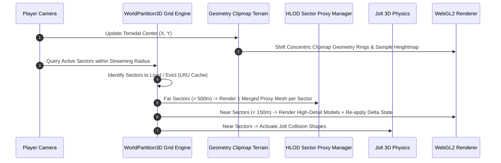

# WorldPartition3D — Implementation Plan

This document outlines the technical architecture, mathematical formulations (Geometry Clipmaps, HLOD Quadtree clustering, and Delta-State persistence), WebGL2 shader pipelines, and implementation phases for **WorldPartition3D**.

---

## 1. System Architecture & Lifecycle

---

## 2. Mathematical Formulations & Algorithms

### A. Geometry Clipmap Terrain with Seam Morphing (Losasso & Hoppe)
The terrain consists of $L$ nested concentric square geometry rings ($L = 4 - 6$) centered on the player. Each ring has grid resolution $M \times M$ (e.g. $64 \times 64$ quads).

* Scale of ring level $l \in [0, L-1]$:
  $$s_l = 2^l \cdot \Delta x_{\text{base}}$$

#### Continuous Transition Morphing Function:
$$\alpha(x, y) = \text{clamp}\left( \frac{\max(|x - c_x|, |y - c_y|) - (M/2 - w - 1)s_l}{w \cdot s_l}, 0.0, 1.0 \right)$$
$$Z_{\text{vertex}} = \text{mix}\left( H_{\text{fine}}(x, y), H_{\text{coarse}}(x, y), \alpha(x, y) \right)$$

---

### B. Hierarchical Level of Detail (HLOD) Quadtree Clustering
1. Spatial Sector Partitioning ($128\text{m} \times 128\text{m}$).
2. Offline / Background Proxy Mesh Baking via `AutoMeshLOD3D` with MaxRects Texture Atlas Packing.
3. Runtime Swapping ($5,000\text{ draw calls} \rightarrow 1\text{ draw call}$).

---

### C. Delta-State Persistence (World Memory Diffs)
1. Delta Memory Dictionary: $\mathcal{D} = \{ \text{ObjectID} \mapsto \{ \text{key}_1: \text{val}_1, \dots \} \}$.
2. On Sector Unload: write dirty state to $\mathcal{D}$.
3. On Sector Reload: re-apply overrides (e.g. `isDead: true`, `isOpened: true`).

---

## 3. Implementation Phases

1. **Phase 1:** Geometry Clipmap concentric ring mesh generation & GPU heightmap displacement.
2. **Phase 2:** $(X,Y)$ Sector grid partitioning engine & LRU VRAM memory caching.
3. **Phase 3:** Delta-state persistence dictionary with `IndexedDB` / `localStorage` serialization.
4. **Phase 4:** Distant sector HLOD proxy swapping and texture atlas rendering.
5. **Phase 5:** GDevelop ACEs, editor properties, and testing on $16\text{km} \times 16\text{km}$ scene.
