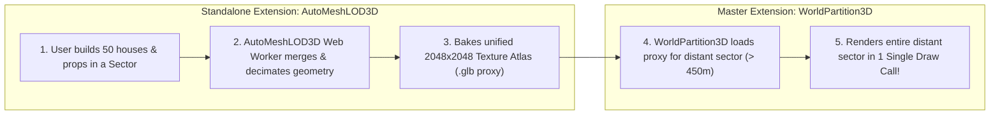

# WorldPartition3D — Open-World Grid Streaming, HLOD Proxies & Clipmap Terrain

**WorldPartition3D** is the master open-world streaming and rendering engine for GDevelop 5 (Three.js WebGL2 backend).

---

## 🌟 Key Highlights

- **Grid-Based Sector Streaming:** Automatically loads and unloads $(X, Y)$ world sectors in background worker threads based on camera streaming radii with LRU VRAM memory caching.
- **Delta-State Persistence (World Memory):** Remembers which chests were looted, enemies killed, doors unlocked, and trees chopped so world state is never reset when sectors unload and reload!
- **Hierarchical Level of Detail (HLOD) Distant Sector Merging:** Groups thousands of individual distant buildings, rocks, and trees in outer sectors into a **single merged low-poly proxy mesh per sector** ($5,000\text{ draw calls} \rightarrow 1\text{ draw call}$!).
- **Concentric Geometry Clipmap Terrain:** 4–6 nested concentric square geometry rings following the player with GPU heightmap displacement, morphing seams, and multi-biome splatmaps at a **constant $O(1)$ 50k triangle budget** regardless of world size.
- **Dedicated `AutoMeshLOD3D` Pipeline:** Integrates seamlessly with the standalone `AutoMeshLOD3D` extension, consuming its background Web Worker QEM cluster bakes to render distant HLOD proxies at runtime.

---

## 🏰 The HLOD Runtime Optimization Engine

---

## 📚 Documentation

- [IMPLEMENTATION_PLAN.md](./IMPLEMENTATION_PLAN.md) — Technical architecture, mathematical formulations, and phased roadmap.
- [API_REFERENCE.md](./API_REFERENCE.md) — Properties, Actions, Conditions, Expressions (ACEs).
