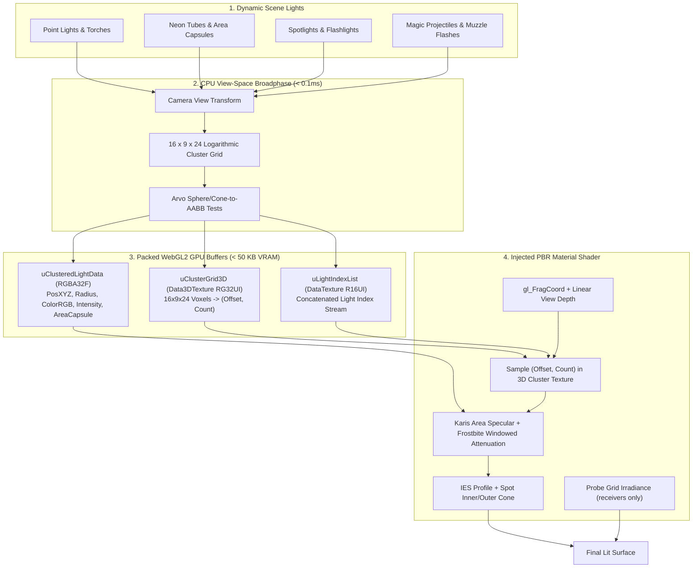

# AdvancedLighting3D — Clustered Forward Dynamic Lighting + Baked Indirect GI for GDevelop

**AdvancedLighting3D** is a complete dynamic lighting architecture and material pipeline for
**GDevelop 5 (Three.js WebGL2 backend)**. It covers both halves of a scene's lighting:

**Direct light.** By partitioning the camera view frustum into a 3D grid of **3,456 spatial clusters**
($16 \times 9 \times 24$ depth slices), it lets scenes carry **100 to 500+ active dynamic lights**
(torches, streetlamps, campfires, neon signs, magic spells, muzzle flashes) with zero shader
recompilations, flat 60 FPS performance, and cinema-grade fidelity (Karis area light specular
reflections, volumetric fog shafts, blackbody Kelvin colour temperatures, IES photometric profiles,
and screen-space contact micro-shadows).

**Indirect light.** A **`LightProbeVolume3D`** bakes the scene's ambient into a small RGBA16F 3D
texture that **`ReceiveLightProbes`** objects sample per fragment, so a character walking under a
canopy, into a cave, or along a red-lit corridor picks up the ambient colour of *that place* instead
of the single flat ambient value a scene otherwise gets. About 16 KB of VRAM at default settings and
no additional draw calls.

> **Why one extension.** Both halves inject into the same `lights_fragment_begin` chunk of the same
> shared materials. As two separate extensions they collided on `customProgramCacheKey`, so Three
> could hand a material the other one's compiled program — silently, since a bad 3D shader in
> GDevelop fails without an error. Merged, there is **one injection, one cache key and one
> post-events tick**, and the probe term and the clustered loop are ordered correctly against each
> other by construction.

---

## 🌟 Key Highlights

- **Scale to 500+ Dynamic Lights:** Flat $O(1)$ constant-time pixel evaluation by testing only the 1–3 lights in each pixel's 3D cluster bin.
- **Zero Shader Recompilation Stutter:** Light data is streamed dynamically through WebGL2 DataTextures and 3D textures (`sampler3D`), eliminating all runtime shader recompilations when lights spawn, move, or extinguish.
- **Physically Based Area Lights (Karis Model):** Replaces artificial pinpoint specular reflections with realistic broad reflections for glowing embers, light bulbs, and neon tube/capsule lights.
- **Blackbody Radiation Color Temperature:** Set authentic physical lighting in Kelvin (1,800K candle flames to 8,500K moonlight).
- **IES Photometric Profiles:** Real-world architectural light distributions (wall sconces, streetlamps, spotlights, downlights), carried to the GPU in the fourth light texel.
- **Baked Indirect Light Probes:** A 3D grid of probes captures occlusion and coloured bounce, sampled with one hardware-filtered `sampler3D` fetch per fragment. Caves go dark because there is rock overhead; the corridor goes red because the wall beside it is red.
- **Day / Night Probe Blending:** Two baked states blended on the GPU by a single global factor — no CPU recomputation, no rebake.
- **Amortised Raycast Baker:** Baking runs under a per-frame millisecond budget so the game stays responsive, and the result exports to a `.lpg.bin` so shipping builds load instead of rebaking.
- **Hybrid Co-Existence Pipeline:** Seamlessly adds to GDevelop's native Sun, skybox and ambient light without breaking changes.

---

## 📐 The Clustered Lighting Pipeline

---

## 📊 Comparison: Standard GDevelop Lighting vs. AdvancedLighting3D

| Metric / Capability | Standard GDevelop 3D Lighting | AdvancedLighting3D |
| :--- | :--- | :--- |
| **Max Dynamic Lights** | 8–12 point lights | **200–500+ active lights** |
| **CPU cost of 100 Lights** | One draw path per light | **~1.3 ms broadphase, measured** (see below; GPU cost unprofiled) |
| **Shader Hitching on Spawn** | Recompiles shader per light count change | **Zero recompilations (Streamed via textures)** |
| **Specular Reflections** | Pinpoint plastic white dots | **Realistic Area Lights (Karis Tube & Sphere)** |
| **Light Color Modeling** | Manual RGB hex codes | **Kelvin Blackbody Temperature (1,800K–8,500K)** |
| **Light Profiles** | Uniform spheres only | **IES Photometric Lobes (Sconces, Downlights)** |
| **Indirect / Ambient Light** | One flat ambient value for the whole scene | **Spatially varying baked probe grid (occlusion + coloured bounce)** |
| **Ambient in a Cave** | Same as outdoors | **Dark, because the bake saw rock overhead** |
| **Day / Night Ambient** | Manual re-tint | **Two baked volumes blended by one GPU factor** |
| **GPU VRAM Overhead** | Low | **< 60 KB clustered + ~16 KB probes (default grid)** |

---

## 🚀 Quick Start Guide

1. **No scene manager to add.** The runtime installs itself when the scene loads. Optionally call `SetMaxLights` (64–512, default 256) if you expect more than 256 simultaneous lights.
2. **Add Light Behavior:** Add the **`ClusteredLight3D`** behavior to any 3D object (torches, lampposts, projectiles, or empty light anchors).
3. **Customize Properties:**
   - Set **Light Type:** `Point`, `Spot`, or `AreaCapsule`.
   - A Spot light attached to a Cube3D automatically places an unlit bulb decal over the cube's front (`+Z`) face. This is the exact face the cone points out of, and the decal is attached directly to the editor's Cube3D mesh so face-material refreshes cannot erase it.
   - An AreaCapsule is a two-sided tube along the object's local Z axis. Diffuse lighting and attenuation use the nearest point on the fixed tube; only its physically view-dependent specular reflection uses the Karis representative point.
   - Set **Color Temperature:** e.g. `2200K` for warm torch fire or `5500K` for cool halogen.
   - Set **Attenuation Radius:** e.g. `12.0` meters.
   - Enable **Procedural Flicker:** Select `FireFlicker` for dynamic organic flame modulation.
4. **Trigger In Event Sheet:**
   - On spell cast: `ClusteredLight3D::SetIntensity(3.5)` and `ClusteredLight3D::SetRadius(25.0)`
   - On shooting: `ClusteredLight3D::TriggerMuzzleFlash(duration: 0.05)`
   - Master brightness: `AdvancedLighting3D::SetGlobalIntensity(1.2)`

### Adding baked indirect light

5. **Define the volume.** Add a **Cube3D** to the scene, stretch it over the level with the 3D scale
   gizmo and add the **`LightProbeVolume3D`** behavior. The cube's bounds are the volume's bounds and
   the cube hides itself at runtime. Note that **Z is the height axis** in GDevelop, so the default
   grid is $16 \times 16 \times 4$.
6. **Attach receivers.** Add **`ReceiveLightProbes`** to your player, enemies and props. Receivers
   also keep receiving clustered dynamic lights — the two features share one shader.
7. **Bake.** Call `StartProbeBake()` once and poll `IsProbeBakeComplete()`. **This is the step that
   produces cave shadowing and coloured bounce**; until you run it you have a sky/ground gradient and
   nothing more. Export with `ExportProbeData` so shipping builds load the result instead of rebaking.

Baking is not instant. At the default 1,024 probes it is a few thousand scene raycasts, amortised
across frames under `SetProbeBakeBudgetMs`. Raising resolution raises the cost as the product of all
three axes: $32 \times 8 \times 32$ is eight times the work of the default.

---

## ⚠️ Requirements and limits

| | |
| :--- | :--- |
| **WebGL2** | Required by both halves. `sampler3D` and `usampler3D` do not exist in GLSL ES 1.00, so there is no degraded mode. Check `IsSupported()` before your setup events. |
| **Lit standard materials** | Injection is applied to `MeshStandardMaterial` only. Objects set to material type **Basic** cannot receive either clustered light or probe light — `MeshBasicMaterial` has no lighting at all. The extension warns once, naming the material. |
| **Units** | The clustered light `Radius` and `CapsuleLength` are in **metres**; the runtime converts at 100 world units per metre. Probe bounds and `NormalBiasOffset` stay in raw GDevelop world units (pixels). A humanoid character is 50-200 units tall, so roughly 0.5-2 m. |
| **Probe volumes per scene** | One. Overlapping-volume blending is not implemented. |
| **Probe working scale** | Sensible from roughly a room up to a few thousand units per axis. At the default 16 probes per horizontal axis, a 2,000-unit level gives ~125-unit spacing — about a character and a half. |
| **Scene editor** | Clustered lights **do** render live in the 3D scene editor. GDevelop's in-game editor runs no events, so the extension registers a `gdjs.registerInGameEditorPostStepCallback` — the one per-frame hook available while authoring — and drives the broadphase from there. Flicker and muzzle flashes are pinned to the configured intensity in the editor so authoring is against a steady light. |

---

---

## 🖊️ In the scene editor

Lights render live in GDevelop's **3D scene editor**, not just in Preview. That is not automatic:
the editor drives its own loop (`_updateObjectsForInGameEditor` → `gdjs.callbacksInGameEditorPostStep`
→ `render()`) and **never runs events**, so a behavior's `doStepPreEvents` and the scene's
post-events callbacks both stay silent there. The extension registers for that editor callback list
explicitly and runs the same broadphase from it.

Two consequences worth knowing while authoring:

- **Flicker and muzzle flashes do not animate in the editor.** Each light is drawn at its configured
  `Intensity`. Authoring against a pulsing light is worse than authoring against a steady one.
- **`Intensity` is live without a step.** The light's working intensity is seeded from the property
  at creation rather than defaulting to `1.0`, because nothing in the editor would ever update it.

## 📈 Measured CPU cost

The CPU broadphase, timed in the Node harness at a 4 m radius (16 x 9 x 24 grid, 1920x1080,
fov 45). Note the **default is 12 m**, not 4 — see the warning below the table:

| Active lights | Broadphase / frame |
| ---: | ---: |
| 0 | 0.21 ms |
| 1 | 0.58 ms |
| 16 | 1.21 ms |
| 64 | 1.24 ms |
| 256 | 1.83 ms |
| 500 | 1.70 ms |

Two things keep that flat. The per-cluster bins are typed arrays allocated once and reused —
they used to be 3,456 freshly allocated JS arrays every frame, which cost 0.84 ms before a
single light was considered. And a light is only tested against the tiles its screen-space
footprint actually covers, rather than all 144 tiles of every depth slice it spans.

**Radius is the performance knob — but reach comes first.** A light whose radius covers the whole
view lands in every cluster and defeats the clustering: 256 lights at 4 m cost 1.8 ms, the same 256
at 12 m cost 10.5 ms. It is tempting to make the default small for that reason. Don't: attenuation
reaches **exactly zero** at the radius, so a surface past it is not dim, it is *unlit*, and a 4 m
default turns a stock scene black the moment anything sits more than 400 units from the light.
The default is 12 m (1200 units) because that lights an ordinary scene. Lower it per-light once you
have something on screen and `CPUBroadphaseTimeMs()` says you need to.

*(GPU cost is not measured here — nothing has been profiled in GDevelop yet.)*

---

## ❌ What this extension does *not* do

Listed because earlier revisions of this README claimed otherwise. These are configurable in the
editor and settable from events — the values are stored and reported back correctly — but **nothing
reads them at render time**:

| Feature | Status |
| :--- | :--- |
| **Volumetric fog / god rays** | Not implemented. `SetVolumetricFogEnabled`, `SetVolumetricFogDensity` and `SetVolumetricAnisotropy` set scene state that no shader code consumes. Doing this properly needs a raymarched pass, not a term in the forward material shader. |
| **Screen-space contact shadows (SSCS)** | Not implemented. `EnableContactShadows`, and the per-light `CastContactShadows` / `ShadowBias` properties, are inert. SSCS needs a depth texture, which GDevelop's post-processing composer does not expose. |
| **Configurable cluster grid** | `ClusterGridX/Y/Z` are compile-time constants (16 × 9 × 24). There is no action or property that changes them. |
| **Multiple layers** | The cluster broadphase reads the camera and scene from the base layer (`""`) only. Lights and probe volumes on other layers are not handled. |
| **Multiple probe volumes** | One per scene. Overlapping-volume blending is not implemented. |

Everything else in this document is wired end to end and covered by the test suite.

---

## 📚 Documentation Index

- [IMPLEMENTATION_PLAN.md](./IMPLEMENTATION_PLAN.md) — Technical architecture, mathematical formulations (logarithmic depth slicing, Arvo distance metrics, Karis representative point area specular, Frostbite windowed attenuation, volumetric scattering integrals), WebGL2 texture packing, and implementation phases.
- [API_REFERENCE.md](./API_REFERENCE.md) — Complete specification of Manager and Object Properties, Actions, Conditions, Expressions, Presets, and Color Temperature constants.
