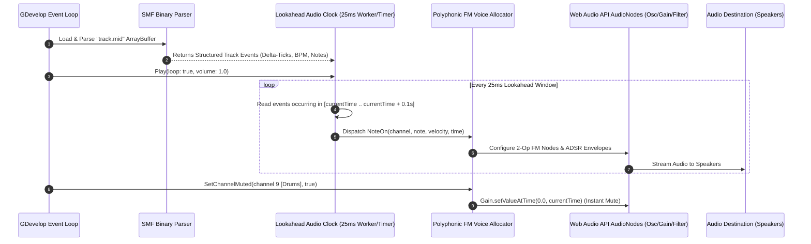
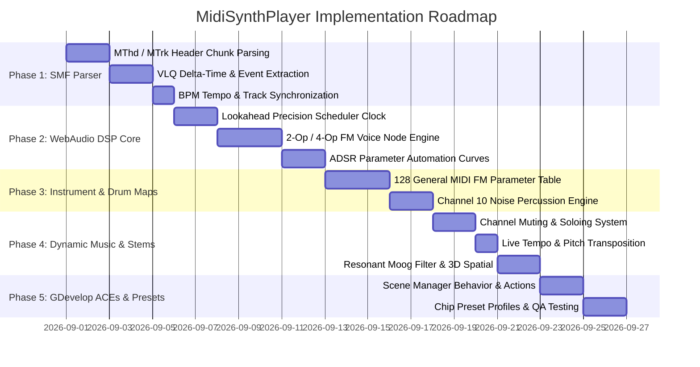

# MidiSynthPlayer — Implementation Plan

This document outlines the technical architecture, binary SMF parsing specifications, Web Audio API DSP synthesis equations, lookahead clock scheduling, and implementation phases for **MidiSynthPlayer**.

---

## 1. System Architecture & Lifecycle

`MidiSynthPlayer` operates as a high-precision, low-latency audio subsystem inside the browser's Web Audio API (`AudioContext`):



---

## 2. Standard MIDI File (SMF) Binary Parsing

The parser is implemented in $< 4\text{ KB}$ of vanilla JavaScript without external dependencies:

### A. Header Chunk (`MThd`)
* **Magic Bytes:** `0x4D 0x54 0x68 0x64` (`"MThd"`)
* **Length:** 32-bit big-endian integer (typically `6`)
* **Format:** 16-bit integer (`0` = Single track, `1` = Synchronous multi-track)
* **Track Count:** 16-bit integer ($N$)
* **Division / PPQ:** 16-bit integer (Pulses / Ticks per Quarter Note, e.g. `480` or `960`)

### B. Variable-Length Quantity (VLQ) Decoding
Delta-times between events are encoded as 7-bit variable-length quantities:
```javascript
function readVarLength(dataView, offset) {
  let value = 0;
  let bytesRead = 0;
  while (true) {
    const byte = dataView.getUint8(offset + bytesRead);
    bytesRead++;
    value = (value << 7) | (byte & 0x7F);
    if ((byte & 0x80) === 0) break;
  }
  return { value, bytesRead };
}
```

### C. Track Event Stream & Running Status
* **Note-On:** `0x90 | channel` $\rightarrow$ `noteNumber` ($0-127$), `velocity` ($0-127$).
* **Note-Off:** `0x80 | channel` $\rightarrow$ `noteNumber` ($0-127$), `releaseVelocity` ($0-127$). (Note-On with velocity `0` is treated as Note-Off).
* **Program Change:** `0xC0 | channel` $\rightarrow$ `instrumentIndex` ($0-127$).
* **Pitch Bend:** `0xE0 | channel` $\rightarrow$ 14-bit unsigned value ($0 - 16383$, center $8192$).
* **Control Change (CC):** `0xB0 | channel` $\rightarrow$ `controllerNumber`, `value` (CC7 Volume, CC10 Pan, CC11 Expression, CC64 Damper/Sustain Pedal).
* **Meta Events:** `0xFF 0x51 0x03` $\rightarrow$ Set Tempo (Microseconds per Quarter Note: $\text{BPM} = \frac{60,000,000}{\mu\text{s}}$).

---

## 3. Mathematical DSP Synthesis Engine (0 KB Samples)

### A. MIDI Note to Frequency Conversion
Given MIDI note number $N \in [0, 127]$, global transposition $\Delta_{\text{semi}}$, and pitch bend $B \in [-8192, +8191]$:

$$f = 440.0 \cdot 2^{\frac{N + \Delta_{\text{semi}} - 69 + \left(\frac{B}{8192} \cdot \text{BendRange}\right)}{12}} \text{ Hz}$$

---

### B. 2-Operator & 4-Operator FM Synthesis Equations
For each melodic voice, we compute frequency modulation with self-feedback:

$$\text{Modulator}(t) = \sin\left(2\pi (f \cdot M_{\text{ratio}}) t + \beta \cdot y_{\text{prev}}\right)$$

$$\text{Carrier}(t) = \sin\left(2\pi (f \cdot C_{\text{ratio}}) t + I_{\text{mod}}(t) \cdot \text{Modulator}(t)\right) \cdot \text{ADSR}(t)$$

Where:
* $C_{\text{ratio}}, M_{\text{ratio}}$: Carrier and Modulator harmonic frequency multipliers (e.g. $1:1, 1:2, 1:3.5$).
* $I_{\text{mod}}(t)$: Dynamic Modulation Index (brightness/timbre envelope).
* $\beta$: Self-feedback coefficient ($0.0 \le \beta \le 0.8$) generating rich sawtooth-like harmonics for brass and distorted guitars.

---

### C. Precision ADSR Envelopes via Web Audio API
Rather than manual per-sample looping, we utilize the browser's hardware-accelerated parameter automation:

```javascript
function applyADSR(gainNode, time, velocity, adsr) {
  const peak = (velocity / 127.0) * adsr.volume;
  const sustain = peak * adsr.sustainLevel;
  
  gainNode.gain.cancelScheduledValues(time);
  gainNode.gain.setValueAtTime(0.0001, time);
  
  // Attack (Linear ramp to peak)
  gainNode.gain.linearRampToValueAtTime(peak, time + adsr.attackTime);
  
  // Decay (Exponential decay to sustain level)
  gainNode.gain.exponentialRampToValueAtTime(Math.max(sustain, 0.0001), time + adsr.attackTime + adsr.decayTime);
}

function applyRelease(gainNode, time, adsr) {
  gainNode.gain.cancelScheduledValues(time);
  gainNode.gain.setValueAtTime(gainNode.gain.value, time);
  gainNode.gain.exponentialRampToValueAtTime(0.0001, time + adsr.releaseTime);
}
```

---

### D. Channel 10 Percussion Synthesis Algorithms (General MIDI Drum Map)
Percussion is generated using distinct mathematical DSP recipes:

| MIDI Note | Drum Sound | DSP Algorithm |
| :---: | :--- | :--- |
| **35 / 36** | Acoustic / Bass Drum | Fast exponential pitch drop from $150\text{Hz} \rightarrow 35\text{Hz}$ over $0.08\text{s}$ with sine oscillator. |
| **38 / 40** | Acoustic / Electric Snare | Biquad Bandpass Filter ($1200\text{Hz}, Q=1.5$) over White Noise burst ($0.15\text{s}$) + $180\text{Hz}$ tone impact. |
| **42 / 44** | Closed Hi-Hat / Pedal | Highpass Filter ($7000\text{Hz}$) over ultra-short white noise burst ($0.04\text{s}$). |
| **46** | Open Hi-Hat | Highpass Filter ($6500\text{Hz}$) over decaying white noise burst ($0.4\text{s}$). |
| **49 / 57** | Crash / Splash Cymbal | 6-Oscillator detuned square cluster + highpass filter ($5000\text{Hz}$) with long $1.2\text{s}$ exponential decay. |
| **41 / 45 / 48** | Floor / Mid / High Toms | Pitched sine drop with resonant body ring ($80\text{Hz} - 250\text{Hz}$). |

---

## 4. The Lookahead Precision Audio Scheduler

JavaScript `setTimeout` and `requestAnimationFrame` suffer from frame pacing jitter ($5\text{ms} - 20\text{ms}$). 

To achieve **sample-accurate musical timing**, we implement a **Lookahead Clock**:
* A recurring lightweight timer ticks every **$25\text{ms}$**.
* During each tick, it looks ahead **$100\text{ms}$** into the future:
  $$t_{\text{windowEnd}} = \text{audioContext.currentTime} + 0.100$$
* All MIDI events falling within $[t_{\text{current}}, t_{\text{windowEnd}}]$ are pre-scheduled with exact microsecond timestamps directly onto Web Audio parameters.
* **Result:** 100% rock-solid, drift-free musical timing regardless of game frame drops or heavy 3D rendering load.

---

## 5. The 4 Authentic Sound Chip Profiles

```javascript
const CHIP_PRESETS = {
  OPL3_SoundBlaster: {
    name: "DOS Sound Blaster (OPL3)",
    operators: 2,
    feedbackScale: 1.0,
    filterCutoff: 12000,
    waveform: "sine"
  },
  YM2612_Genesis: {
    name: "Sega Genesis (YM2612)",
    operators: 4,
    feedbackScale: 1.4,
    filterCutoff: 9000,
    waveform: "sine"
  },
  PC98_FM: {
    name: "NEC PC-98 (YM2608)",
    operators: 4,
    feedbackScale: 1.2,
    filterCutoff: 14000,
    waveform: "sine"
  },
  NES_Chiptune: {
    name: "8-Bit Nintendo / GameBoy",
    operators: 1,
    feedbackScale: 0.0,
    filterCutoff: 20000,
    waveform: "square" // Pulse waves + Triangle bass
  }
};
```

---

## 6. Implementation Phases



---

## 7. Performance Budgets & Target Metrics

| Subsystem | CPU Overhead | Memory Footprint | Network Download Size |
| :--- | :---: | :---: | :---: |
| **SMF Parser (Once per song)** | $< 1.0\text{ ms}$ | $< 50\text{ KB}$ | $15\text{ KB} - 35\text{ KB}$ per `.mid` |
| **Lookahead Scheduler (Every 25ms)** | $< 0.02\text{ ms}$ | $0\text{ B allocation}$ | $0\text{ KB}$ |
| **DSP Voice Synthesis (32 Voices)** | $< 0.4\%$ Audio Thread | $< 1.5\text{ MB}$ WebAudio Graph | **$0\text{ KB}$ Sample Downloads** |
| **Total Overhead** | **Imperceptible** | **$< 2.0\text{ MB}$ Total** | **99% Smaller than MP3** |
