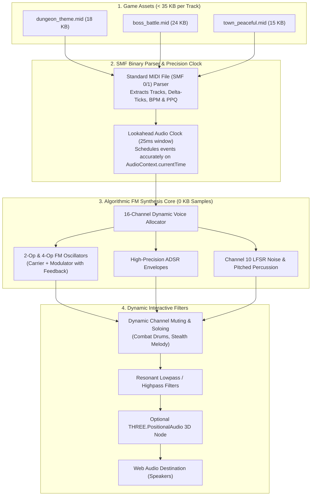

# MidiSynthPlayer — Algorithmic FM & Chiptune MIDI Soundtrack Engine for GDevelop

**MidiSynthPlayer** is a lightweight, zero-sample procedural music synthesizer and `.mid` soundtrack engine for **GDevelop 5 (Web Audio API & Three.js backend)**.

Instead of bundling dozens of multi-megabyte `.mp3` or `.ogg` audio files that bloat your game download (30 MB–100 MB), **MidiSynthPlayer** plays standard `.mid` music files (15 KB–35 KB each) using **100% mathematical frequency modulation (FM) and chiptune synthesis** directly inside the browser's native Web Audio API. 

The result is a **99% reduction in music download size**, zero loading delays, authentic retro sound aesthetics (Sega Genesis, DOS Sound Blaster OPL3, PC-98, NES), and real-time interactive music superpowers (dynamic combat stem muting, tempo changes without pitch distortion, and live transposition).

---

## 🌟 Key Highlights

- **99% Smaller Soundtracks:** An entire 15-track game OST takes **$< 350\text{ KB}$ total**, shrinking your game download from 70 MB down to a fraction of a single megabyte.
- **0 KB Audio Sample Downloads:** All 128 General MIDI instruments and 47 drum kits are generated on the fly via pure mathematical 2-operator/4-operator FM algorithms and noise generators.
- **Dynamic Interactive Stems:** Mute or unmute individual instrument channels seamlessly on beat (e.g. instantly bring in drums and heavy bass when combat begins, or mute them when sneaking).
- **Tempo Modulation Without Pitch Distortion:** Speed up music seamlessly when a timer runs low or a boss enters Phase 2 without altering the musical key or voice pitches.
- **Live Pitch Transposition:** Shift the entire song's musical key (+/- semitones) in real-time when entering alternate dimensions, underwater zones, or magical states.
- **4 Authentic Retro Chip Sound Profiles:** Switch between `OPL3_SoundBlaster` (DOS PC), `YM2612_Genesis` (Sega 16-bit), `PC98_FM` (Japanese NEC PC-98), and `NES_Chiptune` (8-bit square/triangle waves).
- **Optional 3D Spatial Audio:** Attach MIDI music emitters to 3D jukeboxes, radios, or bard characters in your 3D world with distance attenuation.

---

## 📐 The Synthesis & Playback Architecture

---

## 📊 Comparison: Standard Audio Files vs. MidiSynthPlayer

| Metric / Capability | Standard MP3 / OGG Audio | MidiSynthPlayer (Algorithmic MIDI) |
| :--- | :--- | :--- |
| **Track File Size** | $3.5\text{ MB} - 7.0\text{ MB}$ per song | **$15\text{ KB} - 35\text{ KB}$ per song (99% smaller)** |
| **15-Track OST Download** | $\sim 60\text{ MB} - 100\text{ MB}$ | **$< 350\text{ KB}$ (Instant download)** |
| **Sample Library Download** | N/A | **0 KB (Synthesized in real-time with math)** |
| **Audio Loading / Buffer Time** | 1–3 seconds per song | **0 ms (Instant start)** |
| **Interactive Combat Stems** | Requires loading multiple layered MP3s | **Instant 1-action channel muting/unmuting** |
| **Dynamic Tempo Changes** | Distorts pitch or requires heavy DSP | **Pure tempo shift with zero pitch artifacting** |
| **Live Pitch Transposition** | Requires complex pitch shifters | **Exact semitone transposition on the fly** |
| **Aesthetic Sound** | Static pre-recorded audio | **Authentic retro DOS/Genesis/Arcade FM sound** |

---

## 🚀 Quick Start Guide

1. **Add Scene Manager:** Add the **`MidiSynthPlayer`** global behavior or action to your active scene.
2. **Import `.mid` File:** Add your MIDI file (e.g. `battle_theme.mid`) to your GDevelop project resources.
3. **Play Music in Event Sheet:**
   - On scene start: `MidiSynthPlayer::PlayMidi("battle_theme.mid", loop: true, volume: 80)`
4. **Trigger Interactive Music Features:**
   - When entering combat: `MidiSynthPlayer::SetChannelMuted(channel: 9 [Drums], false)`
   - When exiting combat: `MidiSynthPlayer::SetChannelMuted(channel: 9 [Drums], true)`
   - When player is low on health: `MidiSynthPlayer::SetTempoMultiplier(1.25)`
   - When going underwater: `MidiSynthPlayer::SetLowpassCutoff(800.0)`

---

## 📚 Documentation Index

- [IMPLEMENTATION_PLAN.md](./IMPLEMENTATION_PLAN.md) — Technical architecture, SMF 0/1 binary parsing format, 2-Op/4-Op FM synthesis equations with feedback, ADSR envelope scheduling, LFSR noise drums, lookahead clock timers, and Web Audio API lifecycle.
- [API_REFERENCE.md](./API_REFERENCE.md) — Complete specification of Manager Properties, Actions, Conditions, Expressions (ACEs), 128 General MIDI instrument mapping, Channel 10 percussion tables, and Sound Chip Presets.
