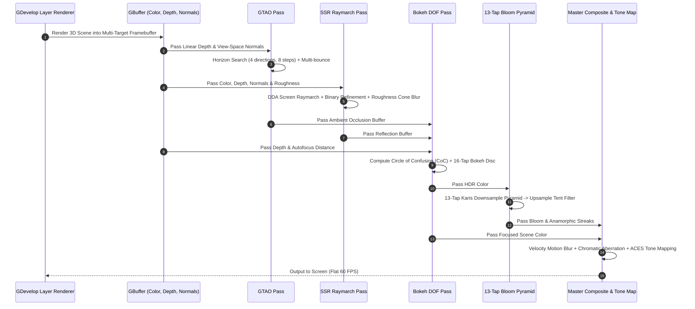
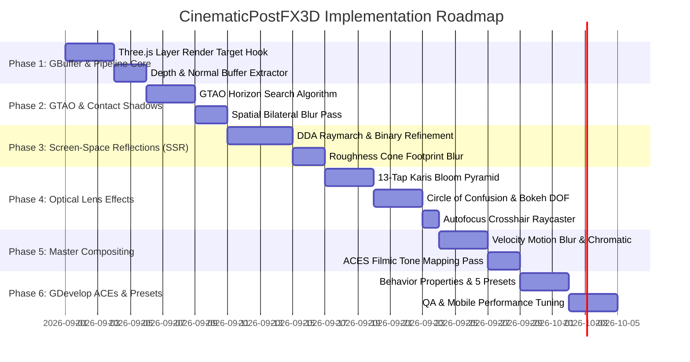

# CinematicPostFX3D — Implementation Plan

This document outlines the technical architecture, mathematical optical formulas, raymarching algorithms, WebGL2 multi-pass compositing buffers, and implementation roadmap for **CinematicPostFX3D**.

---

## 1. System Architecture & Lifecycle

`CinematicPostFX3D` intercepts GDevelop's 3D rendering pipeline using a consolidated, buffer-sharing multi-pass compositing engine:



---

## 2. Mathematical Formulations & Algorithms

### A. Ground Truth Ambient Occlusion (GTAO)
Based on Jimenez et al. (2016). Integrates the hemisphere horizon visibility over $N_{\text{dir}} = 4$ screen directions:

$$\text{AO} = \frac{1}{\pi} \int_{\Omega} V(\vec{\omega}) (\vec{n} \cdot \vec{\omega}) \, d\omega$$

For each directional angle $\phi \in [0, \pi)$:
1. Search along the 2D projected line for maximum elevation horizon angles $(\theta_1, \theta_2)$ from center depth.
2. Project surface normal $\vec{n}$ onto the slice plane to find normal angle $\gamma$.
3. Compute inner visibility integral:
   $$\text{Vis}(\phi) = \frac{1}{4} \left( (\sin(2\theta_1 - \gamma) + \sin\gamma) + (\sin(2\theta_2 - \gamma) + \sin\gamma) \right)$$
4. **Multi-Bounce Ambient Color Approximation:**
   $$\text{AO}_{\text{multi}} = \text{AO} \cdot \frac{1.0 - \text{Albedo}}{1.0 - \text{Albedo} \cdot \text{AO}}$$
   Prevents dark crevices from losing rich colored bounce light.

---

### B. Screen-Space Reflections (SSR)
For a pixel with view position $\vec{P}$ and surface normal $\vec{N}$:

1. Calculate reflection ray in view space:
   $$\vec{R} = \text{reflect}(\text{normalize}(\vec{P}), \vec{N})$$
2. **DDA Raymarch in Screen Space:**
   $$\vec{P}_{\text{step}} = \frac{\text{Project}(\vec{P} + \vec{R}) - \text{Project}(\vec{P})}{\text{MaxSteps}}, \quad \text{Steps} = 32$$
3. When the ray penetrates the depth buffer ($\Delta Z = Z_{\text{ray}} - Z_{\text{buffer}} > 0$):
   - Perform a 4-step **Binary Search** along the intersection segment to locate the exact surface boundary with sub-pixel precision.
4. **Roughness Cone Footprint Blur:**
   Rough surfaces widen the specular sampling cone radius:
   $$\text{BlurRadius} = \text{Roughness}^2 \cdot \text{RayDistance} \cdot \text{MaxBlur}$$
5. Smoothly fade out reflections at screen edges:
   $$\text{Fade} = \text{clamp}(1.0 - 2.0 \cdot \|\text{UV} - 0.5\|, 0.0, 1.0)$$

---

### C. Optical Bokeh Depth of Field (Circle of Confusion)
Calculates the physical Circle of Confusion ($CoC$) diameter on the camera sensor:

$$\text{CoC}(z) = \text{clamp}\left( \frac{|z - z_{\text{focus}}|}{z} \cdot \frac{f^2}{N_{\text{aperture}}(z_{\text{focus}} - f)}, -R_{\text{max}}, R_{\text{max}} \right)$$

Where:
* $f = \text{FocalLength}$ (e.g. $50\text{mm}$).
* $N_{\text{aperture}} = f\text{-stop}$ (e.g. $f/1.8$).
* $z_{\text{focus}}$ is dynamically driven by an **Autofocus Raycaster** hitting the center crosshair in the 3D scene.
* **Bokeh Disc Accumulation:** 16 Poisson/Golden-angle spiral taps weighted by $CoC(z)$.

---

### D. 13-Tap Progressive Karis HDR Bloom
To eliminate fireflies and flickering on high-intensity specular highlights, downsampling uses Brian Karis's 13-tap weighted box filter:

```
  d   e   f
    a   b
  g   c   h
    i   j
  k   l   m
```

$$\text{DownsampleColor} = \frac{1}{4} \text{Box}_{abij} + \frac{1}{8} \text{Box}_{dega} + \frac{1}{8} \text{Box}_{efbh} + \frac{1}{8} \text{Box}_{gikl} + \frac{1}{8} \text{Box}_{hjlm}$$

Each sub-box is weighted by partial luminance to suppress single-pixel fireflies:
$$w_{\text{box}} = \frac{1.0}{1.0 + \text{Luma}(\text{Color})}$$

**Anamorphic Lens Streaks:** Stretches the highest mip levels horizontally ($4\times$ aspect) with a blue chromatic tint for cinema flare streaks.

---

### E. Per-Pixel Velocity Motion Blur
Reads the previous frame's transformation matrix to reconstruct pixel velocity:

$$\vec{V}_{\text{pixel}} = \text{Project}\left(\mathbf{M}_{\text{curr}} \cdot \vec{P}\right) - \text{Project}\left(\mathbf{M}_{\text{prev}} \cdot \vec{P}\right)$$

Accumulates 8 samples along velocity direction $\vec{V}_{\text{pixel}}$ with depth-aware foreground dilation.

---

### F. ACES Filmic Tone Mapping
Maps high-dynamic-range (HDR) radiance values cleanly into $[0.0, 1.0]$ display space:

$$\text{ACES}(x) = \frac{x(2.51x + 0.03)}{x(2.43x + 0.59) + 0.14}$$

---

## 3. WebGL2 Multi-Pass Framebuffer Architecture

```
1. GBuffer Multi-Render-Target (MRT)
   Target 0: RGBA16F (HDR Scene Color)
   Target 1: RGBA16F (View Normals .xyz + Roughness .w)
   Target 2: DepthTexture (Float32 Linear Depth)

2. GTAO Buffer (R8, Half Resolution: 960 x 540)
   Single-channel ambient occlusion factor.

3. SSR Buffer (RGBA16F, Half/Full Resolution)
   Raymarched reflection color with alpha hit mask.

4. Bloom Downsample Pyramid (RGBA16F, 5 Mip Levels: 1/2 -> 1/4 -> 1/8 -> 1/16 -> 1/32)
   Upsampled with 9-tap tent filter.

5. Final Master Composite Pass (RGBA8, Canvas Output)
   Blends Color * GTAO + SSR + Bloom + DOF + Motion Blur + ACES Tone Mapping.
```

---

## 4. Implementation Phases



---

## 5. Performance Budgets & Target Metrics

| Pass / Subsystem | Resolution | GPU Time Budget | Memory Footprint |
| :--- | :---: | :---: | :---: |
| **GBuffer Capture** | Full ($1080\text{p}$) | $0.2\text{ ms}$ | Shared Scene Target |
| **GTAO Horizon Pass** | Half ($540\text{p}$) | $< 0.45\text{ ms}$ | $1.0\text{ MB}$ |
| **SSR Reflection Raymarch** | Half ($540\text{p}$) | $< 0.65\text{ ms}$ | $4.0\text{ MB}$ |
| **13-Tap Karis Bloom Pyramid** | Downsample Mips | $< 0.35\text{ ms}$ | $2.5\text{ MB}$ |
| **Bokeh DOF Pass** | Full ($1080\text{p}$) | $< 0.40\text{ ms}$ | $4.0\text{ MB}$ |
| **Master Composite & ACES** | Full ($1080\text{p}$) | $< 0.15\text{ ms}$ | Canvas Output |
| **Total Pipeline Overhead** | | **$< 2.0\text{ ms}$** | **$< 12\text{ MB}$ VRAM (Rock-Solid 60 FPS)** |
