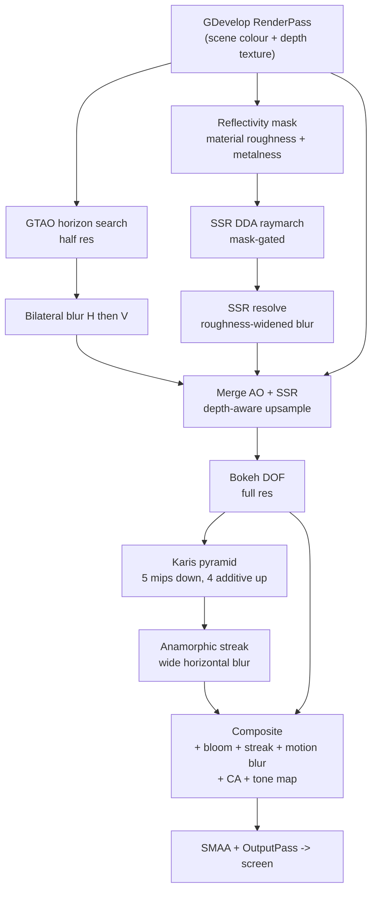

# CinematicPostFX3D — Post-Processing, SSR, GTAO & Optics for GDevelop 5

**CinematicPostFX3D** is a consolidated post-processing pipeline for **GDevelop 5 3D layers** (Three.js r160 / WebGL2). It attaches a single pass to the layer's `EffectComposer` and runs screen-space reflections, ambient occlusion, HDR bloom, bokeh depth of field, motion blur and tone mapping from one shared set of buffers.

---

## The thing that makes it work

GDevelop builds each 3D layer's composer as `new EffectComposer(renderer)`. Three's default render targets carry a depth **renderbuffer**, not a depth **texture** — so nothing downstream can sample depth. Any post-processing effect that needs depth reads `0.0` for every pixel and silently produces nothing (or, in the case of depth of field, blurs the entire screen evenly).

CinematicPostFX3D rebuilds both of the composer's ping-pong render targets with a real `DepthTexture` attached. That is what lets GTAO, SSR, DOF and motion blur do anything at all. If the attachment fails, the extension says so in the console and skips those passes rather than rendering garbage — check it at runtime with the **Depth buffer is available** condition, or switch on the **Log Diagnostics** property.

---

## Units: GDevelop world units, not metres

Every world-space setting — GTAO radius, SSR max distance, focus distance — is in **GDevelop world units**.

A default 3D layer places the camera at `0.5 × layerHeight / tan(fov / 2)`. For a 600px-tall game at 45°, that is about **724 units** from the `z = 0` plane, and objects are typically 50–200 units across. Settings that would be sensible in a metric engine (a 1.2-unit AO radius, a 4-unit focus distance) are effectively zero here.

Sensible starting points:

| Setting | Default | Typical range |
| :--- | ---: | :--- |
| GTAO Radius | 50 | 20 – 150 |
| SSR Max Distance | 400 | 150 – 800 |
| Manual Focus Distance | 700 | wherever your subject is |

The aperture and bokeh radius are scale-free: defocus is measured *relative* to the focus distance, so `f/2.8` looks the same whether your scene is 5 units deep or 5000.

---

## What each pass does

| Pass | Needs depth | Notes |
| :--- | :---: | :--- |
| **Ground Truth Ambient Occlusion** | yes | 4 slices × 6 steps of horizon search, the Jimenez arc integral, and a polynomial multi-bounce fit so coloured crevices keep their bounce light. Reduced resolution with a separable bilateral blur on both axes, upsampled depth-aware. |
| **Screen-Space Reflections** | yes | DDA screen-space raymarch with 4-step binary refinement, Schlick Fresnel weighting, and distance + screen-edge fade. Gated by a per-pixel reflectivity mask so only smooth or metallic surfaces reflect, then resolved with a blur that widens on rough surfaces. Reduced resolution. |
| **13-Tap Karis HDR Bloom** | no | Half-res pyramid, 5 mips, anti-firefly luma weighting on the first mip, progressive upsample that **adds** each matching mip back in. Optional anamorphic streaks via a dedicated wide horizontal blur pass, with a colour tint. |
| **Bokeh Depth of Field** | yes | 16-tap golden-angle spiral, dimensionless Circle of Confusion, optional centre-screen autofocus raycast with eased focus pulls. |
| **Motion Blur** | yes | Camera velocity reconstructed from depth and the previous frame's view-projection matrix. 6 samples. |
| **Chromatic Aberration** | no | Radial R/B split. |
| **Tone Mapping** | no | ACES Filmic, Reinhard, Cineon or Linear. Runs before GDevelop's `OutputPass`, which handles the sRGB conversion. |

**Reflections are gated by material.** Before raymarching, the pipeline renders the layer's 3D group once with every material swapped for a flat value encoding its reflectivity, derived from `roughness` and `metalness`. SSR then multiplies by that mask and skips masked-out pixels entirely — which also makes it cheaper, since most of a typical screen is rough dielectric.

GDevelop's default 3D material is fully rough (`roughness 1`, `metalness 0`) and therefore **does not reflect**. Make a surface reflective by lowering its roughness or raising its metalness — the `Material3D` extension in this repo is one way — or set `mesh.userData.ssrReflectivity` directly (and `userData.ssrRoughness` to control how sharp the reflection is). Setting **SSR Reflective Surfaces** to `Everything` restores the old mirror-the-whole-world behaviour, which is almost never what you want: it puts a partial mirror on floors, terrain and walls.

**AO and reflections render at reduced resolution** (see `EffectQuality`) and are upsampled with four depth-weighted taps rather than plain bilinear — straight bilinear bleeds them across silhouettes, which reads as a halo around every object. They are folded into the colour buffer *before* Depth of Field, so a reflection defocuses along with the surface it sits on instead of staying razor sharp on a blurred background.

**Normals are reconstructed from depth**, using a best-of-four-neighbours pick so silhouettes don't smear. Good enough for AO and reflections; it is not a substitute for a real normal buffer.

---

## Pipeline



---

## Presets

Set the **Preset Profile** property and it is applied once when the behavior is created, overwriting the properties below it. Leave it on **`Custom`** to use your own values. The **Apply cinematic preset** action does the same thing at runtime.

| Preset | SSR | GTAO | Bloom | Flares | DOF | Motion Blur |
| :--- | :---: | :---: | :---: | :---: | :--- | :---: |
| **`CyberpunkNeon`** | 0.9 | 1.0 | 1.5 | 0.6 blue | on, autofocus, f/5.6 | 0.3 |
| **`CinematicMovie`** | 0.4 | 1.2 | 0.8 | 0.2 | on, autofocus, f/2.4 | 0.5 |
| **`HorrorGrim`** | off | 1.8 | 0.3 | off | on, fixed at 320 units, f/1.8 | 0.2 |
| **`CleanRealistic`** | 0.6 | 1.0 | 0.6 | off | off | 0.2 |
| **`PerformanceLite`** | off | off | 0.5 | off | off | off |

---

## Quick start

1. Add the **Cinematic Post-Processing 3D** behavior to any object on (or associated with) your 3D layer.
2. Set **Target Layer** to the name of your 3D layer, or leave it empty for the base layer. The layer must be rendering in 3D.
3. Pick a **Preset Profile**, or leave it on `Custom` and switch on the effects you want.
4. If nothing seems to happen, tick **Log Diagnostics** and check the browser console.

In the event sheet:

- `CinematicPostFX3D::SetDOFEnabled(true)` and `SetAutofocus(true)` for a cutscene rack focus
- `SetSSREnabled(true)` and `SetSSRIntensity(0.85)` for wet streets
- `SetBloomIntensity(2.0)` on an explosion

---

## Limits & caveats

- **One instance drives the pipeline.** The compositor is per-renderer, so adding the behavior to a second object logs a warning and the extra instances stand down.
- **One layer at a time.** The pass attaches to a single layer's composer.
- **Reflections need reflective materials.** Nothing reflects out of the box, by design — see the SSR note above. The mask costs one extra scene render whenever SSR is on.
- **No real normal buffer.** Normals are still reconstructed from depth, so SSR and GTAO are noisier on thin silhouettes than a true G-buffer would be.
- **Depth precision.** GDevelop's default camera is `near = 0.1`, `far = 2000`. That is a 20,000:1 ratio, which crowds depth precision near the far plane. If AO or SSR look noisy on distant geometry, raise the layer's near plane.
- **Buffers are allocated on demand.** Nothing is created for an effect that is switched off, so a bloom-only setup costs about 10 MB of render targets at 1080p rather than 62. Turning an effect on mid-game allocates its buffers at that moment.
- **Cost is not free.** Use the **Effect Buffer Quality** property (`Full` / `Half` / `Quarter`) to trade AO and reflection sharpness against fill rate; `PerformanceLite` uses `Quarter`. DOF, bloom and the composite are always full resolution. No frame-time figures are quoted here because none have been measured on your content.

---

## Development

```bash
node build-extension.mjs
```

Regenerates `CinematicPostFX3D.json` from `CinematicPostFX3D.runtime.js` plus the declarations in the build script. The build refuses to write if any JS block fails to parse, if the GLSL fails its static checks, if the runtime is embedded more or less than once, or if a behavior property has no matching getter in the runtime's `PROPERTY_MAP`.

```bash
node test-runtime.mjs
```

Runs the pipeline against a Three.js mock that models render-target dispose semantics and composer ping-pong, and asserts on which passes run and what uniforms they receive.

```bash
node check-shaders.mjs
```

Static GLSL checks on their own: balanced delimiters, no undeclared `u*`/`t*` identifiers, and no uniform that is uploaded every frame but never read by the shader.

---

## Documentation

- [CHANGELOG.md](./CHANGELOG.md) — what changed in each version, and how to migrate from 1.0.
- [IMPLEMENTATION_PLAN.md](./IMPLEMENTATION_PLAN.md) — architecture, the depth-attachment mechanism, and the maths behind each pass.
- [API_REFERENCE.md](./API_REFERENCE.md) — every property, action, condition and expression.
