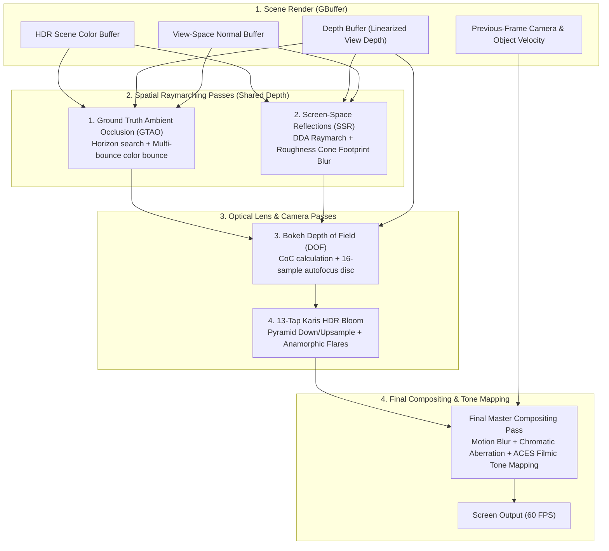
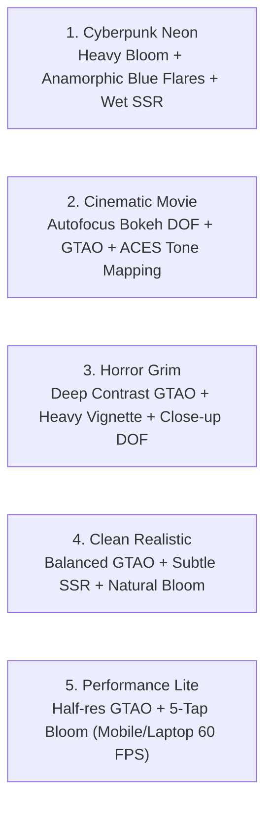

# CinematicPostFX3D — All-in-One AAA Post-Processing, SSR, GTAO & Optics Suite for GDevelop

**CinematicPostFX3D** is a unified, high-performance post-processing and optical rendering engine for **GDevelop 5 (Three.js WebGL2 backend)**.

Instead of chaining separate, unoptimized post-processing passes that drop frames, **CinematicPostFX3D** integrates **Screen-Space Reflections (SSR)**, **Ground Truth Ambient Occlusion (GTAO)**, **Physically Based 13-Tap Karis Bloom**, **Cinematic Bokeh Depth of Field (DOF)**, and **Per-Pixel Velocity Motion Blur** into a single, cohesive, buffer-sharing compositing pipeline.

---

## 🌟 Key Highlights

- **All-in-One Consolidated Pipeline:** Replaces 5 separate post-process plugins with a single, highly optimized multi-pass compositing engine ($< 2.0\text{ ms}$ total frame overhead).
- **Screen-Space Reflections (SSR):** Real-time raymarched reflections of live characters, dynamic lights, and particle explosions on wet streets, puddles, polished marble, and metals.
- **Ground Truth Ambient Occlusion (GTAO):** Fast horizon-based multi-bounce contact shadowing in wall seams, floor cracks, and clothing folds without dark muddy halos.
- **13-Tap Progressive Karis Bloom & Anamorphic Flares:** Cinema-grade HDR bloom with anti-firefly luma weighting, anamorphic horizontal streak flares, and chromatic aberration.
- **Physical Bokeh Depth of Field (DOF):** True optical Circle of Confusion (CoC) blur with dynamic autofocus raycasting on crosshairs or targets.
- **Per-Pixel Velocity Motion Blur:** Camera and object velocity vector accumulation delivering cinematic motion smoothness.
- **5 One-Click Genre Presets:** `CyberpunkNeon`, `CinematicMovie`, `HorrorGrim`, `CleanRealistic`, and `PerformanceLite`.
- **Zero Conflict with `3DCRT+`:** Runs cleanly as Layer 1 (3D optical realism) before vintage CRT display emulation.

---

## 📐 The Consolidated Post-Processing Pipeline

---

## 📊 Comparison: Standard Post-Processing vs. CinematicPostFX3D

| Metric / Capability | Standard Chains / Separate Plugins | CinematicPostFX3D (Consolidated) |
| :--- | :--- | :--- |
| **Render Passes** | 6–8 independent fullscreen passes | **Unified buffer-sharing pipeline** |
| **Frame Overhead** | 6–12 ms (Severe frame drops) | **$< 2.0\text{ ms}$ (Rock-solid 60 FPS)** |
| **Real-Time Reflections** | None (Static cubemaps only) | **Screen-Space Reflections (SSR) with roughness blur** |
| **Ambient Occlusion** | Noisy SSAO with black halos | **Ground Truth AO (GTAO) with multi-bounce color** |
| **HDR Bloom Quality** | Washed-out white haze with fireflies | **13-Tap Karis Bloom + Anamorphic horizontal flares** |
| **Depth of Field** | Simple distance blur | **Optical Bokeh Circle of Confusion + Crosshair Autofocus** |
| **Motion Blur** | Fullscreen camera smear only | **Per-pixel object & camera velocity vectors** |
| **Preset Tuning** | Dozens of disconnected sliders | **5 One-Click Presets + Master Quality Multipliers** |

---

## 5 One-Click Genre Presets

| Preset | SSR | GTAO | Bloom | Bokeh DOF | Motion Blur | Anamorphic Flares |
| :--- | :---: | :---: | :---: | :---: | :---: | :---: |
| **`CyberpunkNeon`** | Heavy (0.9) | Standard | Intense (1.5) | Subtle | 0.3 | Blue Streaks |
| **`CinematicMovie`**| Subtle (0.3) | Strong | Natural (0.8) | Active Autofocus | 0.5 | Subtle |
| **`HorrorGrim`** | Off | Deep (1.8) | Muted (0.3) | Close Macro | 0.2 | Off |
| **`CleanRealistic`**| Balanced (0.6)| Balanced (1.0)| Crisp (0.6) | Off / Manual | 0.2 | Off |
| **`PerformanceLite`**| Off | Half-Res (0.6)| Fast (0.5) | Off | Off | Off |

---

## 🚀 Quick Start Guide

1. **Add Behavior:** Add the **`CinematicPostFX3D`** behavior to your 3D Camera or active 3D Layer.
2. **Select Preset:** Choose a preset (e.g. `CinematicMovie` or `CyberpunkNeon`) in the properties panel.
3. **Trigger In Event Sheet:**
   - On cutscene start: `CinematicPostFX3D::SetDOFFocusDistance(3.5)` or `CinematicPostFX3D::SetAutofocus(true)`
   - On rainy streets: `CinematicPostFX3D::SetSSREnabled(true)` and `CinematicPostFX3D::SetSSRIntensity(0.85)`
   - On explosion / laser fire: `CinematicPostFX3D::SetBloomIntensity(2.0)`

---

## 📚 Documentation Index

- [IMPLEMENTATION_PLAN.md](./IMPLEMENTATION_PLAN.md) — Technical architecture, mathematical formulations (GTAO horizon search, SSR DDA depth raymarching, Circle of Confusion optical equations, 13-tap Karis filter, velocity vectors), WebGL2 compositing buffers, and phased roadmap.
- [API_REFERENCE.md](./API_REFERENCE.md) — Complete specification of Properties, Actions, Conditions, Expressions (ACEs), and Preset definitions.
