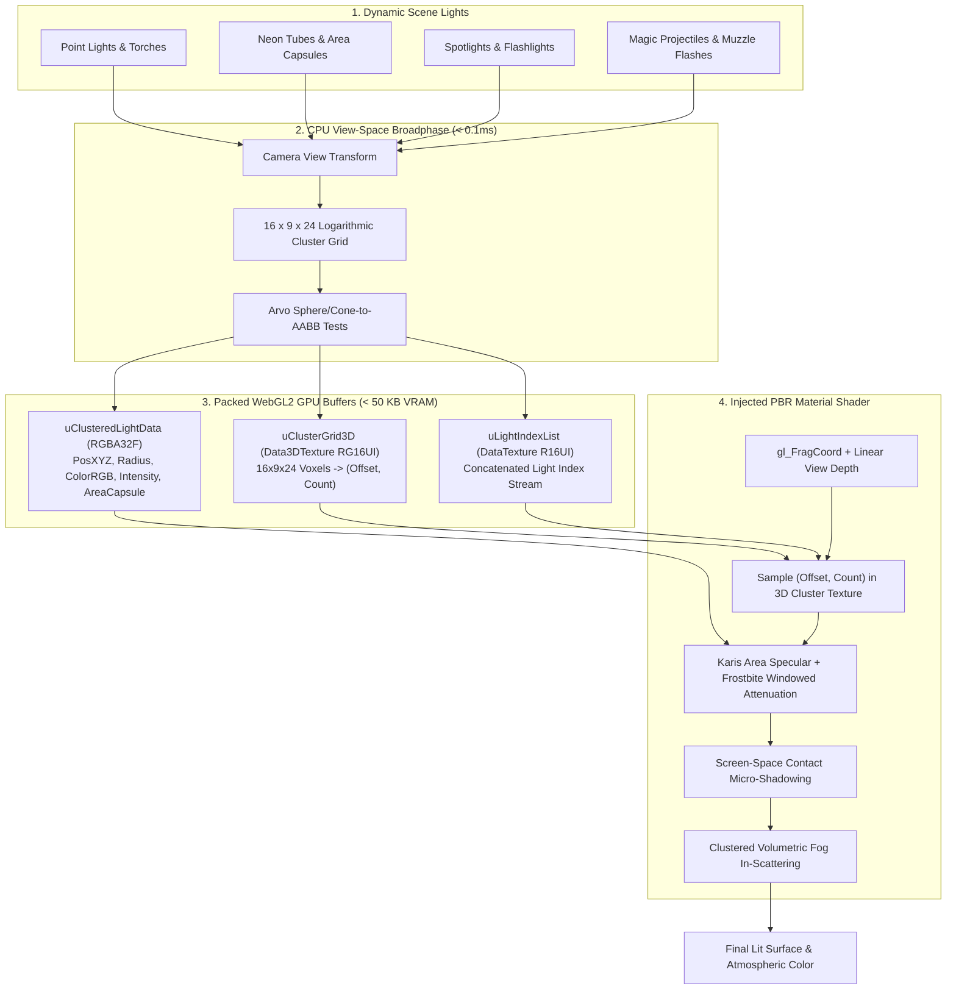

# ClusteredLightManager3D — High-Fidelity Clustered Forward Dynamic Multi-Lighting for GDevelop

**ClusteredLightManager3D** is a next-generation dynamic lighting architecture and material pipeline for **GDevelop 5 (Three.js WebGL2 backend)**.

By partitioning the camera view frustum into a 3D grid of **3,456 spatial clusters** ($16 \times 9 \times 24$ depth slices), it enables scenes to feature **100 to 500+ active dynamic lights** (torches, streetlamps, campfires, neon signs, magic spells, muzzle flashes) with zero shader recompilations, flat 60 FPS performance, and cinema-grade visual fidelity (Karis area light specular reflections, volumetric fog shafts, blackbody Kelvin color temperatures, IES photometric profiles, and screen-space contact micro-shadows).

---

## 🌟 Key Highlights

- **Scale to 500+ Dynamic Lights:** Flat $O(1)$ constant-time pixel evaluation by testing only the 1–3 lights in each pixel's 3D cluster bin.
- **Zero Shader Recompilation Stutter:** Light data is streamed dynamically through WebGL2 DataTextures and 3D textures (`sampler3D`), eliminating all runtime shader recompilations when lights spawn, move, or extinguish.
- **Physically Based Area Lights (Karis Model):** Replaces artificial pinpoint specular reflections with realistic broad reflections for glowing embers, light bulbs, and neon tube/capsule lights.
- **Clustered Volumetric Atmospheric Fog:** Real-time volumetric light cones, god rays, and glowing dust hazes evaluated directly within the 3D cluster depth slices with zero extra raymarching passes.
- **Screen-Space Contact Micro-Shadows (SSCS):** Traces high-speed depth buffer rays to ground characters, table legs, pebbles, and wall trims with razor-sharp micro-shadows from all nearby lights.
- **Blackbody Radiation Color Temperature:** Set authentic physical lighting in Kelvin (1,800K candle flames to 8,500K moonlight).
- **IES Photometric Profiles:** Real-world architectural light distributions (wall sconces, streetlamps, spotlights, downlights).
- **Hybrid Co-Existence Pipeline:** Seamlessly adds to GDevelop's native Sun, skybox, ambient light, and [LightProbeGrid3D](./../LightProbeGrid3D) indirect bounce GI without breaking changes.

---

## 📐 The Clustered Lighting Pipeline

---

## 📊 Comparison: Standard GDevelop Lighting vs. ClusteredLightManager3D

| Metric / Capability | Standard GDevelop 3D Lighting | ClusteredLightManager3D |
| :--- | :--- | :--- |
| **Max Dynamic Lights** | 8–12 point lights | **200–500+ active lights** |
| **Frame Rate with 100 Lights** | 5–12 FPS (Severe lag) | **60 FPS (Rock solid)** |
| **Shader Hitching on Spawn** | Recompiles shader per light count change | **Zero recompilations (Streamed via textures)** |
| **Specular Reflections** | Pinpoint plastic white dots | **Realistic Area Lights (Karis Tube & Sphere)** |
| **Atmospheric Fog** | Flat distance fog | **Volumetric God Rays & Glowing Light Cones** |
| **Micro-Shadows** | None (Light leaks through geometry) | **Screen-Space Contact Shadows (SSCS)** |
| **Light Color Modeling** | Manual RGB hex codes | **Kelvin Blackbody Temperature (1,800K–8,500K)** |
| **Light Profiles** | Uniform spheres only | **IES Photometric Lobes (Sconces, Downlights)** |
| **GPU VRAM Overhead** | Low | **< 60 KB (Virtually zero)** |

---

## 🚀 Quick Start Guide

1. **Add Scene Manager:** Add the **`ClusteredLightManager3D`** global behavior or action to your active scene or layer.
2. **Add Light Behavior:** Add the **`ClusteredLight3D`** behavior to any 3D object (torches, lampposts, projectiles, or empty light anchors).
3. **Customize Properties:**
   - Set **Light Type:** `Point`, `Spot`, or `AreaCapsule`.
   - Set **Color Temperature:** e.g. `2200K` for warm torch fire or `5500K` for cool halogen.
   - Set **Attenuation Radius:** e.g. `12.0` meters.
   - Enable **Procedural Flicker:** Select `FireFlicker` for dynamic organic flame modulation.
4. **Trigger In Event Sheet:**
   - On spell cast: `ClusteredLight3D::SetIntensity(3.5)` and `ClusteredLight3D::SetRadius(25.0)`
   - On shooting: `ClusteredLight3D::TriggerMuzzleFlash(duration: 0.05)`
   - Atmosphere settings: `ClusteredLightManager3D::SetVolumetricFogDensity(0.04)`

---

## 📚 Documentation Index

- [IMPLEMENTATION_PLAN.md](./IMPLEMENTATION_PLAN.md) — Technical architecture, mathematical formulations (logarithmic depth slicing, Arvo distance metrics, Karis representative point area specular, Frostbite windowed attenuation, volumetric scattering integrals), WebGL2 texture packing, and implementation phases.
- [API_REFERENCE.md](./API_REFERENCE.md) — Complete specification of Manager and Object Properties, Actions, Conditions, Expressions, Presets, and Color Temperature constants.
