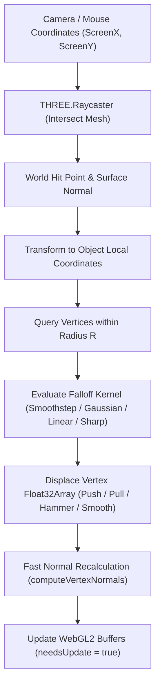

# DeformableIngot3D — Procedural Dynamic 3D Ingot & Mesh Deformation Engine

**DeformableIngot3D** is a high-performance procedural 3D Object extension for **GDevelop 5 (Three.js WebGL2 backend)** that allows 3D meshes to be **dynamically remeshed on the fly** and deformed in real time using **Camera-based Raycasting**.

---

## 🌟 Key Features

- **Procedural Dynamic 3D Object:** Generates a parametrically subdivided 3D box / billet directly inside WebGL2, removing the need for external 3D modeling software for tests or deformable props.
- **Camera-Based Raycast Vertex Detection:** Casts rays from the 3D camera through screen / mouse coordinates to determine exact surface hit coordinates, surface normals, and distance.
- **On-The-Fly Dynamic Remeshing:** Change $X, Y, Z$ subdivision resolution at runtime ($2\times 2\times 2 \leftrightarrow 48\times 48\times 48$). Supports retaining and interpolating surface deformation onto the new topology.
- **Real-Time Vertex Deformation:**
  - **Push / Depress:** Pushes surface vertices down / inward along local normal.
  - **Pull / Elevate:** Pulls surface vertices up / outward along local normal.
  - **Volume-Preserving Hammer Strike:** Compresses along strike vector while squishing metal outward laterally to simulate plastic blacksmith forging.
  - **Laplacian Smoothing:** Relaxes creases and wrinkles across neighboring vertices.
  - **Flatten Plane:** Projects vertices towards the contact strike plane.
- **Dynamic Normal Solver:** Fast localized normal recalculations ensuring specular highlights and lighting react smoothly to surface changes.
- **Thermal Simulation:** Tracks metal temperature ($20^\circ\text{C} - 1150^\circ\text{C}$) with forge heating and water trough quenching.
- **Playable Forging:** Camera-center strikes use face radius and impact velocity; cold or work-hardened metal resists movement while hot metal flows laterally against an anvil constraint.
- **Breakable Workpieces:** Split the surface along a local plane to create a second render mesh fragment.
- **Tool Assembly:** Parent handles, guards, heads, and other 3D objects to the forged part, then animate the combined prop with mathematical pose tweens.

---

## 📐 Deformation & Raycasting Pipeline

---

## 🚀 Quick Start Guide

1. **Add Object:** Add a **`3D Deformable Ingot / Mesh`** (`DeformableIngot3D`) to your scene.
2. **Deform on Click (In Event Sheet):**
   * **Condition:** `Mouse button is down (Left)`
   * **Action:** `Deform DeformableIngot3D at screen pointer (MouseX(), MouseY(), "", "HammerBlow", 24, 6, "Smoothstep")`
3. **Pull Vertices on Shift-Click:**
   * **Condition:** `Shift key is pressed` + `Mouse button is down (Left)`
   * **Action:** `Deform DeformableIngot3D at screen pointer (MouseX(), MouseY(), "", "Pull", 24, 6, "Smoothstep")`
4. **Remesh on the Fly:**
   * **Action:** `Remesh DeformableIngot3D with subdivisions (24, 12, 12) (Preserve deformation: true)`
5. **Reset Ingot:**
   * **Action:** `Reset DeformableIngot3D to original un-deformed ingot shape`

## Playable blacksmithing loop

1. Call **Heat mesh region** while the billet overlaps the forge and **Advance heat simulation** every frame.
2. Animate a separate visual hammer prop toward the workpiece.
3. At contact, call **Forge from camera center**. Offset X/Y moves the strike away from the crosshair without coupling deformation to the hammer mesh.
4. Read **Last strike efficiency** to drive sound, sparks, recoil, and player feedback.
5. Use **Break mesh along plane** for a fracture or cut. This MVP partitions triangles into a second uncapped render mesh.
6. Use **Combine part into tool or prop** to attach a handle or other component.
7. Start and advance a **pose tween** for code-driven swings, inspection turns, placement, and pickup motion.
