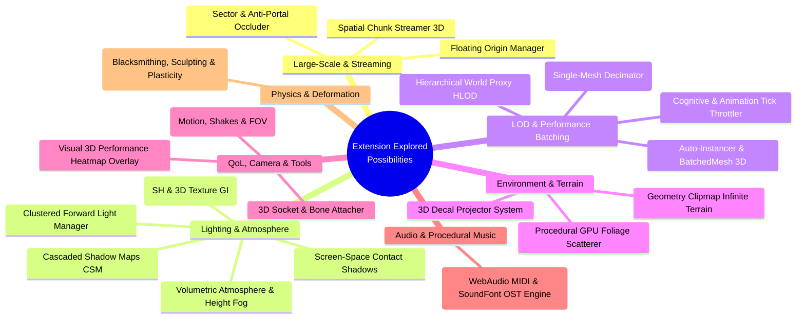

# Extension Explored Possibilities List

A structured architectural blueprint and concept index of high-impact extension ideas designed to scale 3D performance, open-world streaming, advanced atmospheric lighting, and developer workflows in GDevelop.

---

---

## 📂 Active Planned & Formulated Extension Folders

| Extension Folder | Primary Focus | Status | Documentation Links |
| :--- | :--- | :---: | :--- |
| 📁 **[`LightProbeGrid3D/`](./LightProbeGrid3D)** | WebGL2 3D Texture Irradiance Volumes & Spherical Harmonics Indirect GI | Complete Blueprint | [README](./LightProbeGrid3D/README.md) · [Plan](./LightProbeGrid3D/IMPLEMENTATION_PLAN.md) · [API](./LightProbeGrid3D/API_REFERENCE.md) |
| 📁 **[`AutoMeshLOD3D/`](./AutoMeshLOD3D)** | Single-Model QEM Decimation in Web Workers & Shared Vertex Index Swapping | Complete Blueprint | [README](./AutoMeshLOD3D/README.md) · [Plan](./AutoMeshLOD3D/IMPLEMENTATION_PLAN.md) · [API](./AutoMeshLOD3D/API_REFERENCE.md) |
| 📁 **[`CameraTweens3d/`](./CameraTweens3d)** | 8-Module Procedural Motion, Shakes, Spring-Dampers & 4 Genre Presets | Implemented | [README](./CameraTweens3d/README.md) · [Plan](./CameraTweens3d/IMPLEMENTATION_PLAN.md) · [API](./CameraTweens3d/API_REFERENCE.md) |
| 📁 **[`CascadedShadowMaps3D/`](./CascadedShadowMaps3D)** | 3–4 Depth Cascades, Texel Snapping, 16-Tap Poisson PCF & Contact Shadows | Complete Blueprint | [README](./CascadedShadowMaps3D/README.md) · [Plan](./CascadedShadowMaps3D/IMPLEMENTATION_PLAN.md) · [API](./CascadedShadowMaps3D/API_REFERENCE.md) |
| 📁 **[`ClusteredLightManager3D/`](./ClusteredLightManager3D)** | 16x9x24 Frustum Clustered Multi-Lights (500+ Lights, Karis Area Specular, Volumetric Fog, SSCS) | Complete Blueprint | [README](./ClusteredLightManager3D/README.md) · [Plan](./ClusteredLightManager3D/IMPLEMENTATION_PLAN.md) · [API](./ClusteredLightManager3D/API_REFERENCE.md) |
| 📁 **[`ExternalSkeletalAnimator3D/`](./ExternalSkeletalAnimator3D)** | Multi-Clip External GLB Animation Player, Bone Sockets & Jolt Ragdoll Physics | Implemented / Active | [README](./ExternalSkeletalAnimator3D/README.md) · [Plan](./ExternalSkeletalAnimator3D/PLAN.md) |
| 📁 **[`Material3D/`](./Material3D)** | Universal PBR & BRDF Material Engine + v3.5 FX (POM 3D Relief, SSS Skin, Triplanar, Wetness) | Implemented / Active Plan | [README](./Material3D/README.md) · [v3.5 Plan](./Material3D/ADVANCED_MATERIAL_ENHANCEMENT_PLAN.md) |
| 📁 **[`MeshDeformation3D/`](./MeshDeformation3D)** | Real-Time Vertex Sculpting, Thermal Blacksmithing, Volume Metal Flow & Chiseling | Complete Blueprint | [README](./MeshDeformation3D/README.md) · [Plan](./MeshDeformation3D/IMPLEMENTATION_PLAN.md) · [API](./MeshDeformation3D/API_REFERENCE.md) |
| 📁 **[`MidiSynthPlayer/`](./MidiSynthPlayer)** | WebAudio Algorithmic FM/Chiptune MIDI OST Engine (0 KB Samples, 99% Size Reduction) | Complete Blueprint | [README](./MidiSynthPlayer/README.md) · [Plan](./MidiSynthPlayer/IMPLEMENTATION_PLAN.md) · [API](./MidiSynthPlayer/API_REFERENCE.md) |

---

## 1. Large-Scale Open World & Streaming Extensions

### 1.1 `SpatialChunkStreamer3D` (World Partition Manager)
* **Type:** Global Scene Manager / Behavior
* **Purpose:** Enables massive maps (kilometers wide) by partitioning the world into 3D grid cells and loading/unloading assets based on camera proximity.
* **Key Features:**
  - Configurable active radius (e.g. Inner Active 0–50m, Middle Proxy 50–150m, Distant Cached >150m).
  - **Delta-State Memory:** Caches player modifications (killed enemies, opened chests, harvested resources, destroyed props) in a lightweight JSON state table so modifications persist when chunks reload.
  - Automatic VRAM eviction of distant chunk geometries and textures using an LRU (Least Recently Used) cache.
* **Technical Mechanism:** Dynamically adds/removes Three.js sub-trees from the active scene and registers/unregisters collision shapes with GDevelop's Jolt Physics engine.
* **Impact / Priority:** ⭐⭐⭐⭐⭐ *(Essential for open worlds)*

---

### 1.2 `FloatingOrigin3D` (Infinite Coordinate Stabilizer)
* **Type:** Global Scene Behavior
* **Purpose:** Eliminates 32-bit floating-point vertex tearing and physics jitter when traveling far from $(0, 0, 0)$.
* **Key Features:**
  - Configurable origin threshold distance (e.g., 2000m).
  - Automatically shifts the active Three.js scene graph and Jolt physics world back to $(0,0,0)$ seamlessly.
  - Exposes `GlobalWorldPositionX`, `Y`, `Z` expressions for UI, minimaps, and global coordinate tracking.
* **Technical Mechanism:** Subtracted delta vector applied to `runtimeScene.getLayer("").getRenderer().getThreeScene().position` and physics rigid body matrices.
* **Impact / Priority:** ⭐⭐⭐⭐ *(Crucial for continuous open terrain or flight games)*

---

### 1.3 `AntiPortalOccluder3D` (Indoor / Dungeon Culling System)
* **Type:** Behavior & Object
* **Purpose:** Completely hides rooms and hallways that are hidden behind walls or closed doors before the GPU draws them.
* **Key Features:**
  - "Occluder Wall" and "Portal Door" behaviors.
  - Frustum-to-portal visibility testing.
  - Drastically cuts draw calls in complex indoor structures, cities, or dungeons.
* **Technical Mechanism:** Toggles `object.getRendererObject().visible = false` based on camera view frustum raycast intersection with portal volumes.
* **Impact / Priority:** ⭐⭐⭐⭐ *(High impact for urban/dungeon environments)*

---

## 2. Advanced Lighting & Atmospheric Extensions

### 2.1 `CascadedShadowMaps3D` (CSM Sun Lighting) — *[Folder: CascadedShadowMaps3D/](./CascadedShadowMaps3D)*
* **Type:** Layer Effect / Global Manager
* **Purpose:** Replaces GDevelop's single directional shadow map with a multi-tier cascaded shadow system for sharp shadows near the player and wide shadows in the distance.
* **Key Features:**
  - 3–4 depth cascades (Near: 0.1–15m, Mid: 15–60m, Far: 60–250m).
  - Customizable practical cascade split equation ($\lambda = 0.75$).
  - **Light-Space Texel Stabilization (Snapping):** Anchors shadow matrices to world texels, completely eliminating edge shimmering during camera movement.
  - **16-Tap Poisson Disk PCF:** Smooth soft-shadow filtering with dithered seam crossfading.
  - **Screen-Space Contact Shadows (SSCS):** Traces depth-buffer micro-rays to ground character feet, pebbles, and props.
* **Technical Mechanism:** Overrides Three.js directional shadow passes and injects custom CSM/SSCS chunks into `MeshStandardMaterial` / `MeshPhysicalMaterial`.
* **Impact / Priority:** ⭐⭐⭐⭐⭐ *(Massive visual fidelity boost)*

---

### 2.2 `LightProbeGrid3D` (Spherical Harmonics Indirect GI) — *[Folder: LightProbeGrid3D/](./LightProbeGrid3D)*
* **Type:** Global Manager / Behavior
* **Purpose:** Delivers realistic indirect bounce lighting (colored ambient light from ground, walls, and sky) with near-zero GPU cost via WebGL2 3D textures.
* **Key Features:**
  - Grid-based or manually placed 3D ambient probe nodes in WebGL2 `THREE.Data3DTexture`.
  - Trilinear interpolation: dynamic characters automatically sample surrounding probes in 1 GPU clock cycle.
  - **Day/Night Lerp:** Smooth blending between baked "Daytime" and "Nighttime" probe states using a single global `TimeOfDay` parameter.
* **Technical Mechanism:** Injects a custom 9-coefficient Spherical Harmonics (SH) calculation or 3D texture sampler into model vertex/fragment shaders.
* **Impact / Priority:** ⭐⭐⭐⭐⭐ *(AAA atmospheric lighting quality)*

---

### 2.3 `ClusteredLightManager3D` (100+ Active Dynamic Lights) — *[Folder: ClusteredLightManager3D/](./ClusteredLightManager3D)*
* **Type:** Global Scene Manager & Behavior
* **Purpose:** Allows placing hundreds of dynamic point lights, spotlights, and area lights (torches, streetlamps, neon tubes, campfires) with zero frame drops or shader hitching.
* **Key Features:**
  - Frustum spatial clustering ($16 \times 9 \times 24 = 3,456$ logarithmic depth bins).
  - WebGL2 `sampler3D` / DataTexture streaming of 200–500+ active lights with zero shader recompilations.
  - **Karis Representative Point Area Specular:** Realistic reflections for glowing bulbs and neon capsule lights.
  - **Clustered Volumetric Fog:** God rays, glowing dust hazes, and light shafts evaluated within 3D depth clusters.
  - **Screen-Space Contact Micro-Shadows (SSCS):** Sharp contact shadows grounding feet, furniture, and wall trims.
  - **Blackbody Kelvin Color Temperature:** 1,800K candle flames to 8,500K moonlight.
* **Technical Mechanism:** Custom Three.js PBR shader chunk injection sampling cluster grid headers and light index streams in constant time $O(1)$.
* **Impact / Priority:** ⭐⭐⭐⭐⭐ *(Essential for night scenes, cyberpunk cities, and dark fantasy games)*

---

### 2.4 `AtmosphericScattering3D` (Dynamic Sky & Exponential Height Fog)
* **Type:** Layer Effect
* **Purpose:** Realistic atmospheric sky rendering (Rayleigh & Mie scattering) with height-aware fog for realistic horizon perspective.
* **Key Features:**
  - Real-time Sun position calculation (Azimuth and Elevation).
  - Golden hour sunsets, blue mid-day skies, and night sky transitions.
  - Exponential height fog: dense in valleys, clearing out on mountain summits.
* **Technical Mechanism:** Custom fullscreen sky dome shader + depth-aware post-process height fog pass.
* **Impact / Priority:** ⭐⭐⭐⭐ *(Vastly superior to standard flat distance fog)*

---

### 2.5 `ScreenSpaceContactShadows3D` (SSCS Micro-Shadows)
* **Type:** Post-Processing Layer Effect
* **Purpose:** Traces short screen-space rays across the depth buffer to draw razor-sharp contact shadows where objects touch the ground.
* **Key Features:**
  - Sharp shadows for character feet, fingers, grass roots, and small props.
  - Operates independently of shadow map resolution.
* **Technical Mechanism:** Lightweight screen-space depth raymarching pass running prior to final compositing.
* **Impact / Priority:** ⭐⭐⭐ *(Adds high-end fidelity to character and prop grounding)*

---

## 3. Level of Detail (LOD) & Performance Batching

### 3.1 `AutoMeshLOD3D` (Single-Mesh Dynamic Simplifier) — *[Folder: AutoMeshLOD3D/](./AutoMeshLOD3D)*
* **Type:** Behavior
* **Purpose:** Takes a single 3D `.glb` model and automatically generates optimized lower-polygon index buffers in background Web Workers at runtime.
* **Key Features:**
  - **Single Model In $\rightarrow$ Multi-LOD Out:** No manual decimation in Blender required.
  - **Shared Vertex Memory:** All LODs share original vertex positions, UVs, normals, and bone skin weights (saving 70% VRAM).
  - **Unified Throttling:** Distance-based triangle reduction, shadow casting cutoff, and skeletal animation tick throttling.
* **Technical Mechanism:** Background QEM (Quadric Error Metric) edge collapse in Web Workers generating compact index buffers swapped via `geometry.setIndex()`.
* **Impact / Priority:** ⭐⭐⭐⭐⭐ *(Highest single performance gain for 3D)*

---

### 3.2 `AutoInstancer3D` / `ObjectBatcher3D`
* **Type:** Scene Action / Behavior
* **Purpose:** Automatically combines hundreds of identical static props placed in the editor into a single draw call.
* **Key Features:**
  - Tag-based batching (e.g., all objects tagged `"Crate"` or `"DungeonWall"` combine at scene start).
  - Reduces 1,000 draw calls down to 1–5 draw calls.
  - Supports individual instance transforms, colors, and randomized scale/rotation jitter.
* **Technical Mechanism:** Scans scene instances at startup and builds `THREE.InstancedMesh` or `THREE.BatchedMesh` nodes.
* **Impact / Priority:** ⭐⭐⭐⭐⭐ *(Crucial for complex levels with repeating geometry)*

---

### 3.3 `HierarchicalLOD3D` (HLOD Cluster Proxy)
* **Type:** Scene Manager
* **Purpose:** Merges entire groups of static buildings, walls, and landscape props into a single simplified low-poly proxy when far away.
* **Key Features:**
  - Replaces 50 separate house and prop meshes with 1 combined town proxy at $>200\text{m}$.
  - Eliminates draw calls for entire distant settlements.
* **Technical Mechanism:** Visibility group toggling linking local chunk children to an HLOD proxy mesh.
* **Impact / Priority:** ⭐⭐⭐⭐ *(Open-world scalability)*

---

## 4. Environment, Foliage & Terrain Extensions

### 4.1 `ClipmapTerrain3D` (Infinite Continuous Landscape)
* **Type:** Custom 3D Object
* **Purpose:** Renders vast terrain without storing millions of static polygon vertices in memory.
* **Key Features:**
  - Concentric nested grid rings centered on the camera.
  - GPU vertex displacement sampled from heightmap textures.
  - Biome splatmap texturing (blending grass, rock, mud, and sand via multi-texture blending).
* **Technical Mechanism:** Geometry Clipmap algorithm displacing a fixed 50,000-triangle mesh grid in vertex shaders.
* **Impact / Priority:** ⭐⭐⭐⭐⭐ *(Game-changer for outdoor open worlds)*

---

### 4.2 `ProceduralFoliageScatterer3D` (GPU Grass & Debris Ring)
* **Type:** Behavior / Global System
* **Purpose:** Populates millions of dynamic grass blades, flowers, and pebbles around the player without placing them manually in the editor.
* **Key Features:**
  - Moving camera disc: instances recycle from the trailing edge to the leading edge as the player moves.
  - Density masking via terrain texture color and slope angle restrictions.
  - Vertex-shader wind sway animation with configurable breeze strength and direction.
* **Technical Mechanism:** Single `THREE.InstancedMesh` with a cyclic ring buffer updated based on camera $(X, Z)$ position.
* **Impact / Priority:** ⭐⭐⭐⭐⭐ *(Transforms flat terrain into lush, living worlds)*

---

### 4.3 `DecalProjector3D` (Impacts, Blood, Tracks & Scorch Marks)
* **Type:** Custom 3D Object / Action
* **Purpose:** Dynamically projects 2D textures onto arbitrary 3D surfaces without clipping or z-fighting.
* **Key Features:**
  - Conforms to uneven terrain, curved walls, and complex meshes.
  - Automatic FIFO recycling pool (oldest decals fade out and get reused).
  - Decal lifetime duration and fade-out animations.
* **Technical Mechanism:** Utilizes Three.js `DecalGeometry` to clip and project quad geometry against target static meshes.
* **Impact / Priority:** ⭐⭐⭐⭐ *(Essential for shooter, combat, and vehicle feedback)*

---

## 5. Quality-of-Life (QoL), Camera & Developer Tools

### 5.1 `CameraTweens3D` (Procedural Motion, Shakes & FOV) — *[Folder: CameraTweens3d/](./CameraTweens3d)*
* **Type:** Behavior
* **Purpose:** Non-destructive procedural camera modifier that adds physical weight, dynamic head bobbing, strafe leaning, jump landing shocks, trauma-based screen shakes, weapon recoil kicks, and smooth FOV transitions to **any** 3D camera.
* **Key Features:**
  - **8 Modular Tuning Groups:** Master controls, Head Bob, Strafe Leaning, Jump Landing Dips, Breathing Sway, Weapon Recoil, Trauma Shakes ($T^2$), and Dynamic FOV.
  - **4 One-Click Genre Presets:** `ImmersiveHorror`, `FastArcadeShooter`, `TacticalMilitary`, and `AccessibilityComfort`.
  - **Full In-Game Options Menu Support:** Global multiplier actions to bind settings menu sliders directly to camera shake and motion scales.
* **Technical Mechanism:** Additive procedural delta composition pipeline applied directly to Three.js `layer.getRenderer().getThreeCamera()`.
* **Impact / Priority:** ⭐⭐⭐⭐⭐ *(Immediate gameplay polish for all 3D games)*

---

### 5.2 `SocketBoneAttachment3D`
* **Type:** Behavior
* **Purpose:** Easily attach weapons, helmets, flashlights, or particle emitters directly to moving character bones.
* **Key Features:**
  - Attach by bone name (e.g. `"Hand_R"`, `"Head"`, `"Spine"`).
  - Offset $X, Y, Z$ and rotation offsets relative to the bone.
  - Automatic attachment/detachment events (e.g. sheathing/drawing a sword).
* **Technical Mechanism:** Hooks into `SkinnedMesh.skeleton.getBoneByName()` and synchronizes child object world matrices each frame.
* **Impact / Priority:** ⭐⭐⭐⭐⭐ *(Massive workflow time-saver for character gear)*

---

### 5.3 `PerformanceHeatmapOverlay3D` (In-Game Profiler)
* **Type:** Debug Tool Behavior
* **Purpose:** Real-time visual overlay that color-codes the 3D scene based on performance bottlenecks.
* **Key Features:**
  - **Color Modes:** Draw Call Cost, Triangle Density, Active Shadow Casters, and Un-Culled Rigs.
  - Real-time FPS, draw calls (`renderer.info.render.calls`), and triangle count HUD.
  - Identifies lag-inducing meshes instantly during playtesting.
* **Technical Mechanism:** Temporarily swaps scene materials to false-color diagnostic shaders based on geometry and draw metrics.
* **Impact / Priority:** ⭐⭐⭐⭐ *(Invaluable for debugging and optimization)*

---

## 6. Audio, Procedural Sound & Music Synthesis

### 6.1 `MidiSynthPlayer` (WebAudio MIDI & SoundFont OST Engine) — *[Folder: MidiSynthPlayer/](./MidiSynthPlayer)*
* **Type:** Global Scene Manager / Audio Extension
* **Purpose:** Plays compact `.mid` soundtrack files using browser-synthesized General MIDI soundfonts or FM synthesis, shrinking multi-megabyte music downloads by 99% ($50\text{MB} \rightarrow 300\text{KB}$).
* **Key Features:**
  - **Ultra-Compact Soundtracks:** Load entire 20-track game soundtracks in $< 500\text{ KB}$ total.
  - **Interactive Adaptive Audio:** Dynamically mute/unmute instrument channels (e.g. bring in drum beats on entering combat), change tempo without pitch distortion, or transpose pitch keys live.
  - **Dual Synthesizer Modes:** Retro 16-bit FM/OPL3 chiptune synth ($< 20\text{ KB}$, 0 samples) or TinySoundFont wavetable instruments (realistic orchestral strings, piano, drums).
* **Technical Mechanism:** Parses binary `.mid` streams and schedules timestamped DSP notes directly through the browser's native Web Audio API `AudioContext`.
* **Impact / Priority:** ⭐⭐⭐⭐⭐ *(Drastically reduces game download size; enables dynamic interactive OSTs)*

---

## 7. Physics & Interactive Mesh Deformation

### 7.1 `MeshDeformation3D` (Blacksmithing, Sculpting & Plasticity) — *[Folder: MeshDeformation3D/](./MeshDeformation3D)*
* **Type:** Custom 3D Object / Behavior
* **Purpose:** Real-time procedural vertex deformation engine for physical metal blacksmithing, stone statue sculpting, clay modeling, grindstone blade sharpening, and vehicle impact crushing.
* **Key Features:**
  - **Volume-Preserving Plasticity:** Hammer strikes compress metal in depth and naturally squeeze it outward laterally.
  - **Thermal Conduction & Incandescence:** Vertex temperature field ($20^\circ\text{C} - 1200^\circ\text{C}$), air cooling, water trough quenching, and glowing blackbody shaders (Dull Red $\rightarrow$ Yellow $\rightarrow$ White Hot).
  - **Subtractive Stone Chiseling & Clay Smoothing:** Planar carving cuts for statue sculpting + Laplacian organic smoothing filters.
  - **Grindstone Sharpening:** Knife-edge beveling and dynamic mirror-specular strip painting.
  - **Blueprint Scoring Engine:** Automatic grading of forged weapons/statues against target silhouettes (Symmetry, Straightness, Masterwork Grade).
* **Technical Mechanism:** Direct `Float32Array` vertex buffer displacement with localized $O(k)$ sub-mesh normal updates ($< 0.1\text{ms}$ per strike).
* **Impact / Priority:** ⭐⭐⭐⭐⭐ *(Enables entire forging, sculpting, and physical destruction game genres)*

---

## 8. Summary Matrix: Extension Possibilities by Priority

| Extension Concept | Primary Category | Complexity | Performance / Value Impact | Status |
| :--- | :--- | :---: | :---: | :---: |
| **`AutoMeshLOD3D`** | Optimization / LOD | Medium | ⭐⭐⭐⭐⭐ (Maximum) | 📁 Documented (`AutoMeshLOD3D/`) |
| **`CameraTweens3d`** | Camera & Motion Polish | Low | ⭐⭐⭐⭐⭐ (Maximum) | ✅ Implemented (`CameraTweens3d/`) |
| **`LightProbeGrid3D` (SH GI)** | Lighting & Atmosphere | High | ⭐⭐⭐⭐⭐ (Maximum) | 📁 Documented (`LightProbeGrid3D/`) |
| **`ClusteredLightManager3D`** | Dynamic Multi-Lights | High | ⭐⭐⭐⭐⭐ (Maximum) | 📁 Documented (`ClusteredLightManager3D/`) |
| **`MidiSynthPlayer`** | Audio & Dynamic OST | Low | ⭐⭐⭐⭐⭐ (Maximum) | 📁 Documented (`MidiSynthPlayer/`) |
| **`CascadedShadowMaps3D`** | Lighting & Shadows | High | ⭐⭐⭐⭐⭐ (Maximum) | 📁 Documented (`CascadedShadowMaps3D/`) |
| **`MeshDeformation3D`** | Physics & Deformation | Medium | ⭐⭐⭐⭐⭐ (Maximum) | 📁 Documented (`MeshDeformation3D/`) |
| **`SpatialChunkStreamer3D`** | Open World / Streaming | High | ⭐⭐⭐⭐⭐ (Maximum) | 💡 Explored Blueprint |
| **`AutoInstancer3D`** | Draw Call Batching | Medium | ⭐⭐⭐⭐⭐ (Maximum) | 💡 Explored Blueprint |
| **`ProceduralFoliageScatterer3D`** | Environment & Foliage | Medium | ⭐⭐⭐⭐⭐ (Maximum) | 💡 Explored Blueprint |
| **`SocketBoneAttachment3D`** | Workflow / QoL | Low | ⭐⭐⭐⭐⭐ (Maximum) | 💡 Explored Blueprint |
| **`ClipmapTerrain3D`** | Infinite Landscape | High | ⭐⭐⭐⭐⭐ (Maximum) | 💡 Explored Blueprint |
| **`DecalProjector3D`** | Visual Effects | Medium | ⭐⭐⭐⭐ (High) | 💡 Explored Blueprint |
| **`FloatingOrigin3D`** | Large-Scale Coordinates | Medium | ⭐⭐⭐⭐ (High) | 💡 Explored Blueprint |
| **`AtmosphericScattering3D`** | Atmosphere & Fog | Medium | ⭐⭐⭐⭐ (High) | 💡 Explored Blueprint |
| **`PerformanceHeatmapOverlay3D`**| Debugging & Diagnostics| Low | ⭐⭐⭐⭐ (High) | 💡 Explored Blueprint |
| **`AntiPortalOccluder3D`** | Indoor Occlusion Culling | Medium | ⭐⭐⭐⭐ (High) | 💡 Explored Blueprint |
| **`HierarchicalLOD3D` (HLOD)** | Distant Proxy Clusters | High | ⭐⭐⭐⭐ (High) | 💡 Explored Blueprint |
| **`ScreenSpaceContactShadows3D`**| Micro-Shadows | Medium | ⭐⭐⭐ (Moderate) | 💡 Explored Blueprint |
