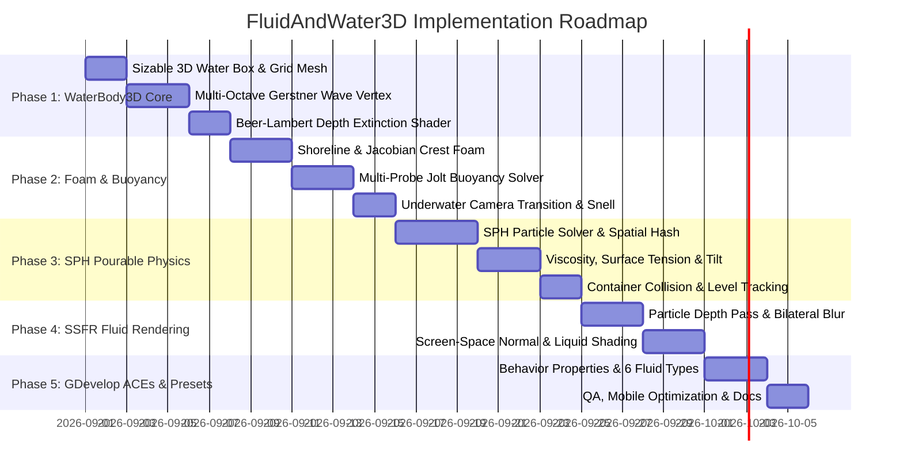

# FluidAndWater3D — Implementation Plan

This document records the technical architecture, mathematical wave and fluid equations, shipped implementation, and deferred work for **FluidAndWater3D**. Sections describing SSFR or scene-buffer refraction are design targets, not current runtime features; the status matrix in section 6 is authoritative.

---

## 1. System Architecture & Lifecycle

`FluidAndWater3D` operates via two distinct yet interoperable subsystems:

```mermaid
sequenceDiagram
    autonumber
    participant GD as GDevelop Event Loop
    participant Water as WaterBody3D Engine
    participant SPH as PourableLiquid3D (SPH Solver)
    participant Jolt as Jolt 3D Physics
    participant GPU as WebGL2 Renderer
    
    rect rgb(20, 35, 50)
    Note over Water,Jolt: Subsystem 1: Macro Water Bodies & Oceans
    GD->>Water: Update Wave Time (dt)
    Water->>GPU: Displace Water Mesh Vertices (Gerstner Waves)
    Water->>Jolt: Evaluate Buoyancy Probes at (x, y) -> Apply Upward Forces to Boats
    GPU->>GPU: Approximate optical depth from water bounds -> Render color & foam
    end
    
    rect rgb(30, 20, 45)
    Note over SPH,GPU: Subsystem 2: Micro SPH Pourable Liquids
    GD->>SPH: Emit Fluid Droplets from Bottle Spout
    SPH->>SPH: SPH Spatial Hash Grid -> Compute Density, Pressure & Viscosity
    SPH->>Jolt: Collide Droplets with Cups, Cauldrons & Terrain
    SPH->>GPU: Update instanced, per-droplet coloured spheres
    SPH->>GD: Update Container Fill Level (e.g. Cauldron is 65% Full)
    end
```



---

## 2. Mathematical Formulations & Algorithms

### A. Multi-Octave Gerstner Wave Equation
To produce realistic sharp wave crests and broad flat troughs, vertices are displaced both horizontally and vertically:

$$\vec{P}(x, y, t) = \begin{bmatrix} x - \sum_{i=1}^N Q_i A_i D_{x, i} \sin(\mathbf{K}_i \cdot (x, y) - \omega_i t) \\ y - \sum_{i=1}^N Q_i A_i D_{y, i} \sin(\mathbf{K}_i \cdot (x, y) - \omega_i t) \\ \sum_{i=1}^N A_i \cos(\mathbf{K}_i \cdot (x, y) - \omega_i t) \end{bmatrix}$$

* $A_i$: Amplitude (wave height).
* $Q_i = \frac{1}{\omega_i A_i N}$: Steepness parameter ($Q_i \in [0.0, 1.0]$).
* $\mathbf{D}_i = (\cos\theta_i, \sin\theta_i)$: Normalized wind/wave direction vector.
* $\mathbf{K}_i = \frac{2\pi}{L_i} \mathbf{D}_i$: Wave number vector (where $L_i$ is wavelength).
* $\omega_i = \sqrt{g \|\mathbf{K}_i\|}$: Dispersion frequency under gravity ($g = 9.81\text{ m/s}^2$).

#### Analytical Normal Vector Derivation (Exact Surface Normals):
$$\vec{N} = \frac{\partial \vec{P}}{\partial y} \times \frac{\partial \vec{P}}{\partial x} = \begin{bmatrix} -\sum_{i=1}^N D_{x, i} \cdot (\omega_i A_i) \cdot \sin(\mathbf{K}_i \cdot \vec{x} - \omega_i t) \\ -\sum_{i=1}^N D_{y, i} \cdot (\omega_i A_i) \cdot \sin(\mathbf{K}_i \cdot \vec{x} - \omega_i t) \\ 1 - \sum_{i=1}^N Q_i \cdot (\omega_i A_i) \cdot \cos(\mathbf{K}_i \cdot \vec{x} - \omega_i t) \end{bmatrix}$$

---

### B. Optical Absorption & Depth Extinction (Beer-Lambert Law)
The color of water is physically calculated from optical column depth $d = Z_{\text{seabed}} - Z_{\text{water}}$:

$$I(d) = I_0 \cdot \exp\left(-\vec{\beta}_{\text{extinction}} \cdot d\right)$$

Where $\vec{\beta}_{\text{extinction}} = (0.35, 0.08, 0.02)$ in $\text{m}^{-1}$ (red absorbs fast, blue penetrates deep).

* **Screen-Space Refraction:**
  $$\text{UV}_{\text{distorted}} = \text{UV} + \vec{N}_{xy} \cdot \text{clamp}(d \cdot \text{RefractScale}, 0.0, 0.04)$$
* **Schlick Fresnel Term:**
  $$F(\theta) = F_0 + (1 - F_0)(1 - \vec{V} \cdot \vec{N})^5, \quad F_0 = 0.02 \text{ (water index } n = 1.333\text{)}$$

---

### C. Multi-Point Archimedes Buoyancy Solver
For any floating rigid body in Jolt Physics (e.g. a boat with $M = 4$ hull probe points):

For each probe $k \in [1, M]$ at world position $(x_k, y_k, z_k)$:
1. Query CPU Gerstner solver for water surface height $Z_{\text{water}} = \text{WaterHeight}(x_k, y_k, t)$.
2. Calculate submersion depth: $h_k = \max(0.0, Z_{\text{water}} - z_k)$.
3. If $h_k > 0$ (submerged):
   $$\vec{F}_{\text{buoyant}, k} = \rho_{\text{water}} \cdot \left(\frac{V_{\text{hull}}}{M}\right) \cdot \vec{g} \cdot \min\left(1.0, \frac{h_k}{h_{\text{max}}}\right)$$
   $$\vec{F}_{\text{drag}, k} = -c_{\text{drag}} \cdot (\vec{v}_k - \vec{v}_{\text{wave}}) \cdot |\vec{v}_k - \vec{v}_{\text{wave}}|$$
   $$\vec{F}_{\text{total}, k} = \vec{F}_{\text{buoyant}, k} + \vec{F}_{\text{drag}, k}$$
4. Apply $\vec{F}_{\text{total}, k}$ as a world impulse at probe position $(x_k, y_k, z_k)$, naturally producing **pitch, roll, yaw, and wave surfing**.

---

### D. SPH Fluid Simulation (Pouring & Droplet Physics)
Based on Müller et al. Smoothed Particle Hydrodynamics with spatial hash grid partitioning ($O(N)$ neighbor search):

1. **Density Computation (Poly6 Kernel):**
   $$\rho_i = \sum_{j \in N(i)} m_j W_{\text{poly6}}(\vec{r}_i - \vec{r}_j, h), \quad W_{\text{poly6}}(r, h) = \frac{315}{64\pi h^9}(h^2 - r^2)^3$$

2. **Pressure Calculation (Tait's Equation of State):**
   $$P_i = k_{\text{gas}} \cdot \left( \left(\frac{\rho_i}{\rho_0}\right)^\gamma - 1.0 \right), \quad \gamma = 7$$

3. **Pressure Force (Spiky Gradient Kernel):**
   $$\vec{F}_i^{\text{pressure}} = -\sum_{j \in N(i)} m_j \frac{P_i + P_j}{2\rho_j} \nabla W_{\text{spiky}}(\vec{r}_i - \vec{r}_j, h), \quad \nabla W_{\text{spiky}}(r, h) = -\frac{45}{\pi h^6}(h - r)^2 \frac{\vec{r}}{r}$$

4. **Viscosity Force (Viscosity Laplacian Kernel):**
   $$\vec{F}_i^{\text{viscosity}} = \mu \sum_{j \in N(i)} m_j \frac{\vec{v}_j - \vec{v}_i}{\rho_j} \nabla^2 W_{\text{visc}}(\vec{r}_i - \vec{r}_j, h), \quad \nabla^2 W_{\text{visc}}(r, h) = \frac{45}{\pi h^6}(h - r)$$

5. **Container Intersection & Fill Volume Tracking:**
   When droplets enter a container's open AABB or cylindrical volume:
   $$\text{FillVolume} += \Delta V_{\text{particle}}, \quad \text{FillLevel} = \frac{\text{FillVolume}}{\text{ContainerCapacity}}$$

---

### E. Deferred: Screen-Space Fluid Rendering (SSFR Metaballs)
This is an unimplemented design target for reconstructing individual droplets as a continuous glossy volume:

```
Pass 1: Render Particle Sphere Depths to Depth Texture
Pass 2: Bilateral Depth Smoothing Filter (Blurs droplet bumps while preserving sharp outer silhouettes)
Pass 3: Reconstruct Surface Normals from Filtered Depths:
        Nx = (Depth(x+1, y) - Depth(x-1, y)) / (2 * dx)
        Ny = (Depth(x, y+1) - Depth(x, y-1)) / (2 * dy)
        N = normalize(-Nx, -Ny, 1.0)
Pass 4: PBR Liquid Shading (Refraction, Fresnel Reflection, Caustic Highlights)
```

---

## 3. WebGL2 Render Pipelines & Shader Injections

```
1. WaterBody3D Shader Pipeline
   - Vertex Shader: Displaces grid vertices via a generated 10-octave Gerstner loop.
   - Fragment Shader: Approximates depth from volume bounds -> Beer-Lambert-shaped color -> boundary foam -> crest foam -> sun specular.

2. PourableLiquid3D Shipped Pipeline
   - CPU SPH simulation with a spatial hash.
   - One instanced sphere mesh with per-droplet transform and color.
   - SSFR depth, blur, and composite passes remain deferred.
```

---

## 4. Historical Roadmap



---

## 5. Performance Targets (Not Guarantees)

These are design budgets. Browser, GPU, active-particle density, and scene complexity all affect actual cost. Use the included ocean and SPH benchmarks on representative target hardware.

| Subsystem | CPU Time Budget | GPU Time Budget | Target FPS |
| :--- | :---: | :---: | :---: |
| **`WaterBody3D` (Gerstner Ocean Grid)** | $< 0.05\text{ ms}$ | $< 0.35\text{ ms}$ | **60–120 FPS** |
| **Jolt 4-Probe Boat Buoyancy** | $< 0.03\text{ ms}$ | $0.0\text{ ms}$ | **60 FPS** |
| **`PourableLiquid3D` SPH (1,500 Droplets)**| $< 0.65\text{ ms}$ | $0.0\text{ ms}$ | **60 FPS** |
| **SSFR Bilateral Depth Blur & Shading** | Not implemented | Not implemented | Deferred |
| **Total Combined Water & Pouring** | Measure per project | Measure per project | Target 60 FPS |

---

## 6. Implementation Status (v1.1.0)

The sections above describe the intended design. What the shipped runtime actually does:

| Subsystem | Status | Notes |
| :--- | :--- | :--- |
| Multi-octave Gerstner displacement (GPU) | **Shipped** | 10 octaves, vertex-displaced. Phase evaluated in GDevelop space so it matches the CPU solver. |
| Wave scale mode | **Shipped** | `Absolute` (fixed 300-unit base, world-space tiling) or `RelativeToVolume` (base = volume's shorter side). Recomputed on resize. |
| Octave spectrum (WaterBody3D) | **Reworked, 2.3.0** | Ten octaves. Non-harmonic frequency ratios near 1.6 with no two steps equal; a distinct phase per octave; amplitudes weighted by cos^2(theta/2) and falling off near k^-1. Directions **straddle** the wind, and their spread **widens as wavelength shortens** — long swell runs with the wind, short chop fans out to ~50 degrees. `speedMul` is 1.0 throughout so phase speed comes from the dispersion relation sqrt(g/k) alone. Measured on ridge-orientation isotropy against a matched Tessendorf field: **0.643 vs 0.635 reference**. The 1.3.0 table scored 0.338 — it had seven of eight octaves on one side of the wind, giving parallel ridges that all marched the same way when viewed along them, and pushed short waves to 2.2x speed so the surface slid as one sheet. |
| Shader generated from the octave table | **Shipped** | The vertex shader's `addWave` calls are emitted from `GERSTNER_OCTAVES` at runtime rather than hardcoded, so the GPU surface and the CPU solver cannot describe different waves. Asserted in `test-runtime.mjs` 3d. |
| Tessendorf ocean core | **Shipped** | Phillips spectrum, Hermitian h0 construction, radix-2 FFT, time evolution, bilinear sampling, wind-speed normalisation to H_s = 0.21V²/g. The Nyquist row and column are zeroed: they have no mirror partner in the grid, and leaving them populated breaks the Hermitian symmetry, so the inverse transform returns a field whose imaginary part matches its real part. Covered by `test-ocean.mjs`. |
| `OceanFFT3D` behavior | **Shipped** | CPU field uploaded as an RGBA float `DataTexture` (rgb = displacement XYZ, a = Jacobian). The vertex shader samples it by **world XY**, not mesh UVs, so the wave field is independent of the mesh's shape. Normals are reconstructed per pixel from the height channel, giving shading detail finer than the geometry. |
| Jacobian foam | **Shipped** | Whitecaps where the displacement Jacobian shows the surface folding, per Tessendorf 2001 and Sea of Thieves, replacing the height threshold that gave every crest an identical cap. |
| `WaterEdge3D` behavior | **Shipped, shared shoreline path** | Up to 8 same-layer, vertically intersecting AABBs are uploaded to both Gerstner and FFT water. A signed distance masks water beneath land, drives water-side surf and shallow color, and attenuates GPU and CPU wave displacement toward shore. Nearest-first selection prevents distant coasts crowding out the local beach. |
| Buoyancy on the FFT field | **Shipped** | `Buoyancy3D` samples the same `OceanField` the texture was built from — one source of truth, no CPU/GPU divergence. |
| GPU FFT | **Shipped** | Ping-pong butterfly FFT on render targets obtained via `getThreeRenderer()`. Two inverse transforms per frame rather than three: h, Dx and Dy are all real and the transform is linear, so `IFFT(H + i·DX)` yields the height as its real part and the X displacement as its imaginary part. 31 fullscreen passes at 128², 35 at 256². The butterfly table folds the bit-reversal into stage 0, and its twiddle index advances so the lower wing of each group receives a sign-flipped twiddle — which is why every texel can use `p + w·q` with no per-wing branch. Verified without a GPU in `test-gpufft.mjs`: the exact pass sequence is replayed in JS and compared against the CPU transform (agrees to ~3e-8, the float32 twiddle precision). Falls back to the CPU spectrum if float render targets are unavailable or any pass throws. |
| Wave direction controls | **Shipped, 2.4.0** | `DirectionalSpread` rescales the octave table's authored directions (0 collapses every wave onto the wind, 45 is the authored fan, 90 doubles it) and `PhaseSeed` shifts each octave by `seed x lenRatio x 2pi` so one number rearranges the whole surface. Both are uniforms applied identically on CPU and GPU. Measured ridge isotropy across spread: 0.00 / 0.17 / 0.45 / 0.64 / 0.82 / 0.87 at 0/15/30/45/60/75 degrees. |
| Deterministic crest irregularity | **Shipped, 2.7.0** | `WaveIrregularity` adds a slow phase warp along each Gerstner crest's perpendicular axis. It breaks straight, mechanically repeated bands without random frame noise. The identical formula runs in the vertex shader, height/normal/velocity queries, underwater detection and buoyancy. |
| Physics3D/Jolt water interactions | **Shipped, 2.7.0** | Both `WaterBody3D` and `OceanFFT3D` scan same-layer moving Physics3D bodies overlapping their volume. Jolt velocity drives fixed-capacity localized ripple events; measured motion is a fallback. The vertex shader renders displacement, the fragment shader adds transient foam, and CPU surface queries/buoyancy include the same radial function. No `Buoyancy3D` behavior or fake water collider is required on a player. |
| Spectrum fitted to the volume | **Shipped, 2.5.0** | A fully developed sea's waves are enormous — 12 m/s peaks near 92 m — so on any smaller body the physically correct result is ONE swell spanning the whole surface, which renders as dead flat with a little chop on top. That was the real reason OceanFFT3D 'did not show right'. `WavelengthScale` (0 = auto) now fits the spectrum so roughly 4 waves land across the volume at any size. Height carries a slower scale than length (sqrt), because scaling both equally preserves the fully developed steepness of exactly 0.21/4.44 = 0.047 and would make wind speed stop changing anything. Steepness is capped at 0.10 — fetch-limited seas really are steeper than developed ones, but real waves break near 0.14. |
| Fluid drag units | **Fixed, 2.4.2** | `Physics3D.getLinearVelocity*()` returns SCENE UNITS per second (it multiplies Jolt's m/s by `worldScale`), while `getMass()` returns kilograms. The drag term fed the raw figure into a kg-based coefficient, producing a force `worldScale` (100x) too large — enough to overwhelm buoyancy and launch a hull from Z=100 to Z=43000 in under two seconds. Relative velocity is now divided by the shared data's `worldScale` before the drag coefficient sees it, at both the Gerstner and the Tessendorf call sites. Angular velocity was already converted from deg/s to rad/s. Found by `gdjs-harness`, which runs the extension against the real engine with real Jolt bodies. |
| Physics hook guard | **Fixed, 2.4.2** | `_sharedData.registerHook` was called unguarded, so a Physics3D build without the hook API would throw and take the whole behavior down instead of falling through to the per-frame path. |
| Shared-context GL state | **Fixed, 2.4.1** | GDevelop runs three.js and PIXI on ONE WebGL context and calls `renderer.resetState()` plus PIXI's `reset()` at every boundary between them (`runtimescene-pixi-renderer`). The GPU FFT passes run from a post-events callback, outside that handshake, so three's cached GL state was whatever PIXI last left — rendering against a stale cache binds the wrong buffers and returns garbage instead of failing. Symptom: a GPU field reading 3.6e32, vertices displaced to infinity, and an ocean that simply is not drawn. `resetState()` now brackets the pass sequence. This does not reproduce in a standalone three.js page, where nothing else touches the context. |
| normalizeToWindSpeed staleness | **Fixed, 2.4.1** | It measured sigma, scaled `h0`, then returned without re-running the transform, so `height` still held the unscaled measurement pass. Anything reading `peakHeight()` straight afterwards saw a figure thousands of times too large. |
| GPU output self-check | **Shipped, 2.4.0** | After the first update the finished target is read back and checked for NaN, Infinity and all-zero. A GPU FFT can fail with no error at all — an unsupported float format, a driver declining the target, a NaN through the butterfly passes — and a vertex displaced to NaN drops its whole triangle, so the ocean is simply not drawn against a clean console. On a bad result the extension warns and falls back to the verified CPU spectrum. |
| Wave detail diagnostic | **Shipped** | `WaveDetailPercent()` plus a one-time console warning when the mesh cannot resolve a single octave and the surface would render flat. |
| Octave band-limiting | **Shipped** | Octaves shorter than 4x the mesh vertex spacing are faded to zero, identically on GPU and CPU. Prevents the sub-Nyquist crosshatch a coarse mesh otherwise produces, and keeps buoyancy in phase with the drawn surface. Crest foam renormalises against the retained amplitude. |
| Analytical normals + CPU height/normal/velocity query | **Shipped** | `WaveHeightAt`, `WaterSurfaceZ`, orbital velocity for drag. |
| Beer-Lambert extinction | **Shipped, approximated** | Column depth derived from distance to the volume's edge, clamped by its depth. No scene depth buffer is exposed to sample a real column. |
| Screen-space refraction | **Not implemented** | No scene colour buffer is available to a custom material. `RefractionScale` distorts the caustic pattern instead. |
| Voronoi caustics | **Shipped** | Gated by `EnableCaustics`, attenuated by transmittance so it only reads through shallow water. |
| Shore foam | **Shipped, approximated** | Animated water-side surf band along `WaterEdge3D`; `WaterBody3D` falls back to its own perimeter when no edge is present. AABB distance, not a terrain depth-intersection test. |
| Crest whitecaps | **Shipped** | Normalised against the true summed amplitude — the earlier normalisation was 2x too large, so the `smoothstep` band was never reached. |
| Underwater fog transition | **Shipped** | Per layer. Restores the original fog on surfacing and on scene unload. |
| Snell's window / total internal reflection | **Not implemented** | Fog and tint only. |
| Multi-probe Archimedes buoyancy | **Shipped** | 1 / 4 / 8 probes about the object **centre**, sampling the volume's top face. |
| Jolt integration | **Shipped** | One `applyImpulse(ix, iy, iz, px, py, pz)` per probe at the probe's world position, so pitch and roll emerge from the force distribution. Force is scaled by the body's own mass, making `BuoyancyFactor` a weight ratio. |
| Fluid drag | **Shipped** | Quadratic, against local wave orbital velocity, on the Physics3D path. |
| SPH solver (Poly6 / Spiky / viscosity Laplacian, spatial hash) | **Shipped** | Per-particle viscosity, surface tension and rest density, so presets are genuinely distinguishable. Sub-stepped for stability at high viscosity. |
| Container fill tracking | **Shipped** | Any object with `PourableLiquid3D` doubles as a container; droplets entering another emitter's AABB are absorbed and raise its fill level. Volume in litres. |
| Droplet collision with scene geometry | **Not implemented** | Droplets collide with each other, the droplet floor plane, and container AABBs only. |
| SSFR (depth pass / bilateral blur / normal reconstruction) | **Not implemented** | Droplets render as an instanced sphere mesh, tinted per droplet. |
| `MaterialSource: Material3D` delegation | **Not implemented** | Property is stored; the built-in shader always renders. |

### Engine constraints that shaped the above

1. **The 3D scene root is Y-mirrored** (`scale.y = -1`). Shader world positions and the three.js camera both report a negated GDevelop Y. Every wave phase is evaluated in GDevelop space and mapped back.
2. **three.js declares `cameraPosition` and friends for every non-raw `ShaderMaterial`.** Redeclaring one is a GLSL redefinition error, and GDevelop surfaces that as the object simply not drawing.
3. **Objects are parented per layer** via `layer.getRenderer().getThreeGroup()`. Adding to a hardcoded base layer breaks any water body on another layer.
4. **`Physics3D.applyImpulse` takes six arguments** — impulse XYZ then the world application point. Passing three sends `undefined * worldInvScale` (NaN) into Jolt.
5. **Frame time comes from `runtimeScene.getElapsedTime()` (ms).** A hardcoded 0.016 s step makes the whole simulation run at the wrong speed on any display that is not 60 Hz.
