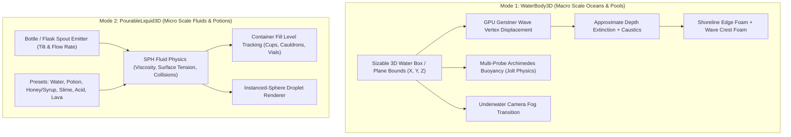

# FluidAndWater3D — Sizable Water Volumes, Gerstner Oceans, Buoyancy & Pourable SPH Liquids for GDevelop

**FluidAndWater3D** is a water rendering, buoyancy, and stylized fluid toolkit for **GDevelop 5 (Three.js WebGL2 backend)**.

It brings together **large-scale water bodies** (sizable 3D ocean/river/lake volumes with Gerstner waves, underwater submersion, and boat buoyancy) and **micro-scale pourable liquids** (SPH particle fluids for pouring potions, filling flasks, alchemy cauldrons, and splashing viscous slimes) in a single unified extension.

---

## 🌟 Key Highlights

- **Dual-Mode Fluid Architecture:**
  1. **`WaterBody3D`:** Sizable 3D water box or ocean plane for open-world seas, swimming lakes, rivers, and swimming pools.
  2. **`PourableLiquid3D`:** Lagrangian SPH particle fluid simulator for pouring potions, filling bottles, splashing acid, and viscous honey/slime.
- **Multi-Octave Gerstner Wave Displacement:** Realistic sharp-peaked ocean swells and rolling waves displaced on the GPU with full CPU/GPU height synchronization.
- **Deterministic Wave Irregularity:** Crest lines bend and evolve without frame noise, while CPU height queries and buoyancy remain synchronized with the GPU surface.
- **Absolute or Volume-Relative Wave Scale:** `WaveScaleMode` picks between world-space waves that tile seamlessly between adjacent oceans, and waves sized to the volume so a pool looks like a pool. Octaves the surface mesh cannot resolve are filtered out on both the GPU and the CPU, so a large body reads as calm rather than as sampling noise.
- **Beer-Lambert Depth Absorption:** Physically-shaped extinction (crystal shallow turquoise $\rightarrow$ deep oceanic navy) with Schlick Fresnel reflections. The optical column is approximated from the water volume's own bounds — see *Limitations*.
- **Water-Aware Shorelines & Whitecaps:** `WaterEdge3D` masks water beneath land, drives a water-side surf band and shallow color, and damps waves as they run ashore. Crest foam remains wave-driven offshore.
- **Underwater Submersion:** Optional automatic fog transition while the camera is inside and below a water volume.
- **Multi-Point Jolt Physics Buoyancy:** 4/8-probe hull buoyancy plus configurable roll/pitch stabilization for boats, rafts, crates, and ships. Lift is applied only while the hull actually overlaps the water volume.
- **Automatic Jolt Wakes & Splashes:** Any moving `Physics3D` object intersecting either water type creates expanding ripples and foam; a player does not need `Buoyancy3D` just to disturb the surface.
- **Two Ocean Models:** Use controllable Gerstner waves for pools, rivers, and modest seas, or a Tessendorf/Phillips FFT spectrum for large open water.
- **SPH Pouring & Container Level Tracking:** Tilt bottles or flasks to pour liquid droplets with realistic viscosity, surface tension, and liquid volume fill tracking inside cups and cauldrons.
- **Per-Droplet Fluid Materials:** Every droplet carries its own viscosity, surface tension, rest density, radius and colour, so honey and water can pour in the same scene and behave differently.

---

## 📐 The Dual-Mode Architecture



---

## 📊 Dual Mode Comparison

| Feature / Metric | 🌊 `WaterBody3D` (Ocean & Pool Volumes) | 🧪 `PourableLiquid3D` (SPH Pouring & Potions) |
| :--- | :--- | :--- |
| **Primary Scope** | Large environments (Oceans, rivers, lakes, flooded rooms). | Small interactions (Bottles, potions, chemistry, cups). |
| **Geometry Setup** | Resizable 3D Box or Plane placed in scene. | Particle emitter attached to bottle neck or tap. |
| **Physics Method** | Analytical Gerstner wave displacement + Buoyancy forces. | Smoothed Particle Hydrodynamics (SPH) particle collisions. |
| **Surface Rendering**| Displaced water shader with depth absorption. | Instanced droplet spheres, coloured per fluid preset. |
| **Viscosity Support**| Wave drag & current flow vectors. | Full viscosity spectrum (Water $\rightarrow$ Honey $\rightarrow$ Slime). |
| **Container Filling**| Static volume boundary. | Dynamic volume accumulation and liquid level tracking. |
| **Performance** | Mostly GPU-bound; measure on target hardware. | CPU cost depends strongly on active droplets and local neighbour density; use `test-sph.mjs` as a host benchmark. |

---

## 🚀 Quick Start Guide

### Setup 1: Ocean / Lake Water Volume
1. Add a 3D Box or Plane object to your scene and attach **`WaterBody3D`**.
2. Resize the box to cover your ocean or lake basin.
3. Attach **`Buoyancy3D`** to your Boat or Floating Crate object.
4. When play starts, the boat automatically floats, rocks on wave peaks, and the camera tints underwater when diving.

For a ship, start with **Hull Probe Count = 8-HullBox**, **Ship Stability = 0.65**, and
**Stability Damping = 1.5**. Raise damping if the hull keeps oscillating; raise stability if it heels
too far. Set stability to `0` for loose debris that should tumble freely. A `Physics3D` behavior is
required for gravity outside the water; without it, buoyancy uses a kinematic surface-following
fallback and deliberately leaves the object alone when it is not touching water.

For a swimming player, attach GDevelop's `Physics3D` behavior and let the player's 3D bounds overlap
the water volume. Both `WaterBody3D` and `OceanFFT3D` detect the Jolt velocity automatically. Tune
**Splash Strength**, **Splash Radius**, and **Splash Speed Threshold** on the water object; no collision
event or `Buoyancy3D` behavior is required for the wake effect.

### Setup 2: Pourable Potion Flask
1. Attach **`PourableLiquid3D`** to a Potion Flask object.
2. Set Fluid Preset to `"MagicPotion"` or `"Honey"`.
3. In Events: When flask pitch angle $> 45^\circ$, trigger `PourableLiquid3D::StartPouring()`.
4. When droplets collide with a Cauldron object, the cauldron's liquid level rises dynamically!

---

## 📚 Documentation Index

- [IMPLEMENTATION_PLAN.md](./IMPLEMENTATION_PLAN.md) — Technical architecture, mathematical formulations, shipped-status matrix, performance targets, and deferred rendering work.
- [API_REFERENCE.md](./API_REFERENCE.md) — Complete specification of Behavior Properties for both modes, Actions, Conditions, Expressions (ACEs), and Fluid preset profiles.

---

## 🌊 Choosing a water model

| | `WaterBody3D` | `OceanFFT3D` |
| :--- | :--- | :--- |
| Method | 10 Gerstner octaves, analytic | Tessendorf FFT (Phillips spectrum) |
| Authored by | wave height in units | **wind speed in m/s** |
| Wave components | 10 | thousands (resolution² wavenumbers) |
| Repetition | some structure remains | none within the tile |
| CPU cost | Small analytical queries only | Host benchmark: approximately 0.3 ms at 32² and 1 ms at 64²; higher resolutions should use the GPU path |
| Good for | pools, lakes, rivers, modest seas | open water you look across |

`OceanFFT3D` implements Tessendorf 2001, the model behind Sea of Thieves (Ang et al., SIGGRAPH 2018
Talks). Wave height is not authored — it follows the physical relation `Hs = 0.21 V²/g` from wind
speed, so 6 m/s gives a 0.8 m chop and 24 m/s a 12 m storm sea. Foam is generated where the surface
**folds** (the displacement Jacobian), the same criterion Rare uses, rather than from wave height —
which is why its whitecaps are irregular instead of identical caps on identical peaks.

`Buoyancy3D` works with either. It selects only a water volume that overlaps the hull in XY and Z;
a distant registered ocean can no longer make an object float in empty space or override a nearby
`WaterBody3D`. When an `OceanFFT3D` overlaps the hull it samples the exact same field the surface is
displaced from, so the hull cannot float out of phase with the waves you can see.

### `WaterEdge3D` — coastlines

Attach `WaterEdge3D` to a 3D Box or Model covering a beach, cliff, rock or harbour wall.
Both `WaterBody3D` and `OceanFFT3D` mask their surface beneath it, flatten waves toward it, foam on
the water-facing side, and transition to shallow color. Edges affect only water on the same layer
whose top surface crosses the edge's vertical span. Up to 8 edges affect a given water body at once,
chosen nearest-first — cover a long coast with a few large volumes rather than many small ones.

The current shoreline shape is the object's axis-aligned XY bounds; rotation and model contours are
not sampled. Use several boxes for a curved coast. Enable **Hide Helper Object** when the edge object
is only a marker volume rather than visible land.

---

## ⚠️ Limitations

The full list lives in [API_REFERENCE.md](./API_REFERENCE.md#9-limitations). The short version:

* No screen-space refraction or scene-depth shoreline test — GDevelop does not expose those buffers to a custom material. Optical depth and shore foam use `WaterEdge3D` bounds, with `WaterBody3D` falling back to its own perimeter when no edge is present.
* Droplets render as instanced spheres, not an SSFR metaball surface. The SPH physics underneath is real.
* Droplets collide with each other, the droplet floor, and container bounding boxes — not with arbitrary scene geometry.
* `MaterialSource` and `WaterType` are stored but do not yet change rendering.
* `WaterEdge3D` uses axis-aligned box bounds, not rotated-box or mesh distance. Several overlapping boxes can approximate a curved coastline.
* Wave detail is bounded by `GridSubdivisions` (max 256). Octaves shorter than four vertex spacings are faded out by design — see [Wave Scale and Mesh Resolution](./API_REFERENCE.md#7-wave-scale-and-mesh-resolution).

---

## 📌 Coordinate-space notes for contributors

GDevelop's 3D scene root carries `scale.y = -1`, so `(modelMatrix * position).y` inside a shader is the **negated** GDevelop Y, and `threeCamera.getWorldPosition()` reports a negated Y too. Every wave phase — GPU and CPU — is evaluated in GDevelop space, and the shader maps its horizontal displacement back into mirrored space afterwards. Getting this wrong does not crash: the boats simply bob out of phase with the waves you can see, and underwater detection never fires.

Equally silent: three.js declares `cameraPosition`, `viewMatrix`, `modelMatrix`, `projectionMatrix`, `normalMatrix` and `isOrthographic` for every non-raw `ShaderMaterial`. Redeclaring any of them is a GLSL redefinition error and the water just never draws. `test-runtime.mjs` asserts against both mistakes.

---

## Contributor validation

After changing the runtime or generator, rebuild and run the complete validation suite:

```sh
node FluidAndWater3D/build-extension.mjs
node FluidAndWater3D/test-all.mjs
```

`build-extension.mjs --check` is non-writing and fails when the generated JSON is stale. The SPH timing printed by `test-sph.mjs` is a local diagnostic, not a browser or device performance guarantee.
