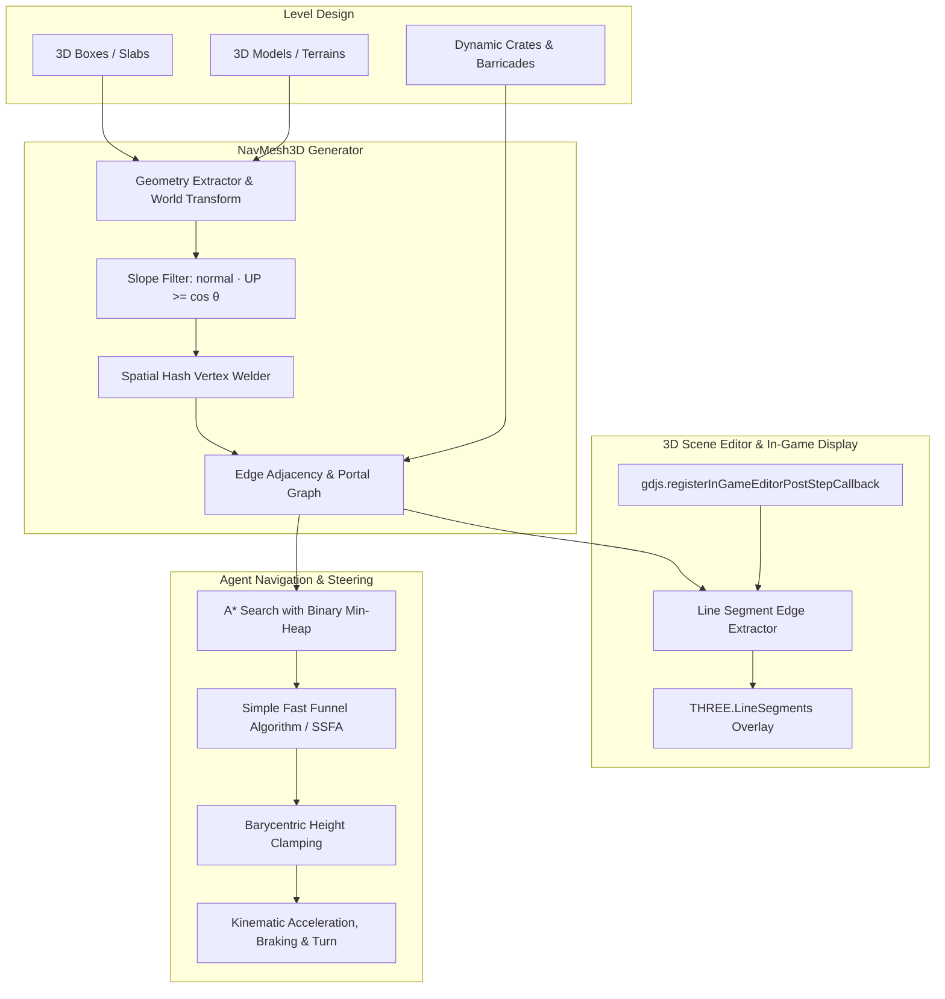

# NavMesh 3D (Navigation Mesh & Intelligent Pathfinding)

A high-performance 3D Navigation Mesh and Intelligent Pathfinding extension for GDevelop 5 (Three.js WebGL2 & 2D/isometric compatible).

Features **Live 3D Scene Editor wireframe visualization** directly inside GDevelop's 3D viewport, automatic slope filtering, kinematic agent steering, surface elevation clamping, dynamic obstacle carving, and off-mesh links.

---

## Highlights

- ⚡ **Live 3D Scene Editor Wireframe**: See navigable terrain live directly in GDevelop's 3D editor! Automatically updates as you move, rotate, scale, or place objects in the level editor.
- 📐 **Clean Line Rendering (`THREE.LineSegments`)**: Renders clean, glowing wireframe lines without solid polygon blocks, keeping scene materials, textures, and models 100% visible.
- 🚀 **Zero-WASM Pure JavaScript Engine**: Lightning fast, instant scene startup with zero asynchronous loading delays or WebAssembly asset dependencies.
- ⛰️ **Slope & Ramp Filtering**: Automatically filters out steep cliffs, vertical walls, and ceilings based on configurable max slope angles (e.g. 50°).
- 🧗 **Automatic Surface Elevation Clamping**: Projects agents onto the exact barycentric height of polygon triangles, allowing characters to smoothly walk up stairs, hills, and ramps without falling through.
- 🎯 **A* Graph Search & Funnel Smoothing (SSFA)**: Produces the mathematically shortest, smooth Euclidean paths with agent radius wall clearance.
- 🏎️ **Kinematic Steering Physics**: Acceleration, deceleration, arrival braking distance curves, and smooth angular heading rotation.
- 🚧 **Dynamic Obstacles**: Moving crates, barricades, and doors dynamically block navmesh polygons and trigger nearby agents to smoothly re-plan their paths.
- 🦘 **Off-Mesh Links**: Connect disjoint platforms with parabolic jump trajectories, ladders, or instant teleporters.
- 💾 **Pre-Baked JSON Import/Export**: Export baked navmesh geometry to JSON strings or scene variables for instant 0ms scene loads.
- 🔄 **Dual Coordinate Support**: Works in both GDevelop default 3D ($X, Y$ ground, $Z$ elevation) and standard 3D $Y$-up ($X, Z$ ground, $Y$ elevation).

---

## Architecture



---

## Getting Started

### 1. Setup Walkable Surfaces
1. Add the **NavMesh 3D Walkable Surface** (`NavMeshWalkable3D`) behavior to your ground meshes, platforms, or floor 3D Boxes.
2. Add a manager object to your scene (e.g. an empty 3D Box or scene controller) and attach the **NavMesh 3D Zone** (`NavMeshZone3D`) behavior.
3. In the 3D Scene Editor, the navigable terrain immediately appears as a glowing **cyan/green wireframe grid**!

### 2. Setup the Pathfinding Agent
1. Attach the **NavMesh 3D Agent** (`NavMeshAgent3D`) behavior to your player or NPC 3D object.
2. In your event sheet, direct the character to navigate to any position or object:
   ```text
   Conditions:
     Touch or Left mouse button is down
   Actions:
     Move "Player" to (RaycastX, RaycastY, RaycastZ)
   ```
3. The character will smoothly rotate towards the path, accelerate, follow waypoints around corners, climb slopes flush with the surface, and decelerate upon arrival.

### 3. Dynamic Obstacles
1. Attach **NavMesh 3D Dynamic Obstacle** (`NavMeshObstacle3D`) to doors, movable crates, or destructible barricades.
2. The wireframe turns **red** around the obstacle, and navigating agents automatically divert around it.

---

## Behaviors Reference

### 1. `NavMeshZone3D` (Navigation Surface & Manager)
| Property | Default | Description |
|---|---|---|
| `ZoneName` | `"Default"` | Identifier for this navigation zone (allows multi-floor or separate levels). |
| `UpAxis` | `"Z"` | Vertical elevation axis (`Z` for GDevelop default, `Y` for Three.js standard). |
| `MaxSlopeAngle` | `50` | Maximum climbable slope in degrees. Steeper faces are treated as impassable walls. |
| `MergeTolerance` | `0.1` | Vertex welding distance tolerance for uniting adjacent meshes. |
| `AutoBakeOnStart` | `true` | Automatically bake navmesh from walkable scene objects on scene start. |
| `ShowLiveWireframeInEditor` | `true` | Draws live wireframe lines in GDevelop's 3D scene editor. |
| `ShowDebugWireframeInGame` | `false` | Shows wireframe navigation lines during game preview. |

**Actions:**
- `Bake navigation mesh`: Re-scans walkable scene geometry and rebuilds the navmesh graph.
- `Clear navigation mesh`: Empties the navigation zone.
- `Load navmesh from JSON data`: Loads pre-baked navmesh from a serialized JSON string.
- `Save navmesh to scene variable`: Exports current navmesh to a scene variable for 0ms loading.
- `Set in-game wireframe visualization`: Toggles in-game wireframe display.
- `Add off-mesh jump/climb link`: Connects two 3D points with a jump arc, teleport, or climb.

**Conditions:**
- `Is navmesh ready`: Returns true if the zone contains walkable polygons.
- `Is position on walkable navmesh`: Tests if $(X, Y, Z)$ lies on a valid walkable polygon.

**Expressions:**
- `PolygonCount()`: Number of navigation polygons.
- `VertexCount()`: Number of vertices.
- `SurfaceElevation(X, Y)`: Returns exact surface height at horizontal position $(X, Y)$.
- `ExportedJSON()`: Returns serialized JSON string of the baked navmesh.

---

### 2. `NavMeshAgent3D` (Intelligent Pathfinding Character)
| Property | Default | Description |
|---|---|---|
| `ZoneName` | `"Default"` | Navigation zone to pathfind within. |
| `Speed` | `250` | Maximum travel speed in world units per second. |
| `Acceleration` | `600` | Rate of acceleration in units/s². |
| `Deceleration` | `800` | Braking deceleration rate in units/s² for smooth arrival. |
| `TurnSpeed` | `360` | Angular rotation speed towards path heading in degrees per second. |
| `StoppingDistance` | `5` | Distance from destination to consider arrived. |
| `WaypointTolerance` | `10` | Distance threshold to advance to next waypoint. |
| `AgentRadius` | `15` | Clearance margin used to inset portals away from walls and corners. |
| `RotateTowardsPath` | `true` | Automatically rotates the 3D object to face its movement vector. |
| `ClampToNavMesh` | `true` | Automatically clamps object elevation onto terrain ramps and slopes. |
| `Avoidance` | `true` | Applies soft lateral separation forces to steer around other agents. |
| `UpAxis` | `"Z"` | Elevation axis (`Z` or `Y`). |

**Actions:**
- `Move to position (X, Y, Z)`: Finds path and navigates to target coordinate.
- `Move towards object`: Navigates to another object's position.
- `Stop moving`: Instantly stops movement and clears active path.
- `Teleport to position`: Snaps agent to position with automatic navmesh surface elevation clamping.
- `Set maximum speed`: Updates max speed.
- `Set acceleration`: Updates acceleration rate.
- `Set deceleration`: Updates braking deceleration rate.
- `Set rotation turn speed`: Updates angular turn speed in deg/s.
- `Set arrival stopping distance`: Updates arrival tolerance.

**Conditions:**
- `Destination reached`: Returns true when destination is reached.
- `Is moving`: Returns true while traveling along path.
- `Is path valid`: Returns true if pathfinding succeeded.
- `Remaining distance`: Compares remaining travel distance along path.

**Expressions:**
- `Speed()`: Instantaneous movement speed.
- `RemainingDistance()`: Total distance left to destination.
- `TargetX()`, `TargetY()`, `TargetZ()`: Destination coordinates.
- `NextWaypointX()`, `NextWaypointY()`, `NextWaypointZ()`: Next immediate waypoint coordinates.
- `WaypointCount()`: Total waypoints along current path.
- `CurrentWaypointIndex()`: Index of currently targeted waypoint.

---

### 3. `NavMeshObstacle3D` (Dynamic Obstacle)
| Property | Default | Description |
|---|---|---|
| `ZoneName` | `"Default"` | Navigation zone affected by this obstacle. |
| `ObstacleShape` | `"Box"` | Bounding volume shape (`Box` or `Sphere`). |
| `SizeX`, `SizeY`, `SizeZ` | `50` | Obstacle volume dimensions. |
| `ObstacleEnabled` | `true` | Whether the obstacle is actively blocking polygons. |

**Actions:**
- `Enable or disable obstacle`: Toggles dynamic polygon blocking.
- `Set obstacle bounds size`: Adjusts bounding volume dimensions.

**Conditions:**
- `Is obstacle enabled`: True if obstacle is active.
- `Is actively blocking polygons`: True if obstacle volume intersects at least one polygon.

---

### 4. `NavMeshWalkable3D` (Walkable Surface)
| Property | Default | Description |
|---|---|---|
| `ZoneName` | `"Default"` | Target navigation zone. |
| `AreaType` | `"Walkable"` | Terrain type (`Walkable`, `Mud`, `Road`, `Hazard`). |
| `AreaCost` | `1.0` | Cost multiplier for A* pathfinding (e.g. `2.0` = avoided, `0.5` = preferred). |

**Actions:**
- `Set area traversal cost multiplier`: Changes traversal weight.
- `Set area terrain type`: Updates terrain classification.

---

## Global Free Functions

- `NavMeshFindPath(ZoneName, StartX, StartY, StartZ, EndX, EndY, EndZ, TargetArrayVariable)`: Raw pathfinding query that writes 3D waypoints into a scene array variable.
- `NavMeshGetElevation(ZoneName, X, Y, FallbackZ)`: Expression returning exact ground elevation at $(X, Y)$.
- `NavMeshIsReachable(ZoneName, StartX, StartY, StartZ, EndX, EndY, EndZ)`: Condition testing if a traversable path exists.
- `NavMeshSetDebugWireframe(Enabled)`: Action toggling in-game wireframe display.

---

## Performance & Best Practices

1. **Pre-Baking for Instant Loads**: During development or preview, call `Save navmesh to scene variable` or copy the JSON from `ExportedJSON()`. Paste it into a text resource or scene variable and use `Load navmesh from JSON data` on scene start to eliminate runtime baking overhead entirely.
2. **Slope Tuning**: Default `50°` is ideal for standard 3D platforms. For stairs, ensure step height is within reach or place a simplified invisible wedge/ramp over detailed stair geometry.
3. **Agent Clearance**: Use `AgentRadius` equal to roughly half your character's width so the Funnel algorithm hugs corners without clipping character geometry into walls.
4. **Live 3D Editor Wireframe**: Keep `ShowLiveWireframeInEditor: true` enabled during level design. The visualizer debounces updates (50ms) to ensure level editing remains responsive and smooth at 60 FPS.
