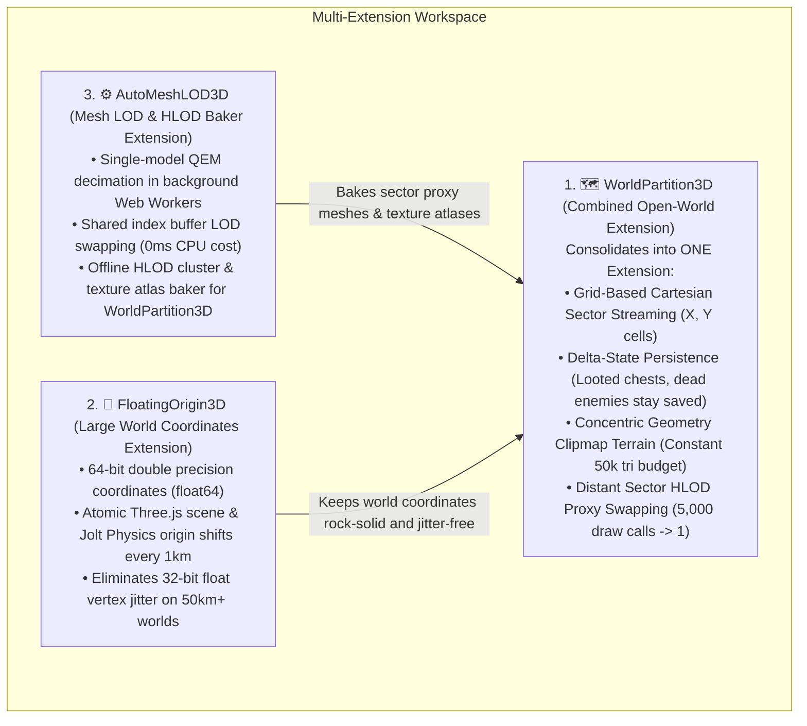

# Multi-Extension Workspace — Open-World & Draw Distance Optimization Suite

This workspace contains the coordinated **3-Extension Open-World Suite** for GDevelop 5:

---

## 📂 The 3 Consolidated Extensions in this Workspace

---

## 📑 Direct Documentation Index

### 1. 🗺️ [`WorldPartition3D/`](./WorldPartition3D) (Combined Extension)
* **What it combines in one behavior:** World Partition Grid Streaming + Delta-State Persistence + Concentric Geometry Clipmap Terrain + Distant Sector HLOD Proxy Swapping.
* [`README.md`](./WorldPartition3D/README.md) — Overview, features, and quick-start guide.
* [`IMPLEMENTATION_PLAN.md`](./WorldPartition3D/IMPLEMENTATION_PLAN.md) — Technical streaming algorithms, Losasso & Hoppe clipmaps, and LRU memory cache.
* [`API_REFERENCE.md`](./WorldPartition3D/API_REFERENCE.md) — Properties, Actions, Conditions, and Expressions.

---

### 2. 🌌 [`FloatingOrigin3D/`](./FloatingOrigin3D) (Large World Coordinates)
* **What it does:** Independent coordinate stabilizer managing 64-bit double precision coordinates and atomic Jolt Physics / Three.js origin shifts.
* [`README.md`](./FloatingOrigin3D/README.md) — Overview and precision jitter prevention.
* [`IMPLEMENTATION_PLAN.md`](./FloatingOrigin3D/IMPLEMENTATION_PLAN.md) — Quantized origin shift formulas and camera-relative shader pipeline.
* [`API_REFERENCE.md`](./FloatingOrigin3D/API_REFERENCE.md) — Properties, Actions, and Expressions.

---

### 3. ⚙️ [`AutoMeshLOD3D/`](./AutoMeshLOD3D) (LOD & HLOD Cluster Baker)
* **What it does:** Per-model QEM mesh simplification in background Web Workers, plus the offline HLOD tool that bakes entire villages into single proxy meshes for `WorldPartition3D`.
* [`README.md`](./AutoMeshLOD3D/README.md) — Overview and shared vertex buffer strategy.
* [`IMPLEMENTATION_PLAN.md`](./AutoMeshLOD3D/IMPLEMENTATION_PLAN.md) — QEM edge collapse math, Web Worker threading, and MaxRects atlas packing.
* [`API_REFERENCE.md`](./AutoMeshLOD3D/API_REFERENCE.md) — Properties, Actions, and Expressions.
