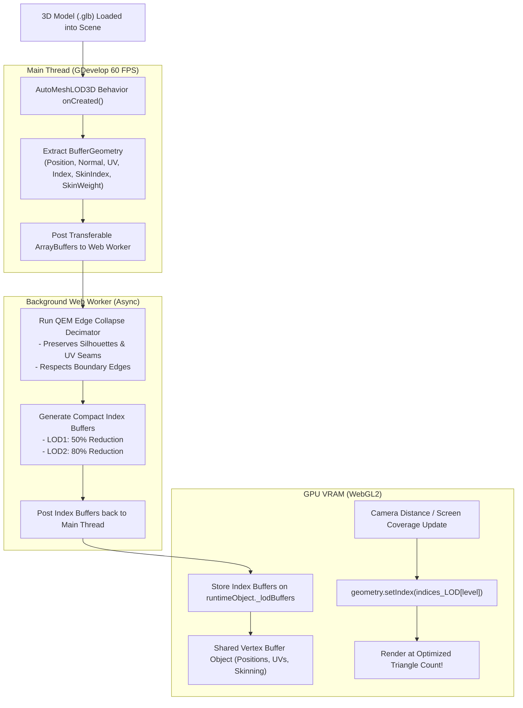

# AutoMeshLOD3D — Implementation Plan

This document details the engineering architecture, decimation algorithms, Web Worker asynchronous threading, and GDevelop behavior lifecycle for **AutoMeshLOD3D**.

---

## 1. System Architecture & Data Flow



---

## 2. Decimation Engine: Quadric Error Metric (QEM)

### Mathematical Formulation
For each vertex $v$, a quadric matrix $Q_v$ represents the sum of squared distances to all incident triangular planes:
$$Q_v = \sum_{p \in \text{planes}(v)} K_p, \quad \text{where } K_p = p \cdot p^T$$

When collapsing an edge $(v_1, v_2) \rightarrow \bar{v}$:
1. **Combined Quadric Matrix:**
   $$\bar{Q} = Q_{v_1} + Q_{v_2}$$
2. **Optimal Target Position:**
   $$\bar{v} = \bar{Q}^{-1} \begin{bmatrix} 0 \\ 0 \\ 0 \\ 1 \end{bmatrix}$$
3. **Error Metric:**
   $$\Delta(\bar{v}) = \bar{v}^T \bar{Q} \bar{v}$$

### UV & Attribute Preservation
- Edge collapses are prohibited if they would flip triangle winding order or tear UV seam boundaries.
- Vertex skin weights (`skinIndex`, `skinWeight`) for skeletal characters are interpolated to preserve smooth bone deformation during animation.

---

## 3. Shared Vertex Buffer & Multi-Index Strategy

Instead of cloning 3 separate geometries (which triples VRAM usage):
```javascript
// On the main thread, the geometry retains 1 shared vertex buffer:
mesh.geometry.attributes.position; // Shared across all LODs
mesh.geometry.attributes.normal;   // Shared across all LODs
mesh.geometry.attributes.uv;       // Shared across all LODs
mesh.geometry.attributes.skinIndex;// Shared across all LODs

// Only lightweight index arrays are stored:
mesh._lodIndices = {
  0: originalIndexBuffer,                                // 100% triangles (e.g. 30,000 indices = 60 KB)
  1: new THREE.BufferAttribute(lod1UintArray, 1),        // 50% triangles  (e.g. 15,000 indices = 30 KB)
  2: new THREE.BufferAttribute(lod2UintArray, 1)         // 20% triangles  (e.g. 6,000 indices  = 12 KB)
};
```

### Runtime Swapping:
During the frame update, changing LOD levels is a single pointer swap:
```javascript
if (currentLOD !== targetLOD) {
  mesh.geometry.setIndex(mesh._lodIndices[targetLOD]);
  mesh.geometry.index.needsUpdate = true;
  currentLOD = targetLOD;
}
```

---

## 4. Web Worker Threading Architecture

To guarantee that mesh decimation never stalls GDevelop's 60 FPS main game loop:
1. **Worker Pool:** A pool of $2\text{--}4$ Web Workers (matching `navigator.hardwareConcurrency`).
2. **Transferable Objects:** Geometry buffers are transferred (`postMessage([buffer], [buffer])`) with zero memory copy overhead.
3. **Job Queue:** If a scene spawns 50 props simultaneously, decimation requests are queued and processed asynchronously. Until a model's lower LOD index buffer finishes calculating, it renders at LOD0.

---

## 5. Unified 3-Tier Multi-Throttling

The behavior evaluates camera distance each frame and executes a unified throttle:

| Evaluation Tier | Camera Distance Range | Geometry Index Buffer | Shadow Casting | Skeletal Animation Rate |
| :--- | :--- | :---: | :---: | :---: |
| **LOD 0 (Full)** | $0\text{m} \le \text{Dist} < 25\text{m}$ | Original (100% Tris) | `castShadow = true` | 60 FPS (Every Frame) |
| **LOD 1 (Medium)** | $25\text{m} \le \text{Dist} < 60\text{m}$ | LOD 1 (50% Tris) | `castShadow = false` | 30 FPS (Every 2nd Frame) |
| **LOD 2 (Low)** | $\text{Dist} \ge 60\text{m}$ | LOD 2 (20% Tris) | `castShadow = false` | 15 FPS (Every 4th Frame) |

---

## 6. Implementation Phases

### Phase 1: Core Runtime & Worker Infrastructure
* Create `AutoMeshLOD3D.worker.js` containing the QEM decimation algorithm.
* Create `AutoMeshLOD3D.runtime.js` managing the worker pool, job queue, and cache.

### Phase 2: Index Buffer Generation & Caching
* Add an in-memory LRU cache so identical prop models (e.g. 100 identical trees) only run the decimation algorithm **once**. All other instances immediately share the cached index buffers.

### Phase 3: Behavior Integration
* Create the `AutoMeshLOD3D` behavior attached to `Model3DRuntimeObject`.
* Implement `onCreated`, `doStepPreEvents`, and `onDestroy` lifecycle hooks.

### Phase 4: Screen-Coverage / Projected Pixel Sizing (Optional Mode)
* Implement projected pixel screen size calculations:
  $$\text{ScreenSize} = \frac{\text{BoundingRadius} \cdot \text{ScreenHeight}}{2 \cdot \text{Distance} \cdot \tan(\text{FOV} / 2)}$$

### Phase 5: Verification & Benchmarking
* Test with complex static meshes (100,000+ triangles) and animated character meshes.
* Verify memory footprint and triangle count drop in profiler.
