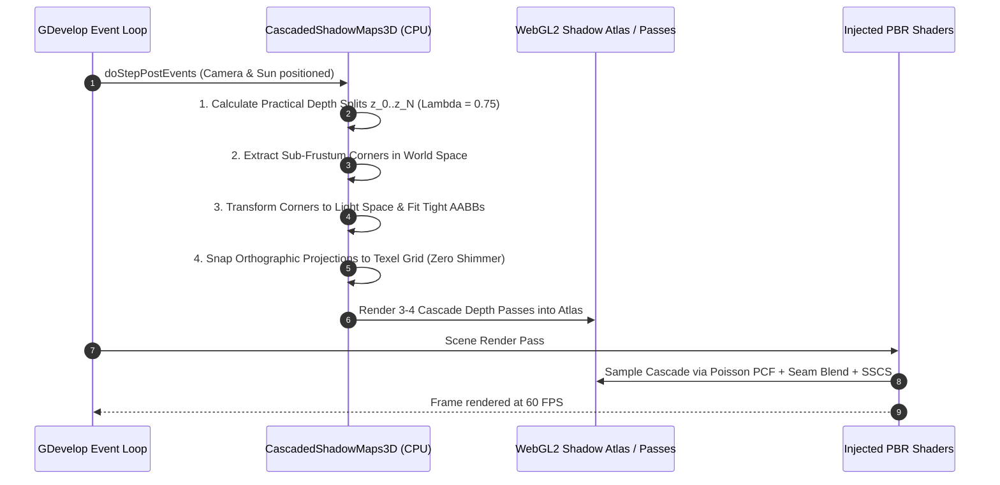
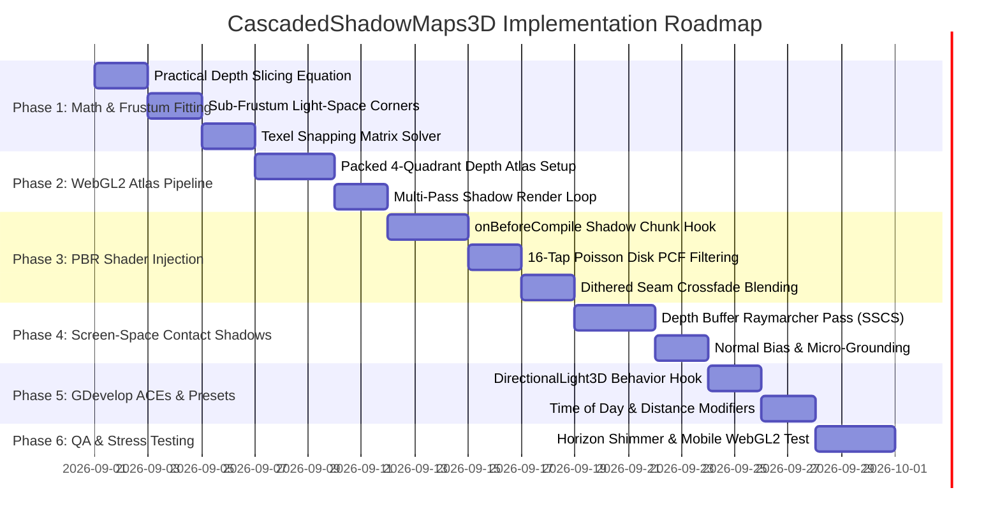

# CascadedShadowMaps3D — Implementation Plan

This document outlines the technical architecture, mathematical split algorithms, texel stabilization matrices, WebGL2 shadow atlas packing, shader injection hooks, and implementation phases for **CascadedShadowMaps3D**.

---

## 1. System Architecture & Lifecycle

`CascadedShadowMaps3D` operates as a high-performance directional shadow subsystem intercepting GDevelop's `DirectionalLight3D` and Three.js shadow pipeline:



---

## 2. Mathematical Formulations & Algorithms

### A. Practical Split Scheme (Logarithmic vs. Uniform Blend)
To achieve optimal texel distribution across camera depths $[z_{\text{near}}, z_{\text{maxShadow}}]$, cascade split distances $z_i$ ($i \in [0, N]$) are computed using the **Practical Split Equation** (Zhang et al. / Engel):

$$z_i = \lambda \cdot z_{\text{near}} \left(\frac{z_{\text{max}}}{z_{\text{near}}}\right)^{\frac{i}{N}} + (1 - \lambda) \cdot \left(z_{\text{near}} + \frac{i}{N}(z_{\text{max}} - z_{\text{near}})\right)$$

Where:
* $N = 3$ (Number of active cascades).
* $\lambda \in [0.0, 1.0]$ (Default $\lambda = 0.75$, balancing logarithmic resolution near the camera with linear reach).
* Example for $z_{\text{near}} = 0.1\text{m}, z_{\text{max}} = 250.0\text{m}$:
  - $z_0 = 0.10\text{m}$ (Near Plane)
  - $z_1 = 14.8\text{m}$ (Cascade 0: High-density micro-shadows)
  - $z_2 = 62.4\text{m}$ (Cascade 1: Medium-range props & trees)
  - $z_3 = 250.0\text{m}$ (Cascade 2: Distant terrain ridges & horizon)

---

### B. Sub-Frustum Tight Fitting in Light Space
For each cascade $i$:
1. Calculate the 8 corner vertices of the sub-frustum $[z_i, z_{i+1}]$ in Camera View Space.
2. Unproject corners to World Space via $\mathbf{M}_{\text{camWorld}}$.
3. Transform corners into **Light View Space** using the Sun's rotation matrix $\mathbf{M}_{\text{lightView}}$.
4. Calculate the bounding box in Light Space: $[x_{\text{min}}, x_{\text{max}}, y_{\text{min}}, y_{\text{max}}, z_{\text{min}}, z_{\text{max}}]$.
5. Extend the near plane backward ($z_{\text{min}} -= \text{CasterExtrusion}$) to catch shadow casters standing behind the cascade boundary.

---

### C. Light-Space Texel Stabilization (Snapping)
When the camera rotates or translates, the shadow projection matrix moves by fractional sub-texel amounts, causing high-frequency edge crawling and shimmering ("shadow swimming").

To eliminate shimmering, the orthographic projection origin is snapped to integer multiples of the world texel size:

$$\text{worldTexelSize} = \frac{x_{\text{max}} - x_{\text{min}}}{\text{shadowResolution}}$$

$$\Delta X = \left\lfloor \frac{x_{\text{min}}}{\text{worldTexelSize}} \right\rfloor \cdot \text{worldTexelSize} - x_{\text{min}}$$

$$\Delta Y = \left\lfloor \frac{y_{\text{min}}}{\text{worldTexelSize}} \right\rfloor \cdot \text{worldTexelSize} - y_{\text{min}}$$

$$x_{\text{min}} \mathrel{+}= \Delta X, \quad x_{\text{max}} \mathrel{+}= \Delta X, \quad y_{\text{min}} \mathrel{+}= \Delta Y, \quad y_{\text{max}} \mathrel{+}= \Delta Y$$

> **Result:** The shadow map grid stays permanently anchored to world space texels. Shadow edges remain **100% stationary and rock-solid** regardless of camera movement.

---

### D. 16-Tap Poisson Disk PCF Soft Filtering
Standard hardware PCF is limited to $2 \times 2$ filtering. We implement a **16-Tap Poisson Disk Kernel**:

$$S(u, v) = \frac{1}{16} \sum_{k=0}^{15} \text{SampleShadowMap}\left((u, v) + \vec{P}_k \cdot \text{FilterRadius}, z_{\text{light}} - \text{Bias}\right)$$

Where $\vec{P}_k$ are precomputed Poisson disk distribution offsets:
```
P[0] = (-0.3262, -0.4058),  P[1] = (-0.8401, -0.0735),  P[2] = (-0.6959,  0.4571)
P[3] = (-0.2033,  0.6206),  P[4] = ( 0.9623, -0.1950),  P[5] = ( 0.4734, -0.4800)
... (16 stratified taps)
```

---

### E. Dithered Cascade Seam Blending
To prevent hard, visible resolution steps between cascades, a transition band of width $w = 0.10 \cdot z_{i+1}$ smoothly blends cascade $i$ into cascade $i+1$:

$$t_{\text{blend}} = \text{smoothstep}(z_{i+1} - w, z_{i+1}, z_{\text{view}})$$

$$\text{FinalShadow} = \text{mix}(\text{Shadow}_i, \text{Shadow}_{i+1}, t_{\text{blend}})$$

---

### F. Screen-Space Contact Shadows (SSCS Micro-Raymarcher)
Traces short screen-space rays in the depth buffer from the fragment toward the light vector:

$$\vec{P}_{\text{step}} = \frac{\vec{L}_{\text{screen}} \cdot \text{RayLength}}{\text{Steps}}, \quad \text{Steps} = 8$$

For each step $s \in [1, 8]$:
$$\vec{P}_{\text{sample}} = \vec{P}_{\text{screen}} + \vec{P}_{\text{step}} \cdot s$$
$$\Delta Z = Z_{\text{sample}} - \text{SampleLinearDepth}(\vec{P}_{\text{sample}}.xy)$$
If $0.001 < \Delta Z < \text{Thickness}$, the ray is occluded $\rightarrow$ Contact Shadow Factor $= 0.0$.

---

## 3. WebGL2 GPU Shadow Atlas Layout

To avoid exhausting WebGL texture units, all 3–4 cascades are packed into a single $4096 \times 4096$ or $2048 \times 2048$ **Depth Texture Atlas** (`THREE.DepthTexture`):

```
+------------------------+------------------------+
|                        |                        |
|   Cascade 0 (Near)     |   Cascade 1 (Mid)      |
|   [0.0, 0.5] x [0.5, 1] |   [0.5, 1.0] x [0.5, 1]|
|                        |                        |
+------------------------+------------------------+
|                        |                        |
|   Cascade 2 (Far)      |   Cascade 3 / Unused   |
|   [0.0, 0.5] x [0.0, 0.5|   [0.5, 1.0] x [0.0, 0.5|
|                        |                        |
+------------------------+------------------------+
```

---

## 4. Injected Shader Chunk (`onBeforeCompile`)

```glsl
// --- CASCADED SHADOW MAP EVALUATION ---
#ifdef USE_CSM_SHADOWS
  float viewDepth = -vViewPosition.z;
  int cascadeIndex = 0;
  
  if (viewDepth > uCSMSplits[1]) {
    cascadeIndex = 2;
  } else if (viewDepth > uCSMSplits[0]) {
    cascadeIndex = 1;
  }
  
  // Transform world position by the selected cascade's shadow matrix
  vec4 shadowCoord = uCSMShadowMatrices[cascadeIndex] * vec4(vWorldPosition, 1.0);
  shadowCoord.xyz /= shadowCoord.w;
  
  // Slope-scale depth bias
  float cosTheta = clamp(dot(geometryNormal, uSunDirection), 0.0, 1.0);
  float bias = max(0.002 * (1.0 - cosTheta), 0.0005);
  
  // 16-Tap Poisson Disk PCF
  float shadowFactor = 0.0;
  vec2 texelSize = vec2(1.0 / 4096.0);
  
  for (int tap = 0; tap < 16; ++tap) {
    vec2 offset = uPoissonDisk[tap] * uShadowFilterRadius * texelSize;
    float depthSample = texture(uCSMShadowAtlas, shadowCoord.xy + offset).r;
    shadowFactor += (depthSample < shadowCoord.z - bias) ? 0.0 : 1.0;
  }
  shadowFactor *= 0.0625; // Divide by 16
  
  // Screen-Space Contact Shadow Occlusion
  #ifdef USE_SSCS
    shadowFactor *= evaluateContactShadow(gl_FragCoord.xy, vViewPosition, uSunDirectionView);
  #endif
  
  // Multiply direct sun light by final shadow factor
  directDiffuse *= shadowFactor;
  directSpecular *= shadowFactor;
#endif
```

---

## 5. Implementation Phases



---

## 6. Performance Budgets & Target Metrics

| Subsystem | CPU Time Budget | GPU Time Budget | Memory / VRAM |
| :--- | :---: | :---: | :---: |
| **CPU Frustum Fitting & Snapping** | $< 0.04\text{ ms}$ | $0.0\text{ ms}$ | $0\text{ B per frame}$ |
| **Cascade Shadow Depth Passes (3 Cascades)** | $< 0.02\text{ ms}$ | $< 1.1\text{ ms}$ | 1 Depth Atlas ($2048^2$ or $4096^2$) |
| **PBR Fragment Evaluation (16-tap PCF)** | $0.0\text{ ms}$ | $< 0.4\text{ ms}$ | Single texture fetch per tap |
| **Screen-Space Contact Shadow Pass (SSCS)** | $0.0\text{ ms}$ | $< 0.5\text{ ms}$ | Fullscreen depth read |
| **Total Frame Overhead** | **$< 0.06\text{ ms}$** | **$< 2.0\text{ ms}$** | **Solid 60 FPS at 1080p / 1440p** |
