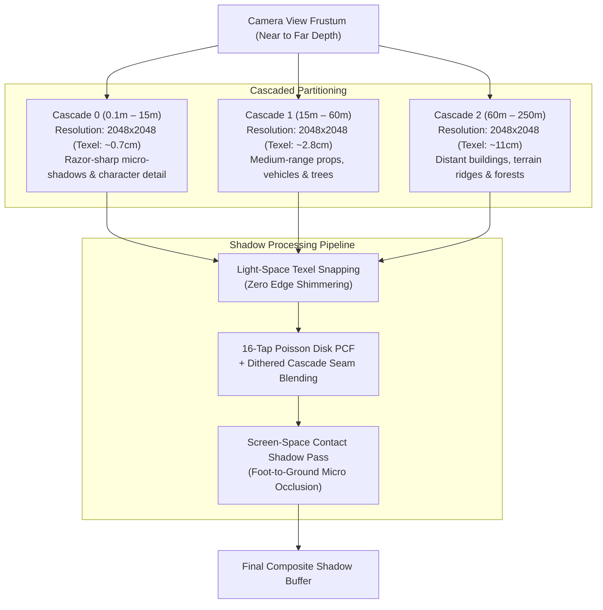

# CascadedShadowMaps3D — High-Fidelity Cascaded Shadow Maps & Contact Shadows for GDevelop

> **Integration status:** Retained as the CSM design record for AdvancedLighting3D. The intended
> implementation is a selectable `CSM` mode alongside `SDF`, with `Hybrid` as the default. See
> `AdvancedLighting3D/SHADOW_SELECTOR_IMPLEMENTATION_PLAN.md` for ownership, lifecycle, API, and
> verification requirements.

**CascadedShadowMaps3D (CSM)** is an advanced directional shadow architecture for **GDevelop 5 (Three.js WebGL2 backend)**.

It replaces GDevelop's single, blurry directional shadow map with **3 to 4 tightly fitted depth cascade sub-frustums**, combined with **Light-Space Texel Stabilization (Snapping)**, **Poisson Disk PCF Soft Filtering**, and **Screen-Space Contact Shadows (SSCS)**. 

The result is razor-sharp shadow fidelity up close (character fingers, facial features, weapon ironsights) while maintaining smooth, wide-range shadow coverage out to the distant horizon (hundreds of meters away) at a rock-solid 60 FPS.

---

## 🌟 Key Highlights

- **3–4 Depth Cascades:** Splits camera frustum into logarithmic/practical depth partitions (e.g., Near: 0–15m, Mid: 15–60m, Far: 60–250m).
- **Sub-Texel Light Snapping:** Locks shadow matrices to world texel grid increments, completely eliminating shadow edge shimmering and crawling artifacts during camera rotation and translation.
- **Screen-Space Contact Shadows (SSCS):** Traces high-speed depth-buffer rays to ground micro-details (character feet, pebbles, grass roots) where traditional shadow maps suffer from bias detachment ("Peter Panning").
- **Dithered Cascade Seam Blending:** Smoothly cross-fades boundaries between cascades over a 10% transition band, eliminating hard visible resolution seams.
- **Dynamic Split Adjustment ($\lambda$):** Balances uniform vs. logarithmic depth distribution to match first-person, third-person, top-down, or flight simulator perspectives.
- **Optimized for WebGL2:** Packed 2D Shadow Atlas / 2D Texture Arrays (`sampler2DArray`) with 16-tap Poisson PCF filtering in a single texture slot.

---

## 📐 The Cascade Split Architecture

---

## 📊 Comparison: Standard Shadow Map vs. CascadedShadowMaps3D

| Metric / Feature | Standard GDevelop 3D Shadow | CascadedShadowMaps3D (CSM + SSCS) |
| :--- | :--- | :--- |
| **Shadow Frustum Coverage** | Single box stretched over entire world | 3–4 tight sub-frustums fitted per depth zone |
| **Close-Up Texel Density** | Low ($~0.05\text{ texels/cm}$, blurry) | **Ultra-High ($~1.4\text{ texels/cm}$, razor-sharp)** |
| **Max Shadow Distance** | 30m – 50m before severe pixelation | **250m – 500m with zero near-range quality loss** |
| **Camera Movement Artifacts** | Noticeable edge shimmering & crawling | **Rock-solid (Stabilized Texel Snapping)** |
| **Contact Anchoring** | Light leaks / "Peter Panning" gap | **Grounded contact shadows via SSCS raymarching** |
| **Boundary Transitions** | N/A | **Dithered cross-fade blending across cascade seams** |
| **GPU Texture Overhead** | 1 Shadow Map | **1 Packed Shadow Atlas (Single Texture Slot)** |

---

## 🚀 Quick Start Guide

1. **Add Scene Manager:** Add the **`CascadedShadowMaps3D`** global behavior or action to your scene's main Directional Light (Sun).
2. **Configure Cascades:** Set **Cascade Count** to `3` and configure **Max Shadow Distance** to `250.0` meters.
3. **Select Split Mode:** Choose `Practical` ($\lambda = 0.75$) for general 3D games, or `Logarithmic` for wide horizon views.
4. **Enable Contact Shadows:** Toggle `EnableSSCS` to `true` to instantly ground character feet and small scene props.
5. **Trigger In Events:**
   - On time-of-day changes: `CascadedShadowMaps3D::SetSunDirection(pitch, yaw)`
   - On indoor transitions: `CascadedShadowMaps3D::SetMaxDistance(40.0)` for boosted indoor density.

---

## 📚 Documentation Index

- [IMPLEMENTATION_PLAN.md](./IMPLEMENTATION_PLAN.md) — Mathematical formulations (Practical split equation, texel-grid snapping matrices, PCF Poisson shader chunk injection, SSCS depth-raymarch algorithm) and WebGL2 implementation phases.
- [API_REFERENCE.md](./API_REFERENCE.md) — Comprehensive specification of Properties, Actions, Conditions, and Expressions (ACEs).
