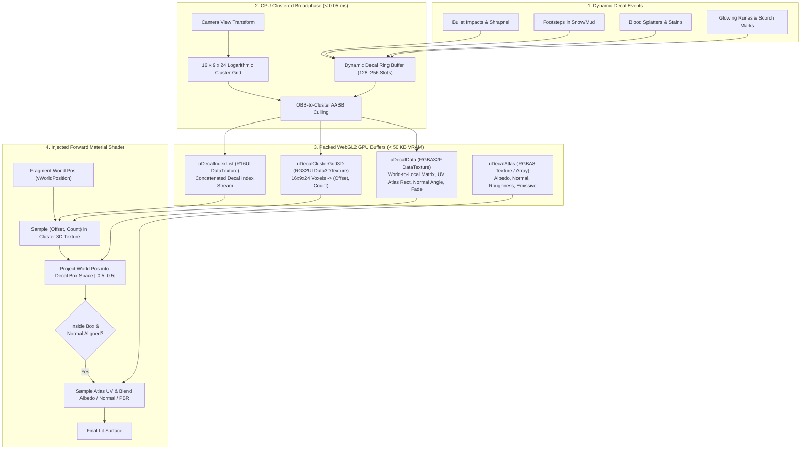

# ClusteredDetail — Clustered Forward Projective Decals for GDevelop 5

**ClusteredDetail** is a high-performance 3D projective decal pipeline for **GDevelop 5 (Three.js WebGL2 backend)**.

It allows scenes to render **hundreds of dynamic surface details** — bullet holes, footsteps, blood splatters, explosion scorch marks, puddles, tire tracks, cracks, and glowing magical runes — with **zero extra draw calls**, **zero geometry clipping**, and **zero frame hitches**.

---

## 🌟 The Problem ClusteredDetail Solves

In 3D games, placing visual marks on surfaces (floors, walls, props, characters) has historically been one of the hardest technical challenges in WebGL:

| Decal Approach | How It Works | The Problem in GDevelop / WebGL |
| :--- | :--- | :--- |
| **Mesh Decals** (`THREE.DecalGeometry`) | Raycasts surface triangles and generates a brand new sliced polygon mesh sitting 0.1 mm off the wall. | ❌ **Severe CPU hitches:** Slicing complex meshes freezes the game. ❌ **Draw call explosion:** 50 bullet impacts = 50 additional draw calls. ❌ **Z-fighting:** Meshes flicker against underlying geometry when camera moves. |
| **Deferred Screen-Space Decals** | Renders 3D boxes into the camera's depth buffer (standard in Unreal/Unity). | ❌ **Impossible in GDevelop:** GDevelop uses a forward WebGL2 renderer without a sampleable GBuffer or depth texture. |
| **Clustered Projective Decals (This Plan)** | Treats decals as **3D Oriented Bounding Boxes (OBBs)** binned into a 3D frustum cluster grid, projected in the forward material pass. | ✅ **0 Extra Draw Calls:** All decals render in the base mesh draw call. ✅ **0 Geometry Slicing:** Spawning a decal just writes a 16-float matrix. ✅ **No Z-Fighting:** Decals are evaluated per-fragment directly on the geometry. |

---

## 📐 The Clustered Decal Pipeline

---

## 🚀 Key Architectural Advantages

### 1. Zero Extra Draw Calls
Whether your scene has **1 decal or 256 active decals**, your draw call count remains completely unchanged. Decals are projected during the existing mesh draw calls of surfaces marked with `ReceiveClusteredDecals`.

### 2. Instant Spawning with Ring Buffer Memory
No mesh generation, no BVH updates, and no GC memory churn. Spawning a bullet hole is an $O(1)$ ring-buffer write of:
- Center position $(x, y, z)$
- Rotation quaternion or orientation vector
- Box dimensions (width, height, depth)
- Atlas coordinate index and blend mode
Oldest decals fade out and get overwritten automatically when the ring buffer fills.

### 3. Wraps Around Complex Corners Automatically
Because projection happens per fragment in 3D world space, a single decal placed on the corner of a step or between a floor and wall naturally and seamlessly projects onto **both surfaces** with zero gaps or stretching.

### 4. Angle-Based Normal Rejection
A common flaw with naive projective decals is "back-projection" or bleeding onto steep surfaces (e.g., a floor puddle bleeding 10 meters up a vertical wall). ClusteredDetail compares the surface normal with the decal's projection direction and applies a smooth cosine falloff, cleanly cutting off the decal when surface angle exceeds the user-defined threshold.

### 5. Multi-Channel PBR Blending
Decals are not just flat stickers; they can modify:
- **Albedo / Base Color:** Blood, dirt, paint, scorch marks (with Alpha Blend, Multiply, or Screen modes).
- **Normal Maps:** Relief cracks, indented bullet dents, chipped stone (blended via Reoriented Normal Mapping).
- **Roughness / Metallic:** Wet puddles, polished wax, matte dirt.
- **Emissive:** Glowing sci-fi runes, molten impact marks, neon signage.

---

## 📊 Comparison Matrix

| Feature | Standard Three.js Mesh Decal | Deferred Screen-Space Decal | ClusteredDetail (This Extension) |
| :--- | :--- | :--- | :--- |
| **Draw Call Overhead** | +1 draw call per decal | +1 draw call per decal volume | **0 extra draw calls** |
| **CPU Spawning Cost** | Very High (CPU mesh slicing) | Low (Matrix set) | **Instant ($O(1)$ buffer write)** |
| **Memory Footprint** | Heavy (triangle buffers per decal) | Low | **Tiny (< 60 KB GPU buffer)** |
| **GDevelop Forward Renderer Fit** | Poor (causes hitches on spawn) | Incompatible (no depth texture) | **Perfect (native forward injection)** |
| **Z-Fighting / Flickering** | Prone to flickering | None | **None (evaluated on surface)** |
| **Corner / Edge Wrapping** | Broken across distinct objects | Full | **Full across all receiving meshes** |
| **Max Concurrent Decals** | 10–20 before performance drops | 50–100 | **128–256+ with flat 60 FPS** |

---

## 📂 Plan Documents in this Directory

* [`IMPLEMENTATION_PLAN.md`](./IMPLEMENTATION_PLAN.md) — Comprehensive technical architecture, mathematical formulations, GPU DataTexture schemas, GLSL shader injection code, and phased milestones.
* [`API_REFERENCE.md`](./API_REFERENCE.md) — Full GDevelop-facing action, condition, expression, and behavior specification.
* [`test-plan-validation.mjs`](./test-plan-validation.mjs) — Standalone verification script validating the mathematical projections, OBB clipping, atlas UV calculations, and binary GPU packing.
