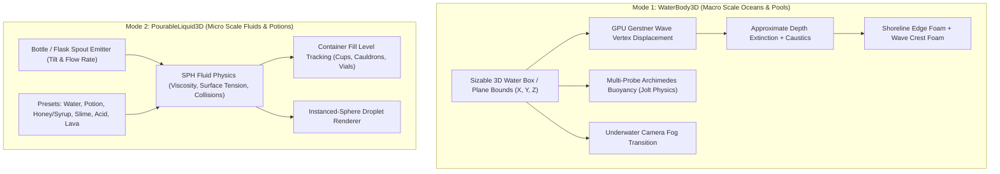

# FluidAndWater3D — Sizable Water Volumes, Gerstner Oceans, Buoyancy & Pourable SPH Liquids for GDevelop

**FluidAndWater3D** is a water rendering, buoyancy, and stylized fluid toolkit for **GDevelop 5 (Three.js WebGL2 backend)**.

It brings together **large-scale water bodies** (sizable 3D ocean/river/lake volumes with Gerstner waves, underwater submersion, and boat buoyancy) and **micro-scale pourable liquids** (SPH particle fluids for pouring potions, filling flasks, alchemy cauldrons, and splashing viscous slimes) in a single unified extension.

---

## 🌟 Key Highlights

- **Dual-Mode Fluid Architecture:**
  1. **`WaterBody3D`:** Sizable 3D water box or ocean plane for open-world seas, swimming lakes, rivers, and swimming pools.
  2. **`PourableLiquid3D`:** Lagrangian SPH particle fluid simulator for pouring potions, filling bottles, splashing acid, and viscous honey/slime.
- **Multi-Octave Gerstner Wave Displacement:** Realistic sharp-peaked ocean swells and rolling waves displaced on the GPU with full CPU/GPU height synchronization.
- **Deterministic Wave Irregularity:** Crest lines bend and evolve without frame noise, while CPU height queries and buoyancy remain synchronized with the GPU surface.
- **Absolute or Volume-Relative Wave Scale:** `WaveScaleMode` picks between world-space waves that tile seamlessly between adjacent oceans, and waves sized to the volume so a pool looks like a pool. Octaves the surface mesh cannot resolve are filtered out on both the GPU and the CPU, so a large body reads as calm rather than as sampling noise.
- **Beer-Lambert Depth Absorption:** Physically-shaped extinction (crystal shallow turquoise $\rightarrow$ deep oceanic navy) with Schlick Fresnel reflections. The optical column is approximated from the water volume's own bounds — see *Limitations*.
- **Water-Aware Shorelines & Whitecaps:** `WaterEdge3D` masks water beneath land, drives a water-side surf band and shallow color, and damps waves as they run ashore. Crest foam remains wave-driven offshore.
- **Underwater Submersion:** Optional automatic fog transition while the camera is inside and below a water volume.
- **Multi-Point Jolt Physics Buoyancy:** 4/8-probe hull buoyancy plus configurable roll/pitch stabilization for boats, rafts, crates, and ships. Lift is applied only while the hull actually overlaps the water volume.
- **Automatic Jolt Wakes & Splashes:** Any moving `Physics3D` object intersecting either water type creates expanding ripples and foam; a player does not need `Buoyancy3D` just to disturb the surface.
- **Two Ocean Models:** Use controllable Gerstner waves for pools, rivers, and modest seas, or a Tessendorf/Phillips FFT spectrum for large open water.
- **Native 3D Skybox Reflection:** Automatically detects and reflects GDevelop's built-in 3D Layer Effect `Skybox` cubemap with vertical coordinate-inversion correction, seamlessly falling back to an analytic sky dome when no skybox is active.
- **Scene DirectionalLight Auto-Sync:** Automatically tracks scene directional lights for sun direction, color, and specular trails, with full override options via actions or `WaterDetailing3D`.
- **SPH Pouring & Container Level Tracking:** Tilt bottles or flasks to pour liquid droplets with realistic viscosity, surface tension, and liquid volume fill tracking inside cups and cauldrons.
- **Per-Droplet Fluid Materials:** Every droplet carries its own viscosity, surface tension, rest density, radius and colour, so honey and water can pour in the same scene and behave differently.

---

## 📐 The Dual-Mode Architecture



---

## 📊 Dual Mode Comparison

| Feature / Metric | 🌊 `WaterBody3D` (Ocean & Pool Volumes) | 🧪 `PourableLiquid3D` (SPH Pouring & Potions) |
| :--- | :--- | :--- |
| **Primary Scope** | Large environments (Oceans, rivers, lakes, flooded rooms). | Small interactions (Bottles, potions, chemistry, cups). |
| **Geometry Setup** | Resizable 3D Box or Plane placed in scene. | Particle emitter attached to bottle neck or tap. |
| **Physics Method** | Analytical Gerstner wave displacement + Buoyancy forces. | Smoothed Particle Hydrodynamics (SPH) particle collisions. |
| **Surface Rendering**| Displaced water shader with depth absorption. | Instanced droplet spheres, coloured per fluid preset. |
| **Viscosity Support**| Wave drag & current flow vectors. | Full viscosity spectrum (Water $\rightarrow$ Honey $\rightarrow$ Slime). |
| **Container Filling**| Static volume boundary. | Dynamic volume accumulation and liquid level tracking. |
| **Performance** | Mostly GPU-bound; measure on target hardware. | CPU cost depends strongly on active droplets and local neighbour density; use `test-sph.mjs` as a host benchmark. |

---

## 🚀 Quick Start Guide

### Setup 1: Ocean / Lake Water Volume
1. Add a 3D Box or Plane object to your scene and attach **`WaterBody3D`**.
2. Resize the box to cover your ocean or lake basin.
3. Attach **`Buoyancy3D`** to your Boat or Floating Crate object.
4. When play starts, the boat automatically floats, rocks on wave peaks, and the camera tints underwater when diving.

For a ship, start with **Hull Probe Count = 8-HullBox**, **Ship Stability = 0.65**, and
**Stability Damping = 1.5**. Raise damping if the hull keeps oscillating; raise stability if it heels
too far. Set stability to `0` for loose debris that should tumble freely. Leave **Max Submersion
Depth** at `0`: the lift ramp then spans the hull itself, so the boat settles about half under and
the same settings work whether your scene is 100 or 10,000 units across. A number there is in
pixels, not metres — a small one makes the hull ride on top of the water and bob far too stiffly.

A `Physics3D` behavior is required for gravity outside the water; without it, buoyancy uses a
kinematic surface-following fallback and deliberately leaves the object alone when it is not
touching water.

For a swimming player, attach GDevelop's `Physics3D` behavior and let the player's 3D bounds overlap
the water volume. Both `WaterBody3D` and `OceanWaveWorks3D` detect the Jolt velocity automatically. Tune
**Splash Strength**, **Splash Radius**, and **Splash Speed Threshold** on the water object; no collision
event or `Buoyancy3D` behavior is required for the wake effect.

### Setup 2: Pourable Potion Flask
1. Attach **`PourableLiquid3D`** to a Potion Flask object.
2. Set Fluid Preset to `"Magic Potion"` or `"Honey"`.
3. In Events: When flask pitch angle $> 45^\circ$, trigger `PourableLiquid3D::StartPouring()`.
4. When droplets collide with a Cauldron object, the cauldron's liquid level rises dynamically!

---

## 📚 Documentation Index

- [IMPLEMENTATION_PLAN.md](./IMPLEMENTATION_PLAN.md) — Technical architecture, mathematical formulations, shipped-status matrix, performance targets, and deferred rendering work.
- [API_REFERENCE.md](./API_REFERENCE.md) — Complete specification of Behavior Properties for both modes, Actions, Conditions, Expressions (ACEs), and Fluid preset profiles.

---

## 🌊 Choosing a water model

| | Gerstner Water (`WaterBody3D`) | `OceanWaveWorks3D` |
| :--- | :--- | :--- |
| Method | 10 Gerstner octaves, analytic | **Triple-field spectral FFT (WaveWorks replica)** |
| Authored by | wave height in units | **Beaufort wind scale (0-12) / m/s** |
| Wave components | 10 | **3 x resolution² wavenumbers** |
| Features | Baseline Gerstner displacement | **Cascades, cross swell, Jacobian foam, collision spray** |
| CPU cost | Small analytical queries only | ~0.6 ms at 32² |
| Good for | Pools, simple lakes, baseline water | **Open water, cinematic realism, Sea of Thieves style** |

The Gerstner `GerstnerWater2_3D` behavior was removed in 4.4.0 and the single-cascade `OceanFFT3D`
in 2.12.0. `OceanWaveWorks3D` supersedes both and keeps the same Tessendorf 2001 foundation (the
model behind Sea of Thieves - Ang et al., SIGGRAPH 2018 Talks), with the *Sea of Thieves* look
available through `WaterDetailing3D`'s style axis instead of a separate water model.

Wave height is not authored: it follows the physical relation `Hs = 0.21 V²/g` from wind speed, so
6 m/s gives a 0.8 m chop and 24 m/s a 12 m storm sea. Foam is generated where the surface **folds**
(the displacement Jacobian), the same criterion Rare uses, rather than from wave height - which is
why its whitecaps are irregular instead of identical caps on identical peaks.

### Three seas, not one

`OceanWaveWorks3D` runs three FFT fields at once:

| Field | Tile | Direction | What it is |
| :--- | :--- | :--- | :--- |
| Cascade 0 | full | with the wind | the swell |
| Cascade 1 | ¼ tile | with the wind | wind chop and capillary detail, blended by `CascadeWeight` |
| Cross swell | full | `SwellAngle` off the wind | a second sea of comparable wavelength, blended by `SwellWeight` |

The cross swell exists because **a single sea cannot break against itself**. The Phillips spreading
is cos-squared about the wind and cuts upwind energy to 7%, so every crest in one field travels the
same way and nothing ever converges - the sea marches instead of colliding. A second field at a real
angle is what lets two crest-sized waves actually meet, which is what drives crest-collision spray
and the hardest whitecaps.

It has to be a *full* field. Angling the detail cascade instead only crossed chop over swell: the
two trains were four times apart in wavelength, so nothing wave-sized ever hit anything wave-sized.
Measured hard collisions at Beaufort 9 on a 320 m body: 1.78% with a single sea, 2.58% with the
cross swell at its default 0.55, and it keeps climbing to 1.0. Set `SwellWeight` to 0 for a
single-direction sea, which also skips that field's FFTs entirely.

`Buoyancy3D` works with both water models (`WaterBody3D`, `OceanWaveWorks3D`). It selects only a water volume that overlaps the hull in XY and Z;
a distant registered ocean can no longer make an object float in empty space or override a nearby
water body. When water overlaps the hull it samples the exact same wave formula or spectral field the surface is
displaced from, so the hull cannot float out of phase with the waves you can see.

---

## 🎨 `WaterDetailing3D` (Visual Polish, Shaders & Settings Customizer)

Attach **`WaterDetailing3D`** to any 3D object with a water behavior (`WaterBody3D` or `OceanWaveWorks3D`) for instant AAA visual polish:

* **Directional Sun Azimuth & Altitude:** Set `SunHeading` ($0 - 360^\circ$) and `SunElevation` ($0 - 90^\circ$). Low golden-hour angles ($15 - 25^\circ$) cast the signature blazing *Sea of Thieves* specular sun trail across the ocean.
* **Dual-Lobe Specular Highlights:** Crisp solar disk reflection surrounded by an anisotropic glint trail.
* **Anti-Aliased Capillary Micro-Ripples:** Scaled multi-octave normal harmonics (`MicroFrequency`, `MicroDetail`) that completely eliminate high-frequency moiré diamond grid patterns.
* **Wave Depth Contrast:** Modulates Beer-Lambert optical column by wave tilt and elevation (`WaveContrast`). Eliminates washed-out flat cyan by deepening wave troughs into oceanic navy while keeping crests luminous.
* **Wave-Collision Droplet Spray (`SprayEnabled`):** Automatically detects colliding wave crests (where both eigenvalues in the displacement gradient tensor collapse, $\lambda_{\max} < 0.85$) and launches upward droplet plumes using a dedicated lightweight `SpraySystem` pool with Phase 4 plume foam base whitening.
* **Hardware Anisotropic Filtering (`TextureAnisotropy`):** Uses mipmaps to improve ocean detail and persistent foam filtering at grazing angles. The requested level (1x to 16x) is limited by device and texture-format support, with a 1x fallback. Wave geometry and CPU height queries use the original field. Changing the setting preserves persistent foam history; it does not eliminate every source of horizon aliasing.
* **Directional Subsurface Scattering (SSS):** Backlit inner glow through wave crests aligned with camera-sun opposition.
* **Quick Presets:** Instant visual profiles (`Sea of Thieves - Golden Hour`, `Sea of Thieves - Midday`, `Stormy - Dark`, `Crystal Clear Tropical`).
* **Full In-Game Customizer API:** Every parameter has dedicated GDevelop actions and expressions, making it trivial to build in-game graphical settings menus and sliders.


### Ocean & Water Environmental Presets (Dynamic Color & Sea State)

A named preset **owns** the look: it overrides the individual colour, foam and sea-state properties on the same behavior. Set the preset to `Custom` when you want to author those values yourself.

`WaterDetailing3D` splits that choice across three independent selectors — **Style** (how the water is drawn), **Water Type** (what the water is), and **Lighting** (what hour it is). "Sea of Thieves + Murky + Midday" is stylized murky water at noon; swapping the style to `Realistic` draws the same water physically. A style carries no colours of its own, so adding one costs a single table entry rather than a palette per combination.

`WaterDetailing3D` supports dynamic environmental presets that retune both physical sea state and **water color palettes (shallow color, deep color, SSS glow, optical depth)** at runtime without changing mesh subdivisions (`GridSubdivisions`).

`OceanWaveWorks3D` deliberately does not: its **Beaufort Scale Preset** offers `Custom` plus the continuous Beaufort scale ($0 - 12$), because that property sets the physical SEA STATE. Attach `WaterDetailing3D` to the same object for the colour, sun and foam styling below.

| Preset | Description | Visual Character |
| :--- | :--- | :--- |
| **`Swimming Pool`** | Flat water, zero wave displacement, full seabed caustics (1.5) | Vibrant turquoise shallow water `[20, 225, 240]`, deep azure pool water `[10, 115, 185]`, crisp Voronoi caustics throughout. Ideal for resort swimming pools, baths, and calm indoor water. |
| **`Sea of Thieves`** | Wind = 10 m/s (signature Caribbean look), fibrous foam lace | Tropical cyan-emerald shallow water `[0, 215, 185]`, deep navy oceanic trenches `[4, 22, 48]`, radiant crest translucency, wind-aligned directional fibrous foam streaks, and depth-attenuated caustics. |
| **`Murky`** | Wind = 7.5 m/s, low optical extinction (65 units), subtle caustics | Deep oceanic navy-slate water `[18, 62, 88]`, dark abyss blue `[6, 18, 32]`, muted SSS and low caustics. True deep ocean blue hue, not swamp green. |
| **`Stormy`** | Wind = 22 m/s, steep choppiness, high contrast (0.85) | Dark midnight tempest slate `[20, 52, 78]`, deep midnight abyss `[4, 12, 24]`, heavy crashing swells, aggressive optical contrast, dense wind-blown fibrous foam froth. |
| **`Calm`** | Wind = 3.5 m/s, gentle rolling swell, soft caustics | Tranquil aquamarine water `[15, 185, 200]`, clear azure navy `[8, 45, 90]`, glassy surface with delicate ripples for sheltered lagoons and bays. |
| **`Flat Water`** | Wind = 0 m/s, zero wave displacement, micro-detail = 0 | Perfectly flat, glass/mirror reflection plane. |
| **`Wavy`** | Wind = 11 m/s (classic Sea of Thieves waves) | Balanced rolling swells, crisp whitecaps, lively wind-aligned capillary ripples. |
| **`Hellhole`** | Wind = 35 m/s, extreme rogue swells and raging foam | Maelstrom / tempest conditions with massive folding waves and violent froth coverage. |

#### Stylized & Realistic Water Material Features (*Sea of Thieves* Quality):
- **Wind-Aligned Directional Fibrous Foam:** Wind-oriented trailing streaks and delicate cellular lace dual-threshold whitecaps that naturally stretch along the wind vector, replicating Rare's signature *Sea of Thieves* ocean foam.
- **Depth-Attenuated Optical Caustics:** Animated Voronoi light caustics smoothly fade out as optical water column depth increases. Shallow shores and swimming pools display vibrant caustic patterns, while deep ocean waters remain dark and free of artificial "swimming pool" grids.
- **Wave Crest Subsurface Scattering (SSS):** Sunlight backscatters through thin wave crests, producing the signature turquoise inner glow seen in *Sea of Thieves*.
- **Dual-Lobe Specular Highlights:** Combines a tight solar specular disk with an elongated glint path across wave faces.
- **Atmospheric Sky Dome Fresnel:** Realistic Fresnel reflectance blending deep oceanic navy into bright sky horizon reflection at glancing angles.
- **Global Opacity Control (`Opacity`):** Smoothly blend water transparency from completely clear glass ($0.0$) to dense ocean ($1.0$).

### OceanWaveWorks3D — NVIDIA WaveWorks Dual-Cascade FFT & Continuous Beaufort Scale

`OceanWaveWorks3D` replicates NVIDIA WaveWorks' signature features:
- **Dual-Cascade FFT Waves:** Concurrently simulates two independent FFT wave fields — Cascade 0 (macro ocean swells) and Cascade 1 (high-frequency capillary ripples and wind chop at $4\times$ spatial density) — combined smoothly in vertex displacement and normal generation.
- **Continuous Beaufort Scale:** Supports all 13 standard rungs (`Beaufort 0 - Calm` to `Beaufort 12 - Hurricane`) plus fractional values ($0.0 - 12.0$). Hand-tuned physical anchors ($0, 2, 4, 6, 9, 12$) ensure $V = 0.836 \cdot B^{1.5}$ physical calibration with smooth interpolation.
- **Dynamic Cascade Weighting (`CascadeWeight`):** Real-time slider and Action to balance between broad rolling ocean swell and turbulent capillary chop.
- **Subsurface Scattering & Multi-Cascade Foam:** Jacobian whitecaps computed across both cascades with backlit wave crest SSS and glinting specular highlights.

### `WaterStrengthSlider3D` — Continuous Sea-State & Weather Controller

Attach `WaterStrengthSlider3D` to any object to drive sea state smoothly across `OceanWaveWorks3D` and `WaterBody3D`:
- **Dual Operating Modes:** `Beaufort (0 - 12)` for standard physical sea state, or `Normalized (0 - 1)` for percentage sliders.
- **Smooth Damping (`SmoothDamping`):** Time constant in seconds for gradual weather transitions (e.g. calm lagoon to raging storm over 10 seconds).
- **Multi-Target Binding:** Automatically controls the water body on the same object or finds target bodies by name (`TargetWaterBody`).
- **Condition Triggers:** `IsCalm` (Beaufort $< 1.0$) and `IsStormy` (Beaufort $\ge 8.0$) for triggering audio cues, particle rain, or boat damage events.

Normalized starting values are applied immediately: `0.5` starts at Beaufort 6, even with damping enabled. Damping applies to subsequent changes and settles exactly at the target. Once settled, the slider does not rebuild the ocean spectra until its strength or target changes.

Collision spray advances once per scene frame, follows the fluid simulation's pause/time-scale controls, and retains each droplet's source gravity. Adding another detailing behavior or disabling an emitter does not accelerate, hide, or remove droplets already in the air.

### `WaterEdge3D` — coastlines

Attach `WaterEdge3D` to a 3D Box or Model covering a beach, cliff, rock or harbour wall.
Both `WaterBody3D` and `OceanWaveWorks3D` mask their surface beneath it, flatten waves toward it, foam on
the water-facing side, and transition to shallow color. Edges affect only water on the same layer
whose top surface crosses the edge's vertical span. Up to 8 edges affect a given water body at once,
chosen nearest-first — cover a long coast with a few large volumes rather than many small ones.

The current shoreline shape is the object's axis-aligned XY bounds; rotation and model contours are
not sampled. Use several boxes for a curved coast. Enable **Hide Helper Object** when the edge object
is only a marker volume rather than visible land.

---

## ⚠️ Limitations

The full list lives in [API_REFERENCE.md](./API_REFERENCE.md#9-limitations). The short version:

* No screen-space refraction or scene-depth shoreline test — GDevelop does not expose those buffers to a custom material. Optical depth and shore foam use `WaterEdge3D` bounds, with `WaterBody3D` falling back to its own perimeter when no edge is present.
* Droplets render as instanced spheres, not an SSFR metaball surface. The SPH physics underneath is real.
* Droplets collide with each other, the droplet floor, and container bounding boxes — not with arbitrary scene geometry.
* `MaterialSource` and `WaterType` are stored but do not yet change rendering.
* `WaterEdge3D` uses axis-aligned box bounds, not rotated-box or mesh distance. Several overlapping boxes can approximate a curved coastline.
* Wave detail is bounded by `GridSubdivisions` (max 256). Octaves shorter than four vertex spacings are faded out by design — see [Wave Scale and Mesh Resolution](./API_REFERENCE.md#7-wave-scale-and-mesh-resolution).

---

## 📌 Coordinate-space notes for contributors

GDevelop's 3D scene root carries `scale.y = -1`, so `(modelMatrix * position).y` inside a shader is the **negated** GDevelop Y, and `threeCamera.getWorldPosition()` reports a negated Y too. Every wave phase — GPU and CPU — is evaluated in GDevelop space, and the shader maps its horizontal displacement back into mirrored space afterwards. Getting this wrong does not crash: the boats simply bob out of phase with the waves you can see, and underwater detection never fires.

Equally silent: three.js declares `cameraPosition`, `viewMatrix`, `modelMatrix`, `projectionMatrix`, `normalMatrix` and `isOrthographic` for every non-raw `ShaderMaterial`. Redeclaring any of them is a GLSL redefinition error and the water just never draws. `test-runtime.mjs` asserts against both mistakes.

---

## Contributor validation

After changing the runtime or generator, rebuild and run the complete validation suite:

```sh
node "Rarely used extensions/FluidAndWater3D/build-extension.mjs"
node "Rarely used extensions/FluidAndWater3D/test-all.mjs"
```

`build-extension.mjs --check` is non-writing and fails when the generated JSON is stale. The SPH timing printed by `test-sph.mjs` is a local diagnostic, not a browser or device performance guarantee.

For the real WebGL sampler/shader regression, use Node 22+ and add `--webgl` to `test-all.mjs`. It requires Chrome (set `CHROME_PATH` if it is not in the default Windows location) and the local Three.js runtime installed by `node gdjs-harness/setup.mjs`. The test uses an isolated headless Chrome profile and software WebGL, checks actual GPU sampler parameters, compiles the ocean/foam shaders, and verifies foam history survives filter changes. It does not benchmark physical GPU performance.
