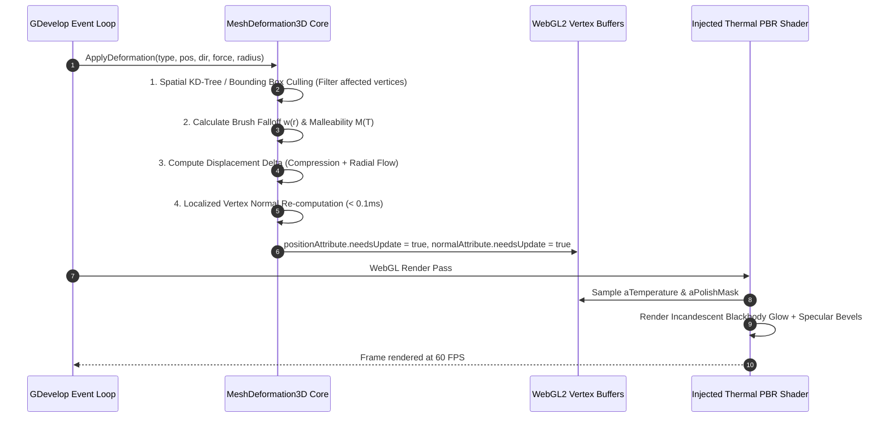
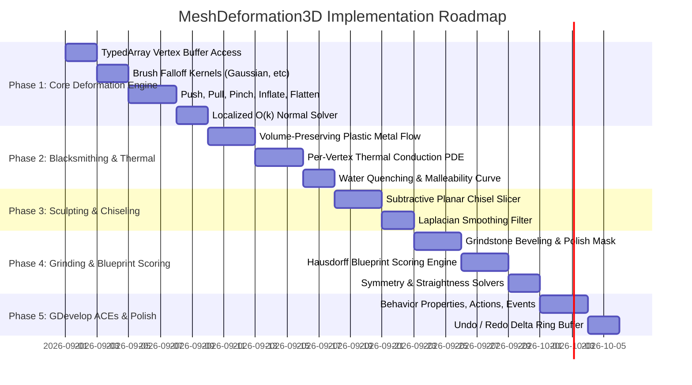

# MeshDeformation3D — Implementation Plan

This document outlines the technical architecture, mathematical deformation models, thermal conduction PDEs, localized normal solvers, blueprint comparison metrics, and implementation phases for **MeshDeformation3D**.

---

## 1. System Architecture & Lifecycle

`MeshDeformation3D` operates as a high-performance vertex manipulation subsystem interacting directly with Three.js `THREE.BufferGeometry` and WebGL2 vertex buffer attributes:



---

## 2. Mathematical Formulations & Algorithms

### A. Universal Brush Falloff Kernels
For a vertex at position $\vec{V}_i$ and tool center $\vec{P}_{\text{tool}}$ with radius $R$, normalized distance $u = \frac{\|\vec{V}_i - \vec{P}_{\text{tool}}\|}{R} \in [0.0, 1.0]$:

* **Gaussian Kernel:**
  $$w(u) = \exp\left(-\frac{u^2}{2\sigma^2}\right), \quad \sigma = 0.35$$
* **Smoothstep Kernel:**
  $$w(u) = 1.0 - (3u^2 - 2u^3) = (1 - u)^2(1 + 2u)$$
* **Sharp / Pinch Kernel:**
  $$w(u) = (1.0 - u)^3$$
* **Linear Kernel:**
  $$w(u) = 1.0 - u$$

---

### B. Volume-Preserving Plastic Deformation (Blacksmithing Metal Flow)
When a hammer strikes hot metal at contact point $\vec{P}_{\text{hit}}$ with strike normal $\vec{N}_{\text{strike}}$ and impact force $F$:

1. **Local Temperature Malleability:**
   $$M(T_i) = \text{smoothstep}(600^\circ\text{C}, 1050^\circ\text{C}, T_i)$$
   Total weight: $W_i = w(u_i) \cdot M(T_i) \cdot F$.

2. **Normal Compression (Flattening along strike axis):**
   $$\Delta \vec{V}_{\parallel, i} = -\vec{N}_{\text{strike}} \cdot \left(k_{\text{compress}} \cdot W_i\right)$$

3. **Lateral Radial Flow (Incompressible Metal Squish):**
   Let $\vec{d}_i = \vec{V}_i - \vec{P}_{\text{hit}}$. The perpendicular outward vector is:
   $$\vec{d}_{\perp, i} = \vec{d}_i - (\vec{d}_i \cdot \vec{N}_{\text{strike}})\vec{N}_{\text{strike}}$$
   $$\vec{D}_{\text{outward}, i} = \frac{\vec{d}_{\perp, i}}{\|\vec{d}_{\perp, i}\| + \epsilon}$$
   $$\Delta \vec{V}_{\perp, i} = \vec{D}_{\text{outward}, i} \cdot \left(k_{\text{spread}} \cdot W_i\right)$$

4. **Conservation of Volume Factor:**
   To guarantee strict physical volume preservation, $k_{\text{spread}} = \frac{1}{2} k_{\text{compress}}$.
   $$\vec{V}_{i, \text{new}} = \vec{V}_i + \Delta \vec{V}_{\parallel, i} + \Delta \vec{V}_{\perp, i}$$

---

### C. Thermal Conduction & Cooling PDE
Heat conduction across the mesh is modeled via discretized finite differences:

$$\frac{\partial T_i}{\partial t} = \alpha \sum_{j \in N(i)} \frac{T_j - T_i}{\|\vec{V}_j - \vec{V}_i\|^2} - k_{\text{conv}}(T_i - T_{\text{ambient}}) - k_{\text{rad}}\epsilon\sigma_{\text{SB}}(T_i^4 - T_{\text{ambient}}^4)$$

* **In Forge:** Heat influx $Q_{\text{forge}} = k_{\text{forge}} (T_{\text{furnace}} - T_i)$ applied to submerged vertices.
* **In Quench Trough:** High-convection rapid cooling $Q_{\text{quench}} = -h_{\text{water}} (T_i - T_{\text{water}})$.

---

### D. Subtractive Planar Chiseling (Statue Carving)
For a chisel cutting plane defined by point $\vec{P}_{\text{plane}}$ and inward normal $\vec{N}_{\text{plane}}$:

For each vertex $\vec{V}_i$ within the chisel cutting radius:
$$d_i = (\vec{V}_i - \vec{P}_{\text{plane}}) \cdot \vec{N}_{\text{plane}}$$
If $d_i > 0$ (vertex extends above the chisel blade):
$$\vec{V}_{i, \text{new}} = \vec{V}_i - \vec{N}_{\text{plane}} \cdot d_i \cdot w(u_i)$$

---

### E. Laplacian Mesh Smoothing (Clay & Organic Shapes)
Smooths high-frequency surface noise into clean, elegant curves:

$$\vec{V}_{i, \text{new}} = (1 - \lambda)\vec{V}_i + \lambda \left(\frac{1}{|N(i)|} \sum_{j \in N(i)} \vec{V}_j\right)$$

Where $N(i)$ is the 1-ring neighbor vertex set of vertex $i$, and $\lambda \in [0.1, 0.5]$ is the smoothing rate.

---

### F. Localized $O(k)$ Vertex Normal Recalculation
Recomputing the entire model's normals ($50\text{k}$ vertices) each strike drops FPS. Instead, we use **Localized Sub-Mesh Normal Updates**:

1. Mark only modified vertices $[i_1, i_2, \dots, i_k]$ and their adjacent triangle faces.
2. For each affected triangle $(A, B, C)$:
   $$\vec{N}_{\text{face}} = (\vec{V}_B - \vec{V}_A) \times (\vec{V}_C - \vec{V}_A)$$
3. Accumulate $\vec{N}_{\text{face}}$ into affected vertex normal accumulators.
4. Normalize only the $k$ modified normals: $\vec{n}_i = \frac{\vec{N}_i}{\|\vec{N}_i\|}$.
5. Execution time for 200 affected vertices is **$< 0.05\text{ ms}$**.

---

### G. Blueprint Comparison & Quality Scoring Metrics
Grades the player's forged weapon or sculpted statue against a target 3D template:

1. **Mean Squared Shape Deviation:**
   $$\epsilon_{\text{shape}} = \frac{1}{|V|} \sum_{i \in V} \min_{j \in V_{\text{target}}} \|\vec{V}_i - \vec{V}_{\text{target}, j}\|^2$$
   $$\text{ShapeScore} = \text{clamp}\left(1.0 - \frac{\epsilon_{\text{shape}}}{\text{Tolerance}^2}, 0.0, 1.0\right) \times 100\%$$

2. **Bilateral Symmetry Score (Across Center Plane $X=0$):**
   $$\epsilon_{\text{sym}} = \frac{1}{|V|} \sum_{i \in V} \|\vec{V}_{i, \text{mirrored}} - \vec{V}_{i, \text{closest}}\|^2$$
   $$\text{SymmetryScore} = \text{clamp}\left(1.0 - \frac{\epsilon_{\text{sym}}}{\text{SymTolerance}^2}, 0.0, 1.0\right) \times 100\%$$

3. **Overall Quality Grade:**
   $$\text{MasterworkGrade} = 0.50 \cdot \text{ShapeScore} + 0.35 \cdot \text{SymmetryScore} + 0.15 \cdot \text{FinishScore}$$

---

## 3. WebGL2 GPU Buffer Layouts

```
1. position (BufferAttribute: Float32Array, 3 floats per vertex [x, y, z])
2. normal   (BufferAttribute: Float32Array, 3 floats per vertex [nx, ny, nz])
3. aTemperature (BufferAttribute: Float32Array, 1 float per vertex [Temp in °C])
4. aPolishMask  (BufferAttribute: Float32Array, 1 float per vertex [0.0 = Raw, 1.0 = Sharpened Mirror])
```

---

## 4. Injected Shader Chunk (`onBeforeCompile`)

```glsl
// --- THERMAL BLACKBODY INCANDESCENCE & POLISH INJECTION ---
#ifdef USE_MESH_DEFORMATION_EFFECTS
  attribute float aTemperature;
  attribute float aPolishMask;
  
  // Convert temperature to blackbody emission
  vec3 getThermalEmission(float tempC) {
    if (tempC < 550.0) return vec3(0.0);
    
    float t = clamp((tempC - 550.0) / 650.0, 0.0, 1.0);
    // Gradient: Dull Cherry Red (0.0) -> Golden Orange (0.5) -> Blinding White (1.0)
    vec3 red = vec3(0.8, 0.05, 0.0);
    vec3 orange = vec3(1.0, 0.45, 0.02);
    vec3 white = vec3(1.2, 1.1, 1.0);
    
    vec3 color = (t < 0.5) ? mix(red, orange, t * 2.0) : mix(orange, white, (t - 0.5) * 2.0);
    float glowIntensity = pow(t, 2.5) * 4.0;
    return color * glowIntensity;
  }
  
  // Fragment shader evaluation
  vec3 thermalGlow = getThermalEmission(vTemperature);
  totalEmissiveRadiance += thermalGlow;
  
  // Sharpened grindstone edge specular enhancement
  roughnessFactor = mix(roughnessFactor, 0.05, vPolishMask);
  metalnessFactor = mix(metalnessFactor, 0.95, vPolishMask);
#endif
```

---

## 5. Implementation Phases



---

## 6. Performance Budgets & Target Metrics

| Subsystem | CPU Time Budget | GPU Time Budget | Memory Footprint |
| :--- | :---: | :---: | :---: |
| **Hammer Blow Deformation (200 Verts)** | **$< 0.06\text{ ms}$** | $0.0\text{ ms}$ | $0\text{ B per strike (TypedArray)}$ |
| **Localized Normal Recalculation** | **$< 0.04\text{ ms}$** | $0.0\text{ ms}$ | In-place buffer update |
| **Thermal Conduction Tick (Every Frame)** | $< 0.10\text{ ms}$ | $0.0\text{ ms}$ | Reused `Float32Array` |
| **Blueprint Scoring (On Finish)** | $< 2.0\text{ ms}$ | $0.0\text{ ms}$ | Evaluated asynchronously |
| **Total Frame Overhead** | **$< 0.2\text{ ms}$** | **$< 0.5\text{ ms}$** | **Rock-solid 60 FPS** |
