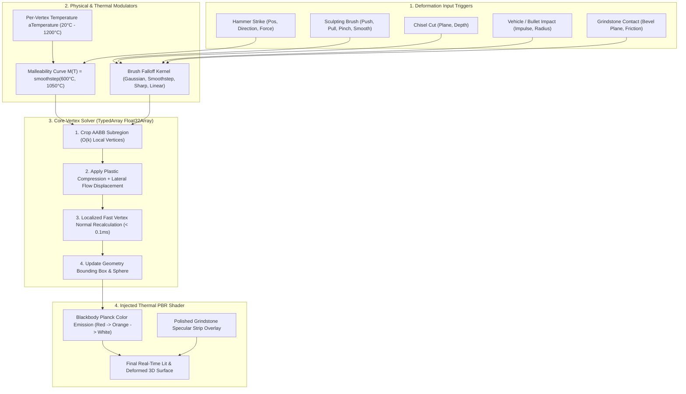

# MeshDeformation3D — General 3D Mesh Deformation, Sculpting & Blacksmithing Engine for GDevelop

**MeshDeformation3D** is a high-performance, real-time procedural mesh deformation, sculpting, and physical plasticity engine for **GDevelop 5 (Three.js WebGL2 backend)**.

It provides a universal vertex-level deformation core that allows 3D meshes to be dynamically sculpted, dented, bent, smoothed, chipped, and physically deformed in real-time. On top of this core, it integrates specialized physical modules for **Blacksmithing & Metal Forging** (volume-preserving metal flow, thermal conduction, quenching, blackbody glow), **Statue Sculpting & Chiseling** (subtractive carving, Laplacian smoothing), **Grindstone Sharpening**, and **Blueprint Quality Grading**—as well as **Vehicle Collision Crushing** and **Impact Damage**.

---

## 🌟 Key Highlights

- **Universal Real-Time Mesh Deformation:** Push, Pull, Pinch, Inflate, Deflate, Flatten, Twist, and Smooth any 3D model geometry at 60 FPS.
- **Volume-Preserving Plasticity (Metal Flow):** Simulates incompressible metal deformation—hammer blows compress metal along the strike vector while naturally squeezing and flowing it outward laterally.
- **Thermal Simulation & Blackbody Incandescence:** Tracks per-vertex temperature ($20^\circ\text{C} - 1200^\circ\text{C}$) with conductive heat transfer, air cooling, water trough quenching, and realistic glowing thermal shaders (Dull Red $\rightarrow$ Bright Orange $\rightarrow$ Blinding White Hot).
- **Temperature-Dependent Malleability:** Hot metal yields realistically under the hammer, while cold iron resists deformation.
- **Subtractive Stone Chiseling & Clay Smoothing:** Carve marble and stone statues with planar chisel strokes, or sculpt organic clay with iterative Laplacian smoothing filters.
- **Grindstone Sharpening & Surface Polishing:** Bevels blade edges against grinding wheels while painting high-specular, zero-roughness texture strips.
- **Blueprint Comparison & Quality Scoring:** Automatically evaluates the player's forged sword or sculpted statue against a target silhouette, scoring Symmetry, Straightness, Edge Sharpness, and Overall Masterwork Grade ($0\% - 100\%$).
- **Impact & Collision Crushing:** Deform car body panels on crashes or punch bullet craters into shields and armor.
- **Undo / Redo Buffer:** Historical delta snapshots allow players to undo mistakes during smithing and sculpting mini-games.

---

## 📐 The Mesh Deformation Pipeline

---

## 📊 Feature Modes Overview

| Mode | Primary Application | Key Mechanics |
| :--- | :--- | :--- |
| **`Blacksmithing`** | Sword & Armor Forging | Thermal heating, volume-preserving lateral metal flow, water quenching, anvil striking. |
| **`StoneChiseling`** | Marble & Statue Carving | Planar subtractive slicing, chisel fragment sparks, progressive chipping. |
| **`ClaySculpting`** | Organic Modeling & Pottery | Pinching, pulling, pushing, and iterative Laplacian smoothing. |
| **`Grindstone`** | Blade Sharpening & Polishing | Knife-edge plane beveling, specular strip painting, directional spark emitters. |
| **`VehicleDamage`** | Car Crashes & Bullet Dents | High-velocity impulse crumpling, structural dent limits, impact craters. |

---

## 🚀 Quick Start Guide

1. **Add Behavior:** Add the **`MeshDeformation3D`** behavior to any 3D Model object (e.g. an iron ingot billet or stone carving block).
2. **Select Initial Mode:** Choose `Blacksmithing`, `Sculpting`, or `ImpactDamage`.
3. **Trigger In Event Sheet:**
   - **Heat Ingot in Forge:** `MeshDeformation3D::HeatUp(rate: 150.0, maxTemp: 1100.0)`
   - **Strike with Hammer:** `MeshDeformation3D::ApplyHammerBlow(hitX, hitY, hitZ, dirX, dirY, dirZ, force: 25.0, radius: 0.08)`
   - **Quench in Water:** `MeshDeformation3D::Quench(coolRate: 400.0)`
   - **Evaluate Blade:** `Set Variable Score = MeshDeformation3D::EvaluateBlueprint("Katana_Blueprint.glb")`

---

## 📚 Documentation Index

- [IMPLEMENTATION_PLAN.md](./IMPLEMENTATION_PLAN.md) — Technical architecture, mathematical formulations (volume-preserving metal flow equations, Gaussian falloff kernels, localized normal recalculation, heat conduction PDE, Laplacian smoothing, Hausdorff blueprint scoring), and WebGL2 implementation phases.
- [API_REFERENCE.md](./API_REFERENCE.md) — Complete specification of Behavior Properties, Actions, Conditions, Expressions (ACEs), Brush Falloff types, and Quality Grading metrics.
