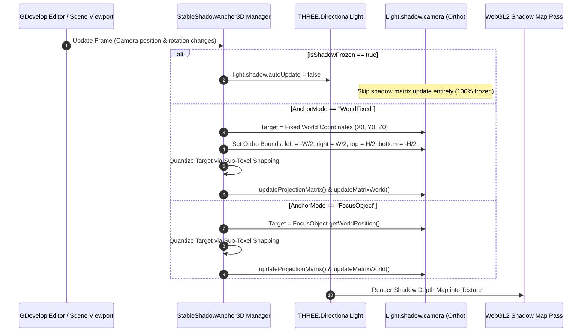
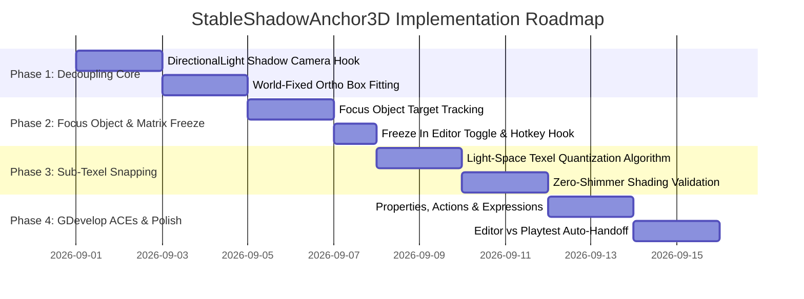

# StableShadowAnchor3D — Implementation Plan

This document outlines the technical architecture, mathematical formulations (texel snapping, bounding box fitting, and matrix freeze loops), Three.js shadow camera hooks, and implementation phases for **StableShadowAnchor3D**.

---

## 1. System Architecture & Lifecycle



---

## 2. Mathematical Formulations & Algorithms

### A. World-Fixed Anchor Bounding Box
Given a fixed world center point $\vec{C}_{\text{world}} = (x_0, y_0, z_0)$, light direction vector $\vec{D}_{\text{light}}$ (normalized), and box dimensions $(W, H, D)$:

1. **Light Position Calculation:**
   $$\vec{P}_{\text{light}} = \vec{C}_{\text{world}} - \vec{D}_{\text{light}} \cdot \frac{D}{2}$$
2. **Light Target Position:**
   $$\vec{P}_{\text{target}} = \vec{C}_{\text{world}}$$
3. **Orthographic Projection Bounds:**
   $$\text{left} = -\frac{W}{2}, \quad \text{right} = \frac{W}{2}, \quad \text{bottom} = -\frac{H}{2}, \quad \text{top} = \frac{H}{2}$$
   $$\text{near} = 0.1, \quad \text{far} = D$$

---

### B. Sub-Texel Light-Space Grid Snapping
When camera-following or object-following is enabled, camera translations cause fractional texel shifts that manifest as shadow crawling and shimmering.

1. Transform target position $\vec{P}_{\text{target}}$ into light view space:
   $$\vec{P}_{\text{lightSpace}} = \mathbf{V}_{\text{light}} \cdot \vec{P}_{\text{target}}$$

2. Compute world-space texel size for the shadow map of resolution $R_{\text{shadow}}$ (e.g. $2048$):
   $$\Delta_{\text{texel}} = \frac{W}{R_{\text{shadow}}}$$

3. **Quantize Light-Space Coordinates:**
   $$P_{x, \text{snapped}} = \left\lfloor \frac{P_{x, \text{lightSpace}}}{\Delta_{\text{texel}}} \right\rfloor \cdot \Delta_{\text{texel}}$$
   $$P_{y, \text{snapped}} = \left\lfloor \frac{P_{y, \text{lightSpace}}}{\Delta_{\text{texel}}} \right\rfloor \cdot \Delta_{\text{texel}}$$

4. Compute snapping compensation offset:
   $$\Delta \vec{P}_{\text{snap}} = \mathbf{V}_{\text{light}}^{-1} \cdot \begin{bmatrix} P_{x, \text{snapped}} - P_{x, \text{lightSpace}} \\ P_{y, \text{snapped}} - P_{y, \text{lightSpace}} \\ 0 \\ 0 \end{bmatrix}$$

5. Apply snapped offset to light position:
   $$\vec{P}_{\text{light, final}} = \vec{P}_{\text{light}} + \Delta \vec{P}_{\text{snap}}$$

---

### C. Frozen Matrix Cache (`FreezeInEditor`)
To freeze shadow rendering with zero CPU or GPU recalculation:

```javascript
function setShadowFrozen(frozen) {
  if (frozen) {
    light.shadow.autoUpdate = false;
    light.shadow.needsUpdate = false;
    light.shadow.camera.matrixAutoUpdate = false;
  } else {
    light.shadow.autoUpdate = true;
    light.shadow.needsUpdate = true;
    light.shadow.camera.matrixAutoUpdate = true;
  }
}
```

---

## 3. Implementation Phases



---

## 4. Performance Metrics

| Subsystem | CPU Time Overhead | VRAM Impact | Frame Rate Stability |
| :--- | :---: | :---: | :---: |
| **World-Fixed Anchor Calculation** | $< 0.01\text{ ms}$ | $0\text{ MB}$ | **Constant 60–120 FPS** |
| **Sub-Texel Grid Snapping**        | $< 0.02\text{ ms}$ | $0\text{ MB}$ | **Zero Shimmering** |
| **Frozen Shadow Mode**             | $0.00\text{ ms}$ (Skipped) | $0\text{ MB}$ | **Zero Overhead** |
