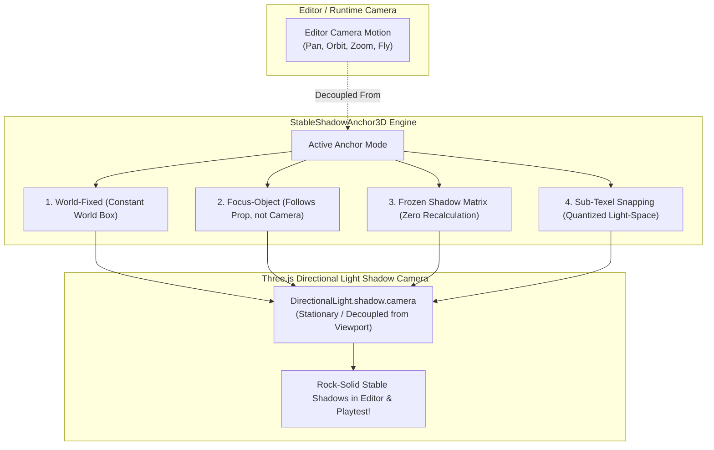

# StableShadowAnchor3D — Editor & Runtime Directional Shadow Stabilization for GDevelop

**StableShadowAnchor3D** is a precision shadow camera management engine for **GDevelop 5 (Three.js WebGL2 backend)**.

It decouples directional light shadow projections from the active scene/editor camera, providing **World-Fixed, Focus-Object, and Frozen Shadow Anchors** along with **Sub-Texel Grid Snapping** so that moving, panning, orbiting, or zooming the camera in the Scene Editor (or during playtest) never causes shadows to crawl, shimmer, pop, or shift across surfaces!

---

## 🌟 Key Highlights

- **World-Fixed Shadow Anchoring:** Locks the directional shadow volume to a fixed coordinate (e.g. $(0,0,0)$ or level center) with fixed bounds—the editor camera can fly anywhere, and **shadows remain 100% stationary in world space**.
- **Object Focus Anchoring:** Locks the shadow volume to a chosen 3D object (e.g. `CenterStage`, `Player`, `SmithingTable`). Orbiting $360^\circ$ around the model allows full inspection without shadows rotating with your viewpoint.
- **Freeze in Editor (Lock Toggle / Hotkey):** Instantly freezes the shadow camera's world matrix at its current position so you can fly behind walls and zoom into crevices with zero shadow re-projection.
- **Sub-Texel Light Snapping:** Quantizes shadow projection bounds to exact shadow map texel intervals, completely eliminating shadow swimming and edge shimmering during camera translation.
- **Seamless Playtest Handoff:** Can automatically maintain a stationary shadow anchor while editing in GDevelop, and switch to dynamic camera-following CSM when the game is played.

---

## 📐 The 4 Stabilization Modes



---

## 📊 Comparison: Standard GDevelop Shadows vs. StableShadowAnchor3D

| Metric / Scenario | Standard GDevelop 3D Shadow | With StableShadowAnchor3D |
| :--- | :--- | :--- |
| **Camera Orbit in Editor** | Shadows rotate and distort around object | **Shadows stay 100% stationary on the ground** |
| **Camera Zoom in Editor** | Shadow bounds re-fit, changing sharpness/edges | **Constant shadow sharpness and coverage** |
| **Camera Panning** | Shadows crawl and shimmer across edges | **Sub-texel quantization eliminates shimmering** |
| **Off-Screen Shadow Casters**| Shadows pop out when casters leave screen | **Casters stay inside fixed world shadow box** |
| **Level Design Workflow** | Distracting shadow movement while placing assets| **Stable lighting reference for easy level building** |

---

## 🚀 Quick Start Guide

### 1. Enable in Scene
1. Add the **`StableShadowAnchor3D`** behavior to your 3D Directional Light or a Scene Manager object.
2. Set `AnchorMode` to `"WorldFixed"`.
3. Set `BoxSize` to `100.0` meters.

### 2. Lock to an Object
1. Set `AnchorMode` to `"FocusObject"`.
2. Set `FocusObjectName` to `"BlacksmithTable"`.
3. Now, as you orbit the editor camera around the table, the shadows stay perfectly stationary relative to the table!

### 3. Freeze Shadows with Hotkey / Action
```
// When pressing F7 in playtest / editor mode:
Condition: KeyPressed("F7")
Action:    StableShadowAnchor3D::ToggleShadowFreeze()
```

---

## 📚 Documentation Index

- [IMPLEMENTATION_PLAN.md](./IMPLEMENTATION_PLAN.md) — Technical architecture, mathematical formulations (texel snapping, bounding box fitting, and frozen matrix loops), and implementation phases.
- [API_REFERENCE.md](./API_REFERENCE.md) — Complete specification of Behavior Properties, Actions, Conditions, and Expressions (ACEs).
