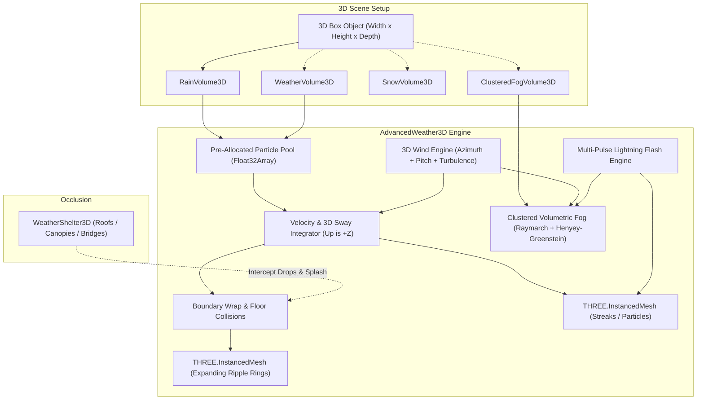

# AdvancedWeather3D — Volumetric 3D Weather for GDevelop 5

**AdvancedWeather3D** adds automated **Rain, Snow, Hail, Dust, Embers, Volumetric Fog, Lightning, and Weather Shelters** to **GDevelop 5's Three.js renderer**. It is designed for effects that need bounded 3D volumes, camera-following coverage, runtime control, and gameplay queries beyond native particle effects.

Much like `FluidAndWater3D`, you simply add a weather behavior to a standard 3D Box (Cube) object, size and position the cube in the scene editor, and that area immediately becomes an automated 3D weather simulation zone.

To keep the GDevelop inspector clean, focused, and intuitive, weather types are organized into **modular behaviors** so you only see the properties relevant to the effect you want, or you can use the master `WeatherVolume3D` behavior for custom authoring.

---

## 🌟 Key Highlights

- **Modular Behaviors for Every Weather Type:**
  - **`RainVolume3D`**: Automated falling raindrops with velocity-aligned streaks, floor/roof impact ripple rings, and multi-pulse thunderstorm lightning flashes.
  - **`SnowVolume3D`**: Fluttering snowflakes with gentle fall speed and lateral sway physics.
  - **`ClusteredFogVolume3D`**: Raymarched volumetric fog with Beer-Lambert extinction, Henyey-Greenstein solar scattering, adjustable sample quality, 3D wind advection, ground falloff, and CPU spatial queries (`FogDensityAt(X, Y, Z)`). The behavior name is retained for compatibility.
  - **`HailVolume3D`**: High-speed icy pellets with swept roof collision, physical rebound arcs, and impact ripples.
  - **`EmbersVolume3D`**: Upward-rising embers with additive glow, thermal turbulence, and per-spark size flicker.
  - **`DustVolume3D`**: Wind-driven dust or sand particles paired with an optional, color-matched volumetric haze.
  - **`WeatherVolume3D`**: Master universal weather volume supporting all presets, custom authoring, and switching types at runtime.
  - **`WeatherShelter3D`**: Attach to roofs, canopies, and bridges to block raindrops and keep interiors dry.
- **Stackable on the Same 3D Box:**
  Add multiple weather behaviors (e.g. `RainVolume3D` + `ClusteredFogVolume3D`) to the exact same 3D Box for a stormy, misty atmosphere. Host mesh visibility is cleanly reference-counted.
- **Sizable 3D Box Volumes:**
  Size the cube visually in the GDevelop scene editor (e.g. over a courtyard, forest clearing, canyon, or open world). At runtime, the cube's placeholder mesh is automatically hidden.
- **Dual Volume Modes:**
  - **`BoundedBox` (Default):** The simulation is strictly confined within the 3D cube's dimensions $[X, X+W] \times [Y, Y+H] \times [Z, Z+D]$. Perfect for localized storms, greenhouses, or entering an outdoor rainy courtyard from an indoor castle.
  - **`FollowCamera`:** Uses a moving emitter window centered horizontally on the active 3D camera while retaining its configured height, depth, and relative elevation. Existing drops and impact ripples stay fixed in world space; particles left behind are recycled into the newly exposed leading edge in the camera's direction of travel. This creates an infinite storm without making the weather visibly slide with the player.
- **Full 3D Wind & Thickness Controls:**
  - **3D Wind Direction:** Horizontal azimuth ($0^\circ - 360^\circ$) plus vertical **Wind Pitch** ($-85^\circ$ to $+85^\circ$). Allows realistic downward driving cloudburst gales or upward drafts.
  - **Streak & Particle Thickness:** Dedicated **`StreakThickness`** controlling physical cross-section width in scene units alongside **`StreakLength`** and volume density (**`ParticleDensity`**).
  - **Fog Optical Thickness:** Dedicated **`FogThickness`** controlling physical extinction and opacity per meter.
- **Raymarched Volumetric Fog:**
  - Samples an animated procedural 3D density field throughout the box volume.
  - Raymarched volumetric shader with **Beer-Lambert optical extinction**.
  - **Henyey-Greenstein Phase Scattering:** Configurable $g$ anisotropy produces realistic forward sun scattering / god rays.
  - **3D Wind Advection:** Winds move the procedural density field through the volume.
  - **Ground Height Falloff:** Exponential height gradient so fog gathers thickly along the floor and dissipates upward.
  - **Lightning Illumination:** Fog lights internally from its own lightning or from a lightning-enabled weather behavior stacked on the same object.
  - **Quality Tiers:** Low, Medium, High, and Ultra use 12, 24, 40, and 64 samples respectively.
  - **Seamless Camera Immersion:** Uses `THREE.BackSide` rendering with depth testing so the camera can enter the fog volume with zero near-plane clipping.
  - **CPU Spatial Queries:** `FogDensityAt(X, Y, Z)` lets gameplay events (AI stealth, visibility limits) query local fog thickness in real time.
- **Autonomous Rain Simulation:**
  - Fast downward terminal velocity.
  - **Velocity-Aligned Streaks:** Drops dynamically orient and elongate along their combined 3D velocity vector (gravity + 3D wind + turbulence).
  - **Automated Floor Splashes & Ripples:** Impacts on floors and shelter roofs can use a single ring, concentric double ring, or raised splash crown.
- **Weather Shelters (`WeatherShelter3D`):**
  Attach `WeatherShelter3D` to any 3D object (roofs, ceilings, bridges, tents, umbrellas). Drops colliding with the shelter splash on top of the roof and are intercepted, keeping the interior floor dry!
- **High-Throughput WebGL Performance:**
  Particle state uses pre-allocated typed arrays and `THREE.InstancedMesh`; runtime resizing rebuilds resources only when an authoring action changes their capacity or shape.

---

## 📐 Architecture Overview

---

## 🚀 Quick Start Guide

### 1. Create a Rain Zone
1. Import `AdvancedWeather3D.json` through the GDevelop **Functions/Behaviors** extension manager.
2. In your scene, add a **3D Box** object named `RainZone`.
3. In the object's properties, add the **`Rain Volume 3D`** (`RainVolume3D`) behavior.
4. Drag `RainZone` into your scene, resize it to cover your outdoor area (e.g. Width: `2000`, Height: `2000`, Depth: `800`), and place it at your desired elevation.
5. Click **Preview**. The opaque 3D box disappears, replaced by falling raindrops, velocity-aligned streaks, and floor splash ripples!

### 2. Add Clustered Volumetric Fog
1. Add the **`Clustered Fog Volume 3D`** (`ClusteredFogVolume3D`) behavior to a 3D Box (or stack it onto the same `RainZone` box).
2. Adjust **Fog Optical Thickness** (e.g. `0.05`), **Fog Height Falloff** (`1.5` for ground fog), and **Fog Phase Anisotropy** (`0.4` for sunlight god rays).
3. The volume is now filled with raymarched volumetric mist that swirls with the wind and scatters sunlight!

### 3. Adjust 3D Wind & Streak Thickness
1. Set **Wind Azimuth Direction** to `45` degrees (northeast).
2. Set **Wind Vertical Pitch** to `-25` degrees to create a driving downward cloudburst gale.
3. Set **Streak Thickness** to `3.5` for heavy, prominent raindrops.

### 4. Keep Interiors Dry with Shelters
1. Add a 3D Box or 3D Model for a gazebo roof, canopy, or building ceiling.
2. Attach the **`Weather Shelter 3D`** (`WeatherShelter3D`) behavior to that object.
3. Raindrops hitting the roof will splash on the roof surface and disappear, leaving the area under the roof completely dry!

---

## 📊 Modular Behaviors Reference

| Behavior Name | Typical Use Case | Key Properties |
| :--- | :--- | :--- |
| **`RainVolume3D`** | Rainstorms, downpours, drizzles | Fall speed, streak dimensions, ripple style, lightning |
| **`SnowVolume3D`** | Gentle flurries, blizzards | Fall speed, sway amount & speed, particle size |
| **`ClusteredFogVolume3D`** | Atmospheric fog, valley mist, god rays | Optical thickness, ground falloff, anisotropy, noise scale |
| **`HailVolume3D`** | Hailstorms, ice showers | High fall speed, bounce splashes, pellet size |
| **`EmbersVolume3D`** | Campfires, volcanic ash, burning debris | Negative speed (rises), additive blending, turbulence |
| **`DustVolume3D`** | Sandstorms, ruins, dry wind, airborne dust | Mote drift, wind turbulence, volumetric haze |
| **`WeatherVolume3D`** | Universal / multi-weather master volume | Full preset switching & manual configuration |
| **`WeatherShelter3D`** | Roofs, canopies, bridges, umbrellas | Shelter enabled, splash on roof |

---

## 🛠️ Performance Best Practices

1. **Fog Quality:**
   Start with `Low` (12 samples) on mobile and `Medium` (24) on desktop. Use `High` (40) or `Ultra` (64) for close-up volumes after profiling. For open worlds, pair fog with `FollowCamera`.
2. **Particle Density:**
   - Mobile / Web: `400` – `800` particles per volume.
   - Desktop / Standalone: `1000` – `3000` particles per volume.
3. **Use FollowCamera for Open Worlds:**
   Instead of creating a giant 10,000 x 10,000 box with 15,000 particles, create a 2000 x 2000 box set to `FollowCamera` with 800 particles. You get identical visual fidelity with a fraction of the GPU/CPU workload.

---

## Current Geometry Limits

Weather volumes and shelters use axis-aligned bounds. Rotating a host object changes its appearance but does not rotate the simulation or shelter collision volume. Volumetric fog is rendered as a transparent box volume; opaque-scene depth-aware compositing is a planned renderer-integration upgrade.

## Validation

Run `node AdvancedWeather3D/test-runtime.mjs` for lifecycle and simulation regression tests, and `node AdvancedWeather3D/test-webgl.mjs` for a real Three.js r160 shader/render check in headless Chrome.
