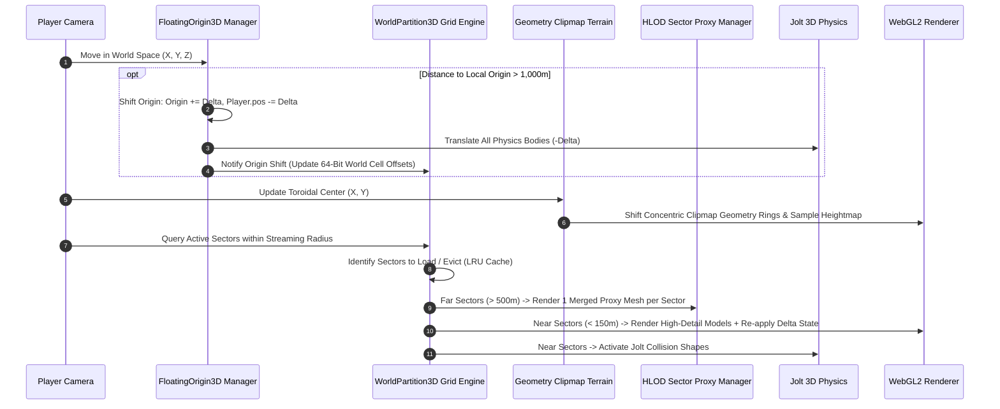
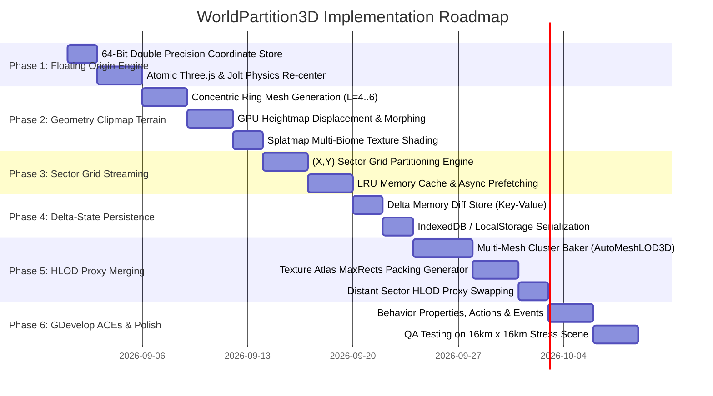

# WorldPartition3D — Implementation Plan

This document outlines the technical architecture, mathematical formulations (Geometry Clipmaps, HLOD Quadtree clustering, Delta-State persistence, and 64-bit Floating Origin coordinate shifts), WebGL2 shader pipelines, and implementation phases for **WorldPartition3D**.

---

## 1. System Architecture & Lifecycle

`WorldPartition3D` orchestrates three coordinated open-world subsystems:



---

## 2. Mathematical Formulations & Algorithms

### A. Geometry Clipmap Terrain with Seam Morphing (Losasso & Hoppe)
The terrain consists of $L$ nested concentric square geometry rings ($L = 4 - 6$) centered on the player. Each ring has grid resolution $M \times M$ (e.g. $64 \times 64$ quads).

* Scale of ring level $l \in [0, L-1]$:
  $$s_l = 2^l \cdot \Delta x_{\text{base}}$$
* The total terrain view distance is $D_{\text{max}} = 2^{L-1} \cdot M \cdot \Delta x_{\text{base}}$ (e.g. $16\text{ km}$ at $L=6, M=64$).

#### Continuous Transition Morphing Function:
To prevent T-junction cracks and popping between ring boundaries, vertices near the outer perimeter of ring $l$ smoothly morph to match the coarser sample of ring $l+1$:

$$\alpha(x, y) = \text{clamp}\left( \frac{\max(|x - c_x|, |y - c_y|) - (M/2 - w - 1)s_l}{w \cdot s_l}, 0.0, 1.0 \right)$$

Where:
* $(c_x, c_y)$ is the center of the ring in world space.
* $w$ is the transition blend width (typically $w = 4$ grid units).
* Final vertex elevation:
  $$Z_{\text{vertex}} = \text{mix}\left( H_{\text{fine}}(x, y), H_{\text{coarse}}(x, y), \alpha(x, y) \right)$$

---

### B. Hierarchical Level of Detail (HLOD) Quadtree Clustering
To eliminate draw calls on distant towns, ruins, or forests:

1. **Spatial Sector Partitioning:**
   The world is divided into sectors of size $S_{\text{size}} = 128\text{m} \times 128\text{m}$.
2. **Offline / Background Proxy Mesh Baking (`AutoMeshLOD3D`):**
   - For all static props inside a sector $(x_{\text{sector}}, y_{\text{sector}})$:
     $$\text{MergedGeometry} = \bigcup_{k=1}^K \text{Transform}\left(\text{Mesh}_k, \mathbf{M}_k\right)$$
   - **Texture Atlas Packing:** Bakes all diffuse, normal, and roughness maps into a single $2048 \times 2048$ atlas using the MaxRects bin-packing algorithm.
   - **QEM Decimation:** Runs Quadric Error Metric decimation down to a target budget of $\sim 500 - 1,500$ triangles for the **entire sector**.
3. **Runtime Swapping:**
   - When distance $d > R_{\text{HLOD}}$ (e.g. $500\text{m}$), all individual meshes in that sector are hidden, and the single HLOD proxy mesh is rendered in **1 single draw call**.

---

### C. Delta-State Persistence (World Memory Diffs)
To ensure that player actions (looting chests, destroying doors, killing bosses, chopping trees) persist across chunk unloads:

1. **Delta Memory Dictionary:**
   $$\mathcal{D} = \left\{ \text{ObjectID} \mapsto \{ \text{key}_1: \text{val}_1, \text{key}_2: \text{val}_2, \dots \} \right\}$$
2. **On Sector Unload:**
   All modified dynamic objects write their dirty properties to $\mathcal{D}$. The raw 3D mesh instances are safely deleted from Three.js scene memory.
3. **On Sector Reload:**
   When the sector re-enters the streaming radius:
   - Spawn base sector template objects.
   - For each spawned object $i$: if $\text{ObjectID}_i \in \mathcal{D}$, immediately re-apply its delta overrides (e.g. `isDead: true` $\rightarrow$ remove from scene, `isOpened: true` $\rightarrow$ set animation frame to open).

---

### D. 64-Bit Floating Origin Coordinate Shifts
32-bit floats (`float32`) lose precision far from $(0, 0, 0)$. At $10\text{km}$, float precision drops to $\sim 1\text{mm}$, causing models to visibly shake.

1. **64-Bit Double Coordinates:**
   True world positions are stored as 64-bit doubles:
   $$\vec{P}_{\text{world}} = \vec{O}_{\text{origin}} + \vec{P}_{\text{local}}$$
2. **Origin Shift Trigger:**
   Whenever the player moves farther than $R_{\text{threshold}} = 1,000\text{m}$ from the current origin:
   $$\Delta \vec{O} = \text{round}\left(\frac{\vec{P}_{\text{player, local}}}{R_{\text{step}}}\right) \cdot R_{\text{step}}$$
   $$\vec{O}_{\text{origin, new}} = \vec{O}_{\text{origin}} + \Delta \vec{O}$$
   $$\vec{P}_{\text{local, new}} = \vec{P}_{\text{local}} - \Delta \vec{O}$$
3. **Atomic Scene & Physics Shift:**
   - Three.js: Translates all active root layer containers by $-\Delta \vec{O}$.
   - Jolt Physics: Shifts all active rigid body positions by $-\Delta \vec{O}$.
   - Result: The camera is always near $(0, 0, 0)$, maintaining **100% rock-solid sub-millimeter vertex precision forever**.

---

## 3. WebGL2 GPU Shader Pipelines

```
1. Clipmap Terrain Shader Pipeline
   - Vertex Shader: Samples R16F Heightmap Texture -> Applies Transition Morphing alpha -> Displaces (X, Y, Z).
   - Fragment Shader: Multi-Biome Splatmap (Grass, Mud, Rock, Snow) with slope-based triplanar projection.

2. HLOD Sector Proxy Pipeline
   - Single Draw Call per Sector with standard MeshStandardMaterial sampling the unified Texture Atlas.
```

---

## 4. Implementation Phases



---

## 5. Performance Budgets & Target Metrics

| Subsystem | CPU Time Budget | GPU Time Budget | Target FPS |
| :--- | :---: | :---: | :---: |
| **Geometry Clipmap Terrain (16km Range)**| $< 0.05\text{ ms}$ | $< 0.50\text{ ms}$ | **60–120 FPS** |
| **Sector Grid Streaming & LRU Check**   | $< 0.10\text{ ms}$ | $0.0\text{ ms}$ | **60 FPS** |
| **HLOD Distant Proxies (100 Sectors)**   | $< 0.05\text{ ms}$ | $< 0.40\text{ ms}$ | **60 FPS** |
| **Floating Origin Shift (Every 1km)**   | $< 0.20\text{ ms}$ (One Frame)| $0.0\text{ ms}$ | **No hitching** |
| **Total Open-World Pipeline**           | **$< 0.4\text{ ms}$** | **$< 1.0\text{ ms}$** | **Rock-solid 60 FPS** |
