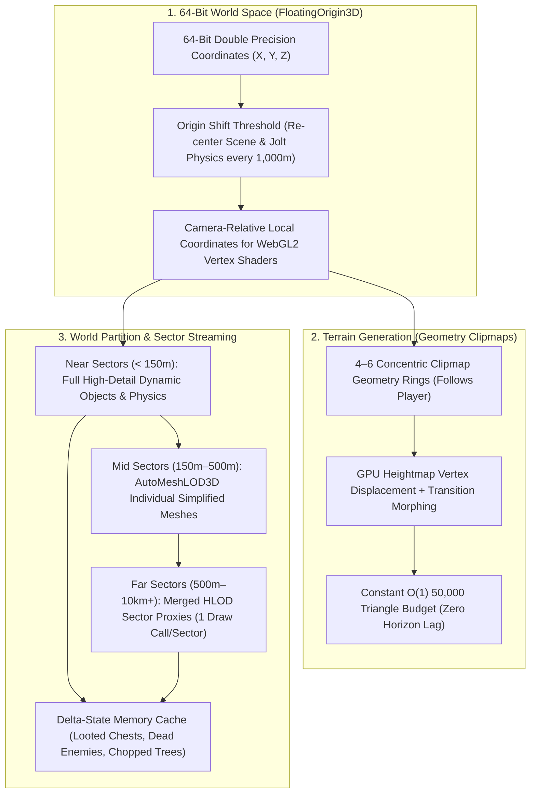
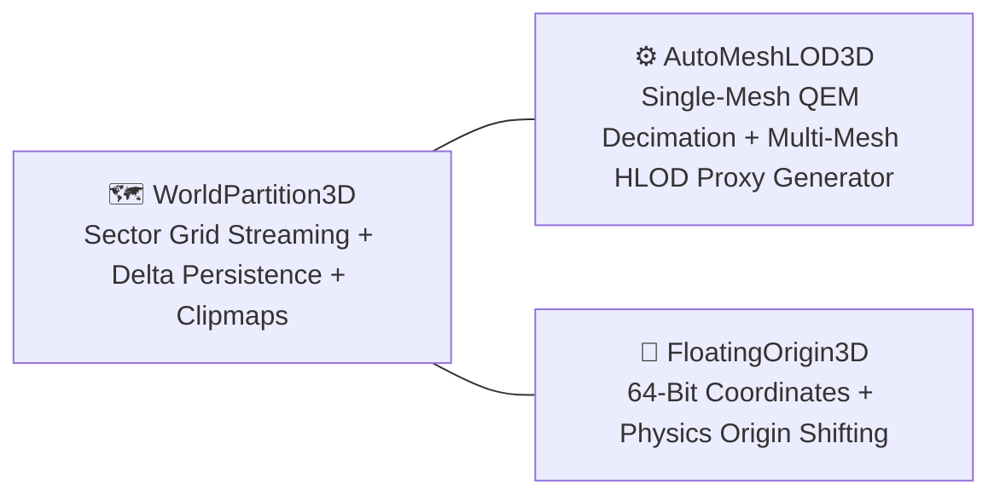

# WorldPartition3D — Open-World Grid Streaming, HLOD Proxies, Geometry Clipmap Terrain & 64-Bit Floating Origin Suite for GDevelop

**WorldPartition3D** is a complete, all-in-one open-world architecture and streaming engine for **GDevelop 5 (Three.js WebGL2 backend)**.

Inspired by **Unreal Engine 5's World Partition & Nanite/HLOD systems** and **Minecraft's Distant Horizons**, **WorldPartition3D** provides a unified multi-tier pipeline that allows developers to build and run massive, seamless open-world games ($10\text{km} \times 10\text{km}+$ maps) at a constant 60–120 FPS in WebGL2 with zero frame drops, zero coordinate jitter, and zero progress loss.

---

## 🌟 Key Highlights

- **Grid-Based Sector Streaming:** Automatically loads and unloads $(X, Y)$ world sectors in background worker threads based on camera streaming radii with LRU VRAM memory caching.
- **Delta-State Persistence (World Memory):** Remembers which chests were looted, enemies killed, doors unlocked, and trees chopped so world state is never reset when sectors unload and reload!
- **Hierarchical Level of Detail (HLOD) Distant Sector Merging:** Groups thousands of individual distant buildings, rocks, and trees in outer sectors into a **single merged low-poly proxy mesh per sector** ($5,000\text{ draw calls} \rightarrow 1\text{ draw call}$!).
- **Concentric Geometry Clipmap Terrain:** 4–6 nested concentric square geometry rings following the player with GPU heightmap displacement, morphing seams, and multi-biome splatmaps at a **constant $O(1)$ 50k triangle budget** regardless of world size.
- **`FloatingOrigin3D` (64-Bit Large World Coordinates):** Uses 64-bit double precision (`float64`) and silently shifts the scene and Jolt Physics origin when crossing tile thresholds, completely eliminating 32-bit floating-point vertex jitter on massive maps.
- **Tight Integration with `AutoMeshLOD3D`:** Directly leverages `AutoMeshLOD3D`'s background Web Worker QEM decimation engine to generate the HLOD sector proxy meshes and multi-texture atlases!

---

## 📐 The Master Open-World Pipeline



---

## 📊 Comparison: Standard GDevelop vs. WorldPartition3D Suite

| Feature / Metric | Standard GDevelop 3D | WorldPartition3D Suite |
| :--- | :--- | :--- |
| **Max Map Size** | $500\text{m} \times 500\text{m}$ (Lags & runs out of VRAM) | **$20\text{km} \times 20\text{km}+$ (Infinite seamless streaming)** |
| **Distant Cities / Props** | 5,000 individual draw calls (10 FPS) | **1 HLOD Proxy Draw Call per Sector (120 FPS)** |
| **Terrain Triangle Count**| Millions of triangles (Crashes WebGL) | **Constant 50k Triangles (Clipmap nested rings)** |
| **World State Memory** | Items/enemies respawn on reload | **Delta-State Persistence (Remembers every change)** |
| **Coordinate Precision** | Shaking/jittering vertices past 2km | **Rock-solid pixel stability (64-bit Floating Origin)** |
| **VRAM Management** | Monolithic scene bloat | **LRU cache eviction with asynchronous prefetching** |

---

## 🧩 The 3 Core Subsystems in this Workspace



1. **`WorldPartition3D`:** The master scene behavior that divides the world into $(X, Y)$ grid cells, manages background streaming, tracks delta state modifications, and renders the concentric geometry clipmap terrain.
2. **`AutoMeshLOD3D` (Enhanced):** Provides per-object LOD mesh swapping and the offline/in-editor HLOD clustering tool that bakes entire villages into single low-poly proxy meshes.
3. **`FloatingOrigin3D`:** The camera-relative coordinate stabilizer that ensures zero vertex jitter and seamless Jolt Physics world re-centering.

---

## 🚀 Quick Start Guide

### 1. Enable World Partition
1. Add the **`WorldPartition3D`** behavior to your Scene or a Global Manager object.
2. Set `SectorSize` (e.g. `128.0` meters) and `StreamingRadius` (e.g. `384.0` meters).
3. Assign your world's heightmap texture and splatmap textures for the clipmap terrain.

### 2. Add Floating Origin
1. Add the **`FloatingOrigin3D`** behavior to the Player Camera.
2. Set `ShiftThreshold` to `1000.0` meters. Whenever the player travels $1\text{km}$, the physics and scene origin shift silently with zero hitching.

### 3. Track World Delta State in Events
```
// When player loots a chest in any chunk:
Condition: Player.CollidesWith(TreasureChest)
Action:    TreasureChest.SetAnimation("Open")
           WorldPartition3D::SaveObjectState(TreasureChest.ID(), "isOpened", true)

// When that chunk unloads and reloads later:
Condition: TreasureChest.OnSpawnedFromSector()
           WorldPartition3D::GetObjectStateBoolean(TreasureChest.ID(), "isOpened") == true
Action:    TreasureChest.SetAnimation("Open") // Stays opened!
```

---

## 📚 Documentation Index

- [IMPLEMENTATION_PLAN.md](./IMPLEMENTATION_PLAN.md) — Technical architecture, mathematical formulations (Geometry Clipmap concentric rings & transition morphing, Quadtree HLOD clustering & QEM proxy baking, LRU cache & delta-state binary diffs, 64-bit floating origin coordinate shifts, Jolt physics world re-centering), WebGL2 shader pipelines, and phased roadmap.
- [API_REFERENCE.md](./API_REFERENCE.md) — Complete specification of Behavior Properties, Actions, Conditions, Expressions (ACEs) for `WorldPartition3D`, `ClipmapTerrain3D`, and `FloatingOrigin3D`.
